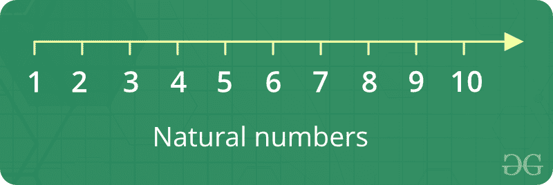

# 自然数

> 原文:[https://www.geeksforgeeks.org/natural-numbers/](https://www.geeksforgeeks.org/natural-numbers/)

数数 1、2、3、4、5、6 …基本上所有大于 0 的整数都是自然数。



**自然数的事实**

1.  它们是整数，并且不小于零(即正数)
2.  下一个可能的自然数可以通过在当前自然数上加 1 来找到
3.  自然数是普通数，1，2，3 等。我们用它来计数。
4.  数字零有时被认为是一个自然数。并不总是因为没有人从零、0、1、2、3 开始计数。
5.  所有其他带素数的自然数的 GCD 总是 1。
6.  自然数可以通过把它们与集合联系起来来正式定义。那么，零就是空集合中的元素个数；1 是包含一个自然数的集合中的元素数；等等。

**如何打印 n 个自然数之和？**

**使用递归**

给定一个数字 *n* ，求第一个 *n* 个自然数的和。为了计算和，我们将使用递归函数 recur _ sum()。

**示例:**

```
Input : 3
Output : 6
Explanation : 1 + 2 + 3 = 6

Input : 5
Output : 15
Explanation : 1 + 2 + 3 + 4 + 5 = 15
```

## C++

```
// C++ program to find the
// sum of natural numbers up
// to n using recursion
#include <iostream>
using namespace std;

// Returns sum of first
// n natural numbers
int recurSum(int n)
{
    if (n <= 1)
        return n;
    return n + recurSum(n - 1);
}

// Driver code
int main()
{
    int n = 5;
    cout << recurSum(n);
    return 0;
}
```

## Java 语言(一种计算机语言，尤用于创建网站)

```
// Java program to find the
// sum of natural numbers up
// to n using recursion
import java.util.*;
import java.lang.*;

class GFG
{

    // Returns sum of first
    // n natural numbers
    public static int recurSum(int n)
    {
        if (n <= 1)
            return n;
        return n + recurSum(n - 1);
    }

    // Driver code
    public static void main(String args[])
    {
        int n = 5;
        System.out.println(recurSum(n));
    }
}
```

## 计算机编程语言

```
# Python code to find sum
# of natural numbers upto
# n using recursion

# Returns sum of first
# n natural numbers
def recurSum(n):
    if n <= 1:
        return n
    return n + recurSum(n - 1)

# Driver code
n = 5
print(recurSum(n))
```

## C#

```
// C# program to find the
// sum of natural numbers
// up to n using recursion
using System;

class GFG
{

    // Returns sum of first
    // n natural numbers
    public static int recurSum(int n)
    {
        if (n <= 1)
            return n;
        return n + recurSum(n - 1);
    }

    // Driver code
    public static void Main()
    {
        int n = 5;
        Console.WriteLine(recurSum(n));
    }
}
```

## 服务器端编程语言（Professional Hypertext Preprocessor 的缩写）

```
<?php
// PHP program to find the
// sum of natural numbers
// up to n using recursion

// Returns sum of first
// n natural numbers
function recurSum($n)
{
    if ($n <= 1)
        return $n;
    return $n + recurSum($n - 1);
}

// Driver code
$n = 5;
echo(recurSum($n));

?>
```

## java 描述语言

```
<script>

// JavaScript program to find the
// sum of natural numbers
// up to n using recursion

// Returns sum of first
// n natural numbers
function recurSum(n)
{
    if (n <= 1)
        return n;
    return n + recurSum(n - 1);
}

// Driver code
n = 5;
document.write(recurSum(n));

</script>
```

**输出:**

```
15 

```

**使用循环**

一个**简单的解决方法**就是做以下几点。

```
1) Initialize : sum = 0
2) Run a loop from x = 1 to n and 
   do following in loop.
     sum = sum + x  
```

## C++

```
// CPP program to find sum of first
// n natural numbers.
#include<iostream>
using namespace std;

// Returns sum of first n natural
// numbers
int findSum(int n)
{
   int sum = 0;
   for (int x=1; x<=n; x++)
     sum = sum + x;
   return sum;
}

// Driver code
int main()
{
  int n = 5;
  cout << findSum(n);
  return 0;
}
```

## Java 语言(一种计算机语言，尤用于创建网站)

```
// JAVA program to find sum of first
// n natural numbers.
import java.io.*;

class GFG{

    // Returns sum of first n natural
    // numbers
    static int findSum(int n)
    {
        int sum = 0;
        for (int x = 1; x <= n; x++)
            sum = sum + x;
        return sum;
    }

    // Driver code
    public static void main(String args[])
    {
        int n = 5;
        System.out.println(findSum(n));
    }
}
```

## 计算机编程语言

```
# PYTHON program to find sum of first
# n natural numbers.

# Returns sum of first n natural
# numbers
def findSum(n) :
    sum = 0
    x = 1
    while x <=n :
        sum = sum + x
        x = x + 1
    return sum

# Driver code

n = 5
print findSum(n)
```

## C#

```
// C# program to find sum of first
// n natural numbers.
using System;

class GFG{

    // Returns sum of first n natural
    // numbers
    static int findSum(int n)
    {
        int sum = 0;
        for (int x = 1; x <= n; x++)
            sum = sum + x;
        return sum;
    }

    // Driver code
    public static void Main()
    {
        int n = 5;
        Console.Write(findSum(n));
    }
}
```

## 服务器端编程语言（Professional Hypertext Preprocessor 的缩写）

```
<?php
// PHP program to find sum of first
// n natural numbers.

// Returns sum of first n natural
// numbers
function findSum($n)
{
$sum = 0;
for ($x = 1; $x <= $n; $x++)
    $sum = $sum + $x;
return $sum;
}

// Driver code
$n = 5;
echo findSum($n);

?>
```

## java 描述语言

```
<script>
// JavaScript program to find the
// sum of natural numbers
// up to n using recursion

// Returns sum of first
// n natural numbers
function findSum(n)
{
let sum = 0;
for (x = 1; x <= n; x++)
    sum = sum + x;
return sum;
}

// Driver code
n = 5;
document.write(findSum(n));

// This code is contributed by sravan kumar

</script>
```

**输出:**

```
15
```

**使用 n 项之和公式**

求 n 个自然数之和的公式由 n*(n+1)/2 给出，这意味着如果使用该公式，程序返回输出的速度会比迭代循环或递归更快。时间复杂度为 O(1)。
转介链接
[程序查找 n 个自然数之和](https://www.geeksforgeeks.org/sum-of-first-n-natural-numbers/)

**更多自然数相关问题:**

*   [计算所有排列都大于该数的自然数](https://www.geeksforgeeks.org/count-natural-numbers-whose-permutation-greater-number/)
*   [前 n 个自然数的平方和](https://www.geeksforgeeks.org/sum-of-squares-of-first-n-natural-numbers/)
*   [偶数和奇数自然数的立方之和](https://www.geeksforgeeks.org/sum-cubes-even-odd-natural-numbers/)
*   [前 n 个自然数的 LCM](https://www.geeksforgeeks.org/lcm-first-n-natural-numbers/)
*   [前 n 个自然数的平方和](https://www.geeksforgeeks.org/sum-squares-first-n-natural-numbers/)