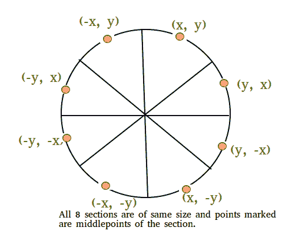

# 使用布雷森汉算法的圆上一点的邻居

> 原文:[https://www . geesforgeks . org/neights-point-circle-use-bresenhams-algorithm/](https://www.geeksforgeeks.org/neighbors-point-circle-using-bresenhams-algorithm/)

给定圆心和半径。我们的任务是找到离散圆上任意一点的邻居。
示例:

```
Input :  Center = (0, 0), 
         Radius = 3 
         Point for determining neighbors = (2, 2)
Output : Neighbors of given point are : (1, 3), (3, 1)

Input : Center = (2, 2) 
        Radius 2
        Point of determining neighbors = (0, 2)
Output : Neighbors of given point are : (1, 4), (3, 4)
```

**离散圆上任意一点的邻居是那些与原始 x 坐标相比少一个或多一个 x 坐标的点。**

我们使用 [bresenham 的圆生成算法](https://www.geeksforgeeks.org/bresenhams-circle-drawing-algorithm/)提取出在像素的计算机屏幕上画圆所需的整数点。



圆具有高度对称的特性，这是在像素的计算机屏幕上画圆所需要的。Bresenham 的圆算法计算前 45 度的像素位置，以原点为中心的圆周边的剩余像素是利用圆的 8 向对称性计算的。


推导:考虑一个无穷小的圆的连续弧，如下图所示，我们假设我们要沿着一个中心在原点的顺时针圆弧运动，半径为 r，我们的运动位于第一个八分之一，位于第一个八分之一，所以我们的极限是从(0，r)到(r/ ，r/ )其中 x = y，我们知道，在这个特定的八分之一中， y 坐标的减少小于 x 坐标的增加，或者你可以说沿着 x 轴的移动大于沿着 y 轴的移动，所以 x 坐标总是在第一个八分点增加。 现在，我们想知道 y 是否会随着 x 而改变。为了知道 y 随 x 的变化，bresenham 引入了一个名为决策参数的变量，它将在循环运行时更新它们的值。
现在，我们需要了解我们将如何选择下一个像素，在图中，f(N)和 f(S)分别是计算原点到像素 N 和 S 的距离时所涉及的误差，无论哪一个少，我们都将选择该像素。判定参数定义为 d = f(N)+f(S)，如果 d < = 0，那么 N 将是下一个像素，否则 S 将是下一个像素。我们将继续这样做，直到 x < y 条件成立，通过取所有对称点，我们将得到在计算机屏幕上显示一个像素圆所需的所有整数点。
本文并不主要关注 bresenham 算法，因此，我将跳过决策参数的推导，但如果您想了解决策参数的推导，请访问参考链接。
**注意:**一个点的邻居可以是任意数量，并且邻居的 y 坐标应该与其输入像素的符号相同，对于那些 y 坐标为零的像素，我们将打印出所有邻居，而不管其符号如何。
离散几何对象由有限组整数点组成。这套通常很稀疏。因此，数组表示根本不具备存储空间效率。我们将使用散列映射，其中数据值是 y 坐标的链表，键值是 x 坐标。我们可以使用键值轻松访问它们，这也是一种节省空间的方法。
下面是确定给定点邻居的 C++ stl 程序。

## 卡片打印处理机（Card Print Processor 的缩写）

```
// C++ program to find neighbors of a given point on circle
#include <bits/stdc++.h>
using namespace std;

// map to store all the pixels of circle
map<int, list<int> > mymap;
map<int, list<int> >::iterator it;

// This program will print all the stored pixels.
void showallpoints(map<int, list<int> >& mymap)
{
    // To print out all the stored pixels,
    // we will traverse the map using iterator
    for (it = mymap.begin(); it != mymap.end(); it++) {

        // List contains all the y-coordinate.
        list<int> temp = it->second;

        for (auto p = temp.begin(); p != temp.end(); p++) {
            cout << "(" << it->first << ", " << *p << ")\n";
        }
    }
}

// This function will stored the pixels.
void putpixelone(int m, int n, map<int, list<int> >& mymap)
{
    // check if the given pixel is present already in the
    // map then discard that pixel and return the function.
    map<int, list<int> >::iterator it;

    // if x-coordinate of the pixel is present in the map then
    // it will give iterator pointing to list of those pixels
    // which are having same x-coordinate as the input pixel
    if (mymap.find(m) != mymap.end()) {

        it = mymap.find(m);
        list<int> temp = it->second;
        list<int>::iterator p;

        // Checking for y coordinate
        for (p = temp.begin(); p != temp.end(); p++)
            if (*p == n)
                return;

        // if map doesn't contain pixels having same y-
        // coordinate then pixel are different and store
        // the pixel
        mymap[m].push_back(n);
    } else

        // Neither x nor y coordinate are same.
        // put the pixel into the map
        mymap[m].push_back(n);

    return;
}

// generate all the pixels using 8 way-symmetry of circle
void putpixelall(int p, int q, int x1, int y1)
{
    putpixelone(p + x1, q + y1, mymap);
    putpixelone(q + x1, p + y1, mymap);
    putpixelone(q + x1, -p + y1, mymap);
    putpixelone(p + x1, -q + y1, mymap);
    putpixelone(-p + x1, -q + y1, mymap);
    putpixelone(-q + x1, -p + y1, mymap);
    putpixelone(-q + x1, p + y1, mymap);
    putpixelone(-p + x1, q + y1, mymap);
    return;
}

// Brensenham's circle algorithm
void circle(int centerx, int centery, int r)
{
    // initial coordinate will be (0, radius) and we
    // will move counter-clockwise from this coordinate
    int x = 0;
    int y = r;

    // decision parameter for initial coordinate
    float decision_para = 3 - 2 * (r);
    putpixelall(x, y, centerx, centery);

    while (x < y) {

        // x will always increase by 1 unit
        x = x + 1;
        if (decision_para <= 0) {

            // if decision parameter is negative then N
            // will be next pixel N(x+1, y)
            decision_para = decision_para + 4 * x + 6;
        } else {

            // if decision parameter is positive then N
            // will be next pixel S(x+1, y-1)
            y = y - 1;
            decision_para = decision_para + 4 * (x - y) + 10;
        }

        // Function call to generate all the pixels by symmetry
        putpixelall(x, y, centerx, centery);
    }
    return;
}
// this program will find the neighbors of a given point`
void neighbours(map<int, list<int> >& mymap, int given_pointx,
                                             int given_pointy)
{
    for (it = mymap.begin(); it != mymap.end(); ++it) {
        if (it->first == given_pointx + 1 ||
            it->first == given_pointx - 1) {
            list<int> temp1 = it->second;
            list<int>::iterator itr1;
            for (itr1 = temp1.begin(); itr1 != temp1.end(); ++itr1) {

                // Checking for same-sign.
                if (given_pointy >= 0 && *itr1 >= 0)
                    cout << "(" << it->first << ", " << *itr1 << ")\n";
                else if (given_pointy <= 0 && *itr1 <= 0)
                    cout << "(" << it->first << ", " << *itr1 << ")\n";
                else
                    continue;
            }
        }
    }
}

// Driver code
int main()
{
    int center_x = 0, center_y = 0;
    float r = 3.0;
    circle(center_x, center_y, r);
    showallpoints(mymap);
    int nx = 3, ny = 0;
    neighbours(mymap, nx, ny);
    cout << endl;
    return 0;
}
```

输出:

```
(-3, 0), (-3, -1), (-3, 1), (-2, -2), (-2, 2), (-1, -3), (-1, 3), (0, 3)
(0, -3), (1, 3), (1, -3), (2, 2), (2, -2), (3, 0), (3, 1), (3, -1)
 Neighbours of given point are : (2, 2), (2, -2)
```

**参考文献:**
[【https://www.slideshare.net/tahersb/bresenham-circle】](https://www.slideshare.net/tahersb/bresenham-circle)
本文由 **Harsh Kumar Singh** 供稿。如果你喜欢 GeeksforGeeks 并想投稿，你也可以用[write.geeksforgeeks.org](https://write.geeksforgeeks.org)写一篇文章或者把你的文章邮寄到 review-team@geeksforgeeks.org。看到你的文章出现在极客博客主页上，帮助其他极客。
如果发现有不正确的地方，或者想分享更多关于上述话题的信息，请写评论。