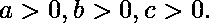
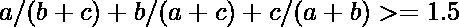

# 奈斯比特不等式

> 原文:[https://www.geeksforgeeks.org/nesbitts-inequality/](https://www.geeksforgeeks.org/nesbitts-inequality/)

[奈斯比特不等式](https://en.wikipedia.org/wiki/Nesbitt%27s_inequality)是数学中最简单的不等式之一。根据不等式的陈述，对于任何 3 个给定的实数，它们满足数学条件，
对于所有都是

**说明性示例:**

> 满足 Nesbitts 不等式的 3 个数字是实数。
> 对于 a = 1，b = 2，c = 3，
> 不等式的条件
> { 1/(2+3)}+{ 2/(1+3)}+{ 3/(1+2)}>= 1.5 成立。
> 
> 对于 a = 1.5，b = 5.6，c = 4.9，
> 不等式的条件
> { 1.5/(5.6+4.9)}+{ 5.6/(1.5+4.9)}+{ 4.9/(1.5+5.6)}>= 1.5 成立。
> 
> 对于 a = 4，b = 6，c = 7，
> 不等式的条件
> { 4/(6+7)}+{ 6/(4+7)}+{ 7/(4+6)}>= 1.5 成立。
> 
> 对于 a = 459，b = 62，c = 783，
> 不等式的条件
> { 459/(62+783)}+{ 62/(459+783)}+{ 783/(459+62)}>= 1.5 成立。
> 
> 对于 a = 9，b = 6，c = 83，
> 不等式的条件
> { 9/(6+83)}+{ 6/(9+83)}+{ 83/(9+6)}>= 1.5 成立。

## C++

```
// C++ code to verify Nesbitt's Inequality
#include <bits/stdc++.h>
using namespace std;

bool isValidNesbitt(double a, double b, double c)
{
    // 3 parts of the inequality sum
    double A = a / (b + c);
    double B = b / (a + c);
    double C = c / (a + b);
    double inequality = A + B + C;

   return (inequality >= 1.5);
}

int main()
{
    double a = 1.0, b = 2.0, c = 3.0;
    if (isValidNesbitt(a, b, c))
        cout << "Nesbitt's inequality satisfied."
             << "for real numbers " << a << ", "
             << b << ", " << c << "\n";
    else
       cout << "Not satisfied";
    return 0;
}
```

## Java 语言(一种计算机语言，尤用于创建网站)

```
// Java code to verify Nesbitt's Inequality
class GFG {

    static boolean isValidNesbitt(double a,
                          double b, double c)
    {

        // 3 parts of the inequality sum
        double A = a / (b + c);
        double B = b / (a + c);
        double C = c / (a + b);
        double inequality = A + B + C;

        return (inequality >= 1.5);
    }

    // Driver code
    public static void main(String args[])
    {
        double a = 1.0, b = 2.0, c = 3.0;
        if(isValidNesbitt(a, b, c) == true)
        {
            System.out.print("Nesbitt's inequality"
                                  + " satisfied.");
            System.out.println("for real numbers "
                         + a + ", " + b + ", " + c);
        }
        else
            System.out.println("Nesbitts inequality"
                                + " not satisfied");
    }
}

// This code is contributed by JaideepPyne.
```

## 蟒蛇 3

```
# Python3 code to verify
# Nesbitt's Inequality

def isValidNesbitt(a, b, c):

    # 3 parts of the
    # inequality sum
    A = a / (b + c);
    B = b / (a + c);
    C = c / (a + b);
    inequality = A + B + C;

    return (inequality >= 1.5);

# Driver Code
a = 1.0;
b = 2.0;
c = 3.0;
if (isValidNesbitt(a, b, c)):
    print("Nesbitt's inequality satisfied." ,
          " for real numbers ",a,", ",b,", ",c);
else:
    print("Not satisfied");

# This code is contributed by mits
```

## C#

```
// C# code to verify
// Nesbitt's Inequality
using System;

class GFG
{
    static bool isValidNesbitt(double a,
                               double b,
                               double c)
    {

        // 3 parts of the
        // inequality sum
        double A = a / (b + c);
        double B = b / (a + c);
        double C = c / (a + b);
        double inequality = A + B + C;

        return (inequality >= 1.5);
    }

    // Driver code
    static public void Main ()
    {
    double a = 1.0, b = 2.0, c = 3.0;
    if(isValidNesbitt(a, b, c) == true)
    {
        Console.Write("Nesbitt's inequality" +
                               " satisfied ");
        Console.WriteLine("for real numbers " +
                      a + ", " + b + ", " + c);
    }
    else
        Console.WriteLine("Nesbitts inequality" +
                               " not satisfied");
    }
}

// This code is contributed by ajit
```

## 服务器端编程语言（Professional Hypertext Preprocessor 的缩写）

```
<?php
// PHP code to verify
// Nesbitt's Inequality

function isValidNesbitt($a, $b, $c)
{

    // 3 parts of the
    // inequality sum
    $A = $a / ($b + $c);
    $B = $b / ($a + $c);
    $C = $c / ($a + $b);
    $inequality = $A + $B + $C;

    return ($inequality >= 1.5);
}

    // Driver Code
    $a = 1.0;
    $b = 2.0;
    $c = 3.0;
    if (isValidNesbitt($a, $b, $c))
        echo"Nesbitt's inequality satisfied.",
            "for real numbers ", $a, ", ", $b,
                               ", ", $c, "\n";
    else
    cout <<"Not satisfied";

// This code is contributed by Ajit.
?>
```

## java 描述语言

```
<script>

// Javascript code to verify Nesbitt's Inequality
function isValidNesbitt(a, b, c)
{

    // 3 parts of the
    // inequality sum
    let A = a / (b + c);
    let B = b / (a + c);
    let C = c / (a + b);
    let inequality = A + B + C;

    return (inequality >= 1.5);
}

// Driver code
let a = 1.0, b = 2.0, c = 3.0;
if (isValidNesbitt(a, b, c) == true)
{
    document.write("Nesbitt's inequality" +
                   " satisfied.");
    document.write("for real numbers " +
                   a + ", " + b + ", " + c);
}
else
    document.write("Nesbitts inequality" +
                   " not satisfied");

// This code is contributed by decode2207

</script>
```

**Output :** 

```
Nesbitt's inequality satisfied.for real numbers 1, 2, 3
```