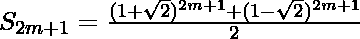
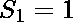

# 纽曼-尚克斯-威廉姆斯素数

> 原文:[https://www.geeksforgeeks.org/newman-shanks-williams-prime/](https://www.geeksforgeeks.org/newman-shanks-williams-prime/)

在数学中，纽曼-桑克斯-威廉姆斯素数(新南威尔士州素数)是一个素数 p，可以写成以下形式:



纽曼-香克斯-威廉姆斯素数的递推关系是:



数列的前几项是 1，1，3，7，17，41，99，…

**示例:**

```
Input : n = 3
Output : 7

Input : n = 4
Output : 17 
```

以下是第 n 个纽曼-尚克斯-威廉姆斯素数的实现:

## C++

```
// CPP Program to find Newman–Shanks–Williams prime
#include <bits/stdc++.h>
using namespace std;

// return nth Newman–Shanks–Williams prime
int nswp(int n)
{
    // Base case
    if (n == 0 || n == 1)
        return 1;

    // Recursive step
    return 2 * nswp(n - 1) + nswp(n - 2);
}

// Driven Program
int main()
{
    int n = 3;

    cout << nswp(n) << endl;
    return 0;
}
```

## Java 语言(一种计算机语言，尤用于创建网站)

```
// Java Program to find
// Newman-Shanks-Williams prime
class GFG
{
// return nth Newman-Shanks-Williams
// prime
static int nswp(int n)
{
    // Base case
    if (n == 0 || n == 1)
        return 1;

    // Recursive step
    return 2 * nswp(n - 1) + nswp(n - 2);
}

// Driver code
public static void main (String[] args)
{
    int n = 3;
    System.out.println(nswp(n));
}
}

// This code is contributed by Anant Agarwal.
```

## 蟒蛇 3

```
# Python3 Program to find Newman–Shanks–Williams prime

# return nth Newman–Shanks–Williams prime
def nswp(n):

    # Base case
    if n == 0 or n == 1:
        return 1

    # Recursive step
    return 2 * nswp(n - 1) + nswp(n - 2)

# Driven Program
n = 3
print (nswp(n))

# This code is contributed by Shreyanshi Arun.
```

## C#

```
// C# Program to find
// Newman-Shanks-Williams prime
using System;

class GFG {

    // return nth Newman-Shanks-Williams
    // prime
    static int nswp(int n)
    {

        // Base case
        if (n == 0 || n == 1)
            return 1;

        // Recursive step
        return 2 * nswp(n - 1) + nswp(n - 2);
    }

    // Driver code
    public static void Main()
    {
        int n = 3;

        Console.WriteLine(nswp(n));
    }
}

// This code is contributed by vt_m.
```

## 服务器端编程语言（Professional Hypertext Preprocessor 的缩写）

```
<?php
// PHP Program to find
// Newman–Shanks–Williams prime

// return nth Newman –
// Shanks – Williams prime
function nswp($n)
{

    // Base case
    if ($n == 0 || $n == 1)
        return 1;

    // Recursive step
    return 2 * nswp($n - 1) +
               nswp($n - 2);
}

// Driver Code
$n = 3;
echo(nswp($n));

// This code is contributed by Ajit.
?>
```

## java 描述语言

```
<script>
    // Javascript Program to find Newman-Shanks-Williams prime

    // return nth Newman-Shanks-Williams
    // prime
    function nswp(n)
    {

        // Base case
        if (n == 0 || n == 1)
            return 1;

        // Recursive step
        return 2 * nswp(n - 1) + nswp(n - 2);
    }

    let n = 3;

      document.write(nswp(n));

     // This code is contributed by mukesh07.
</script>
```

**输出:**

```
7
```

下面是寻找第 n 个纽曼-香克斯-威廉姆斯素数的动态规划解:

## C++

```
// CPP Program to find Newman–Shanks–Williams prime
#include <bits/stdc++.h>
using namespace std;

// return nth Newman–Shanks–Williams prime
int nswp(int n)
{
    int dp[n + 1];

    // Base case
    dp[0] = dp[1] = 1;

    // Finding nth Newman–Shanks–Williams prime
    for (int i = 2; i <= n; i++)
        dp[i] = 2 * dp[i - 1] + dp[i - 2];

    return dp[n];
}

// Driver Program
int main()
{
    int n = 3;

    cout << nswp(n) << endl;
    return 0;
}
```

## Java 语言(一种计算机语言，尤用于创建网站)

```
// Java Program for finding
// Newman-Shanks-Williams prime
import java.util.*;

class GFG
{
    // return nth Newman_Shanks_Williams prime
    public static int nswpn(int n)
    {
        int dp[] = new int[n + 1];

        // Base case
        dp[0] = dp[1] = 1;

        // Finding nth Newman_Shanks_Williams prime
        for (int i = 2; i <= n; i++)
          dp[i] = 2 * dp[i - 1] + dp[i - 2];

        return dp[n];
    }

    // Driver Program
    public static void main (String[] args) {

        int n = 3;

        System.out.println(nswpn(n));
    }
}

/* This code is contributed by Akash Singh */
```

## 蟒蛇 3

```
# Python3 Program to find
# Newman–Shanks–Williams prime

# return nth Newman–Shanks
# –Williams prime
def nswp(n):

    # Base case
    dp = [1 for x in range(n + 1)];

    # Finding nth Newman–Shanks
    # –Williams prime
    for i in range(2, n + 1):
        dp[i] = (2 * dp[i - 1] +
                     dp[i - 2]);
    return dp[n];

# Driver Code
n = 3;
print(nswp(n));

# This code is contributed
# by mits
```

## C#

```
// C# Program to find Newman–Shanks–Williams prime

using System;

class GFG {

    // return nth Newman–Shanks–Williams prime
    static int nswp(int n)
    {

        int[] dp = new int[n + 1];

        // Base case
        dp[0] = dp[1] = 1;

        // Finding nth Newman–Shanks–Williams prime
        for (int i = 2; i <= n; i++)
            dp[i] = 2 * dp[i - 1] + dp[i - 2];

        return dp[n];
    }

    // Driver Program
    public static void Main()
    {
        int n = 3;

        Console.WriteLine(nswp(n));
    }
}

// This code is contributed by vt_m.
```

## 服务器端编程语言（Professional Hypertext Preprocessor 的缩写）

```
<?php
// PHP Program to find
// Newman–Shanks–Williams prime

// return nth Newman–Shanks
// –Williams prime
function nswp($n)
{

    // Base case
    $dp[0] = $dp[1] = 1;

    // Finding nth Newman–Shanks
    // –Williams prime
    for ($i = 2; $i <= $n; $i++)
        $dp[$i] = 2 * $dp[$i - 1] +
                      $dp[$i - 2];

    return $dp[$n];
}

// Driver Code
$n = 3;
echo(nswp($n));

// This code is contributed by Ajit.
?>
```

## java 描述语言

```
<script>

    // Javascript Program to find
    // Newman–Shanks–Williams prime

    // return nth Newman–Shanks–Williams prime
    function nswp(n)
    {

        let dp = new Array(n + 1);

        // Base case
        dp[0] = dp[1] = 1;

        // Finding nth Newman–Shanks–Williams prime
        for (let i = 2; i <= n; i++)
            dp[i] = 2 * dp[i - 1] + dp[i - 2];

        return dp[n];
    }

    let n = 3;
      document.write(nswp(n));

</script>
```

**输出:**

```
7
```

**下面是带有 O(1)空间复杂度的代码**

## C++

```
// C++ code
#include <iostream>
using namespace std;

int nswp(int n)
{

    if(n == 0 || n == 1)
    {
        return 1;
    }

    // Here we only need to store last 2 values
    // to find the value of n,
    // so we will store those 2 values only.
    int a = 1, b = 1;

    for(int i = 2; i <= n; ++i)
    {
        int c = 2 * b + a;
        a = b;
        b = c;
    }
    return b;
}
int main()
{
    int n = 3;
    cout << nswp(n);
    return 0;
}

// This code is contributed by SHUBHAMSINGH10
```

## Java 语言(一种计算机语言，尤用于创建网站)

```
//Write Java code here
class GFG{
     static int nswp(int n){
           if(n==0 || n==1) return 1;
           //Here we only need to store last 2 values to find the value of n,
           //so we will store those 2 values only.
           int a=1,b=1;
           for(int i=2;i<=n;++i){
               int c=2*b+a;
               a=b;
               b=c;
           }
           return b;
     }
     public static void main(String[] args){
          int n=3;
          System.out.println(nswp(n));
     }
}
```

## 蟒蛇 3

```
# Write Python3 code here

def nswp(n):
    if(n<2): return 1
    a,b=1,1
    for i in range(2,n+1):
        c=2*b+a
        a=b
        b=c
    return b
n=3
print(nswp(n))
```

## C#

```
// C# code
using System;

class GFG
{
    static int nswp(int n) {
        if (n == 0 || n == 1)
            return 1;

        // Here we only need to store last 2 values
        // to find the value of n,
        // so we will store those 2 values only.
        int a = 1, b = 1;
        for (int i = 2; i <= n; ++i) {
            int c = 2 * b + a;
            a = b;
            b = c;
        }
        return b;
    }

    public static void Main(String[] args)
    {
        int n = 3;
        Console.WriteLine(nswp(n));
    }
}

// This code is contributed by PrinciRaj1992
```

## java 描述语言

```
<script>
    // Javascript code

    function nswp(n) {
        if (n == 0 || n == 1)
            return 1;

        // Here we only need to store last 2 values
        // to find the value of n,
        // so we will store those 2 values only.
        let a = 1, b = 1;
        for (let i = 2; i <= n; ++i) {
            let c = 2 * b + a;
            a = b;
            b = c;
        }
        return b;
    }

    let n = 3;
      document.write(nswp(n));

</script>
```

**输出:**

```
7
```