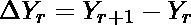
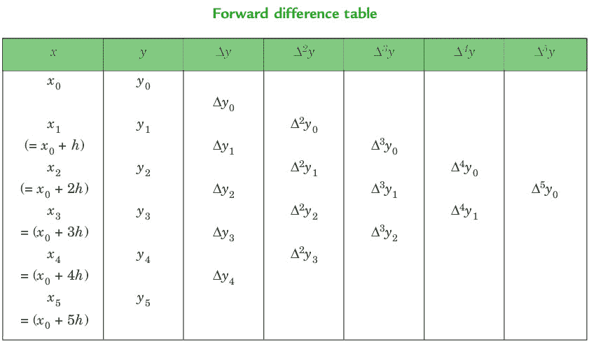
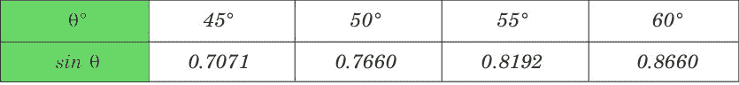
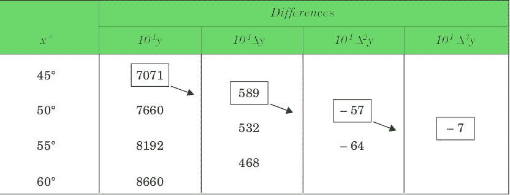
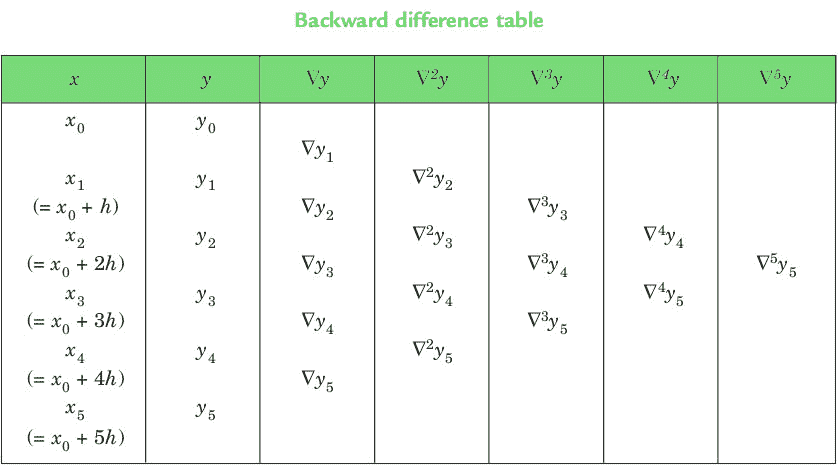
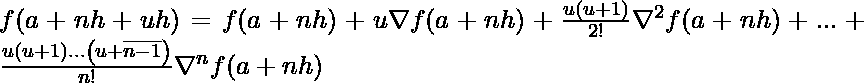
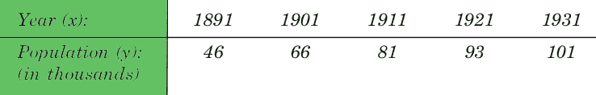

# 牛顿向前和向后插值

> 原文:[https://www . geesforgeks . org/Newton-正向-反向-插值/](https://www.geeksforgeeks.org/newton-forward-backward-interpolation/)

**内插**是针对自变量的任何中间值估计函数值的技术，而计算给定范围之外的函数值的过程称为**外推**。

**正向差**:当分别用 dy0、dy1、dy2、……、dyn–1 表示时，差 y1–y0、y2–y1、y3–y2、……、yn–yn–1 称为第一正向差。由此可见，第一个前进的差异是:




**牛顿的 GREGORY FORWARD 插值公式** :

这个公式对于在给定值集开始附近插值 f(x)的值特别有用。h 称为差的区间和**u =(x–a)/h**，这里 a 是第一项。

**例**:

```
Input : Value of Sin 52
```



```
Output :
```



```
Value at Sin 52 is 0.788003
```

下面是牛顿正插值方法的实现。

## C++

```
// CPP Program to interpolate using
// newton forward interpolation
#include <bits/stdc++.h>
using namespace std;

// calculating u mentioned in the formula
float u_cal(float u, int n)
{
    float temp = u;
    for (int i = 1; i < n; i++)
        temp = temp * (u - i);
    return temp;
}

// calculating factorial of given number n
int fact(int n)
{
    int f = 1;
    for (int i = 2; i <= n; i++)
        f *= i;
    return f;
}

int main()
{
    // Number of values given
    int n = 4;
    float x[] = { 45, 50, 55, 60 };

    // y[][] is used for difference table
    // with y[][0] used for input
    float y[n][n];
    y[0][0] = 0.7071;
    y[1][0] = 0.7660;
    y[2][0] = 0.8192;
    y[3][0] = 0.8660;

    // Calculating the forward difference
    // table
    for (int i = 1; i < n; i++) {
        for (int j = 0; j < n - i; j++)
            y[j][i] = y[j + 1][i - 1] - y[j][i - 1];
    }

    // Displaying the forward difference table
    for (int i = 0; i < n; i++) {
        cout << setw(4) << x[i]
             << "\t";
        for (int j = 0; j < n - i; j++)
            cout << setw(4) << y[i][j]
                 << "\t";
        cout << endl;
    }

    // Value to interpolate at
    float value = 52;

    // initializing u and sum
    float sum = y[0][0];
    float u = (value - x[0]) / (x[1] - x[0]);
    for (int i = 1; i < n; i++) {
        sum = sum + (u_cal(u, i) * y[0][i]) /
                                 fact(i);
    }

    cout << "\n Value at " << value << " is "
         << sum << endl;
    return 0;
}
```

## Java 语言(一种计算机语言，尤用于创建网站)

```
// Java Program to interpolate using
// newton forward interpolation

class GFG{
// calculating u mentioned in the formula
static double u_cal(double u, int n)
{
    double temp = u;
    for (int i = 1; i < n; i++)
        temp = temp * (u - i);
    return temp;
}

// calculating factorial of given number n
static int fact(int n)
{
    int f = 1;
    for (int i = 2; i <= n; i++)
        f *= i;
    return f;
}

public static void main(String[] args)
{
    // Number of values given
    int n = 4;
    double x[] = { 45, 50, 55, 60 };

    // y[][] is used for difference table
    // with y[][0] used for input
    double y[][]=new double[n][n];
    y[0][0] = 0.7071;
    y[1][0] = 0.7660;
    y[2][0] = 0.8192;
    y[3][0] = 0.8660;

    // Calculating the forward difference
    // table
    for (int i = 1; i < n; i++) {
        for (int j = 0; j < n - i; j++)
            y[j][i] = y[j + 1][i - 1] - y[j][i - 1];
    }

    // Displaying the forward difference table
    for (int i = 0; i < n; i++) {
        System.out.print(x[i]+"\t");
        for (int j = 0; j < n - i; j++)
            System.out.print(y[i][j]+"\t");
        System.out.println();
    }

    // Value to interpolate at
    double value = 52;

    // initializing u and sum
    double sum = y[0][0];
    double u = (value - x[0]) / (x[1] - x[0]);
    for (int i = 1; i < n; i++) {
        sum = sum + (u_cal(u, i) * y[0][i]) /
                                fact(i);
    }

    System.out.println("\n Value at "+value+" is "+String.format("%.6g%n",sum));
}
}
// This code is contributed by mits
```

## 蟒蛇 3

```
# Python3 Program to interpolate using
# newton forward interpolation

# calculating u mentioned in the formula
def u_cal(u, n):

    temp = u;
    for i in range(1, n):
        temp = temp * (u - i);
    return temp;

# calculating factorial of given number n
def fact(n):
    f = 1;
    for i in range(2, n + 1):
        f *= i;
    return f;

# Driver Code

# Number of values given
n = 4;
x = [ 45, 50, 55, 60 ];

# y[][] is used for difference table
# with y[][0] used for input
y = [[0 for i in range(n)]
        for j in range(n)];
y[0][0] = 0.7071;
y[1][0] = 0.7660;
y[2][0] = 0.8192;
y[3][0] = 0.8660;

# Calculating the forward difference
# table
for i in range(1, n):
    for j in range(n - i):
        y[j][i] = y[j + 1][i - 1] - y[j][i - 1];

# Displaying the forward difference table
for i in range(n):
    print(x[i], end = "\t");
    for j in range(n - i):
        print(y[i][j], end = "\t");
    print("");

# Value to interpolate at
value = 52;

# initializing u and sum
sum = y[0][0];
u = (value - x[0]) / (x[1] - x[0]);
for i in range(1,n):
    sum = sum + (u_cal(u, i) * y[0][i]) / fact(i);

print("\nValue at", value,
      "is", round(sum, 6));

# This code is contributed by mits
```

## C#

```
// C# Program to interpolate using
// newton forward interpolation
using System;

class GFG
{
// calculating u mentioned in the formula
static double u_cal(double u, int n)
{
    double temp = u;
    for (int i = 1; i < n; i++)
        temp = temp * (u - i);
    return temp;
}

// calculating factorial of given number n
static int fact(int n)
{
    int f = 1;
    for (int i = 2; i <= n; i++)
        f *= i;
    return f;
}

// Driver code
public static void Main()
{
    // Number of values given
    int n = 4;
    double[] x = { 45, 50, 55, 60 };

    // y[,] is used for difference table
    // with y[,0] used for input
    double[,] y=new double[n,n];
    y[0,0] = 0.7071;
    y[1,0] = 0.7660;
    y[2,0] = 0.8192;
    y[3,0] = 0.8660;

    // Calculating the forward difference
    // table
    for (int i = 1; i < n; i++) {
        for (int j = 0; j < n - i; j++)
            y[j,i] = y[j + 1,i - 1] - y[j,i - 1];
    }

    // Displaying the forward difference table
    for (int i = 0; i < n; i++) {
        Console.Write(x[i]+"\t");
        for (int j = 0; j < n - i; j++)
            Console.Write(y[i,j]+"\t");
        Console.WriteLine();
    }

    // Value to interpolate at
    double value = 52;

    // initializing u and sum
    double sum = y[0,0];
    double u = (value - x[0]) / (x[1] - x[0]);
    for (int i = 1; i < n; i++) {
        sum = sum + (u_cal(u, i) * y[0,i]) /
                                fact(i);
    }

    Console.WriteLine("\n Value at "+value+" is "+Math.Round(sum,6));
}
}
// This code is contributed by mits
```

## 服务器端编程语言（Professional Hypertext Preprocessor 的缩写）

```
<?php
// PHP Program to interpolate using
// newton forward interpolation

// calculating u mentioned in the formula
function u_cal($u, $n)
{
    $temp = $u;
    for ($i = 1; $i < $n; $i++)
        $temp = $temp * ($u - $i);
    return $temp;
}

// calculating factorial of given number n
function fact($n)
{
    $f = 1;
    for ($i = 2; $i <= $n; $i++)
        $f *= $i;
    return $f;
}

// Driver Code

// Number of values given
$n = 4;
$x = array( 45, 50, 55, 60 );

// y[,] is used for difference table
// with y[,0] used for input
$y = array_fill(0, $n,
     array_fill(0, $n, 0));
$y[0][0] = 0.7071;
$y[1][0] = 0.7660;
$y[2][0] = 0.8192;
$y[3][0] = 0.8660;

// Calculating the forward difference
// table
for ($i = 1; $i < $n; $i++)
{
    for ($j = 0; $j < $n - $i; $j++)
        $y[$j][$i] = $y[$j + 1][$i - 1] -
                     $y[$j][$i - 1];
}

// Displaying the forward difference table
for ($i = 0; $i < $n; $i++)
{
    print($x[$i] . "\t");
    for ($j = 0; $j < $n - $i; $j++)
        print($y[$i][$j] . "\t");
    print("\n");
}

// Value to interpolate at
$value = 52;

// initializing u and sum
$sum = $y[0][0];
$u = ($value - $x[0]) / ($x[1] - $x[0]);
for ($i = 1; $i < $n; $i++)
{
    $sum = $sum + (u_cal($u, $i) * $y[0][$i]) /
                                    fact($i);
}

print("\nValue at " . $value .
      " is " . round($sum, 6));

// This code is contributed by mits
```

## java 描述语言

```
<script>
    // javascript Program to interpolate using
    // newton forward interpolation
    // calculating u mentioned in the formula

    function u_cal(u , n)
    {
        var temp = u;
        for (var i = 1; i < n; i++)
            temp = temp * (u - i);
        return temp;
    }

    // calculating factorial of given number n
    function fact(n)
    {
        var f = 1;
        for (var i = 2; i <= n; i++)
            f *= i;
        return f;
    }
    // Number of values given
    var n = 4;
    var x = [ 45, 50, 55, 60 ];

    // y is used for difference table
    // with y[0] used for input
    var y=Array(n).fill(0.0).map(x => Array(n).fill(0.0));
    y[0][0] = 0.7071;
    y[1][0] = 0.7660;
    y[2][0] = 0.8192;
    y[3][0] = 0.8660;

    // Calculating the forward difference
    // table
    for (var i = 1; i < n; i++) {
        for (var j = 0; j < n - i; j++)
            y[j][i] = y[j + 1][i - 1] - y[j][i - 1];
    }

    // Displaying the forward difference table
    for (var i = 0; i < n; i++) {
        document.write(x[i].toFixed(6)+"    ");
        for (var j = 0; j < n - i; j++)
            document.write(y[i][j].toFixed(6)+"    ");
        document.write('<br>');
    }

    // Value to interpolate at
    var value = 52;

    // initializing u and sum
    var sum = y[0][0];
    var u = (value - x[0]) / (x[1] - x[0]);
    for (var i = 1; i < n; i++) {
        sum = sum + (u_cal(u, i) * y[0][i]) /
                                fact(i);
    }

    document.write("\n Value at "+value.toFixed(6)+" is "+sum.toFixed(6));

// This code is contributed by 29AjayKumar
</script>
```

**输出:**

```
  45    0.7071    0.0589    -0.00569999    -0.000699997    
  50    0.766    0.0532    -0.00639999    
  55    0.8192    0.0468    
  60    0.866    

Value at 52 is 0.788003
```

**后向差**:分别用 dy1、dy2、……、dyn 表示的差 y1–y0、y2–y1、……、yn–yn–1 称为第一后向差。由此可见，第一个向后的区别是:




**牛顿的 GREGORY BACKWARD 插值公式** :

当表的末尾附近需要 f(x)的值时，这个公式很有用。h 叫差的区间，**u =(x–an)/h**，这里 an 是最后一项。

**例**:

```
Input : Population in 1925
```



```
Output :
```


```
Value in 1925 is 96.8368 
```

下面是牛顿反向插值法的实现。

## C++

```
// CPP Program to interpolate using
// newton backward interpolation
#include <bits/stdc++.h>
using namespace std;

// Calculation of u mentioned in formula
float u_cal(float u, int n)
{
    float temp = u;
    for (int i = 1; i < n; i++)
        temp = temp * (u + i);
    return temp;
}

// Calculating factorial of given n
int fact(int n)
{
    int f = 1;
    for (int i = 2; i <= n; i++)
        f *= i;
    return f;
}

int main()
{
    // number of values given
    int n = 5;
    float x[] = { 1891, 1901, 1911,
                  1921, 1931 };

    // y[][] is used for difference
    // table and y[][0] used for input
    float y[n][n];
    y[0][0] = 46;
    y[1][0] = 66;
    y[2][0] = 81;
    y[3][0] = 93;
    y[4][0] = 101;

    // Calculating the backward difference table
    for (int i = 1; i < n; i++) {
        for (int j = n - 1; j >= i; j--)
            y[j][i] = y[j][i - 1] - y[j - 1][i - 1];
    }

    // Displaying the backward difference table
    for (int i = 0; i < n; i++) {
        for (int j = 0; j <= i; j++)
            cout << setw(4) << y[i][j]
                 << "\t";
        cout << endl;
    }

    // Value to interpolate at
    float value = 1925;

    // Initializing u and sum
    float sum = y[n - 1][0];
    float u = (value - x[n - 1]) / (x[1] - x[0]);
    for (int i = 1; i < n; i++) {
        sum = sum + (u_cal(u, i) * y[n - 1][i]) /
                                     fact(i);
    }

    cout << "\n Value at " << value << " is "
         << sum << endl;
    return 0;
}
```

## Java 语言(一种计算机语言，尤用于创建网站)

```
// Java Program to interpolate using
// newton backward interpolation
class GFG
{

// Calculation of u mentioned in formula
static double u_cal(double u, int n)
{
    double temp = u;
    for (int i = 1; i < n; i++)
        temp = temp * (u + i);
    return temp;
}

// Calculating factorial of given n
static int fact(int n)
{
    int f = 1;
    for (int i = 2; i <= n; i++)
        f *= i;
    return f;
}

// Driver code
public static void main(String[] args)
{
    // number of values given
    int n = 5;
    double x[] = { 1891, 1901, 1911,
                1921, 1931 };

    // y[][] is used for difference
    // table and y[][0] used for input
    double[][] y = new double[n][n];
    y[0][0] = 46;
    y[1][0] = 66;
    y[2][0] = 81;
    y[3][0] = 93;
    y[4][0] = 101;

    // Calculating the backward difference table
    for (int i = 1; i < n; i++)
    {
        for (int j = n - 1; j >= i; j--)
            y[j][i] = y[j][i - 1] - y[j - 1][i - 1];
    }

    // Displaying the backward difference table
    for (int i = 0; i < n; i++)
    {
        for (int j = 0; j <= i; j++)
            System.out.print(y[i][j] + "\t");
        System.out.println("");;
    }

    // Value to interpolate at
    double value = 1925;

    // Initializing u and sum
    double sum = y[n - 1][0];
    double u = (value - x[n - 1]) / (x[1] - x[0]);
    for (int i = 1; i < n; i++)
    {
        sum = sum + (u_cal(u, i) * y[n - 1][i]) /
                                    fact(i);
    }
    System.out.println("\n Value at " + value +
                    " is " + String.format("%.6g%n",sum));
}
}

// This code is contributed by mits
```

## C#

```
// C# Program to interpolate using
// newton backward interpolation
using System;

class GFG
{

// Calculation of u mentioned in formula
static double u_cal(double u, int n)
{
    double temp = u;
    for (int i = 1; i < n; i++)
        temp = temp * (u + i);
    return temp;
}

// Calculating factorial of given n
static int fact(int n)
{
    int f = 1;
    for (int i = 2; i <= n; i++)
        f *= i;
    return f;
}

// Driver code
static void Main()
{
    // number of values given
    int n = 5;
    double[] x = { 1891, 1901, 1911,
                1921, 1931 };

    // y[][] is used for difference
    // table and y[][0] used for input
    double[,] y = new double[n,n];
    y[0,0] = 46;
    y[1,0] = 66;
    y[2,0] = 81;
    y[3,0] = 93;
    y[4,0] = 101;

    // Calculating the backward difference table
    for (int i = 1; i < n; i++)
    {
        for (int j = n - 1; j >= i; j--)
            y[j,i] = y[j,i - 1] - y[j - 1,i - 1];
    }

    // Displaying the backward difference table
    for (int i = 0; i < n; i++)
    {
        for (int j = 0; j <= i; j++)
            Console.Write(y[i,j]+"\t");
        Console.WriteLine("");;
    }

    // Value to interpolate at
    double value = 1925;

    // Initializing u and sum
    double sum = y[n - 1,0];
    double u = (value - x[n - 1]) / (x[1] - x[0]);
    for (int i = 1; i < n; i++)
    {
        sum = sum + (u_cal(u, i) * y[n - 1,i]) /
                                    fact(i);
    }

    Console.WriteLine("\n Value at "+value+" is "+Math.Round(sum,4));
}
}

// This code is contributed by mits
```

## 服务器端编程语言（Professional Hypertext Preprocessor 的缩写）

```
<?php
// PHP Program to interpolate using
// newton backward interpolation

// Calculation of u mentioned in formula
function u_cal($u, $n)
{
    $temp = $u;
    for ($i = 1; $i < $n; $i++)
        $temp = $temp * ($u + $i);
    return $temp;
}

// Calculating factorial of given n
function fact($n)
{
    $f = 1;
    for ($i = 2; $i <= $n; $i++)
        $f *= $i;
    return $f;
}

// Driver Code

// number of values given
$n = 5;
$x = array(1891, 1901, 1911,
           1921, 1931);

// y[][] is used for difference
// table and y[][0] used for input
$y = array_fill(0, $n, array_fill(0, $n, 0));
$y[0][0] = 46;
$y[1][0] = 66;
$y[2][0] = 81;
$y[3][0] = 93;
$y[4][0] = 101;

// Calculating the backward difference table
for ($i = 1; $i < $n; $i++)
{
    for ($j = $n - 1; $j >= $i; $j--)
        $y[$j][$i] = $y[$j][$i - 1] -
                     $y[$j - 1][$i - 1];
}

// Displaying the backward difference table
for ($i = 0; $i < $n; $i++)
{
    for ($j = 0; $j <= $i; $j++)
        print($y[$i][$j] . "\t");
    print("\n");
}

// Value to interpolate at
$value = 1925;

// Initializing u and sum
$sum = $y[$n - 1][0];
$u = ($value - $x[$n - 1]) / ($x[1] - $x[0]);
for ($i = 1; $i < $n; $i++)
{
    $sum = $sum + (u_cal($u, $i) *
           $y[$n - 1][$i]) / fact($i);
}

print("\n Value at " . $value .
      " is " . round($sum, 4));

// This code is contributed by chandan_jnu
?>
```

## java 描述语言

```
<script>
// javascript Program to interpolate using
// newton backward interpolation

// Calculation of u mentioned in formula
function u_cal(u , n)
{
    var temp = u;
    for (var i = 1; i < n; i++)
        temp = temp * (u + i);
    return temp;
}

// Calculating factorial of given n
function fact(n)
{
    var f = 1;
    for (var i = 2; i <= n; i++)
        f *= i;
    return f;
}

// Driver code

    // number of values given
    var n = 5;
    var x = [ 1891, 1901, 1911,
                1921, 1931 ];

    // y is used for difference
    // table and y[0] used for input
    var y = Array(n).fill(0.0).map(x => Array(n).fill(0.0));
    y[0][0] = 46;
    y[1][0] = 66;
    y[2][0] = 81;
    y[3][0] = 93;
    y[4][0] = 101;

    // Calculating the backward difference table
    for (var i = 1; i < n; i++)
    {
        for (var j = n - 1; j >= i; j--)
            y[j][i] = y[j][i - 1] - y[j - 1][i - 1];
    }

    // Displaying the backward difference table
    for (var i = 0; i < n; i++)
    {
        for (var j = 0; j <= i; j++)
            document.write(y[i][j] + "\t");
        document.write('<br>');;
    }

    // Value to interpolate at
    var value = 1925;

    // Initializing u and sum
    var sum = y[n - 1][0];
    var u = (value - x[n - 1]) / (x[1] - x[0]);
    for (var i = 1; i < n; i++)
    {
        sum = sum + (u_cal(u, i) * y[n - 1][i]) /
                                    fact(i);
    }
    document.write("\n Value at " + value +
                    " is " +sum);

// This code is contributed by 29AjayKumar
</script>
```

**输出:**

```
  46    
  66      20    
  81      15      -5    
  93      12      -3       2    
 101       8      -4      -1      -3    

 Value at 1925 is 96.8368
```

本文由 [**舒巴姆拉纳**](https://auth.geeksforgeeks.org/profile.php?user=shubham_rana_77) 供稿。如果你喜欢 GeeksforGeeks 并想投稿，你也可以使用[write.geeksforgeeks.org](https://write.geeksforgeeks.org)写一篇文章或者把你的文章邮寄到 contribute@geeksforgeeks.org。看到你的文章出现在极客博客主页上，帮助其他极客。
如果发现有不正确的地方，或者想分享更多关于上述话题的信息，请写评论。