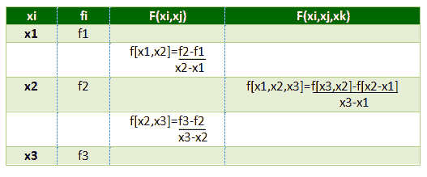

# 牛顿分差插值公式

> 原文:[https://www . geeksforgeeks . org/newtons-divided-divided-difference-interpolation-formula/](https://www.geeksforgeeks.org/newtons-divided-difference-interpolation-formula/)

**插值**是对一系列值中两个已知值内的一个值的估计。

**牛顿除差插值公式**是当区间差对于所有的值序列都不相同时使用的插值技术。

假设 f(x <sub>0</sub> )、f(x <sub>1</sub> )、f(x<sub>2</sub>)……f(x<sub>n</sub>)是与自变量 x=x <sub>0</sub> 、x <sub>1</sub> 、x<sub>2</sub>……x<sub>n</sub>对应的函数 y=f(x)的(n+1)值，其中区间差不相同

```
![ f[x_0, x_1]=\frac{f(x_1)-f(x_0)}{x_1-x_0} ](img/f70cb8ac1c21c721a3485d54a33f9bfb.png "Rendered by QuickLaTeX.com") 
```

****第二个除差由**给出**

```
![ f[x_0, x_1, x_2]=\frac{f[x_1, x_2]-f[x_0, x_1]}{x_2-x_0} ](img/52e179a2519e42c015bce138ef1d103f.png "Rendered by QuickLaTeX.com") 
```

**以此类推……
划分的差异相对于自变量是对称的，即**与自变量的顺序无关。**
所以，**T5】f【x<sub>0</sub>，x<sub>1</sub>= f【x<sub>1</sub>，x<sub>0</sub>
f【x<sub>0</sub>，x <sub>1</sub> ，x<sub>2</sub>= f【x<sub>2</sub>，x <sub>1</sub> ，x <sub>形成了一个表，称为划分差异表。</sub>****

****分差表:**
**

****牛顿差分插值公式**T2】**

> **![ f(x)=f(x_0)+(x-x_0)f[x_0, x_1]+(x-x_0)(x-x_1)f[x_0, x_1, x_2]+..........................+(x-x_0)(x-x_1)...(x-x_k_-_1)f[x_0, x_1, x_2...x_k] ](img/765d2390ca7faa31603f461b19648844.png "Rendered by QuickLaTeX.com")**

 **Examples:

```
Input : Value at 7

Output :

      Value at 7 is 13.47

```

下面是牛顿差分插值方法的实现。

## C++

```
// CPP program for implementing
// Newton divided difference formula
#include <bits/stdc++.h>
using namespace std;

// Function to find the product term
float proterm(int i, float value, float x[])
{
    float pro = 1;
    for (int j = 0; j < i; j++) {
        pro = pro * (value - x[j]);
    }
    return pro;
}

// Function for calculating
// divided difference table
void dividedDiffTable(float x[], float y[][10], int n)
{
    for (int i = 1; i < n; i++) {
        for (int j = 0; j < n - i; j++) {
            y[j][i] = (y[j][i - 1] - y[j + 1]
                         [i - 1]) / (x[j] - x[i + j]);
        }
    }
}

// Function for applying Newton's
// divided difference formula
float applyFormula(float value, float x[],
                   float y[][10], int n)
{
    float sum = y[0][0];

    for (int i = 1; i < n; i++) {
      sum = sum + (proterm(i, value, x) * y[0][i]);
    }
    return sum;
}

// Function for displaying 
// divided difference table
void printDiffTable(float y[][10],int n)
{
    for (int i = 0; i < n; i++) {
        for (int j = 0; j < n - i; j++) {
            cout << setprecision(4) << 
                                 y[i][j] << "\t ";
        }
        cout << "\n";
    }
}

// Driver Function
int main()
{
    // number of inputs given
    int n = 4;
    float value, sum, y[10][10];
    float x[] = { 5, 6, 9, 11 };

    // y[][] is used for divided difference
    // table where y[][0] is used for input
    y[0][0] = 12;
    y[1][0] = 13;
    y[2][0] = 14;
    y[3][0] = 16;

    // calculating divided difference table
    dividedDiffTable(x, y, n);

    // displaying divided difference table
    printDiffTable(y,n);

    // value to be interpolated
    value = 7;

    // printing the value
    cout << "\nValue at " << value << " is "
               << applyFormula(value, x, y, n) << endl;
    return 0;
}
```

## Java 语言(一种计算机语言，尤用于创建网站)

```
// Java program for implementing
// Newton divided difference formula
import java.text.*;
import java.math.*;

class GFG{
// Function to find the product term
static float proterm(int i, float value, float x[])
{
    float pro = 1;
    for (int j = 0; j < i; j++) {
        pro = pro * (value - x[j]);
    }
    return pro;
}

// Function for calculating
// divided difference table
static void dividedDiffTable(float x[], float y[][], int n)
{
    for (int i = 1; i < n; i++) {
        for (int j = 0; j < n - i; j++) {
            y[j][i] = (y[j][i - 1] - y[j + 1]
                        [i - 1]) / (x[j] - x[i + j]);
        }
    }
}

// Function for applying Newton's
// divided difference formula
static float applyFormula(float value, float x[],
                float y[][], int n)
{
    float sum = y[0][0];

    for (int i = 1; i < n; i++) {
    sum = sum + (proterm(i, value, x) * y[0][i]);
    }
    return sum;
}

// Function for displaying 
// divided difference table
static void printDiffTable(float y[][],int n)
{
    DecimalFormat df = new DecimalFormat("#.####");
    df.setRoundingMode(RoundingMode.HALF_UP);

    for (int i = 0; i < n; i++) {
        for (int j = 0; j < n - i; j++) {
            String str1 = df.format(y[i][j]);
            System.out.print(str1+"\t ");
        }
        System.out.println("");
    }
}

// Driver Function
public static void main(String[] args)
{
    // number of inputs given
    int n = 4;
    float value, sum;
    float y[][]=new float[10][10];
    float x[] = { 5, 6, 9, 11 };

    // y[][] is used for divided difference
    // table where y[][0] is used for input
    y[0][0] = 12;
    y[1][0] = 13;
    y[2][0] = 14;
    y[3][0] = 16;

    // calculating divided difference table
    dividedDiffTable(x, y, n);

    // displaying divided difference table
    printDiffTable(y,n);

    // value to be interpolated
    value = 7;

    // printing the value
    DecimalFormat df = new DecimalFormat("#.##");
    df.setRoundingMode(RoundingMode.HALF_UP);

    System.out.println("\nValue at "+df.format(value)+" is "
            +df.format(applyFormula(value, x, y, n)));
}
}
// This code is contributed by mits
```

## 蟒蛇 3

```
# Python3 program for implementing 
# Newton divided difference formula 

# Function to find the product term 
def proterm(i, value, x): 
    pro = 1; 
    for j in range(i): 
        pro = pro * (value - x[j]); 
    return pro; 

# Function for calculating 
# divided difference table 
def dividedDiffTable(x, y, n):

    for i in range(1, n): 
        for j in range(n - i): 
            y[j][i] = ((y[j][i - 1] - y[j + 1][i - 1]) /
                                     (x[j] - x[i + j]));
    return y;

# Function for applying Newton's 
# divided difference formula 
def applyFormula(value, x, y, n): 

    sum = y[0][0]; 

    for i in range(1, n):
        sum = sum + (proterm(i, value, x) * y[0][i]); 

    return sum; 

# Function for displaying divided 
# difference table 
def printDiffTable(y, n): 

    for i in range(n): 
        for j in range(n - i): 
            print(round(y[i][j], 4), "\t", 
                               end = " "); 

        print(""); 

# Driver Code

# number of inputs given 
n = 4; 
y = [[0 for i in range(10)] 
        for j in range(10)]; 
x = [ 5, 6, 9, 11 ]; 

# y[][] is used for divided difference 
# table where y[][0] is used for input 
y[0][0] = 12; 
y[1][0] = 13; 
y[2][0] = 14; 
y[3][0] = 16; 

# calculating divided difference table 
y=dividedDiffTable(x, y, n); 

# displaying divided difference table 
printDiffTable(y, n); 

# value to be interpolated 
value = 7; 

# printing the value 
print("\nValue at", value, "is",
        round(applyFormula(value, x, y, n), 2))

# This code is contributed by mits
```

## C#

```
// C# program for implementing 
// Newton divided difference formula 
using System;

class GFG{ 
// Function to find the product term 
static float proterm(int i, float value, float[] x) 
{ 
    float pro = 1; 
    for (int j = 0; j < i; j++) { 
        pro = pro * (value - x[j]); 
    } 
    return pro; 
} 

// Function for calculating 
// divided difference table 
static void dividedDiffTable(float[] x, float[,] y, int n) 
{ 
    for (int i = 1; i < n; i++) { 
        for (int j = 0; j < n - i; j++) { 
            y[j,i] = (y[j,i - 1] - y[j + 1,i - 1]) / (x[j] - x[i + j]); 
        } 
    } 
} 

// Function for applying Newton's 
// divided difference formula 
static float applyFormula(float value, float[] x, 
                float[,] y, int n) 
{ 
    float sum = y[0,0]; 

    for (int i = 1; i < n; i++) { 
    sum = sum + (proterm(i, value, x) * y[0,i]); 
    } 
    return sum; 
} 

// Function for displaying 
// divided difference table 
static void printDiffTable(float[,] y,int n) 
{ 
    for (int i = 0; i < n; i++) { 
        for (int j = 0; j < n - i; j++) { 
            Console.Write(Math.Round(y[i,j],4)+"\t "); 
        } 
        Console.WriteLine(""); 
    } 
} 

// Driver Function 
public static void Main() 
{ 
    // number of inputs given 
    int n = 4; 
    float value; 
    float[,] y=new float[10,10]; 
    float[] x = { 5, 6, 9, 11 }; 

    // y[][] is used for divided difference 
    // table where y[][0] is used for input 
    y[0,0] = 12; 
    y[1,0] = 13; 
    y[2,0] = 14; 
    y[3,0] = 16; 

    // calculating divided difference table 
    dividedDiffTable(x, y, n); 

    // displaying divided difference table 
    printDiffTable(y,n); 

    // value to be interpolated 
    value = 7; 

    // printing the value 

    Console.WriteLine("\nValue at "+(value)+" is "
            +Math.Round(applyFormula(value, x, y, n),2)); 
} 
} 
// This code is contributed by mits 
```

## 服务器端编程语言（Professional Hypertext Preprocessor 的缩写）

```
<?php
// PHP program for implementing 
// Newton divided difference formula 

// Function to find the product term 
function proterm($i, $value, $x) 
{ 
    $pro = 1; 
    for ($j = 0; $j < $i; $j++) 
    { 
        $pro = $pro * ($value - $x[$j]); 
    } 
    return $pro; 
} 

// Function for calculating 
// divided difference table 
function dividedDiffTable($x, &$y, $n) 
{ 
    for ($i = 1; $i < $n; $i++) 
    { 
        for ($j = 0; $j < $n - $i; $j++) 
        { 
            $y[$j][$i] = ($y[$j][$i - 1] - 
                          $y[$j + 1][$i - 1]) / 
                         ($x[$j] - $x[$i + $j]); 
        } 
    } 
} 

// Function for applying Newton's 
// divided difference formula 
function applyFormula($value, $x, $y,$n) 
{ 
    $sum = $y[0][0]; 

    for ($i = 1; $i < $n; $i++) 
    { 
        $sum = $sum + (proterm($i, $value, $x) * 
                                   $y[0][$i]); 
    } 
    return $sum; 
} 

// Function for displaying 
// divided difference table 
function printDiffTable($y, $n) 
{ 
    for ($i = 0; $i < $n; $i++) 
    { 
        for ($j = 0; $j < $n - $i; $j++) 
        { 
            echo round($y[$i][$j], 4) . "\t "; 
        } 
        echo "\n"; 
    } 
} 

// Driver Code

// number of inputs given 
$n = 4; 
$y = array_fill(0, 10, array_fill(0, 10, 0)); 
$x = array( 5, 6, 9, 11 ); 

// y[][] is used for divided difference 
// table where y[][0] is used for input 
$y[0][0] = 12; 
$y[1][0] = 13; 
$y[2][0] = 14; 
$y[3][0] = 16; 

// calculating divided difference table 
dividedDiffTable($x, $y, $n); 

// displaying divided difference table 
printDiffTable($y, $n); 

// value to be interpolated 
$value = 7; 

// printing the value 
echo "\nValue at " . $value . " is " . 
      round(applyFormula($value, $x, 
                         $y, $n), 2) . "\n"

// This code is contributed by mits
?>
```

**Output:**

```
12     1     -0.1667     0.05     
13     0.3333     0.1333     
14     1     
16     

Value at 7 is 13.47

```**