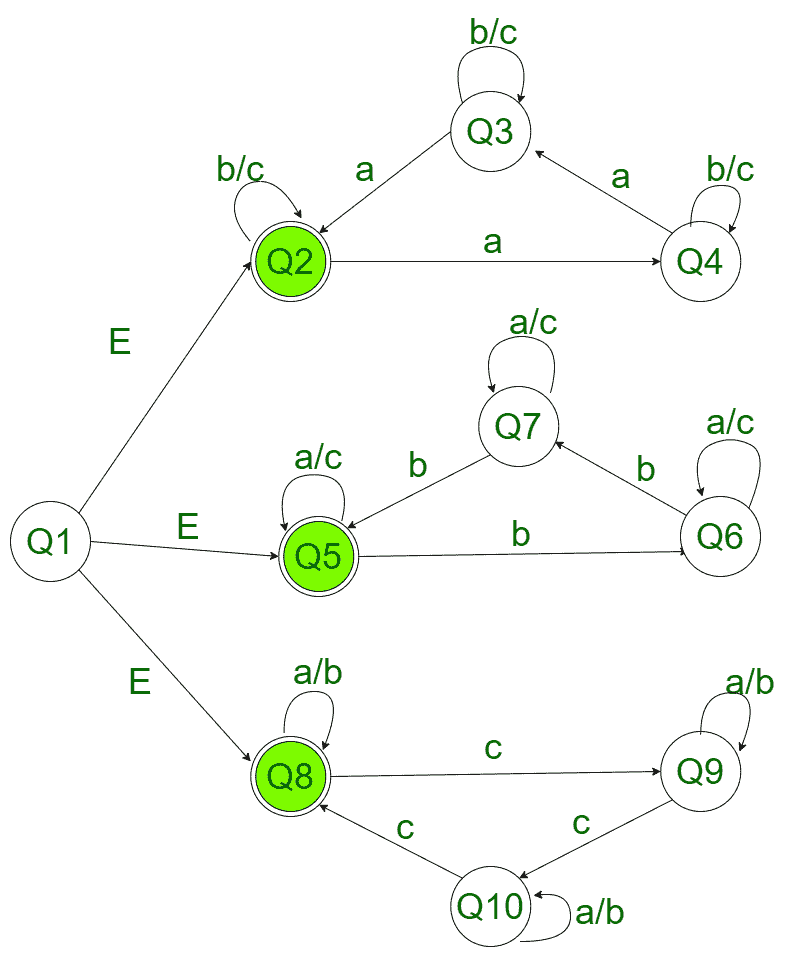

# NFA 接受至少有一个字符以 3 的倍数出现的字符串

> 原文:[https://www . geesforgeks . org/NFA-to-accept-strings-至少有一个字符出现在 3 的倍数中/](https://www.geeksforgeeks.org/nfa-to-accept-strings-that-has-atleast-one-character-occurring-in-a-multiple-of-3/)

**先决条件:** [有限自动机](https://www.geeksforgeeks.org/introduction-of-finite-automata/)
给定由字符**a****b**和 **c** 组成的字符串 **str** ，检查字符串中任何字符的出现次数是否为 3 的倍数。

**示例:**

> **输入:** str = bc
> **输出:**接受
> **解释:**字符串由 0 a 和 3 * 0 = 0 组成。
> 
> **输入:** str = abccc
> **输出:**接受
> **解释:**字符串由 3 个 c 组成。
> 
> **输入:**str = ABC
> T3】输出:不接受

**方法:**
一个 [NFA](https://www.geeksforgeeks.org/introduction-of-finite-automata/) 或者一个[不确定有限自动机](https://www.geeksforgeeks.org/introduction-of-finite-automata/)非常类似于一个 [DFA](https://www.geeksforgeeks.org/introduction-of-finite-automata/) 。它是一个有限状态机，如果一个字符串达到最终状态，它就接受它(在某种特定条件下)，否则就拒绝它。NFA 的其他特点是:

1.  允许空移动，即它可以向前移动而不读取符号。
2.  能够针对特定输入传输到任意数量的状态。

**接受所有字符串的 NFA 机器，其中至少一个字符的出现次数是 3 的倍数** :
对于上面的问题陈述，我们必须首先构建一个 NFA 机器。NFA 机器类似于具有各种状态和转换的流程图。与上述问题对应的 NFA 机如下所示，Q3、Q4、Q8 为最终状态:



**这台 NFA 机器是如何工作的:**
机器的工作取决于检查字符串是否有 3 倍的 a 或 b 或 c。

*   **情况 1:a 的个数是 3 的倍数:**
    *   为了检查字符串中的 a 的个数是否是 3 的倍数，定义了一组单独的状态。定义为 Q2、Q3、Q4 的州检查 a 的数量是否是 3 的倍数。如果这种情况在任何时候达到最终状态 Q2，那么 a 的数是 3 的倍数。
*   **情况 2:b 的个数是 3 的倍数:**
    *   为了检查字符串中的 b 的数目是否是三的倍数，定义了一组单独的状态。定义为 Q5、Q6、Q7 的状态检查 b 的个数是否是 3 的倍数。如果这种情况在任何时候达到最终状态 Q5，那么 b 的数量是 3 的倍数。
*   **情况 3:c 的个数是 3 的倍数:**
    *   为了检查字符串中 c 的个数是否是三的倍数，定义了一组单独的状态。定义为 Q8、Q9、Q10 的状态检查 c 的个数是否是 3 的倍数。如果这种情况在任何时候达到最终状态 Q8，那么 c 的个数是 3 的倍数。

下面是上述方法的实现:

## C++

```
// C++ implementation of the above approach
#include <bits/stdc++.h>

// NFA variable that keeps track of
// the state while transaction.
int nfa = 1;

// This checks for invalid input.
int flag = 0;
using namespace std;

// Function for the state Q2
void state1(char c)
{
    // State transitions
    // 'a' takes to Q4, and
    // 'b' and 'c' remain at Q2
    if (c == 'a')
        nfa = 2;
    else if (c == 'b' || c == 'c')
        nfa = 1;
    else
        flag = 1;
}

// Function for the state Q3
void state2(char c)
{
    // State transitions
    // 'a' takes to Q3, and
    // 'b' and 'c' remain at Q4
    if (c == 'a')
        nfa = 3;
    else if (c == 'b' || c == 'c')
        nfa = 2;
    else
        flag = 1;
}

// Function for the state Q4
void state3(char c)
{
    // State transitions
    // 'a' takes to Q2, and
    // 'b' and 'c' remain at Q3
    if (c == 'a')
        nfa = 1;
    else if (c == 'b' || c == 'c')
        nfa = 3;
    else
        flag = 1;
}

// Function for the state Q5
void state4(char c)
{
    // State transitions
    // 'b' takes to Q6, and
    // 'a' and 'c' remain at Q5
    if (c == 'b')
        nfa = 5;
    else if (c == 'a' || c == 'c')
        nfa = 4;
    else
        flag = 1;
}

// Function for the state Q6
void state5(char c)
{
    // State transitions
    // 'b' takes to Q7, and
    // 'a' and 'c' remain at Q7
    if (c == 'b')
        nfa = 6;
    else if (c == 'a' || c == 'c')
        nfa = 5;
    else
        flag = 1;
}

// Function for the state Q7
void state6(char c)
{
    // State transitions
    // 'b' takes to Q5, and
    // 'a' and 'c' remain at Q7
    if (c == 'b')
        nfa = 4;
    else if (c == 'a' || c == 'c')
        nfa = 6;
    else
        flag = 1;
}

// Function for the state Q8
void state7(char c)
{
    // State transitions
    // 'c' takes to Q9, and
    // 'a' and 'b' remain at Q8
    if (c == 'c')
        nfa = 8;
    else if (c == 'b' || c == 'a')
        nfa = 7;
    else
        flag = 1;
}

// Function for the state Q9
void state8(char c)
{
    // State transitions
    // 'c' takes to Q10, and
    // 'a' and 'b' remain at Q9
    if (c == 'c')
        nfa = 9;
    else if (c == 'b' || c == 'a')
        nfa = 8;
    else
        flag = 1;
}

// Function for the state Q10
void state9(char c)
{
    // State transitions
    // 'c' takes to Q8, and
    // 'a' and 'b' remain at Q10
    if (c == 'c')
        nfa = 7;
    else if (c == 'b' || c == 'a')
        nfa = 9;
    else
        flag = 1;
}

// Function to check for 3 a's
bool checkA(string s, int x)
{
    for (int i = 0; i < x; i++) {
        if (nfa == 1)
            state1(s[i]);
        else if (nfa == 2)
            state2(s[i]);
        else if (nfa == 3)
            state3(s[i]);
    }
    if (nfa == 1) {
        return true;
    }
    else {
        nfa = 4;
    }
}

// Function to check for 3 b's
bool checkB(string s, int x)
{
    for (int i = 0; i < x; i++) {
        if (nfa == 4)
            state4(s[i]);
        else if (nfa == 5)
            state5(s[i]);
        else if (nfa == 6)
            state6(s[i]);
    }
    if (nfa == 4) {

        return true;
    }
    else {
        nfa = 7;
    }
}

// Function to check for 3 c's
bool checkC(string s, int x)
{
    for (int i = 0; i < x; i++) {
        if (nfa == 7)
            state7(s[i]);
        else if (nfa == 8)
            state8(s[i]);
        else if (nfa == 9)
            state9(s[i]);
    }
    if (nfa == 7) {

        return true;
    }
}

// Driver Code
int main()
{
    string s = "bbbca";
    int x = 5;

    // If any of the states is true, that is, if either
    // the number of a's or number of b's or number of c's
    // is a multiple of three, then the string is accepted
    if (checkA(s, x) || checkB(s, x) || checkC(s, x)) {
        cout << "ACCEPTED";
    }

    else {
        if (flag == 0) {
            cout << "NOT ACCEPTED";
            return 0;
        }
        else {
            cout << "INPUT OUT OF DICTIONARY.";
            return 0;
        }
    }
}
```

## Java 语言(一种计算机语言，尤用于创建网站)

```
// Java implementation of the above approach
class GFG {

// NFA variable that keeps track of
// the state while transaction.
static int nfa = 1;

// This checks for invalid input.
static int flag = 0;

// Function for the state Q2
static void state1(char c)
{
    // State transitions
    // 'a' takes to Q4, and
    // 'b' and 'c' remain at Q2
    if (c == 'a')
        nfa = 2;
    else if (c == 'b' || c == 'c')
        nfa = 1;
    else
        flag = 1;
}

// Function for the state Q3
static void state2(char c)
{
    // State transitions
    // 'a' takes to Q3, and
    // 'b' and 'c' remain at Q4
    if (c == 'a')
        nfa = 3;
    else if (c == 'b' || c == 'c')
        nfa = 2;
    else
        flag = 1;
}

// Function for the state Q4
static void state3(char c)
{
    // State transitions
    // 'a' takes to Q2, and
    // 'b' and 'c' remain at Q3
    if (c == 'a')
        nfa = 1;
    else if (c == 'b' || c == 'c')
        nfa = 3;
    else
        flag = 1;
}

// Function for the state Q5
static void state4(char c)
{
    // State transitions
    // 'b' takes to Q6, and
    // 'a' and 'c' remain at Q5
    if (c == 'b')
        nfa = 5;
    else if (c == 'a' || c == 'c')
        nfa = 4;
    else
        flag = 1;
}

// Function for the state Q6
static void state5(char c)
{
    // State transitions
    // 'b' takes to Q7, and
    // 'a' and 'c' remain at Q7
    if (c == 'b')
        nfa = 6;
    else if (c == 'a' || c == 'c')
        nfa = 5;
    else
        flag = 1;
}

// Function for the state Q7
static void state6(char c)
{
    // State transitions
    // 'b' takes to Q5, and
    // 'a' and 'c' remain at Q7
    if (c == 'b')
        nfa = 4;
    else if (c == 'a' || c == 'c')
        nfa = 6;
    else
        flag = 1;
}

// Function for the state Q8
static void state7(char c)
{
    // State transitions
    // 'c' takes to Q9, and
    // 'a' and 'b' remain at Q8
    if (c == 'c')
        nfa = 8;
    else if (c == 'b' || c == 'a')
        nfa = 7;
    else
        flag = 1;
}

// Function for the state Q9
static void state8(char c)
{
    // State transitions
    // 'c' takes to Q10, and
    // 'a' and 'b' remain at Q9
    if (c == 'c')
        nfa = 9;
    else if (c == 'b' || c == 'a')
        nfa = 8;
    else
        flag = 1;
}

// Function for the state Q10
static void state9(char c)
{
    // State transitions
    // 'c' takes to Q8, and
    // 'a' and 'b' remain at Q10
    if (c == 'c')
        nfa = 7;
    else if (c == 'b' || c == 'a')
        nfa = 9;
    else
        flag = 1;
}

// Function to check for 3 a's
static boolean checkA(String s, int x)
{
    for (int i = 0; i < x; i++) {
        if (nfa == 1)
            state1(s.charAt(i));
        else if (nfa == 2)
            state2(s.charAt(i));
        else if (nfa == 3)
            state3(s.charAt(i));
    }
    if (nfa == 1) {
        return true;
    }
    else {
        nfa = 4;
    }
    return false;
}

// Function to check for 3 b's
static boolean checkB(String s, int x)
{
    for (int i = 0; i < x; i++) {
        if (nfa == 4)
            state4(s.charAt(i));
        else if (nfa == 5)
            state5(s.charAt(i));
        else if (nfa == 6)
            state6(s.charAt(i));
    }
    if (nfa == 4) {

        return true;
    }
    else {
        nfa = 7;
    }
    return false;
}

// Function to check for 3 c's
static boolean checkC(String s, int x)
{
    for (int i = 0; i < x; i++) {
        if (nfa == 7)
            state7(s.charAt(i));
        else if (nfa == 8)
            state8(s.charAt(i));
        else if (nfa == 9)
            state9(s.charAt(i));
    }
    if (nfa == 7) {

        return true;
    }
    return false;
}

// Driver Code
public static void main (String[] args)
{
    String s = "bbbca";
    int x = 5;

    // If any of the states is true, that is, if either
    // the number of a's or number of b's or number of c's
    // is a multiple of three, then the string is accepted
    if (checkA(s, x) || checkB(s, x) || checkC(s, x)) {
        System.out.println("ACCEPTED");
    }

    else {
        if (flag == 0) {
            System.out.println("NOT ACCEPTED");

        }
        else {
            System.out.println("INPUT OUT OF DICTIONARY.");

        }
    }
}
}

// This code is contributed by AnkitRai01
```

## 蟒蛇 3

```
# Python3 implementation of the above approach

# NFA variable that keeps track of
# the state while transaction.
nfa = 1

# This checks for invalid input.
flag = 0

# Function for the state Q2
def state1(c):
    global nfa,flag

    # State transitions
    # 'a' takes to Q4, and
    # 'b' and 'c' remain at Q2
    if (c == 'a'):
        nfa = 2
    elif (c == 'b' or c == 'c'):
        nfa = 1
    else:
        flag = 1

# Function for the state Q3
def state2(c):
    global nfa,flag

    # State transitions
    # 'a' takes to Q3, and
    # 'b' and 'c' remain at Q4
    if (c == 'a'):
        nfa = 3
    elif (c == 'b' or c == 'c'):
        nfa = 2
    else:
        flag = 1

# Function for the state Q4
def state3(c):
    global nfa,flag

    # State transitions
    # 'a' takes to Q2, and
    # 'b' and 'c' remain at Q3
    if (c == 'a'):
        nfa = 1
    elif (c == 'b' or c == 'c'):
        nfa = 3
    else:
        flag = 1

# Function for the state Q5
def state4(c):
    global nfa,flag

    # State transitions
    # 'b' takes to Q6, and
    # 'a' and 'c' remain at Q5
    if (c == 'b'):
        nfa = 5
    elif (c == 'a' or c == 'c'):
        nfa = 4
    else:
        flag = 1

# Function for the state Q6
def state5(c):
    global nfa, flag

    # State transitions
    # 'b' takes to Q7, and
    # 'a' and 'c' remain at Q7
    if (c == 'b'):
        nfa = 6
    elif (c == 'a' or c == 'c'):
        nfa = 5
    else:
        flag = 1

# Function for the state Q7
def state6(c):
    global nfa,flag

    # State transitions
    # 'b' takes to Q5, and
    # 'a' and 'c' remain at Q7
    if (c == 'b'):
        nfa = 4
    elif (c == 'a' or c == 'c'):
        nfa = 6
    else:
        flag = 1

# Function for the state Q8
def state7(c):
    global nfa,flag

    # State transitions
    # 'c' takes to Q9, and
    # 'a' and 'b' remain at Q8
    if (c == 'c'):
        nfa = 8
    elif (c == 'b' or c == 'a'):
        nfa = 7
    else:
        flag = 1

# Function for the state Q9
def state8(c):
    global nfa,flag

    # State transitions
    # 'c' takes to Q10, and
    # 'a' and 'b' remain at Q9
    if (c == 'c'):
        nfa = 9
    elif (c == 'b' or c == 'a'):
        nfa = 8
    else:
        flag = 1

# Function for the state Q10
def state9(c):
    global nfa,flag

    # State transitions
    # 'c' takes to Q8, and
    # 'a' and 'b' remain at Q10
    if (c == 'c'):
        nfa = 7
    elif (c == 'b' or c == 'a'):
        nfa = 9
    else:
        flag = 1

# Function to check for 3 a's
def checkA(s, x):
    global nfa,flag
    for i in range(x):
        if (nfa == 1):
            state1(s[i])
        elif (nfa == 2):
            state2(s[i])
        elif (nfa == 3):
            state3(s[i])

    if (nfa == 1):
        return True

    else:
        nfa = 4

# Function to check for 3 b's
def checkB(s, x):
    global nfa,flag
    for i in range(x):
        if (nfa == 4):
            state4(s[i])
        elif (nfa == 5):
            state5(s[i])
        elif (nfa == 6):
            state6(s[i])

    if (nfa == 4):
        return True
    else:
        nfa = 7

# Function to check for 3 c's
def checkC(s, x):
    global nfa, flag
    for i in range(x):
        if (nfa == 7):
            state7(s[i])
        elif (nfa == 8):
            state8(s[i])
        elif (nfa == 9):
            state9(s[i])

    if (nfa == 7):
        return True

# Driver Code

s = "bbbca"
x = 5

# If any of the states is True, that is, if either
# the number of a's or number of b's or number of c's
# is a multiple of three, then the is accepted
if (checkA(s, x) or checkB(s, x) or checkC(s, x)):
    print("ACCEPTED")

else:
    if (flag == 0):
        print("NOT ACCEPTED")

    else:
        print("INPUT OUT OF DICTIONARY.")

# This code is contributed by shubhamsingh10
```

## C#

```
// C# implementation of the above approach
using System;

class GFG {

// NFA variable that keeps track of
// the state while transaction.
static int nfa = 1;

// This checks for invalid input.
static int flag = 0;

// Function for the state Q2
static void state1(char c)
{
    // State transitions
    // 'a' takes to Q4, and
    // 'b' and 'c' remain at Q2
    if (c == 'a')
        nfa = 2;
    else if (c == 'b' || c == 'c')
        nfa = 1;
    else
        flag = 1;
}

// Function for the state Q3
static void state2(char c)
{
    // State transitions
    // 'a' takes to Q3, and
    // 'b' and 'c' remain at Q4
    if (c == 'a')
        nfa = 3;
    else if (c == 'b' || c == 'c')
        nfa = 2;
    else
        flag = 1;
}

// Function for the state Q4
static void state3(char c)
{
    // State transitions
    // 'a' takes to Q2, and
    // 'b' and 'c' remain at Q3
    if (c == 'a')
        nfa = 1;
    else if (c == 'b' || c == 'c')
        nfa = 3;
    else
        flag = 1;
}

// Function for the state Q5
static void state4(char c)
{
    // State transitions
    // 'b' takes to Q6, and
    // 'a' and 'c' remain at Q5
    if (c == 'b')
        nfa = 5;
    else if (c == 'a' || c == 'c')
        nfa = 4;
    else
        flag = 1;
}

// Function for the state Q6
static void state5(char c)
{
    // State transitions
    // 'b' takes to Q7, and
    // 'a' and 'c' remain at Q7
    if (c == 'b')
        nfa = 6;
    else if (c == 'a' || c == 'c')
        nfa = 5;
    else
        flag = 1;
}

// Function for the state Q7
static void state6(char c)
{
    // State transitions
    // 'b' takes to Q5, and
    // 'a' and 'c' remain at Q7
    if (c == 'b')
        nfa = 4;
    else if (c == 'a' || c == 'c')
        nfa = 6;
    else
        flag = 1;
}

// Function for the state Q8
static void state7(char c)
{
    // State transitions
    // 'c' takes to Q9, and
    // 'a' and 'b' remain at Q8
    if (c == 'c')
        nfa = 8;
    else if (c == 'b' || c == 'a')
        nfa = 7;
    else
        flag = 1;
}

// Function for the state Q9
static void state8(char c)
{
    // State transitions
    // 'c' takes to Q10, and
    // 'a' and 'b' remain at Q9
    if (c == 'c')
        nfa = 9;
    else if (c == 'b' || c == 'a')
        nfa = 8;
    else
        flag = 1;
}

// Function for the state Q10
static void state9(char c)
{
    // State transitions
    // 'c' takes to Q8, and
    // 'a' and 'b' remain at Q10
    if (c == 'c')
        nfa = 7;
    else if (c == 'b' || c == 'a')
        nfa = 9;
    else
        flag = 1;
}

// Function to check for 3 a's
static bool checkA(String s, int x)
{
    for (int i = 0; i < x; i++) {
        if (nfa == 1)
            state1(s[i]);
        else if (nfa == 2)
            state2(s[i]);
        else if (nfa == 3)
            state3(s[i]);
    }
    if (nfa == 1) {
        return true;
    }
    else {
        nfa = 4;
    }
    return false;
}

// Function to check for 3 b's
static bool checkB(String s, int x)
{
    for (int i = 0; i < x; i++) {
        if (nfa == 4)
            state4(s[i]);
        else if (nfa == 5)
            state5(s[i]);
        else if (nfa == 6)
            state6(s[i]);
    }
    if (nfa == 4) {

        return true;
    }
    else {
        nfa = 7;
    }
    return false;
}

// Function to check for 3 c's
static bool checkC(String s, int x)
{
    for (int i = 0; i < x; i++) {
        if (nfa == 7)
            state7(s[i]);
        else if (nfa == 8)
            state8(s[i]);
        else if (nfa == 9)
            state9(s[i]);
    }
    if (nfa == 7) {

        return true;
    }
    return false;
}

// Driver Code
public static void Main(String[] args)
{
    String s = "bbbca";
    int x = 5;

    // If any of the states is true, that is, if either
    // the number of a's or number of b's or number of c's
    // is a multiple of three, then the string is accepted
    if (checkA(s, x) || checkB(s, x) || checkC(s, x)) {
        Console.WriteLine("ACCEPTED");
    }

    else {
        if (flag == 0) {
            Console.WriteLine("NOT ACCEPTED");

        }
        else {
            Console.WriteLine("INPUT OUT OF DICTIONARY.");

        }
    }
}
}

// This code is contributed by 29AjayKumar
```

## java 描述语言

```
<script>

// JavaScript implementation of the above approach

// NFA variable that keeps track of
// the state while transaction.
let nfa = 1;

// This checks for invalid input.
let flag = 0;

// Function for the state Q2
function state1(c) {
    // State transitions
    // 'a' takes to Q4, and
    // 'b' and 'c' remain at Q2
    if (c == 'a')
        nfa = 2;
    else if (c == 'b' || c == 'c')
        nfa = 1;
    else
        flag = 1;
}

// Function for the state Q3
function state2(c) {
    // State transitions
    // 'a' takes to Q3, and
    // 'b' and 'c' remain at Q4
    if (c == 'a')
        nfa = 3;
    else if (c == 'b' || c == 'c')
        nfa = 2;
    else
        flag = 1;
}

// Function for the state Q4
function state3(c) {
    // State transitions
    // 'a' takes to Q2, and
    // 'b' and 'c' remain at Q3
    if (c == 'a')
        nfa = 1;
    else if (c == 'b' || c == 'c')
        nfa = 3;
    else
        flag = 1;
}

// Function for the state Q5
function state4(c) {
    // State transitions
    // 'b' takes to Q6, and
    // 'a' and 'c' remain at Q5
    if (c == 'b')
        nfa = 5;
    else if (c == 'a' || c == 'c')
        nfa = 4;
    else
        flag = 1;
}

// Function for the state Q6
function state5(c) {
    // State transitions
    // 'b' takes to Q7, and
    // 'a' and 'c' remain at Q7
    if (c == 'b')
        nfa = 6;
    else if (c == 'a' || c == 'c')
        nfa = 5;
    else
        flag = 1;
}

// Function for the state Q7
function state6(c) {
    // State transitions
    // 'b' takes to Q5, and
    // 'a' and 'c' remain at Q7
    if (c == 'b')
        nfa = 4;
    else if (c == 'a' || c == 'c')
        nfa = 6;
    else
        flag = 1;
}

// Function for the state Q8
function state7(c) {
    // State transitions
    // 'c' takes to Q9, and
    // 'a' and 'b' remain at Q8
    if (c == 'c')
        nfa = 8;
    else if (c == 'b' || c == 'a')
        nfa = 7;
    else
        flag = 1;
}

// Function for the state Q9
function state8(c) {
    // State transitions
    // 'c' takes to Q10, and
    // 'a' and 'b' remain at Q9
    if (c == 'c')
        nfa = 9;
    else if (c == 'b' || c == 'a')
        nfa = 8;
    else
        flag = 1;
}

// Function for the state Q10
function state9(c) {
    // State transitions
    // 'c' takes to Q8, and
    // 'a' and 'b' remain at Q10
    if (c == 'c')
        nfa = 7;
    else if (c == 'b' || c == 'a')
        nfa = 9;
    else
        flag = 1;
}

// Function to check for 3 a's
function checkA(s, x) {
    for (let i = 0; i < x; i++) {
        if (nfa == 1)
            state1(s[i]);
        else if (nfa == 2)
            state2(s[i]);
        else if (nfa == 3)
            state3(s[i]);
    }
    if (nfa == 1) {
        return true;
    }
    else {
        nfa = 4;
    }
}

// Function to check for 3 b's
function checkB(s, x) {
    for (let i = 0; i < x; i++) {
        if (nfa == 4)
            state4(s[i]);
        else if (nfa == 5)
            state5(s[i]);
        else if (nfa == 6)
            state6(s[i]);
    }
    if (nfa == 4) {

        return true;
    }
    else {
        nfa = 7;
    }
}

// Function to check for 3 c's
function checkC(s, x) {
    for (let i = 0; i < x; i++) {
        if (nfa == 7)
            state7(s[i]);
        else if (nfa == 8)
            state8(s[i]);
        else if (nfa == 9)
            state9(s[i]);
    }
    if (nfa == 7) {

        return true;
    }
}

// Driver Code

let s = "bbbca";
let x = 5;

// If any of the states is true, that is, if either
// the number of a's or number of b's or number of c's
// is a multiple of three, then the string is accepted
if (checkA(s, x) || checkB(s, x) || checkC(s, x)) {
    document.write("ACCEPTED");
}

else {
    if (flag == 0) {
        document.write("NOT ACCEPTED");
    }
    else {
        document.write("INPUT OUT OF DICTIONARY.");
    }
}

// This code is contributed by gfgking

</script>
```

**Output:** 

```
ACCEPTED
```

时间复杂度:0(x)

辅助空间:0(1)