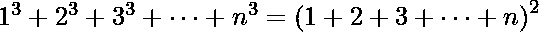

# 尼科马丘定理

> 原文:[https://www.geeksforgeeks.org/nicomachus-theorem/](https://www.geeksforgeeks.org/nicomachus-theorem/)

尼科马丘定理指出[前 n 个自然数的立方之和](https://www.geeksforgeeks.org/program-cube-sum-first-n-natural-numbers/)等于自然数和的平方。

换句话说

或者我们可以说总和等于第 n 个[三角数](https://www.geeksforgeeks.org/triangular-numbers/)的平方。
基于数学归纳法的证明可以在[这里](https://www.geeksforgeeks.org/program-cube-sum-first-n-natural-numbers/)找到。

## C++

```
// CPP program to verify Nicomachu's Theorem
#include <bits/stdc++.h>
using namespace std;

void NicomachuTheorum_sum(int n)
{
   // Compute sum of cubes
   int sum = 0;
   for (int k=1; k<=n; k++)
      sum += k*k*k;

   // Check if sum is equal to
   // given formula.
   int triNo = n*(n+1)/2;
   if (sum == triNo * triNo)
     cout << "Yes";
   else
     cout << "No";
}

// driver function
int main()
{
    int n = 5;
    NicomachuTheorum_sum(n);
    return 0;
}
```

## Java 语言(一种计算机语言，尤用于创建网站)

```
// Java program to verify Nicomachu's Theorem
import java.io.*;

class GFG {

    static void NicomachuTheorum_sum(int n)
    {

        // Compute sum of cubes
        int sum = 0;

        for (int k = 1; k <= n; k++)
            sum += k * k * k;

        // Check if sum is equal to
        // given formula.
        int triNo = n * (n + 1) / 2;

        if (sum == triNo * triNo)
            System.out.println("Yes");
        else
            System.out.println("No");
    }

    // driver function
    public static void main (String[] args)
    {
        int n = 5;
        NicomachuTheorum_sum(n);
    }
}

// This code is contributed by anuj_67.
```

## 蟒蛇 3

```
# Python3 program to verify
# Nicomachu's Theorem

def NicomachuTheorum_sum(n):

    # Compute sum of cubes
    sum = 0;
    for k in range(1, n + 1):
        sum += k * k * k;

    # Check if sum is equal to
    # given formula.
    triNo = n * (n + 1) / 2;
    if (sum == triNo * triNo):
        print("Yes");
    else:
        print("No");

# Driver Code
n = 5;
NicomachuTheorum_sum(n);

# This code is contributed
# by mits
```

## C#

```
// C# program to verify
// Nicomachu's Theorem
using System;

class GFG {

    static void NicomachuTheorum_sum(int n)
    {

        // Compute sum of cubes
        int sum = 0;

        for (int k = 1; k <= n; k++)
            sum += k * k * k;

        // Check if sum is equal to
        // given formula.
        int triNo = n * (n + 1) / 2;

        if (sum == triNo * triNo)
            Console.WriteLine("Yes");
        else
            Console.WriteLine("No");
    }

    // Driver Code
    public static void Main ()
    {
        int n = 5;
        NicomachuTheorum_sum(n);
    }
}

// This code is contributed by anuj_67
```

## 服务器端编程语言（Professional Hypertext Preprocessor 的缩写）

```
<?php
// PHP program to verify
// Nicomachu's Theorem

function NicomachuTheorum_sum($n)
{

    // Compute sum of cubes
    $sum = 0;
    for ($k = 1; $k <= $n; $k++)
        $sum += $k * $k * $k;

    // Check if sum is equal to
    // given formula.
    $triNo = $n * ($n + 1) / 2;
    if ($sum == $triNo * $triNo)
        echo "Yes";
    else
        echo "No";
}

    // Driver Code
    $n = 5;
    NicomachuTheorum_sum($n);

// This code is contributed by anuj_67.
?>
```

## java 描述语言

```
<script>

// JavaScript program to verify Nicomachu's Theorem

    function NicomachuTheorum_sum(n)
    {

        // Compute sum of cubes
        let sum = 0;

        for (let k = 1; k <= n; k++)
            sum += k * k * k;

        // Check if sum is equal to
        // given formula.
        let triNo = n * (n + 1) / 2;

        if (sum == triNo * triNo)
            document.write("Yes");
        else
            document.write("No");
    }

// Driver code

        let n = 5;
        NicomachuTheorum_sum(n);

          // This code is contributed by souravghosh0416.
</script>
```

**Output:** 

```
Yes
```