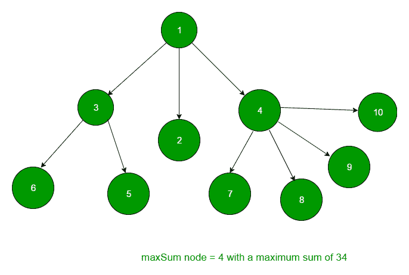

# n 元树中具有最大直接子节点和自身之和的节点

> 原文:[https://www . geesforgeks . org/node-maximum-sum-immediate-children-n-ary-tree/](https://www.geeksforgeeks.org/node-maximum-sum-immediate-children-n-ary-tree/)

给定一个 **N 元树**，找到并返回所有子节点和节点本身的数据总和最大的节点。总之，要获取节点本身的数据及其直接子节点的数据。
例如，在给定的树中，



最大和节点= 4，最大和为 28

想法是我们将维护一个包含最大和的整数变量 **maxsum** ，以及一个指向最大和的节点的 **resnode** 节点指针。
遍历树，在 **currsum**
整型变量中维护其所有直系子代的根和数据之和，并相应更新 **maxsum** 变量。

## C++

```
// CPP program to find the node whose children
// and node sum is maximum.
#include <bits/stdc++.h>
using namespace std;

// Structure of a node of an n-ary tree
struct Node {
    int key;
    vector<Node*> child;
};

// Utility function to create a new tree node
Node* newNode(int key)
{
    Node* temp = new Node;
    temp->key = key;
    return temp;
}

// Helper function to find the node
void maxSumUtil(Node* root, Node** resNode,
                int* maxsum)
{
    // Base Case
    if (root == NULL)
        return;

    // curr contains the sum of the root and
    // its children
    int currsum = root->key;

    // total no of children
    int count = root->child.size();

    // for every child call recursively
    for (int i = 0; i < count; i++) {
        currsum += root->child[i]->key;
        maxSumUtil(root->child[i], resNode, maxsum);
    }

    // if curr is greater than sum, update it
    if (currsum > *maxsum) {

        // resultant node
        *resNode = root;
        *maxsum = currsum;
    }
    return;
}

// Function to find the node having max sum of
// children and node
int maxSum(Node* root)
{
    // resultant node with max sum of children
    // and node
    Node* resNode;

    // sum of node and its children
    int maxsum = 0;

    maxSumUtil(root, &resNode, &maxsum);

    // return the key of resultant node
    return resNode->key;
}

// Driver program
int main()
{
    /*   Let us create below tree
    *              1
    *          /   |  \
    *         2   3   4
    *        / \    / |  \ \
    *       5   6  7  8  9  10
    */

    Node* root = newNode(1);
    (root->child).push_back(newNode(2));
    (root->child).push_back(newNode(3));
    (root->child).push_back(newNode(4));
    (root->child[0]->child).push_back(newNode(5));
    (root->child[0]->child).push_back(newNode(6));
    (root->child[2]->child).push_back(newNode(5));
    (root->child[2]->child).push_back(newNode(6));
    (root->child[2]->child).push_back(newNode(6));

    cout << maxSum(root) << endl;

    return 0;
}
```

## Java 语言(一种计算机语言，尤用于创建网站)

```
// Java program to find the node whose children
// and node sum is maximum.
import java.util.*;

class GFG
{

// Structure of a node of an n-ary tree
static class Node
{
    int key;
    Vector<Node> child;
    Node()
    {
        child = new Vector<Node>();
    }
};

// Utility function to create a new tree node
static Node newNode(int key)
{
    Node temp = new Node();
    temp.key = key;
    return temp;
}

static int maxsum;

// resultant node with max sum of children
// and node
static Node resNode;

// Helper function to find the node
static void maxSumUtil(Node root)
{
    // Base Case
    if (root == null)
        return;

    // curr contains the sum of the root and
    // its children
    int currsum = root.key;

    // total no of children
    int count = root.child.size();

    // for every child call recursively
    for (int i = 0; i < count; i++)
    {
        currsum += root.child.get(i).key;
        maxSumUtil(root.child.get(i));
    }

    // if curr is greater than sum, update it
    if (currsum > maxsum)
    {

        // resultant node
        resNode = root;
        maxsum = currsum;
    }
    return;
}

// Function to find the node having max sum of
// children and node
static int maxSum(Node root)
{

    // sum of node and its children
    int maxsum = 0;

    maxSumUtil(root);

    // return the key of resultant node
    return resNode.key;
}

// Driver code
public static void main(String args[])
{
    /* Let us create below tree
                1
            / | \
            2 3 4
        / \ / | \ \
        5 6 7 8 9 10
    */

    Node root = newNode(1);
    (root.child).add(newNode(2));
    (root.child).add(newNode(3));
    (root.child).add(newNode(4));
    (root.child.get(0).child).add(newNode(5));
    (root.child.get(0).child).add(newNode(6));
    (root.child.get(2).child).add(newNode(5));
    (root.child.get(2).child).add(newNode(6));
    (root.child.get(2).child).add(newNode(6));

    System.out.print( maxSum(root) );
}
}

// This code is contributed by Arnab Kundu
```

## 蟒蛇 3

```
# Python3 program to find the node
# whose children and node sum is maximum.

# Structure of a node of an n-ary tree
class Node:

    def __init__(self, key):
        self.key = key
        self.child = []

# Helper function to find the node
def maxSumUtil(root, resNode, maxsum):

    # Base Case
    if root == None:
        return

    # curr contains the sum of the root
    # and its children
    currsum = root.key

    # total no of children
    count = len(root.child)

    # for every child call recursively
    for i in range(0, count):
        currsum += root.child[i].key
        resNode, maxsum = maxSumUtil(root.child[i],
                                     resNode, maxsum)

    # if curr is greater than sum,
    # update it
    if currsum > maxsum:

        # resultant node
        resNode = root
        maxsum = currsum

    return resNode, maxsum

# Function to find the node having
# max sum of children and node
def maxSum(root):

    # resultant node with max
    # sum of children and node
    resNode, maxsum = Node(None), 0
    resNode, maxsum = maxSumUtil(root, resNode,
                                       maxsum)

    # return the key of resultant node
    return resNode.key

# Driver Code
if __name__ == "__main__":

    root = Node(1)
    (root.child).append(Node(2))
    (root.child).append(Node(3))
    (root.child).append(Node(4))
    (root.child[0].child).append(Node(5))
    (root.child[0].child).append(Node(6))
    (root.child[2].child).append(Node(5))
    (root.child[2].child).append(Node(6))
    (root.child[2].child).append(Node(6))

    print(maxSum(root))

# This code is contributed by Rituraj Jain
```

## C#

```
// C# program to find the node whose children
// and node sum is maximum
using System;
using System.Collections.Generic;

class GFG
{

// Structure of a node of an n-ary tree
public class Node
{
    public int key;
    public List<Node> child;
    public Node()
    {
        child = new List<Node>();
    }
};

// Utility function to create a new tree node
static Node newNode(int key)
{
    Node temp = new Node();
    temp.key = key;
    return temp;
}

static int maxsum;

// resultant node with max sum of children
// and node
static Node resNode;

// Helper function to find the node
static void maxSumUtil(Node root)
{
    // Base Case
    if (root == null)
        return;

    // curr contains the sum of the root and
    // its children
    int currsum = root.key;

    // total no of children
    int count = root.child.Count;

    // for every child call recursively
    for (int i = 0; i < count; i++)
    {
        currsum += root.child[i].key;
        maxSumUtil(root.child[i]);
    }

    // if curr is greater than sum, update it
    if (currsum > maxsum)
    {

        // resultant node
        resNode = root;
        maxsum = currsum;
    }
    return;
}

// Function to find the node having max sum of
// children and node
static int maxSum(Node root)
{

    // sum of node and its children
    int maxsum = 0;

    maxSumUtil(root);

    // return the key of resultant node
    return resNode.key;
}

// Driver code
public static void Main(String []args)
{
    /* Let us create below tree
                1
            / | \
            2 3 4
        / \ / | \ \
        5 6 7 8 9 10
    */

    Node root = newNode(1);
    (root.child).Add(newNode(2));
    (root.child).Add(newNode(3));
    (root.child).Add(newNode(4));
    (root.child[0].child).Add(newNode(5));
    (root.child[0].child).Add(newNode(6));
    (root.child[2].child).Add(newNode(5));
    (root.child[2].child).Add(newNode(6));
    (root.child[2].child).Add(newNode(6));

    Console.Write( maxSum(root) );
}
}

// This code has been contributed by 29AjayKumar
```

## java 描述语言

```
<script>

// JavaScript program to find the node whose children
// and node sum is maximum

// Structure of a node of an n-ary tree
class Node
{
    constructor()
    {
        this.key = null;
        this.child = []
    }
};

// Utility function to create a new tree node
function newNode(key)
{
    var temp = new Node();
    temp.key = key;
    return temp;
}

var maxsum = 0;

// resultant node with max sum of children
// and node
var resNode = 0;

// Helper function to find the node
function maxSumUtil(root)
{
    // Base Case
    if (root == null)
        return;

    // curr contains the sum of the root and
    // its children
    var currsum = root.key;

    // total no of children
    var count = root.child.length;

    // for every child call recursively
    for (var i = 0; i < count; i++)
    {
        currsum += root.child[i].key;
        maxSumUtil(root.child[i]);
    }

    // if curr is greater than sum, update it
    if (currsum > maxsum)
    {

        // resultant node
        resNode = root;
        maxsum = currsum;
    }
    return;
}

// Function to find the node having max sum of
// children and node
function maxSum(root)
{

    // sum of node and its children
    var maxsum = 0;

    maxSumUtil(root);

    // return the key of resultant node
    return resNode.key;
}

// Driver code
/* Let us create below tree
            1
        / | \
        2 3 4
    / \ / | \ \
    5 6 7 8 9 10
*/
var root = newNode(1);
(root.child).push(newNode(2));
(root.child).push(newNode(3));
(root.child).push(newNode(4));
(root.child[0].child).push(newNode(5));
(root.child[0].child).push(newNode(6));
(root.child[2].child).push(newNode(5));
(root.child[2].child).push(newNode(6));
(root.child[2].child).push(newNode(6));
document.write( maxSum(root) );

</script>
```

**输出:**

```
4
```

本文由 **Chhavi** 供稿。如果你喜欢 GeeksforGeeks 并想投稿，你也可以使用[write.geeksforgeeks.org](https://write.geeksforgeeks.org)写一篇文章或者把你的文章邮寄到 review-team@geeksforgeeks.org。看到你的文章出现在极客博客主页上，帮助其他极客。
如果你发现任何不正确的地方，或者你想分享更多关于上面讨论的话题的信息，请写评论。