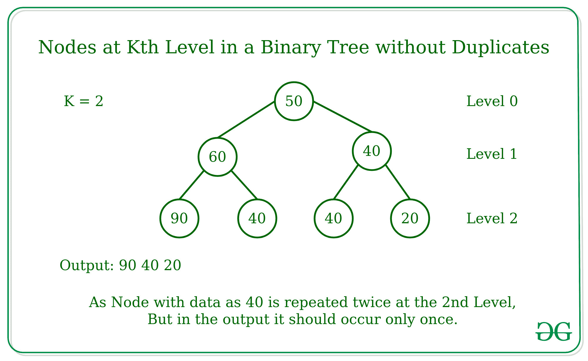

# 二叉树中第 k 层无重复的节点

> 原文:[https://www . geesforgeks . org/nodes-at-kth-level-无二进制树中的重复项/](https://www.geeksforgeeks.org/nodes-at-kth-level-without-duplicates-in-a-binary-tree/)

给定一个具有 **N** 个节点和一个整数 **K** 的二叉树，任务是打印二叉树的第 **K <sup>个</sup>** 级的节点而不重复。

**示例:**

```
Input:       
          60             --- Level 0
         /  \
       50    30          --- Level 1
      /  \   /
    80   10 40           --- Level 2

K = 1
Output: 30 50

Input:
           50            --- Level 0
          /  \
        60    70         --- Level 1
       /  \   / \
     90   40 40  20      --- Level 2
K = 2
Output: 20 40 90

```



**方法:**想法是在队列的帮助下使用[级顺序遍历](https://www.geeksforgeeks.org/level-order-tree-traversal/)遍历二叉树，如果遍历的级别是 K，那么将该级别的所有节点存储在[集合](https://www.geeksforgeeks.org/set-in-cpp-stl/)中，使得在该级别没有重复的节点。

**算法:**

*   初始化一个空的[队列](https://www.geeksforgeeks.org/queue-data-structure/)来存储一个级别的节点。
*   将[二叉树](https://www.geeksforgeeks.org/binary-tree-data-structure/)的根节点排入队列。
*   将级别初始化为 0，因为树的第一个级别在这里应该是 0。
*   将**标志**初始化为 0，检查是否达到第 K <sup>级</sup>水平。
*   使用[循环](https://www.geeksforgeeks.org/loops-in-c-and-cpp/)进行迭代，直到队列不为空。
    1.  找出队列的大小，并以可变大小存储，以便只访问当前级别的节点。
    2.  用另一个 while 循环迭代，直到大小变量不为 0
    3.  从队列中取出一个节点，并将其左右子节点排入队列。
    4.  如果当前级别等于 K，则将该节点的数据添加到集合中，并设置**标志**。
*   如果设置了**标志**，则中断循环，不再访问更多级别，否则将当前级别增加 1。
*   借助[迭代器](https://www.geeksforgeeks.org/iterators-in-java/)打印集合的元素。

**举例说明:**

```
Binary Tree -
           50            --- Level 0
          /  \
        60    70         --- Level 1
       /  \   / \
     90   40 40  20      --- Level 2 
K = 2

Initialize Queue and Set and append Root in queue

Step 1:
Queue = [50],  Set = {}, Level = 0

As current Level is not equal to K,
Deque nodes from the queue and enqueue its  child

Step 2:
Queue = [60, 70], Set = {}, Level = 1

As current level is not equal to K
Deque nodes one by one from the queue and enqueue its child

Step 3:
Queue = [90, 40, 40, 20], Set = {}, Level = 2

As the current level is equal to K
Deque all the nodes from the queue and add to the set

Set = {90, 40, 20}       
```

以下是该方法的实施情况:

## C++

```
// C++ implementation to print the
// nodes of Kth Level without duplicates

#include <bits/stdc++.h>
using namespace std;

// Structure of Binary Tree node
struct node {
    int data;
    struct node* left;
    struct node* right;
};

// Function to create new
// Binary Tree node
struct node* newNode(int data)
{
    struct node* temp = new struct node;
    temp->data = data;
    temp->left = nullptr;
    temp->right = nullptr;
    return temp;
};

// Function to print the nodes
// of Kth Level without duplicates
void nodesAtKthLevel(struct node* root,
                        int k){

    // Condition to check if current
    // node is None
    if (root == nullptr)
        return;

    // Create Queue
    queue<struct node*> que;

    // Enqueue the root node
    que.push(root);

    // Create a set
    set<int> s;

    // Level to track
    // the current level
    int level = 0;
    int flag = 0;

    // Iterate the queue till its not empty
    while (!que.empty()) {

        // Calculate the number of nodes
        // in the current level
        int size = que.size();

        // Process each node of the current
        // level and enqueue their left
        // and right child to the queue
        while (size--) {
            struct node* ptr = que.front();
            que.pop();

            // If the current level matches the
            // required level then add into set
            if (level == k) {

                // Flag initialized to 1
                flag = 1;

                // Inserting node data in set
                s.insert(ptr->data);
            }
            else {

                // Traverse to the left child
                if (ptr->left)
                    que.push(ptr->left);

                // Traverse to the right child
                if (ptr->right)
                    que.push(ptr->right);
            }
        }

        // Increment the variable level
        // by 1 for each level
        level++;

        // Break out from the loop
        // if the Kth Level is reached
        if (flag == 1)
            break;
    }
    set<int>::iterator it;
    for (it = s.begin(); it != s.end(); ++it) {
        cout << *it << " ";
    }
    cout << endl;
}

// Driver code
int main()
{
    struct node* root = new struct node;

    // Tree Construction
    root = newNode(60);
    root->left = newNode(20);
    root->right = newNode(30);
    root->left->left = newNode(80);
    root->left->right = newNode(10);
    root->right->left = newNode(40);
    int level = 1;
    nodesAtKthLevel(root, level);

    return 0;
}
```

## Java 语言(一种计算机语言，尤用于创建网站)

```
// Java implementation to print the
// nodes of Kth Level without duplicates
import java.util.*;

class GFG{

// Structure of Binary Tree node
static class node {
    int data;
    node left;
    node right;
};

// Function to create new
// Binary Tree node
static node newNode(int data)
{
    node temp = new node();
    temp.data = data;
    temp.left = null;
    temp.right = null;
    return temp;
};

// Function to print the nodes
// of Kth Level without duplicates
static void nodesAtKthLevel(node root,
                        int k){

    // Condition to check if current
    // node is None
    if (root == null)
        return;

    // Create Queue
    Queue<node> que = new LinkedList<node>();

    // Enqueue the root node
    que.add(root);

    // Create a set
    HashSet<Integer> s = new HashSet<Integer>();

    // Level to track
    // the current level
    int level = 0;
    int flag = 0;

    // Iterate the queue till its not empty
    while (!que.isEmpty()) {

        // Calculate the number of nodes
        // in the current level
        int size = que.size();

        // Process each node of the current
        // level and enqueue their left
        // and right child to the queue
        while (size-- > 0) {
            node ptr = que.peek();
            que.remove();

            // If the current level matches the
            // required level then add into set
            if (level == k) {

                // Flag initialized to 1
                flag = 1;

                // Inserting node data in set
                s.add(ptr.data);
            }
            else {

                // Traverse to the left child
                if (ptr.left!=null)
                    que.add(ptr.left);

                // Traverse to the right child
                if (ptr.right!=null)
                    que.add(ptr.right);
            }
        }

        // Increment the variable level
        // by 1 for each level
        level++;

        // Break out from the loop
        // if the Kth Level is reached
        if (flag == 1)
            break;
    }
    for (int it : s) {
        System.out.print(it+ " ");
    }
    System.out.println();
}

// Driver code
public static void main(String[] args)
{
    node root = new node();

    // Tree Construction
    root = newNode(60);
    root.left = newNode(20);
    root.right = newNode(30);
    root.left.left = newNode(80);
    root.left.right = newNode(10);
    root.right.left = newNode(40);
    int level = 1;
    nodesAtKthLevel(root, level);

}
}

// This code is contributed by PrinciRaj1992
```

## 蟒蛇 3

```
# Python3 implementation to print the
# nodes of Kth Level without duplicates
from collections import deque

# A binary tree node has key, pointer to
# left child and a pointer to right child
class Node:

    def __init__(self, key):
        self.data = key
        self.left = None
        self.right = None

# Function to print the nodes
# of Kth Level without duplicates
def nodesAtKthLevel(root: Node, k: int):

    # Condition to check if current
    # node is None
    if root is None:
        return

    # Create Queue
    que = deque()

    # Enqueue the root node
    que.append(root)

    # Create a set
    s = set()

    # Level to track
    # the current level
    level = 0
    flag = 0

    # Iterate the queue till its not empty
    while que:

        # Calculate the number of nodes
        # in the current level
        size = len(que)

        # Process each node of the current
        # level and enqueue their left
        # and right child to the queue
        while size:
            ptr = que[0]
            que.popleft()

            # If the current level matches the
            # required level then add into set
            if level == k:

                # Flag initialized to 1
                flag = 1

                # Inserting node data in set
                s.add(ptr.data)

            else:

                # Traverse to the left child
                if ptr.left:
                    que.append(ptr.left)

                # Traverse to the right child
                if ptr.right:
                    que.append(ptr.right)

            size -= 1

        # Increment the variable level
        # by 1 for each level
        level += 1

        # Break out from the loop
        # if the Kth Level is reached
        if flag == 1:
            break

    for it in s:
        print(it, end = " ")
    print()

# Driver Code
if __name__ == "__main__":

    # Tree Construction
    root = Node(60)
    root.left = Node(20)
    root.right = Node(30)
    root.left.left = Node(80)
    root.left.right = Node(10)
    root.right.left = Node(40)

    level = 1
    nodesAtKthLevel(root, level)

# This code is contributed by sanjeev2552
```

## C#

```
// C# implementation to print the
// nodes of Kth Level without duplicates
using System;
using System.Collections.Generic;

class GFG{

// Structure of Binary Tree node
class node {
    public int data;
    public node left;
    public node right;
};

// Function to create new
// Binary Tree node
static node newNode(int data)
{
    node temp = new node();
    temp.data = data;
    temp.left = null;
    temp.right = null;
    return temp;
}

// Function to print the nodes
// of Kth Level without duplicates
static void nodesAtKthLevel(node root,
                        int k){

    // Condition to check if current
    // node is None
    if (root == null)
        return;

    // Create Queue
    List<node> que = new List<node>();

    // Enqueue the root node
    que.Add(root);

    // Create a set
    HashSet<int> s = new HashSet<int>();

    // Level to track
    // the current level
    int level = 0;
    int flag = 0;

    // Iterate the queue till its not empty
    while (que.Count != 0) {

        // Calculate the number of nodes
        // in the current level
        int size = que.Count;

        // Process each node of the current
        // level and enqueue their left
        // and right child to the queue
        while (size-- > 0) {
            node ptr = que[0];
            que.RemoveAt(0);

            // If the current level matches the
            // required level then add into set
            if (level == k) {

                // Flag initialized to 1
                flag = 1;

                // Inserting node data in set
                s.Add(ptr.data);
            }
            else {

                // Traverse to the left child
                if (ptr.left != null)
                    que.Add(ptr.left);

                // Traverse to the right child
                if (ptr.right != null)
                    que.Add(ptr.right);
            }
        }

        // Increment the variable level
        // by 1 for each level
        level++;

        // Break out from the loop
        // if the Kth Level is reached
        if (flag == 1)
            break;
    }
    foreach (int it in s) {
        Console.Write(it+ " ");
    }
    Console.WriteLine();
}

// Driver code
public static void Main(String[] args)
{
    node root = new node();

    // Tree Construction
    root = newNode(60);
    root.left = newNode(20);
    root.right = newNode(30);
    root.left.left = newNode(80);
    root.left.right = newNode(10);
    root.right.left = newNode(40);
    int level = 1;
    nodesAtKthLevel(root, level);

}
}

// This code is contributed by 29AjayKumar
```

## java 描述语言

```
<script>

// JavaScript implementation to print the
// nodes of Kth Level without duplicates

// Structure of Binary Tree node
class node {

    constructor()
    {
        this.data = 0;
        this.left = null;
        this.right = null;
    }
};

// Function to create new
// Binary Tree node
function newNode(data)
{
    var temp = new node();
    temp.data = data;
    temp.left = null;
    temp.right = null;
    return temp;
}

// Function to print the nodes
// of Kth Level without duplicates
function nodesAtKthLevel(root, k){

    // Condition to check if current
    // node is None
    if (root == null)
        return;

    // Create Queue
    var que = [];

    // Enqueue the root node
    que.push(root);

    // Create a set
    var s = new Set();

    // Level to track
    // the current level
    var level = 0;
    var flag = 0;

    // Iterate the queue till its not empty
    while (que.length != 0) {

        // Calculate the number of nodes
        // in the current level
        var size = que.length;

        // Process each node of the current
        // level and enqueue their left
        // and right child to the queue
        while (size-- > 0) {
            var ptr = que[0];
            que.shift();

            // If the current level matches the
            // required level then add into set
            if (level == k) {

                // Flag initialized to 1
                flag = 1;

                // Inserting node data in set
                s.add(ptr.data);
            }
            else {

                // Traverse to the left child
                if (ptr.left != null)
                    que.push(ptr.left);

                // Traverse to the right child
                if (ptr.right != null)
                    que.push(ptr.right);
            }
        }

        // Increment the variable level
        // by 1 for each level
        level++;

        // Break out from the loop
        // if the Kth Level is reached
        if (flag == 1)
            break;
    }
    for(var it of s) {
        document.write(it+ " ");
    }
    document.write("<br>");
}

// Driver code
var root = new node();

// Tree Construction
root = newNode(60);
root.left = newNode(20);
root.right = newNode(30);
root.left.left = newNode(80);
root.left.right = newNode(10);
root.right.left = newNode(40);
var level = 1;
nodesAtKthLevel(root, level);

</script>
```

**Output:** 

```
20 30
```

**性能分析:**

*   **时间复杂度:**和上面的方法一样，在最坏的情况下，树的所有 N 个节点都被访问，所以时间复杂度将是 **O(N)**
*   **空间复杂度:**在树的最底层最差的情况下，它可以有最大数量的节点，即 [2 <sup>H-1</sup>](https://www.geeksforgeeks.org/binary-tree-set-2-properties/) ，其中 H 是二叉树的高度，那么二叉树的空间复杂度将是 **O(2 <sup>H-1</sup> )**