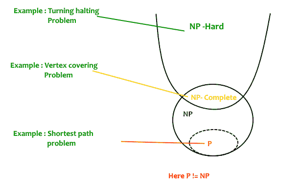
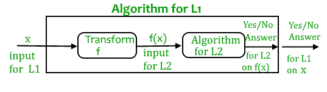

# NP-完全性|第 1 集(简介)

> 原文:[https://www.geeksforgeeks.org/np-completeness-set-1/](https://www.geeksforgeeks.org/np-completeness-set-1/)

我们一直在写解决复杂问题的高效算法，比如[最短路径](https://www.geeksforgeeks.org/greedy-algorithms-set-6-dijkstras-shortest-path-algorithm/)、[欧拉图](https://www.geeksforgeeks.org/eulerian-path-and-circuit/)、[最小生成树](https://www.geeksforgeeks.org/greedy-algorithms-set-2-kruskals-minimum-spanning-tree-mst/)等。这些都是算法设计者的成功故事。在这篇文章中，讨论了计算机科学的失败故事。

**所有的计算问题都可以用计算机解决吗？**有计算问题，即使时间无限，算法也无法解决。例如图灵停止问题(给定一个程序和一个输入，程序在使用该输入运行时是最终停止，还是永远运行)。艾伦·图灵证明了解决所有可能的程序输入对的停顿问题的通用算法是不存在的。证明的一个关键部分是，图灵机被用作计算机和程序的数学定义(来源[停顿问题](http://en.wikipedia.org/wiki/Halting_problem))。
状态 NP 完全问题是另一个失败的故事，NP 完全问题是状态未知的问题。对于任何 NP 完全问题，还没有发现多项式时间算法，也没有人能够证明它们中的任何一个都不存在多项式时间算法。有趣的是，如果任何一个 NP 完全问题都可以在多项式时间内求解，那么它们都可以求解。

**什么是****NP******P******NP-complete**和**T21】NP-Hard**问题？**
P 是一组确定性图灵机在 **P** 多项式时间内可以解决的问题。******

****NP 是一组决策问题，可以通过 **P** 多项式时间内的 **N** 确定性图灵机来解决。p 是 NP 的子集(任何在多项式时间内可以被确定性机器解决的问题，在多项式时间内也可以被非确定性机器解决)。
非正式地说，NP 是一组决策问题，可以通过“幸运算法”(Lucky Algorithm)进行多项式时间求解，这是一种神奇的算法，总能在给定的一组选择中做出正确的猜测(来源[参考文献 1](http://www.youtube.com/watch?v=moPtwq_cVH8) )。****

****NP-complete 问题是 NP 集合中最难的问题。一个决策问题 L 是 NP 完全的如果:
**1)** L 在 NP 中(任何给定的 NP 完全问题的解都可以快速验证，但是没有有效的已知解)。
**2)**NP 中的每个问题都可以在多项式时间内约简为 L(约简定义如下)。****

****一个问题是 NP-Hard 如果遵循上述属性 2，就不需要遵循属性 1。因此，NP 完全集也是 NP 硬集的子集。****

********

******决策 vs 优化问题**
NP 完全性适用于决策问题领域。之所以这样设置，是因为比较决策问题的难度比比较优化问题的难度更容易。然而，在现实中，能够在多项式时间内解决决策问题通常允许我们在多项式时间内解决相应的优化问题(对决策问题使用多项式次数的调用)。所以，讨论决策问题的难度，往往真的相当于讨论优化问题的难度。(来源[参考文献 2](http://uic.edu.hk/~taochen/teaching/comp3040/week13/l17.pdf) )。
比如考虑[顶点覆盖问题](http://en.wikipedia.org/wiki/Vertex_cover)(给定一个图，找出覆盖所有边的最小尺寸顶点集)。这是一个优化问题。对应的判定问题是，给定无向图 G 和 k，是否存在大小为 k 的顶点覆盖？****

******什么是还原？**
让 L 1 和 L 2 成为两个决策问题。假设算法 A 2 求解 L 2 。也就是说，如果 y 是 L 2 的输入，则算法 A 2 将根据 y 是否属于 L 2 来回答是或否。
思路是找到一个从 L 1 到 L 2 的变换，这样算法 A 2 就可以成为算法 A 1 的一部分来求解 L 1 。****

********

****学习还原，总的来说，很重要。例如，如果我们有库函数来解决某些问题，并且如果我们可以将新问题简化为已解决的问题之一，我们就节省了很多时间。考虑一个问题的例子，其中我们必须在给定的有向图中找到最小乘积路径，其中路径的乘积是沿着路径的边的权重的乘积。如果我们有 Dijkstra 算法的代码来寻找最短路径，我们可以取所有权重的对数，使用 Dijkstra 算法来寻找最小乘积路径，而不是为这个新问题编写一个新的代码。****

******如何证明给定的问题是 NP 完全的？**
从 NP-complete 的定义来看，似乎不可能证明一个问题 L 是 NP-Complete。根据定义，它要求我们证明多项式时间内 NP 中的每个问题都可以约化为 l。幸运的是，有一种替代的方法来证明它。其思想是取一个已知的 NP-Complete 问题，化简为 L，如果多项式时间化简是可能的，我们可以通过化简的传递性证明 L 是 NP-Complete(如果一个 NP-Complete 问题在多项式时间内可化简为 L，那么所有问题在多项式时间内可化简为 L)。****

******第一个被证明为 NP-Complete 的问题是什么？**
通过 NP-完全问题的定义，一定有第一个 NP-完全问题被证明。 [SAT(布尔可满足性问题)](http://en.wikipedia.org/wiki/Boolean_satisfiability_problem)是库克证明的第一个 NP 完全问题(证明见 CLRS 书)。****

****即使对工程师来说，了解 NP 完全性也总是有用的。假设你被要求写一个高效的算法来解决一个对你的公司来说极其重要的问题。经过大量思考，你只能想出指数时间方法，这是不切实际的。如果你不知道 NP 完全性，你只能说我没有一个有效的算法。如果你知道 NP-完全性，并且证明问题是 NP-完全的，你可以自豪地说多项式时间解不太可能存在。如果有一个多项式时间的解决方案是可能的，那么这个解决方案解决了许多科学家多年来一直在尝试的计算机科学的一个大问题。****

****我们将很快讨论更多的 NP-完全问题及其对 NP-完全性的证明。****

******参考文献:**
[麻省理工学院计算复杂性视频讲座](http://www.youtube.com/watch?v=moPtwq_cVH8)
[算法导论第三版作者:克利福德·斯坦、托马斯·h·科曼、查尔斯·e·雷瑟森、罗纳德·L·李维斯特](http://www.flipkart.com/introduction-algorithms-3/p/itmczynzhyhxv2gs?pid=9788120340077&affid=sandeepgfg)
[http://www.ics.uci.edu/~eppstein/161/960312.html](http://www.ics.uci.edu/~eppstein/161/960312.html)****

****如果发现有不正确的地方，请写评论，或者想分享更多关于以上讨论话题的信息****