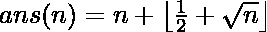

# 第 n 个非平方数

> 原文:[https://www.geeksforgeeks.org/nth-non-square-number/](https://www.geeksforgeeks.org/nth-non-square-number/)

给定 **n** ，在自然数(1，2，3，4，5，6，…)中找出不是完美平方的**n**数

**示例:**

```
Input : 3
Output : 5
First three non-square numbers are 2, 3
and 5

Input : 5
Output : 7

Input : 16
Output : 20
```

看看问题陈述，我们可以得出一个直截了当的强力方法。我们可以从 n = 1 开始，开始检查它们是否都是一个完美的正方形。所以我们可以得出第 n 个非平方数。
然而，上述方法非常慢，因为它每次都在小于目标的每个数字中搜索每一个。
我们可以观察到正在考虑的级数是 2、3、5、6、7、8、10、11、12、13、14、15、17、…。
通过检验，我们可以得出这个序列中第 n 个数的时间常数公式。
。
利用数学归纳法原理可以证明公式的正确性。

下面给出了上述公式的实现。

## C++

```
// CPP program to find n-th non-square number.
#include <bits/stdc++.h>

using namespace std;

// function to find the nth Non-Square Number
int findNthNonSquare(int n)
{
    // conversion from int to long double is
    // necessary in order to preserve decimal
    // places after square root.
    long double x = (long double)n;

    // calculating the result
    long double ans = x + floor(0.5 + sqrt(x));

    return (int)ans;
}

// Driver code
int main()
{
    // initializing the term number
    int n = 16;

    // Print the result
    cout << "The " << n << "th Non-Square number is ";
    cout << findNthNonSquare(n);

    return 0;
}
```

## Java 语言(一种计算机语言，尤用于创建网站)

```
// Java program to find
// n-th non-square number.
import java.io.*;
import java.util.*;
import java.lang.*;

class GFG
{

// function to find the
// nth Non-Square Number
static int findNthNonSquare(int n)
{
    // conversion from int to
    // long double is necessary
    // in order to preserve decimal
    // places after square root.
    double x = (double)n;

    // calculating the result
    double ans = x + Math.floor(0.5 +
                     Math.sqrt(x));

    return (int)ans;
}

// Driver code
public static void main(String[] args)
{
    // initializing
    // the term number
    int n = 16;

    // Print the result
    System.out.print("The " + n +
                     "th Non-Square number is ");
    System.out.print(findNthNonSquare(n));
}
}
```

## 蟒蛇 3

```
# Python3 program to find n-th
# non-square number.
import math

# function to find the nth
# Non-Square Number
def findNthNonSquare(n):

    # conversion from int to long
    # double is necessary in order
    # to preserve decimal places
    # after square root.
    x = n;

    # calculating the result
    ans = x + math.floor(0.5 + math.sqrt(x));

    return int(ans);

# Driver code

# initializing the term number
n = 16;

# Print the result
print("The", n, "th Non-Square number is",
                     findNthNonSquare(n));

# This code is contributed by mits
```

## C#

```
// C# program to find
// n-th non-square number.
using System;

class GFG
{

// function to find the
// nth Non-Square Number
static int findNthNonSquare(int n)
{
    // conversion from int
    // to long double is
    // necessary in order
    // to preserve decimal
    // places after square
    // root.
    double x = (double)n;

    // calculating the result
    double ans = x + Math.Floor(0.5 +
                     Math.Sqrt(x));

    return (int)ans;
}

// Driver code
public static void Main()
{
    // initializing
    // the term number
    int n = 16;

    // Print the result
    Console.Write("The " + n +
                  "th Non-Square " +
                      "number is ");
    Console.Write(findNthNonSquare(n));
}
}

// This code is contributed
// by anuj_67.
```

## 服务器端编程语言（Professional Hypertext Preprocessor 的缩写）

```
<?php
// PHP program to find n-th
// non-square number.

// function to find the nth
// Non-Square Number
function findNthNonSquare($n)
{
    // conversion from int to long
    // double is necessary in order
    // to preserve decimal places
    // after square root.
    $x = $n;

    // calculating the result
    $ans = $x + floor(0.5 + sqrt($x));

    return (int)$ans;
}

// Driver code

// initializing the term number
$n = 16;

// Print the result
echo "The " . $n .
     "th Non-Square number is ";
echo findNthNonSquare($n);

// This Code is Contributed by mits
?>
```

## java 描述语言

```
<script>

// Javascript program to find
// n-th non-square number.

// Function to find the
// nth Non-Square Number
function findNthNonSquare(n)
{

    // Conversion from var to
    // var var is necessary
    // in order to preserve decimal
    // places after square root.
    var x =  n;

    // Calculating the result
    var ans = x + Math.floor(0.5 + Math.sqrt(x));

    return parseInt(ans);
}

// Driver code

// Initializing
// the term number
var n = 16;

// Print the result
document.write("The " + n + "th Non-Square number is ");
document.write(findNthNonSquare(n));

// This code is contributed by todaysgaurav

</script>
```

**输出:**

```
The 16th Non-Square number is 20
```

**时间复杂度** 。
**空间复杂性** 