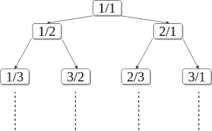
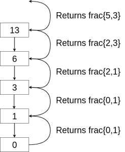

# 卡尔金-威尔夫序列中的第 n 个有理数

> 原文:[https://www . geesforgeks . org/n th-有理数 in-calkin-wilf-sequence/](https://www.geeksforgeeks.org/nth-rational-number-in-calkin-wilf-sequence/)

**什么是卡尔金威尔夫序列？**
一棵 Calkin-Wilf 树(或序列)是一棵特殊的二叉树，它是从分数 1/1 开始，在每个分数 a/b 下面迭代地加上 a/(a+b)和(a+b)/b 而得到的，这棵树生成每一个有理数。写出一个序列中的项给出了 1/1，1/2，2/1，1/3，3/2，2/3，3/1，1/4，4/3，3/5，5/2，2/5，5/3，3/4，4/1，…这个序列有一个性质，即每个分母都是下一个分子。



上图是卡尔金-威尔夫树，其中列出了所有有理数。节点 a/b 的子节点计算为 a/(a+b)和(a+b)/b.
**任务是在此树的广度优先遍历中找到第 n 个有理数。**
**例:**

```
Input : 13
Output : [5, 3]

Input : 5
Output : [3, 2]
```

说明:这棵树是一个完美的二叉查找树，我们需要 floor(log(n))步来计算第 n 个有理数。这个概念类似于在二叉查找树搜索。给定 n，我们继续除以 2，直到得到 0。我们在每个阶段以下列方式返回分数:-

```
    if n%2 == 0
        update frac[1]+=frac[0]
    else
        update frac[0]+=frac[1]
```

**下面是在卡尔金威尔夫序列中寻找第 n 个数字的程序:**

## C++

```
// C++ program to find the
// nth number in Calkin
// Wilf sequence:
# include<bits/stdc++.h>
using namespace std;

int frac[] = {0, 1};

// returns 1x2 int array 
// which contains the nth
// rational number
int nthRational(int n)
{
    if (n > 0)
        nthRational(n / 2);

    // ~n&1 is equivalent to
    // !n%2?1:0 and n&1 is
    // equivalent to n%2
    frac[~n & 1] += frac[n & 1];
}

// Driver Code
int main()
{
    int n = 13; // testing for n=13

    // converting array
    // to string format
    nthRational(n);
    cout << "[" << frac[0] << ","
         << frac[1] << "]" << endl;
    return 0;
}

// This code is contributed
// by Harshit Saini
```

## Java 语言(一种计算机语言，尤用于创建网站)

```
// Java program to find the nth number
// in Calkin Wilf sequence:
import java.util.*;

public class GFG {
    static int[] frac = { 0, 1 };

    public static void main(String args[])
    {
        int n = 13; // testing for n=13

        // converting array to string format
        System.out.println(Arrays.toString(nthRational(n)));
    }

    // returns 1x2 int array which
    // contains the nth rational number
    static int[] nthRational(int n)
    {
        if (n > 0)
            nthRational(n / 2);

        // ~n&1 is equivalent to !n%2?1:0
        // and n&1 is equivalent to n%2
        frac[~n & 1] += frac[n & 1];

        return frac;
    }
}
```

## 蟒蛇 3

```
# Python program to find
# the nth number in Calkin
# Wilf sequence:
frac = [0, 1]

# returns 1x2 int array
# which contains the nth
# rational number
def nthRational(n):
    if n > 0:
        nthRational(int(n / 2))

    # ~n&1 is equivalent to
    # !n%2?1:0 and n&1 is
    # equivalent to n%2
    frac[~n & 1] += frac[n & 1]

    return frac

# Driver code
if __name__ == "__main__":

    n = 13 # testing for n=13

    # converting array
    # to string format
    print(nthRational(n))

# This code is contributed
# by Harshit Saini
```

## C#

```
// C# program to find the nth number
// in Calkin Wilf sequence:
using System;

class GFG
{
    static int[] frac = { 0, 1 };

    public static void Main(String []args)
    {
        int n = 13; // testing for n=13

        // converting array to string format
        Console.WriteLine("[" + String.Join(",",
                                nthRational(n)) + "]");
    }

    // returns 1x2 int array which
    // contains the nth rational number
    static int[] nthRational(int n)
    {
        if (n > 0)
            nthRational(n / 2);

        // ~n&1 is equivalent to !n%2?1:0
        // and n&1 is equivalent to n%2
        frac[~n & 1] += frac[n & 1];

        return frac;
    }
}

// This code is contributed by 29AjayKumar
```

## java 描述语言

```
<script>
// Javascript program to find the nth number
// in Calkin Wilf sequence:
let frac = [0, 1];

let n = 13; // testing for n=13

// converting array to string format
document.write(`[${nthRational(n)}]`)

// returns 1x2 int array which
// contains the nth rational number
function nthRational(n) {
    if (n > 0)
        nthRational(Math.floor(n / 2));

    // ~n&1 is equivalent to !n%2?1:0
    // and n&1 is equivalent to n%2
    frac[~n & 1] += frac[n & 1];
    return frac;
}

// This code is contributed by _saurabh_jaiswal

</script>
```

**Output:** 

```
[5, 3]
```

**说明:**T2【n = 13，

