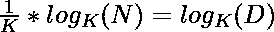

# 使用对数的一个数的第 n 个根

> 原文:[https://www . geeksforgeeks . org/n 次根数使用日志/](https://www.geeksforgeeks.org/nth-root-of-a-number-using-log/)

给定两个整数 **N** 和 **K** ，任务是找到 K 的 N <sup>次</sup>根

**示例:**

> **输入:** N = 3，K = 8
> **输出:** 2.00
> **说明:**
> 8 的立方根为 2。即 2 <sup>3</sup> = 8
> 
> **输入:** N = 2，K = 16
> **输出:** 4.00
> **说明:**
> 16 的平方根是 4，即 4 <sup>2</sup> = 16

**方法:**思路是用[对数函数](https://www.geeksforgeeks.org/log-function-cpp/)求 k 的 N <sup>次</sup>根

> 让 D 成为我们的 N <sup>第</sup>根的 K，
> 然后，T4【两边敷原木<sub>K</sub>–
> =>
> =>
> =>

下面是上述方法的实现:

## C++

```
// C++ implementation to find the
// Kth root of a number using log

#include <bits/stdc++.h>

// Function to find the Kth root
// of the number using log function
double kthRoot(double n, int k)
{
    return pow(k,
               (1.0 / k)
                   * (log(n)
                      / log(k)));
}

// Driver Code
int main(void)
{
    double n = 81;
    int k = 4;
    printf("%lf ", kthRoot(n, k));
    return 0;
}
```

## Java 语言(一种计算机语言，尤用于创建网站)

```
// Java implementation to find the
// Kth root of a number using log
import java.util.*;

class GFG {

// Function to find the Kth root
// of the number using log function
static double kthRoot(double n, int k)
{
    return Math.pow(k, ((1.0 / k) *
                       (Math.log(n) /
                        Math.log(k))));
}

// Driver Code
public static void main(String args[])
{
    double n = 81;
    int k = 4;

    System.out.printf("%.6f", kthRoot(n, k));
}
}

// This code is contributed by rutvik_56
```

## 蟒蛇 3

```
# Python3 implementation to find the
# Kth root of a number using log

import numpy as np

# Function to find the Kth root
# of the number using log function
def kthRoot(n, k):

    return pow(k, ((1.0 / k) *
                  (np.log(n) /
                   np.log(k))))

# Driver Code
n = 81
k = 4

print("%.6f" % kthRoot(n, k))

# This code is contributed by PratikBasu   
```

## C#

```
// C# implementation to find the
// Kth root of a number using log
using System;

class GFG {

// Function to find the Kth root
// of the number using log function
static double kthRoot(double n, int k)
{

    return Math.Pow(k, ((1.0 / k) *
                        (Math.Log(n) /
                         Math.Log(k))));
}

// Driver Code
public static void Main(String []args)
{
    double n = 81;
    int k = 4;

    Console.Write("{0:F6}", kthRoot(n, k));
}
}

// This code is contributed by AbhiThakur
```

## java 描述语言

```
<script>

// Javascript implementation to find the
// Kth root of a number using log

// Function to find the Kth root
// of the number using log function
function kthRoot(n, k)
{
   return Math.pow(k, ((1.0 / k) *
                       (Math.log(n) /
                        Math.log(k))));
}

// Driver Code
var n = 81;
var k = 4;
var x = kthRoot(n, k)

document.write(x.toFixed(6));

// This code is contributed by Ankita saini

</script>
```

**Output:** 

```
3.000000
```