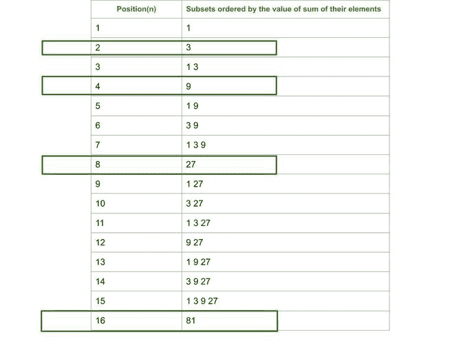

# 由 K 的幂组成的序列的第 n 个子集，按其和的递增顺序排列

> 原文:[https://www . geesforgeks . org/n-序列的子集-由 k 的幂组成-它们的和的递增顺序/](https://www.geeksforgeeks.org/nth-subset-of-the-sequence-consisting-of-powers-of-k-in-increasing-order-of-their-sum/)

给定两个整数 **N** 和 **K** ，任务是从 K 的幂生成的子集序列中找到 **N <sup>第</sup>子集**，即{1，K <sup>1</sup> ，K <sup>2</sup> ，K <sup>3</sup> ，…..}这样子集按其和的递增顺序排列，任务是从序列中找到第 **N <sup>个</sup>子集**。

**示例:**

> **输入:** N = 5，K = 3
> **输出:** 1 9
> **说明:**
> 子集的顺序及其和为:
> 
> *   子集= {1}，总和= 1
> *   子集= {3}，总和= 3
> *   子集= {1，3}，总和= 4
> *   子集= {9}，总和= 9
> *   子集= {1，9}，总和= 10
> 
> 因此，位置 5 的子集是{1，9}。
> 
> **输入:** N = 4，K = 4
> T3】输出: 16

**方法:**
我们来参考下面给出的 K = 3 所需的序列:

[](https://media.geeksforgeeks.org/wp-content/uploads/20200817015851/Untitleddrawing7-660x495.jpg)

从上面的序列可以观察到，子集{3}具有位置 2，子集{9}具有位置 4，子集{27}具有位置 8，以此类推。子集{1，3}、{1，9}、{1，27}分别占据位置 3、5 和 9。因此，所需的第 N <sup>个</sup>子集的所有元素可以通过找到小于或等于 **N** 的最近 2 次幂来获得。

> **图解:**
> N = 6，K = 3
> 第一次迭代:
> 
> 1.  p = log <sub>2</sub> (6) = 2
> 2.  3 <sup>2</sup> = 9，子集= {9}
> 3.  N = 6 % 4 = 2
> 
> 第二次迭代:
> 
> 1.  p = log <sub>2</sub> (2) = 1
> 2.  3 <sup>1</sup> = 3，子集= {3，9}
> 3.  N = 2 % 2 = 0
> 
> 因此，所需的子集是{3，9}

按照以下步骤解决问题:

*   计算 **2** 小于或等于 **N** 的最近幂，说 **p** 。因此， **p = log <sub>2</sub> N** 。
*   现在，子集的元素将是 K <sup>p</sup> 。将其插入子集的前面。
*   将 **N** 更新为**N % 2<sup>p</sup>T5。**
*   重复上述步骤，直到 N 变为 0，然后打印获得的子集。

下面是上述方法的实现:

## C++

```
// C++ program for the above approach
#include <bits/stdc++.h>
#include <stdio.h>
using namespace std;
#define lli long long int

// Function to print the
// required N-th subset
void printSubset(lli n, int k)
{
    vector<lli> answer;
    while(n > 0)
    {

        // Nearest power of 2<=N
        lli p = log2(n);

        // Now insert k^p in the answer
        answer.push_back(pow(k, p));

        // update n
        n %= (int)pow(2, p);
    }

    // Print the ans in sorted order
    reverse(answer.begin(), answer.end());
    for(auto x: answer)
    {
        cout << x << " ";
    }
}

// Driver Code
int main()
{
    lli n = 5;
    int k = 4;
    printSubset(n, k);
}

// This code is contributed by winter_soldier
```

## Java 语言(一种计算机语言，尤用于创建网站)

```
// Java program for above approach
import java.util.*;
import java.lang.*;
import java.io.*;
class GFG
{

  // Function to print the 
  // required N-th subset 
  static void printSubset(long n, int k)
  {
    ArrayList<Long> answer = new ArrayList<>();
    while(n > 0)
    {

      // Nearest power of 2<=N
      long p = (long)(Math.log(n) / Math.log(2));;

      // Now insert k^p in the answer
      answer.add((long)(Math.pow(k, p)));

      // update n
      n %= (int)Math.pow(2, p);
    }

    // Print the ans in sorted order
    Collections.sort(answer);
    for(Long x: answer)
    {
      System.out.print(x + " ");
    }
  }

  // Driver function
  public static void main (String[] args)
  {
    long n = 5;
    int k = 4;
    printSubset(n, k);
  }
}

// This code is contributed by offbeat
```

## 蟒蛇 3

```
# Python3 program for
# the above approach
import math

# Function to print the
# required N-th subset
def printSubset(N, K):
    # Stores the subset
    answer = ""
    while(N > 0):
        # Nearest power of 2 <= N
        p = int(math.log(N, 2))
        # Insert K ^ p in the subset
        answer = str(K**p)+" "+answer
        # Update N
        N = N % (2**p)

    # Print the subset
    print(answer)

# Driver Code
N = 5
K = 4
printSubset(N, K)
```

## C#

```
// C# program for the above approach
using System;
using System.Collections.Generic;
class GFG {

  // Function to print the
  // required N-th subset
  static void printSubset(int n, int k)
  {
    List<int> answer = new List<int>();
    while(n > 0)
    {

      // Nearest power of 2<=N
      int p = (int)Math.Log(n,2);

      // Now insert k^p in the answer
      answer.Add((int)Math.Pow(k, p));

      // update n
      n %= (int)Math.Pow(2, p);
    }

    // Print the ans in sorted order
    answer.Reverse();
    foreach(int x in answer)
    {
      Console.Write(x + " ");
    }
  }

  // Driver code
  static void Main() {
    int n = 5;
    int k = 4;
    printSubset(n, k);
  }
}

// This code is contributed by divyeshrabadiya07.
```

## java 描述语言

```
<script>
// Javascript program for the above approach

// Function to print the
// required N-th subset
function printSubset(n, k)
{
    var answer = [];
    while(n > 0)
    {

        // Nearest power of 2<=N
        var p = parseInt(Math.log2(n));

        // Now insert k^p in the answer
        answer.push(Math.pow(k, p));

        // update n
        n %= parseInt(Math.pow(2, p));
    }

    // Print the ans in sorted order
    answer.sort();
    //reverse(answer.begin(), answer.end());
    for(var i=0;i<answer.length;i++)
    {
        document.write(answer[i] + " ");
    }
}

var n = 5;
var k = 4;
printSubset(n, k);

//This code is contributed by SoumikMondal
</script>
```

**Output**

```
1 16 
```

***时间复杂度:** O(logN)*
***辅助空间:** O(1)*

**进场:**

*   将计数和 x 初始化为 0。此外，一个存储子集元素的向量。
*   当 n 大于 0 时，执行以下操作。
    *   设置 x = n & 1，用于查找数字的最后一位是否被设置。
    *   如果 n 不是 0，现在将元素 3 <sup>计入子集。</sup>
    *   借助向右移动 1 个单位，将数字 n 减少 2。
    *   将计数值增加 1。
*   最后，数组中的元素是第 n 个子集的元素。

下面是上述方法的实现:

## C++

```
// C++ program to print subset
// at the nth position ordered
// by the sum of the elements
#include <bits/stdc++.h>
using namespace std;

// Function to print the elements of
// the subset at pos n
void printsubset(int n,int k)
{
    //  Initialize count=0 and x=0
    int count = 0, x = 0;

    // create a vector for
    // storing the elements
    // of subsets
    vector<int> vec;

    // doing until all the
    // set bits of n are used
    while (n) {
        x = n & 1;

        // this part is executed only
        // when the last bit is
        // set
        if (x) {
            vec.push_back(pow(k, count));
        }

        // right shift the bit by one position
        n = n >> 1;

        // increasing the count each time by one
        count++;
    }

    // printing the values os elements
    for (int i = 0; i < vec.size(); i++)
        cout << vec[i] << " ";
}

// Driver Code
int main()
{
    int n = 7,k=4;
    printsubset(n,k);
    return 0;
}

// This code is contributed by shivkant
```

## Java 语言(一种计算机语言，尤用于创建网站)

```
// Java program to print subset
// at the nth position ordered
// by the sum of the elements
import java.util.*;
import java.lang.*;
class GFG{

// Function to print the
// elements of the subset
// at pos n
static void printsubset(int n,
                        int k)
{
  // Initialize count=0 and x=0
  int count = 0, x = 0;

  // Create a vector for
  // storing the elements
  // of subsets
  ArrayList<Integer> vec =
            new ArrayList<>();

  // Doing until all the
  // set bits of n are used
  while (n != 0)
  {
    x = n & 1;

    // This part is executed only
    // when the last bit is
    // set
    if (x != 0)
    {
      vec.add((int)Math.pow(k,
                            count));
    }

    // Right shift the bit
    // by one position
    n = n >> 1;

    // Increasing the count
    // each time by one
    count++;
  }

  // Printing the values os elements
  for (int i = 0; i < vec.size(); i++)
    System.out.print(vec.get(i) + " ");
}

// Driver function
public static void main (String[] args)
{
  int n = 7, k = 4;
  printsubset(n, k);
}
}

// This code is contributed by offbeat
```

## 蟒蛇 3

```
# Python3 program to print subset
# at the nth position ordered
# by the sum of the elements
import math

# Function to print the elements of
# the subset at pos n
def printsubset(n, k):

    # Initialize count=0 and x=0
    count = 0
    x = 0

    # Create a vector for
    # storing the elements
    # of subsets
    vec = []

    # Doing until all the
    # set bits of n are used
    while (n > 0):
        x = n & 1

        # This part is executed only
        # when the last bit is
        # set
        if (x):
            vec.append(pow(k, count))

        # Right shift the bit by one position
        n = n >> 1

        # Increasing the count each time by one
        count += 1

    # Printing the values os elements
    for item in vec:
        print(item, end = " ")

# Driver Code
n = 7
k = 4

printsubset(n, k)

# This code is contributed by Stream_Cipher
```

## C#

```
// C# program to print subset
// at the nth position ordered
// by the sum of the elements
using System.Collections.Generic;
using System;

class GFG{

// Function to print the
// elements of the subset
// at pos n
static void printsubset(int n, int k)
{

    // Initialize count=0 and x=0
    int count = 0, x = 0;

    // Create a vector for
    // storing the elements
    // of subsets
    List<int> vec = new List<int>();

    // Doing until all the
    // set bits of n are used
    while (n != 0)
    {
        x = n & 1;

        // This part is executed only
        // when the last bit is
        // set
        if (x != 0)
        {
            vec.Add((int)Math.Pow(k, count));
        }

        // Right shift the bit
        // by one position
        n = n >> 1;

        // Increasing the count
        // each time by one
        count++;
    }

    // Printing the values os elements
    for(int i = 0; i < vec.Count; i++)
        Console.Write(vec[i] + " ");
}

// Driver code
public static void Main ()
{
    int n = 7, k = 4;

    printsubset(n, k);
}
}

// This code is contributed by Stream_Cipher
```

## java 描述语言

```
<script>
    // Javascript program to print subset
    // at the nth position ordered
    // by the sum of the elements

    // Function to print the
    // elements of the subset
    // at pos n
    function printsubset(n, k)
    {

        // Initialize count=0 and x=0
        let count = 0, x = 0;

        // Create a vector for
        // storing the elements
        // of subsets
        let vec = [];

        // Doing until all the
        // set bits of n are used
        while (n != 0)
        {
            x = n & 1;

            // This part is executed only
            // when the last bit is
            // set
            if (x != 0)
            {
                vec.push(Math.pow(k, count));
            }

            // Right shift the bit
            // by one position
            n = n >> 1;

            // Increasing the count
            // each time by one
            count++;
        }

        // Printing the values os elements
        for(let i = 0; i < vec.length; i++)
            document.write(vec[i] + " ");
    }

    let n = 7, k = 4;

    printsubset(n, k);

</script>
```

**Output**

```
1 4 16 
```