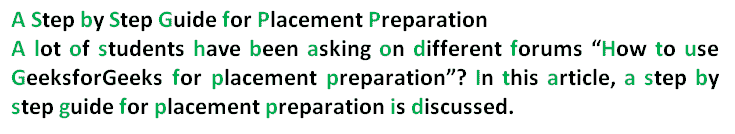

# 空密码

> 原文:[https://www.geeksforgeeks.org/null-cipher/](https://www.geeksforgeeks.org/null-cipher/)

一种**空密码**，也称为**隐藏密码**，是一种古老的加密形式，其中明文与大量非密码材料混合。今天它被认为是一种简单的[隐写术](https://en.wikipedia.org/wiki/Steganography)，可以用来隐藏密文。
使用**空密码**有多种选择。这里我们依次取每个单词的**首字母**。可以选择该模式来提高加密级别**其他选项**可以是:

*   从每个单词中提取最后一个字母。
*   把信从特定的位置拿走
*   使用模式(1，2，3，1，2，3[每个单词中的每个字母])。您也可以使用其他模式。
*   将重要字母放置在标点符号或特定字符旁边或按一定间隔放置。

**连续取每个单词第一个字母的空密码**



包含空密码的消息的更多示例:

```
Input will be one paragraph or sentence without any newline.

Input : News Eight Weather: Tonight increasing snow.
        Unexpected precipitation smothers eastern
        towns. Be extremely cautious and use snowtires
        especially heading east. The [highway is not]
        knowingly slippery. Highway evacuation is 
        suspected. Police report emergency situations
        in downtown ending near Tuesday.

Explanation:
Taking the first letter in each word successively yields
the real message.
Here we are converting decoded message to lowercase.

News Eight Weather: Tonight Increasing Snow.
Unexpected Precipitation Smothers Eastern
Towns. Be Extremely Cautious And Use Snowtires
Especially Heading East. The [Highway Is Not]
Knowingly Slippery. Highway Evacuation Is
Suspected. Police Report Emergency Situations
In Downtown Ending Near Tuesday.

Output :
After Deciphered : newtisupsetbecausehethinksheispresident

After breaking the words manually the output will be:
  Newt is upset because he thinks he is President
```

## C++

```
// CPP program to decode NULL CIPHER
#include <bits/stdc++.h>
using namespace std;
string decode(string str)
{
    // Store the decoded string.
    string res = "";
    // found variable is used to tell that the encoded
    // encoded character is found in that particular word.
    bool found = false;

    for (int i = 0; i < str.size(); i++)
    {
        // Set found variable to false whenever we find
        // whitespace, meaning that encoded character for
        // new word is not found
        if (str[i] == ' ')
        {
            found = false;
            continue;
        }
        if (!found)
        {
            if (str[i] >= 'A' && str[i] <= 'Z')
            {
                res += str[i] + 32;
                found = true;
            }
            else if (str[i] >= 'a' && str[i] <= 'z')
            {
                res += str[i];
                found = true;
            }
        }
    }
    return res;
}
// Driver code
int main()
{
    string in;
    in = "A Step by Step Guide for Placement Preparation by GeeksforGeeks";

    cout << "Enciphered Message: ";

    // Function call
    cout << decode(in) << endl;
    return 0;
}
```

## Java 语言(一种计算机语言，尤用于创建网站)

```
// Java program to decode NULL CIPHER
class GFG
{

    // Function to decode the message.
    static String decode(String str)
    {
        // Store the decoded string
        String res = "";

        // found variable is used
        // to tell that the encoded
        // encoded character is
        // found in that particular word.
        boolean found = false;
        for (int i = 0; i < str.length(); i++)
        {
            // Set found variable to false
            // whenever we find
            // whitespace, meaning that
            // encoded character for
            // new word is not found
            if (str.charAt(i) == ' ')
            {
                found = false;
                continue;
            }
            if (!found)
            {
                if ((str.charAt(i) >= 'A' && str.charAt(i) <= 'Z') ||
                    (str.charAt(i) >= 'a' && str.charAt(i) <= 'z'))
                {
                    res += Character.toString(str.charAt(i));
                    found = true;
                }
            }
        }
        return res.toLowerCase();
    }

    // Driver Code
    public static void main(String[] args)
    {
        String in;
        in = "A Step by Step Guide for Placement Preparation by GeeksforGeeks";
        System.out.println("Enciphered Message: " + decode(in));
    }
}

// This code is contributed by Vivek Kumar Singh
```

## 蟒蛇 3

```
# Python program to decode NULL CIPHER

# Function to decode the message.
def decode(string):

    # Store the decoded string
    res = ""

    # found variable is used
    # to tell that the encoded
    # encoded character is
    # found in that particular word.
    found = False

    for character in string:

        # Set found variable to false
        # whenever we find
        # whitespace, meaning that
        # encoded character for
        # new word is not found
        if character == ' ':
            found = False
            continue

        if not found:
            if character>='A' and character<='Z' or character>='a' and character<='z':
                res += character
                found = True

    return res.lower()

# Driver code
if __name__ == "__main__":
    input = "A Step by Step Guide for Placement Preparation by GeeksforGeeks"
    print("Enciphered Message:",decode(input))

# This code is contributed by Vivek Kumar Singh
```

## C#

```
// A C# program to decode NULL CIPHER
using System;

class GFG
{

    // Function to decode the message.
    static String decode(String str)
    {
        // Store the decoded string
        String res = "";

        // found variable is used
        // to tell that the encoded
        // encoded character is
        // found in that particular word.
        Boolean found = false;
        for (int i = 0; i < str.Length; i++)
    {
        // Set found variable to false whenever we find
        // whitespace, meaning that encoded character for
        // new word is not found
        if (str[i] == ' ')
        {
            found = false;
            continue;
        }
        if (!found)
        {
            if (str[i] >= 'A' && str[i] <= 'Z')
            {
                res += (char)(str[i] + 32);
                found = true;
            }
            else if (str[i] >= 'a' && str[i] <= 'z')
            {
                res += (char)str[i];
                found = true;
            }
        }
    }
    return res;
    }

    // Driver Code
    public static void Main(String[] args)
    {
        String str;
        str = "A Step by Step Guide for Placement Preparation by GeeksforGeeks";
        Console.WriteLine("Enciphered Message: " + decode(str));
    }
}

// This code has been contributed by 29AjayKumar
```

## java 描述语言

```
<script>
// Javascript program to decode NULL CIPHER

// Function to decode the message.
function decode(str)
{
     // Store the decoded string
        let res = "";

        // found variable is used
        // to tell that the encoded
        // encoded character is
        // found in that particular word.
        let found = false;
        for (let i = 0; i < str.length; i++)
        {
            // Set found variable to false
            // whenever we find
            // whitespace, meaning that
            // encoded character for
            // new word is not found
            if (str[i] == ' ')
            {
                found = false;
                continue;
            }
            if (!found)
            {
                if ((str[i] >= 'A' && str[i] <= 'Z') ||
                    (str[i] >= 'a' && str[i] <= 'z'))
                {
                    res += (str[i]);
                    found = true;
                }
            }
        }
        return res.toLowerCase();
}

// Driver Code
let In = "A Step by Step Guide for Placement Preparation by GeeksforGeeks";
document.write("Enciphered Message: " + decode(In));

// This code is contributed by rag2127
</script>
```

**输出:**

```
Enciphered Message: asbsgfppbg
```

本文由**沙钦·毕斯特**供稿。如果你喜欢 GeeksforGeeks 并想投稿，你也可以使用[write.geeksforgeeks.org](https://write.geeksforgeeks.org)写一篇文章或者把你的文章邮寄到 review-team@geeksforgeeks.org。看到你的文章出现在极客博客主页上，帮助其他极客。
如果你发现任何不正确的地方，或者你想分享更多关于上面讨论的话题的信息，请写评论。