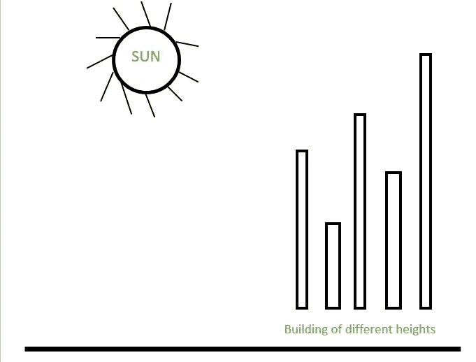

# 面向太阳的建筑数量

> 原文:[https://www.geeksforgeeks.org/number-buildings-facing-sun/](https://www.geeksforgeeks.org/number-buildings-facing-sun/)

给定一个代表建筑物高度的数组。阵列从左到右有建筑，如下图所示，数一数面对日落的建筑数量。假设所有建筑物的高度都是不同的。



示例:

```
Input : arr[] = {7, 4, 8, 2, 9}
Output: 3
Explanation: As 7 is the first element, it can 
see the sunset.
4 can't see the sunset as 7 is hiding it. 
8 can see.
2 can't see the sunset.
9 also can see the sunset.

Input : arr[] = {2, 3, 4, 5}
Output : 4
```

问于:[亚马逊采访](https://www.geeksforgeeks.org/amazon-interview-experience-set-189-for-sde1)
很容易观察到，只有目前发现的最大元素才会看到阳光
即 curr_max 会看到阳光，然后只有大于 curr_max 的元素才会看到阳光。我们从左到右遍历给定的数组。我们跟踪到目前为止看到的最大元素。每当一个元素超过当前最大值时，递增结果并更新当前最大值。

## C++

```
// C++ program to count buildings that can
// see sunlight.
#include <iostream>
using namespace std;

// Returns count buildings
// that can see sunlight
int countBuildings(int arr[], int n)
{
    // Initialize result (Note that first building
    // always sees sunlight)
    int count = 1;

    // Start traversing element
    int curr_max = arr[0];
    for (int i = 1; i < n; i++) {

        // If curr_element is maximum
        // or current element is
        // equal, update maximum and increment count
        if (arr[i] > curr_max || arr[i] == curr_max) {
            count++;
            curr_max = arr[i];
        }
    }

    return count;
}

// Driver code
int main()
{
    int arr[] = { 7, 4, 8, 2, 9 };
    int n = sizeof(arr) / sizeof(arr[0]);
    cout << countBuildings(arr, n);
    return 0;
}
```

## Java 语言(一种计算机语言，尤用于创建网站)

```
// Java program to count buildings that can
// see sunlight.

class Test {
    // Returns count buildings that can see sunlight
    static int countBuildings(int arr[], int n)
    {
        // Initialize result  (Note that first building
        // always sees sunlight)
        int count = 1;

        // Start traversing element
        int curr_max = arr[0];
        for (int i = 1; i < n; i++) {

            // If curr_element is maximum
            // or current element
            // is equal, update maximum and increment count
            if (arr[i] > curr_max || arr[i] == curr_max) {
                count++;
                curr_max = arr[i];
            }
        }

        return count;
    }

    // Driver method
    public static void main(String[] args)
    {
        int arr[] = { 7, 4, 8, 2, 9 };

        System.out.println(countBuildings(arr, arr.length));
    }
}
```

## 蟒蛇 3

```
# Python3 program to count buildings
# that can see sunlight.

# Returns count buildings that
# can see sunlight

def countBuildings(arr, n):

    # Initialize result (Note that first
    # building always sees sunlight)
    count = 1

    # Start traversing element
    curr_max = arr[0]
    for i in range(1, n):

        # If curr_element is maximum or
        # current element is equal,
        # update maximum and increment count
        if (arr[i] > curr_max or arr[i] == curr_max):

            count += 1
            curr_max = arr[i]

    return count

# Driver code
arr = [7, 4, 8, 2, 9]
n = len(arr)
print(countBuildings(arr, n))

# This code is contributed by Rohit.
```

## C#

```
// C# program to count buildings that can
// see sunlight.
using System;

class GFG {

    // Returns count buildings
    // that can see sunlight
    static int countBuildings(int[] arr, int n)
    {

        // Initialize result (Note that first building
        // always sees sunlight)
        int count = 1;

        // Start traversing element
        int curr_max = arr[0];
        for (int i = 1; i < n; i++) {

            // If curr_element is maximum
            // or current element
            // is equal, update maximum
            // and increment count
            if (arr[i] > curr_max || arr[i] == curr_max) {
                count++;
                curr_max = arr[i];
            }
        }

        return count;
    }

    // Driver method
    public static void Main()
    {
        int[] arr = { 7, 4, 8, 2, 9 };

        Console.Write(countBuildings(arr, arr.Length));
    }
}

// This code is contributed by Rohit.
```

## 服务器端编程语言（Professional Hypertext Preprocessor 的缩写）

```
<?php
// php program to count buildings
// that can see sunlight.

// Returns count buildings that
// can see sunlight
function countBuildings($arr, $n)
{
    // Initialize result (Note that
    // first building always sees
    // sunlight)
    $count = 1;

    // Start traversing element
    $curr_max = $arr[0];
    for ( $i = 1; $i < $n; $i++)
    {

        // If curr_element is maximum or
        // current element is equal,
        // update maximum and
        // increment count
        if ($arr[$i] > $curr_max || $arr[$i] == $curr_max)
        {
            $count++;
            $curr_max=$arr[$i];
        }
    }

    return $count;
}

// Driver code
$arr = array(7, 4, 8, 2, 9);
$n = sizeof($arr) / sizeof($arr[0]);
echo countBuildings($arr, $n);

// This code is contributed by
// Rohit
?>
```

## java 描述语言

```
<script>

// Javascript program to count buildings that can
// see sunlight.

// Returns count buildings
// that can see sunlight
function countBuildings( arr, n)
{
    // Initialize result (Note that first building
    // always sees sunlight)
    let count = 1;

    // Start traversing element
    let curr_max = arr[0];
    for (let i = 1; i < n; i++) {

        // If curr_element is maximum
        // or current element is
        // equal, update maximum and increment count
        if (arr[i] > curr_max || arr[i] == curr_max) {
            count++;
            curr_max = arr[i];
        }
    }

    return count;
}

    // Driver program

    let arr = [ 7, 4, 8, 2, 9 ];
    let n = arr.length;
    document.write(countBuildings(arr, n));

</script>
```

**输出:**

```
3
```

**时间复杂度:**O(n)
T3】辅助空间: O(1)

本文由 [**萨哈布拉**](https://www.facebook.com/sahil.chhabra.965) 供稿。如果你喜欢 GeeksforGeeks 并想投稿，你也可以使用[write.geeksforgeeks.org](https://write.geeksforgeeks.org)写一篇文章或者把你的文章邮寄到 review-team@geeksforgeeks.org。看到你的文章出现在极客博客主页上，帮助其他极客。
如果发现有不正确的地方，或者想分享更多关于上述话题的信息，请写评论。