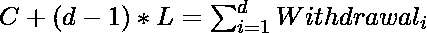
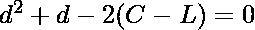
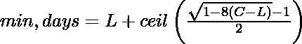

# 油箱变空的天数

> 原文:[https://www . geesforgeks . org/number-days-tank-will-变空/](https://www.geeksforgeeks.org/number-days-tank-will-become-empty/)

给定一个容量为 C 升的油箱，它在起动时完全充满。每天水箱都装满 1 升水，如果溢出，多余的水会被倒掉。现在，在第一天，我会拿出几升水喝。我们需要找出油箱第一次变空的日期。

**示例:**

```
Input : Capacity = 5        
        l = 2
Output : 4
At the start of 1st day, water in tank = 5    
and at the end of the 1st day = (5 - 1) = 4
At the start of 2nd day, water in tank = 4 + 2 = 6
but tank capacity is 5 so water = 5
and at the end of the 2nd day = (5 - 2) = 3
At the start of 3rd day, water in tank = 3 + 2 = 5
and at the end of the 3rd day = (5 - 3) = 2
At the start of 4th day, water in tank = 2 + 2 = 4
and at the end of the 4th day = (4 - 4) = 0
    So final answer will be 4
```

我们可以看到，在开始的(l + 1)天里，水箱将是满的，因为取出的水比装满的水少。此后，每天水箱中的水将再减少 1 升，在第(l + 1 + i)天(C –( I)(I+1)/2)升水将在饮用前保留。

现在我们需要找到一个最小日(l + 1 + K)，在这个最小日中，即使在将水箱装满 l 升之后，水箱中的水也少于 l，即在第(l+1+K–1)天水箱变空，因此我们的目标是找到最小 K，这样，
C–K(K+1)/2<= l

我们可以用二分搜索法解上面的方程，然后(l + K)就是我们的答案。解决方案的总时间复杂度为 0(对数 C)

## C++

```
// C/C++ code to find number of days after which
// tank will become empty
#include <bits/stdc++.h>
using namespace std;

// Utility method to get sum of first n numbers
int getCumulateSum(int n)
{
    return (n * (n + 1)) / 2;
}

// Method returns minimum number of days after
// which tank will become empty
int minDaysToEmpty(int C, int l)
{
    // if water filling is more than capacity then
    // after C days only tank will become empty
    if (C <= l)
        return C;   

    // initialize binary search variable
    int lo = 0;
    int hi = 1e4;
    int mid;

    // loop until low is less than high
    while (lo < hi) {
        mid = (lo + hi) / 2;

        // if cumulate sum is greater than (C - l)
        // then search on left side
        if (getCumulateSum(mid) >= (C - l))
            hi = mid;

        // if (C - l) is more then search on
        // right side
        else
            lo = mid + 1;       
    }

    // final answer will be obtained by adding
    // l to binary search result
    return (l + lo);
}

// Driver code to test above methods
int main()
{
    int C = 5;
    int l = 2;

    cout << minDaysToEmpty(C, l) << endl;
    return 0;
}
```

## Java 语言(一种计算机语言，尤用于创建网站)

```
// Java code to find number of days after which
// tank will become empty
public class Tank_Empty {

    // Utility method to get sum of first n numbers
    static int getCumulateSum(int n)
    {
        return (n * (n + 1)) / 2;
    }

    // Method returns minimum number of days after
    // which tank will become empty
    static int minDaysToEmpty(int C, int l)
    {
        // if water filling is more than capacity then
        // after C days only tank will become empty
        if (C <= l)
            return C;   

        // initialize binary search variable
        int lo = 0;
        int hi = (int)1e4;
        int mid;

        // loop until low is less than high
        while (lo < hi) {

            mid = (lo + hi) / 2;

            // if cumulate sum is greater than (C - l)
            // then search on left side
            if (getCumulateSum(mid) >= (C - l))
                hi = mid;

            // if (C - l) is more then search on
            // right side
            else
                lo = mid + 1;       
        }

        // final answer will be obtained by adding
        // l to binary search result
        return (l + lo);
    }

    // Driver code to test above methods
    public static void main(String args[])
    {
        int C = 5;
        int l = 2;

        System.out.println(minDaysToEmpty(C, l));
    }
}
// This code is contributed by Sumit Ghosh
```

## 蟒蛇 3

```
# Python3 code to find number of days
# after which tank will become empty

# Utility method to get
# sum of first n numbers
def getCumulateSum(n):

    return int((n * (n + 1)) / 2)

# Method returns minimum number of days
# after  which tank will become empty
def minDaysToEmpty(C, l):

    # if water filling is more than
    # capacity then after C days only
    # tank will become empty
    if (C <= l) : return C

    # initialize binary search variable
    lo, hi = 0, 1e4

    # loop until low is less than high
    while (lo < hi):
        mid = int((lo + hi) / 2)

        # if cumulate sum is greater than (C - l)
        # then search on left side
        if (getCumulateSum(mid) >= (C - l)):
            hi = mid

        # if (C - l) is more then
        # search on right side
        else:
            lo = mid + 1   

    # Final answer will be obtained by
    # adding l to binary search result
    return (l + lo)

# Driver code
C, l = 5, 2
print(minDaysToEmpty(C, l))

# This code is contributed by Smitha Dinesh Semwal.
```

## C#

```
// C# code to find number
// of days after which
// tank will become empty
using System;

class GFG
{

    // Utility method to get
    // sum of first n numbers
    static int getCumulateSum(int n)
    {
        return (n * (n + 1)) / 2;
    }

    // Method returns minimum
    // number of days after
    // which tank will become empty
    static int minDaysToEmpty(int C,
                              int l)
    {
        // if water filling is more
        // than capacity then after
        // C days only tank will
        // become empty
        if (C <= l)
            return C;

        // initialize binary
        // search variable
        int lo = 0;
        int hi = (int)1e4;
        int mid;

        // loop until low is
        // less than high
        while (lo < hi)
        {

            mid = (lo + hi) / 2;

            // if cumulate sum is
            // greater than (C - l)
            // then search on left side
            if (getCumulateSum(mid) >= (C - l))
                hi = mid;

            // if (C - l) is more then
            // search on right side
            else
                lo = mid + 1;
        }

        // final answer will be
        // obtained by adding
        // l to binary search result
        return (l + lo);
    }

    // Driver code
    static public void Main ()
    {
        int C = 5;
        int l = 2;

        Console.WriteLine(minDaysToEmpty(C, l));
    }
}

// This code is contributed by ajit
```

## java 描述语言

```
<script>

// Javascript code to find number
// of days after which
// tank will become empty

// Utility method to get
// sum of first n numbers
function getCumulateSum(n)
{
    return parseInt((n * (n + 1)) / 2, 10);
}

// Method returns minimum
// number of days after
// which tank will become empty
function minDaysToEmpty(C, l)
{

    // If water filling is more
    // than capacity then after
    // C days only tank will
    // become empty
    if (C <= l)
        return C;

    // Initialize binary
    // search variable
    let lo = 0;
    let hi = 1e4;
    let mid;

    // Loop until low is
    // less than high
    while (lo < hi)
    {
        mid = parseInt((lo + hi) / 2, 10);

        // If cumulate sum is
        // greater than (C - l)
        // then search on left side
        if (getCumulateSum(mid) >= (C - l))
            hi = mid;

        // If (C - l) is more then
        // search on right side
        else
            lo = mid + 1;
    }

    // Final answer will be
    // obtained by adding
    // l to binary search result
    return (l + lo);
}

// Driver code
let C = 5;
let l = 2;

document.write(minDaysToEmpty(C, l));

// This code is contributed by rameshtravel07
</script>
```

**输出:**

```
4
```

**替代解:**
可以用一个简单的公式进行数学求解:

让我们假设 C>L。假设 d 是 L *次*后油箱变空的天数。期间会有 **(d-1)** 续费、 **d** 取款。
因此我们需要解这个方程:

所有提款的总和是算术级数的总和，因此:




判别式= 1+8(C-L)>0，因为 C>L.
跳过负根，我们得到如下公式:

因此，最终的答案是:


## C++

```
// C/C++ code to find number of days after which
// tank will become empty
#include <bits/stdc++.h>
using namespace std;

// Method returns minimum number of days after
// which tank will become empty
int minDaysToEmpty(int C, int l)
{
    if (l >= C)
        return C;

    double eq_root = (std::sqrt(1+8*(C-l)) - 1) / 2;
    return std::ceil(eq_root) + l;
}

// Driver code to test above methods
int main()
{
    cout << minDaysToEmpty(5, 2) << endl;
    cout << minDaysToEmpty(6514683, 4965) << endl;
    return 0;
}
```

## Java 语言(一种计算机语言，尤用于创建网站)

```
// Java code to find number of days
// after which tank will become empty
import java.lang.*;
class GFG {

// Method returns minimum number of days
// after which tank will become empty
static int minDaysToEmpty(int C, int l)
{
    if (l >= C) return C;

    double eq_root = (Math.sqrt(1 + 8 *
                     (C - l)) - 1) / 2;
    return (int)(Math.ceil(eq_root) + l);
}

// Driver code
public static void main(String[] args)
{
    System.out.println(minDaysToEmpty(5, 2));
    System.out.println(minDaysToEmpty(6514683, 4965));
}
}

// This code is contributed by Smitha Dinesh Semwal.
```

## 蟒蛇 3

```
# Python3 code to find number of days
# after which tank will become empty
import math

# Method returns minimum number of days 
# after which tank will become empty
def minDaysToEmpty(C, l):

    if (l >= C): return C

    eq_root = (math.sqrt(1 + 8 * (C - l)) - 1) / 2
    return math.ceil(eq_root) + l

# Driver code
print(minDaysToEmpty(5, 2))
print(minDaysToEmpty(6514683, 4965))

# This code is contributed by Smitha Dinesh Semwal.
```

## C#

```
// C# code to find number
// of days after which
// tank will become empty
using System;

class GFG
{

// Method returns minimum
// number of days after
// which tank will become empty
static int minDaysToEmpty(int C,
                          int l)
{
    if (l >= C) return C;

    double eq_root = (Math.Sqrt(1 + 8 *
                     (C - l)) - 1) / 2;
    return (int)(Math.Ceiling(eq_root) + l);
}

// Driver code
static public void Main ()
{
    Console.WriteLine(minDaysToEmpty(5, 2));
    Console.WriteLine(minDaysToEmpty(6514683,
                                     4965));
}
}

// This code is contributed by ajit
```

## 服务器端编程语言（Professional Hypertext Preprocessor 的缩写）

```
<?php
// PHP code to find number
// of days after which
// tank will become empty

// Method returns minimum
// number of days after
// which tank will become empty
function minDaysToEmpty($C, $l)
{
    if ($l >= $C)
        return $C;

    $eq_root = (int)sqrt(1 + 8 *
                   ($C - $l) - 1) / 2;
    return ceil($eq_root) + $l;
}

// Driver code
echo minDaysToEmpty(5, 2), "\n";
echo minDaysToEmpty(6514683,
                    4965), "\n";

// This code is contributed
// by akt_mit
?>
```

## java 描述语言

```
<script>

// Javascript code to find number
// of days after which
// tank will become empty

// Method returns minimum
// number of days after
// which tank will become empty
function minDaysToEmpty(C, l)
{
    if (l >= C) return C;

    let eq_root = (Math.sqrt(1 + 8 *
                            (C - l)) - 1) / 2;
    return (Math.ceil(eq_root) + l);
}

// Driver code
document.write(minDaysToEmpty(5, 2) + "</br>");
document.write(minDaysToEmpty(6514683, 4965));

// This code is contributed by suresh07

</script>
```

**输出:**

```
4
8573
```

感谢 **Andrey Khayrutdinov** 提出这个解决方案。
本文由 [**乌塔什·特里维迪**](https://in.linkedin.com/in/utkarsh-trivedi-253069a7) 供稿。如果你喜欢 GeeksforGeeks 并想投稿，你也可以使用[write.geeksforgeeks.org](https://write.geeksforgeeks.org)写一篇文章或者把你的文章邮寄到 contribute@geeksforgeeks.org。看到你的文章出现在极客博客主页上，帮助其他极客。
如果发现有不正确的地方，或者想分享更多关于上述话题的信息，请写评论。