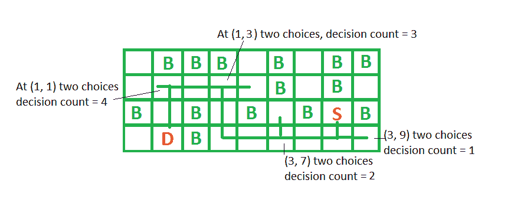

# 到达目的地的决策数量

> 原文:[https://www . geesforgeks . org/number-decisions-reach-destination/](https://www.geeksforgeeks.org/number-decisions-reach-destination/)

给定一个由 4 种字符组成的网格:“B”s 和 D。我们需要从 S 开始到达 D，在每一步我们可以到达相邻的小区，即上、下、左、右。字符为“B”的细胞被阻断，即在任何一步我们都不能移动到字符为“B”的细胞。**给定的网格具有点，这样从任何其他单元到达任何单元只有一种方法。**我们需要告诉多少次我们需要从一个以上的选择中选择我们的道路，即决定到达 d 的路径。

**示例:**

```
Input : Grid = [".BBB.B.BB"
                ".....B.B."
                "B.B.B.BSB"
                ".DB......"]
Output : 4
In above shown grid we have to decide 4
times to reach destination at (3, 7), 
(3, 5), (1, 3) and (1, 1).  
```



我们可以用 [DFS](https://www.geeksforgeeks.org/depth-first-traversal-for-a-graph/) 来解决这个问题。在从源到目的地的路径中，我们可以看到，每当我们有 1 个以上的邻居时，我们需要决定我们的路径，因此首先我们做一个 [DFS](https://www.geeksforgeeks.org/depth-first-traversal-for-a-graph/) ，并根据子-父数组存储从源到目的地的路径，然后我们从目的地移动到源，使用父数组逐个单元格，并且在我们有 1 个以上邻居的每个单元格，我们将增加我们的答案 1。

请参见下面的代码，以便更好地理解。

## C++

```
// C++ program to find decision taken to
// reach destination from source
#include <bits/stdc++.h>
using namespace std;

//  Utility dfs method to fill parent array
void dfs(int u, vector<int> g[], int prt[], bool visit[])
{
    visit[u] = true;

    //  loop over all unvisited neighbors
    for (int i = 0; i < g[u].size(); i++)
    {
        int v = g[u][i];
        if (!visit[v])
        {
            prt[v] = u;
            dfs(v, g, prt, visit);
        }
    }
}

// method returns decision taken to reach destination
// from source
int turnsToReachDestination(string grid[], int M)
{
    int N = grid[0].length();

    //  storing direction for neighbors
    int dx[] = {-1, 0, 1, 0};
    int dy[] = {0, -1, 0, 1};

    vector<int> g[M*N];
    bool visit[M*N] = {0};
    int prt[M*N];
    int start, dest;

    /*  initialize start and dest and
        store neighbours vector g
        If cell index is (i, j), then we can convert
        it to 1D as (i*N + j)  */
    for (int i = 0; i < M; i++)
    {
        for (int j = 0; j < N; j++)
        {
            if (grid[i][j] == 'D')
                dest = i*N + j;
            if (grid[i][j] == 'S')
                start = i*N + j;

            g[i*N + j].clear();
            if (grid[i][j] != 'B')
            {
                for (int k = 0; k < 4; k++)
                {
                    int u = i + dx[k];
                    int v = j + dy[k];

                    // if neighboring cell is in boundary
                    // and doesn't have 'B'
                    if (u >= 0 && u < M && v >= 0 &&
                        v < N && grid[u][v] != 'B')
                        g[i*N + j].push_back(u*N + v);
                }
            }
        }
    }

    //  call dfs from start and fill up parent array
    dfs(start, g, prt, visit);

    int curr = dest;
    int res = 0;

    //  loop from destination cell back to start cell
    while (curr != start)
    {
        /*  if current cell has more than 2 neighbors,
            then we need to decide our path to reach S
            from D, so increase result by 1 */
        if (g[curr].size() > 2)
            res++;

        curr = prt[curr];
    }

    return res;
}

//  Driver code to test above methods
int main()
{
    string grid[] =
    {
        ".BBB.B.BB",
        ".....B.B.",
        "B.B.B.BSB",
        ".DB......"
    };
    int M = sizeof(grid)/sizeof(grid[0]);
    cout << turnsToReachDestination(grid, M) << endl;
    return 0;
}
```

## Java 语言(一种计算机语言，尤用于创建网站)

```
// Java program to find decision taken to
// reach destination from source
import java.util.*;

class GFG
{

// Utility dfs method to fill parent array
static void dfs(int u, Vector<Integer> g[],
                int prt[], boolean visit[])
{
    visit[u] = true;

    // loop over all unvisited neighbors
    for (int i = 0; i < g[u].size(); i++)
    {
        int v = g[u].get(i);
        if (!visit[v])
        {
            prt[v] = u;
            dfs(v, g, prt, visit);
        }
    }
}

// method returns decision taken to reach destination
// from source
static int turnsToReachDestination(String grid[], int M)
{
    int N = grid[0].length();

    // storing direction for neighbors
    int dx[] = {-1, 0, 1, 0};
    int dy[] = {0, -1, 0, 1};

    Vector<Integer> []g = new Vector[M*N];
    for (int i = 0; i < M*N; i++)
        g[i] = new Vector<Integer>();
    boolean []visit = new boolean[M*N];
    int []prt = new int[M*N];
    int start = -1, dest = -1;

    /* initialize start and dest and
        store neighbours vector g
        If cell index is (i, j), then we can convert
        it to 1D as (i*N + j) */
    for (int i = 0; i < M; i++)
    {
        for (int j = 0; j < N; j++)
        {
            if (grid[i].charAt(j) == 'D')
                dest = i * N + j;
            if (grid[i].charAt(j) == 'S')
                start = i * N + j;

            g[i * N + j].clear();
            if (grid[i].charAt(j) != 'B')
            {
                for (int k = 0; k < 4; k++)
                {
                    int u = i + dx[k];
                    int v = j + dy[k];

                    // if neighboring cell is in boundary
                    // and doesn't have 'B'
                    if (u >= 0 && u < M && v >= 0 &&
                        v < N && grid[u].charAt(v) != 'B')
                        g[i * N + j].add(u * N + v);
                }
            }
        }
    }

    // call dfs from start and fill up parent array
    dfs(start, g, prt, visit);

    int curr = dest;
    int res = 0;

    // loop from destination cell back to start cell
    while (curr != start)
    {
        /* if current cell has more than 2 neighbors,
            then we need to decide our path to reach S
            from D, so increase result by 1 */
        if (g[curr].size() > 2)
            res++;

        curr = prt[curr];
    }

    return res;
}

// Driver code
public static void main(String[] args)
{
    String grid[] =
    {
        ".BBB.B.BB",
        ".....B.B.",
        "B.B.B.BSB",
        ".DB......"
    };
    int M = grid.length;
    System.out.print(turnsToReachDestination(grid, M) +"\n");
}
}

// This code is contributed by Rajput-Ji
```

## 蟒蛇 3

```
# Python3 program to find decision taken
# to reach destination from source

# Utility dfs method to fill parent array
def dfs(u, g, prt, visit):

    visit[u] = True

    # Loop over all unvisited neighbors
    for i in range(len(g[u])):

        v = g[u][i]

        if (not visit[v]):
            prt[v] = u
            dfs(v, g, prt, visit)

# Method returns decision taken to
# reach destination from source
def turnsToReachDestination(grid, M):

    N = len(grid[0])

    # Storing direction for neighbors
    dx = [ -1, 0, 1, 0 ]
    dy = [ 0, -1, 0, 1 ]

    g = {}

    visit = [0 for i in range(M * N)]
    prt = [0 for i in range(M * N)]

    start = -1
    dest = -1

    # Initialize start and dest and
    # store neighbours vector g
    # If cell index is (i, j), then
    # we can convert
    # it to 1D as (i*N + j) 
    for i in range(M):
        for j in range(N):
            if (grid[i][j] == 'D'):
                dest = i * N + j
            if (grid[i][j] == 'S'):
                start = i * N + j

            if (grid[i][j] != 'B'):
                for k in range(4):
                    u = i + dx[k]
                    v = j + dy[k]

                    # If neighboring cell is in
                    # boundary and doesn't have 'B'
                    if (u >= 0 and u < M and
                        v >= 0 and v < N and
                        grid[u][v] != 'B'):
                        if (i * N +j) not in g:
                            g[i * N + j] = []
                            g[i * N + j].append(u * N + v)
                        else:
                            g[i * N + j].append(u * N + v)

    # Call dfs from start and fill up parent array
    dfs(start, g, prt, visit)

    curr = dest
    res = 0

    # Loop from destination cell back to start cell
    while(curr != start):

        # If current cell has more than 2 neighbors,
        # then we need to decide our path to reach S
        # from D, so increase result by 1 */
        if (len(g[curr]) > 2):
            res += 1

        curr = prt[curr]

    return res

# Driver code
grid = [ ".BBB.B.BB", ".....B.B.",
         "B.B.B.BSB", ".DB......" ]

M = len(grid)

print(turnsToReachDestination(grid, M))

# This code is contributed by avanitrachhadiya2155
```

## C#

```
// C# program to find decision taken to
// reach destination from source
using System;
using System.Collections.Generic;

class GFG
{

// Utility dfs method to fill parent array
static void dfs(int u, List<int> []g,
                int []prt, bool []visit)
{
    visit[u] = true;

    // loop over all unvisited neighbors
    for (int i = 0; i < g[u].Count; i++)
    {
        int v = g[u][i];
        if (!visit[v])
        {
            prt[v] = u;
            dfs(v, g, prt, visit);
        }
    }
}

// method returns decision taken to reach destination
// from source
static int turnsToReachDestination(String []grid, int M)
{
    int N = grid[0].Length;

    // storing direction for neighbors
    int []dx = {-1, 0, 1, 0};
    int []dy = {0, -1, 0, 1};

    List<int> []g = new List<int>[M*N];
    for (int i = 0; i < M*N; i++)
        g[i] = new List<int>();
    bool []visit = new bool[M*N];
    int []prt = new int[M*N];
    int start = -1, dest = -1;

    /* initialize start and dest and
        store neighbours vector g
        If cell index is (i, j), then we can convert
        it to 1D as (i*N + j) */
    for (int i = 0; i < M; i++)
    {
        for (int j = 0; j < N; j++)
        {
            if (grid[i][j] == 'D')
                dest = i * N + j;
            if (grid[i][j] == 'S')
                start = i * N + j;

            g[i * N + j].Clear();
            if (grid[i][j] != 'B')
            {
                for (int k = 0; k < 4; k++)
                {
                    int u = i + dx[k];
                    int v = j + dy[k];

                    // if neighboring cell is in boundary
                    // and doesn't have 'B'
                    if (u >= 0 && u < M && v >= 0 &&
                        v < N && grid[u][v] != 'B')
                        g[i * N + j].Add(u * N + v);
                }
            }
        }
    }

    // call dfs from start and fill up parent array
    dfs(start, g, prt, visit);

    int curr = dest;
    int res = 0;

    // loop from destination cell back to start cell
    while (curr != start)
    {
        /* if current cell has more than 2 neighbors,
            then we need to decide our path to reach S
            from D, so increase result by 1 */
        if (g[curr].Count > 2)
            res++;

        curr = prt[curr];
    }

    return res;
}

// Driver code
public static void Main(String[] args)
{
    String []grid =
    {
        ".BBB.B.BB",
        ".....B.B.",
        "B.B.B.BSB",
        ".DB......"
    };
    int M = grid.Length;
    Console.Write(turnsToReachDestination(grid, M) +"\n");
}
}

// This code is contributed by 29AjayKumar
```

## java 描述语言

```
<script>

// JavaScript program to find decision taken to
// reach destination from source

// Utility dfs method to fill parent array
function dfs(u,g,prt,visit)
{
    visit[u] = true;

    // loop over all unvisited neighbors
    for (let i = 0; i < g[u].length; i++)
    {
        let v = g[u][i];
        if (!visit[v])
        {
            prt[v] = u;
            dfs(v, g, prt, visit);
        }
    }
}

// method returns decision taken to reach destination
// from source
function turnsToReachDestination(grid,M)
{
    let N = grid[0].length;

    // storing direction for neighbors
    let dx = [-1, 0, 1, 0];
    let dy = [0, -1, 0, 1];

    let g = new Array(M*N);
    for (let i = 0; i < M*N; i++)
        g[i] = [];
    let visit = new Array(M*N);
    let prt = new Array(M*N);
    let start = -1, dest = -1;

    /* initialize start and dest and
        store neighbours vector g
        If cell index is (i, j), then we can convert
        it to 1D as (i*N + j) */
    for (let i = 0; i < M; i++)
    {
        for (let j = 0; j < N; j++)
        {
            if (grid[i][j] == 'D')
                dest = i * N + j;
            if (grid[i][j] == 'S')
                start = i * N + j;

            g[i * N + j]=[];
            if (grid[i][j] != 'B')
            {
                for (let k = 0; k < 4; k++)
                {
                    let u = i + dx[k];
                    let v = j + dy[k];

                    // if neighboring cell is in boundary
                    // and doesn't have 'B'
                    if (u >= 0 && u < M && v >= 0 &&
                        v < N && grid[u][v] != 'B')
                        g[i * N + j].push(u * N + v);
                }
            }
        }
    }

    // call dfs from start and fill up parent array
    dfs(start, g, prt, visit);

    let curr = dest;
    let res = 0;

    // loop from destination cell back to start cell
    while (curr != start)
    {
        /* if current cell has more than 2 neighbors,
            then we need to decide our path to reach S
            from D, so increase result by 1 */
        if (g[curr].length > 2)
            res++;

        curr = prt[curr];
    }

    return res;
}

// Driver code
let grid=[".BBB.B.BB",
        ".....B.B.",
        "B.B.B.BSB",
        ".DB......"];
let M = grid.length;
document.write(turnsToReachDestination(grid, M) +"<br>");

// This code is contributed by rag2127

</script>
```

**输出:**

```
4
```

本文由 [**乌卡什·特里维迪**](https://in.linkedin.com/in/utkarsh-trivedi-253069a7) 供稿。如果你喜欢 GeeksforGeeks 并想投稿，你也可以使用[write.geeksforgeeks.org](https://write.geeksforgeeks.org)写一篇文章或者把你的文章邮寄到 review-team@geeksforgeeks.org。看到你的文章出现在极客博客主页上，帮助其他极客。
如果发现有不正确的地方，或者想分享更多关于上述话题的信息，请写评论。