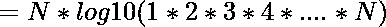

# N 次方的位数

> 原文:[https://www . geesforgeks . org/number-digits-n-factorial-power-n/](https://www.geeksforgeeks.org/number-digits-n-factorial-power-n/)

给定一个正整数 N，我们要求 N 的阶乘中的位数的总数升到 N 的幂，即
**例:**

```
Input: 4
Output: 6
Explanations:  =  = 331776\. 
Total number of digits in 331776 is 6.
Input: 5
Output: 11
Explanations:  =  = 24883200000
Total number of digits in 24883200000 is 11.
Input: 2
Output: 1
Input: 1000
Output: 2567605
```

解决方案的思路描述如下。

> **蛮力法:**通过蛮力，我们可以简单的算出 N！在 O(N)时间内，然后乘以 N 倍，但这将是一个非常慢的方法，并且会超过时间和空间，因为将是一个巨大的数字。
> 
> **高效法:**
> 我们再仔细看看。我们可以打破(N！将)^N 转化为更简单的易于计算的术语。通过取普通对数，
> 
> 我们得到
> 
> ，我们知道，
> 所以我们可以进一步约简。
> 
> 
> 
> 
> 
> ![= N * [log10 (1) + log10 (2) + log10 (3) + .... + log10 (N)]   ](img/8fe39bc56cfc787b0750ab94658bb22f.png "Rendered by QuickLaTeX.com")
> 现在我们可以在 O(N)个时间内轻松计算出答案，而且没有空间限制超越。
> 
> *那么为什么是这个问题的有效答案呢？*
> 我们知道，取 ceil(log10 (N))可以很容易地求出基数为 10 的数字 N 中的总位数。这正是用上述方法完成的。

下面给出了上述思想的代码实现。

## C++

```
// CPP program to find count of digits in N
// factorial raised to N
#include <bits/stdc++.h>
using namespace std;

int countDigits(int n)
{
    // we take sum of logarithms as explained
    // in the approach
    double ans = 0;
    for (int i = 1; i <= n; i++)
        ans += log10(i);

    // multiply the result with n
    ans = ans * n;
    return 1 + floor(ans);
}

int main()
{
    int n = 4;
    cout << countDigits(n) << "\n";
    return 0;
}
```

## Java 语言(一种计算机语言，尤用于创建网站)

```
// Java program to find
// count of digits in N
// factorial raised to N
import java.io.*;

class GFG
{
static int countDigits(int n)
{
    // we take sum of logarithms
    // as explained in the approach
    double ans = 0;
    for (int i = 1; i <= n; i++)
        ans += Math.log10(i);

    // multiply the
    // result with n
    ans = ans * n;
    return 1 + (int)Math.floor(ans);
}

// Driver Code
public static void main (String[] args)
{
    int n = 4;
    System.out.println(
               countDigits(n) + "\n");
}
}

// This code is contributed
// by anuj_67.
```

## 蟒蛇 3

```
# python3 program to find count of digits in N
# factorial raised to N

import math

def countDigits( n):

    # we take sum of logarithms as explained
    # in the approach
    ans = 0
    for i in range (1,n+1):
        ans += math.log10(i)

    #multiply the result with n
    ans = ans * n
    return 1 + math.floor(ans)

if __name__ == "__main__":

    n = 4
    print (countDigits(n))
```

## C#

```
// C# program to find
// count of digits in N
// factorial raised to N
using System;

class GFG
{
static int countDigits(int n)
{
    // we take sum of logarithms
    // as explained in the approach
    double ans = 0;
    for (int i = 1; i <= n; i++)
        ans += Math.Log10(i);

    // multiply the
    // result with n
    ans = ans * n;
    return 1 + (int)Math.Floor(ans);
}

// Driver Code
public static void Main ()
{
    int n = 4;
    Console.WriteLine(
            countDigits(n) + "\n");
}
}

// This code is contributed
// by anuj_67.
```

## 服务器端编程语言（Professional Hypertext Preprocessor 的缩写）

```
<?php
// PHP program to find count of
// digits in N factorial raised to N
function countDigits ($n)
{
    // we take sum of logarithms as
    // explained in the approach
    $ans = 0;
    for ($i = 1; $i <= $n; $i++)
        $ans += log10($i);

    // multiply the result with n
    $ans = $ans * $n;
    return 1 + floor($ans);
}

// Driver Code
$n = 4;
echo countDigits($n) , "\n";

// This code is contributed
// by jit_t   
?>
```

## java 描述语言

```
<script>

// Javascript program to find count of digits in N
// factorial raised to N

function countDigits(n)
{
    // we take sum of logarithms as explained
    // in the approach
    let ans = 0;
    for (let i = 1; i <= n; i++)
        ans += Math.log10(i);

    // multiply the result with n
    ans = ans * n;
    return 1 + Math.floor(ans);
}

    let n = 4;
    document.write(countDigits(n) + "<br>");

// This code is contributed by Mayank Tyagi

</script>
```

**Output:** 

```
6
```