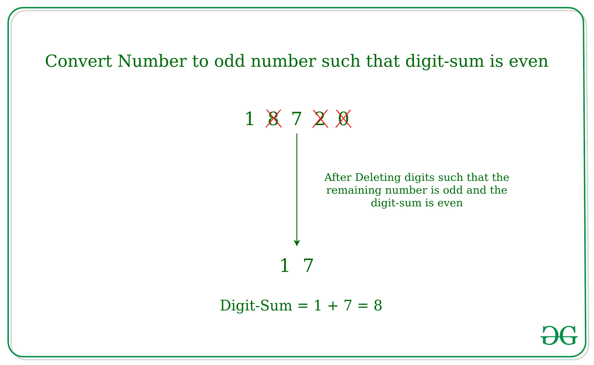

# 删除数字形成的数字，使数字之和为偶数，数字为奇数

> 原文:[https://www . geesforgeks . org/number-通过删除数字形成-这样-数字的总和变成偶数和奇数/](https://www.geeksforgeeks.org/number-formed-by-deleting-digits-such-that-sum-of-the-digits-becomes-even-and-the-number-odd/)

给定一个非负数 **N** ，任务是通过删除该数的某些数字来转换该数，使得数字之和变为偶数但该数为奇数。如果没有可能的号码，则打印 **-1** 。
**注:**给定 n 可以有多个可能的数字。
**示例:**

> **输入:** N = 18720
> **输出:** 17
> **说明:**
> 
> 
> 
> 删除 8，2，0 位后，数字变成 17，这是奇数，数字总和是 8，这是偶数。
> **输入:** N = 3
> **输出:** -1
> **说明:**
> 不存在数字变奇数，数字和为偶数的可能。

**方法:**
思路是利用**“奇数的偶数会给偶数的和”**。因此，如果数字中的数字包含奇数的偶数计数，则可以转换该数字，否则转换该数字是不可能的。
以下是上述办法的实施情况。

## C++

```
// C++ implementation to convert
// a number into odd number such
// that digit-sum is odd

#include <bits/stdc++.h>
using namespace std;

// Function to convert a number into
// odd number such that digit-sum is odd
void converthenumber(int n)
{
    string s = to_string(n);
    string res;

    // Loop to find any first two
    // odd number such that their
    // sum is even and number is odd
    for (int i = 0; i < s.length(); i++) {
        if (s[i] == '1' || s[i] == '3'
            || s[i] == '5' || s[i] == '7'
            || s[i] == '9')
            res += s[i];
        if (res.size() == 2)
            break;
    }

    // Print the result
    if (res.size() == 2)
        cout << res << endl;
    else
        cout << "-1" << endl;
}

// Driver Code
int main()
{
    int n = 18720;
    converthenumber(n);

    return 0;
}
```

## Java 语言(一种计算机语言，尤用于创建网站)

```
// Java implementation to convert
// a number into odd number such
// that digit-sum is odd
import java.util.*;
import java.lang.*;
import java.io.*;

class Main
{

// Function to convert a number into
// odd number such that digit-sum is odd
static void converthenumber(int n)
{
    String s = Integer.toString(n);
    String res = "";

    // Loop to find any first two
    // odd number such that their
    // sum is even and number is odd
    for (int i = 0; i < s.length(); i++)
    {
        if (s.charAt(i) == '1' || s.charAt(i) == '3'
            || s.charAt(i) == '5' || s.charAt(i) == '7'
            || s.charAt(i) == '9')
            res += s.charAt(i);
        if (res.length() == 2)
            break;
    }

    // Print the result
    if (res.length() == 2)
        System.out.println(res);
    else
        System.out.println(-1);
}

// Driver code
public static void main (String[] args)
{
    int n = 18720;
    converthenumber(n);
}
}

// This code is contributed by Subhadeep Gupta
```

## 蟒蛇 3

```
# Python3 implementation to convert
# a number into odd number such
# that digit-sum is odd

# Function to convert a number into
# odd number such that digit-sum is odd
def converthenumber(n) :
    s = str(n);
    res = "";

    # Loop to find any first two
    # odd number such that their
    # sum is even and number is odd
    for i in range(len(s)) :
        if (s[i] == '1' or s[i] == '3'
        or s[i] == '5' or s[i] == '7'
        or s[i] == '9') :
            res += s[i];

        if (len(res) == 2) :
            break;

    # Print the result
    if (len(res) == 2) :
        print(res);

    else :
        print("-1");

# Driver Code
if __name__ == "__main__" :

    n = 18720;
    converthenumber(n);

# This code is contributed by AnkitRai01
```

## C#

```
// C# implementation to convert
// a number into odd number such
// that digit-sum is odd
using System;

class GFG
{

// Function to convert a number into
// odd number such that digit-sum is odd
static void converthenumber(int n)
{
    String s = n.ToString();
    String res = "";

    // Loop to find any first two
    // odd number such that their
    // sum is even and number is odd
    for (int i = 0; i < s.Length; i++)
    {
        if (s[i] == '1' || s[i] == '3'
            || s[i] == '5' || s[i] == '7'
            || s[i] == '9')
            res += s[i];
        if (res.Length == 2)
            break;
    }

    // Print the result
    if (res.Length == 2)
        Console.WriteLine(res);
    else
        Console.WriteLine(-1);
}

// Driver code
public static void Main (String[] args)
{
    int n = 18720;
    converthenumber(n);
}
}

// This code is contributed by Mohit kuamr 29
```

## java 描述语言

```
<script>

// Javascript implementation to convert
// a number into odd number such
// that digit-sum is odd

// Function to convert a number into
// odd number such that digit-sum is odd
function converthenumber(n)
{
    var s = n.toString();
    var res = "";

    var i;
    // Loop to find any first two
    // odd number such that their
    // sum is even and number is odd
    for (i = 0; i < s.length; i++) {
        if (s[i] == '1' || s[i] == '3'
            || s[i] == '5' || s[i] == '7'
            || s[i] == '9')
            res += s[i];
        if (res.length == 2)
            break;
    }

    // Print the result
    if (res.length == 2)
        document.write(res);
    else
        document.write("-1");
}

// Driver Code
    var n = 18720;
    converthenumber(n);

</script>
```

**Output:** 

```
17
```