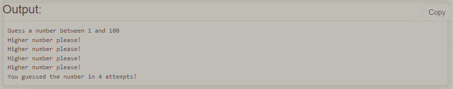

# C 中的猜数字游戏

> 原文:[https://www.geeksforgeeks.org/number-guessing-game-in-c/](https://www.geeksforgeeks.org/number-guessing-game-in-c/)

给定一个整数 **N** 。数字猜谜游戏是一种简单的猜谜游戏，用户最多需要在 **10 次**尝试中猜出 **0** 和 **N** 之间的数字。游戏将在 **10 次**尝试后结束，如果玩家猜不到号码，他将输掉游戏。

**示例:**

> **N** = 100
> **所选号码:** 20
> 
> **机器:**猜一个 1 到 N 之间的数字
> T3】玩家:30
> T6【机器:请降低数字！
> **玩家:** 15
> **机器:**请高数！
> **玩家:** 20
> **机器:**你在 3 次尝试
> 中猜到了数字现在，终止游戏。

**进场:**可以按照以下步骤设计游戏:

*   生成一个介于 **0** 和 **N** 之间的随机数。
*   然后从 **1** 迭代到 **10** ，检查输入的数字是否等于假设的数字。
*   如果是，那么玩家赢得游戏。
*   否则，在 **10 次**尝试后终止游戏。

下面是上述方法的实现:

## C

```
// C program for the above approach
#include <math.h>
#include <stdio.h>
#include <stdlib.h>

// Function that generate a number in
// the range [1, N] and checks if the
// generated number is the same as the
// guessed number or not
void guess(int N)
{
    int number, guess, numberofguess = 0;

    // Generate a random number
    number = rand() % N;

    printf("Guess a number between"
           " 1 and %d\n",
           N);

    // Using a do-while loop that will
    // work until user guesses
    // the correct number
    do {

        if (numberofguess > 9) {
            printf("\nYou Loose!\n");
            break;
        }

        // Input by user
        scanf("%d", &guess);

        // When user guesses lower
        // than actual number
        if (guess > number)

        {
            printf("Lower number "
                   "please!\n");
            numberofguess++;
        }

        // When user guesses higher
        // than actual number
        else if (number > guess)

        {
            printf("Higher number"
                   " please!\n");
            numberofguess++;
        }

        // Printing number of times
        // user has taken to guess
        // the number
        else
            printf("You guessed the"
                   " number in %d "
                   "attempts!\n",
                   numberofguess);

    } while (guess != number);
}

// Driver Code
int main()
{
    int N = 100;

    // Function call
    guess(N);

    return 0;
}
```

**输出:**
[](https://media.geeksforgeeks.org/wp-content/cdn-uploads/20201228131006/Screenshot-65.png)