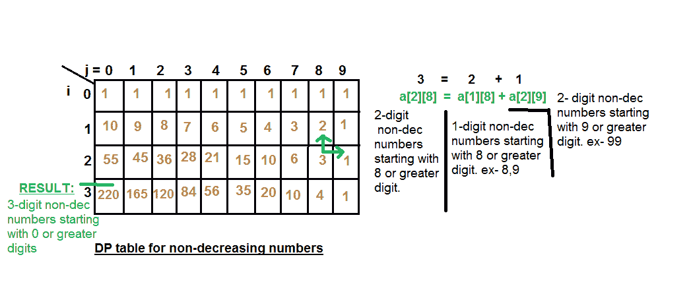
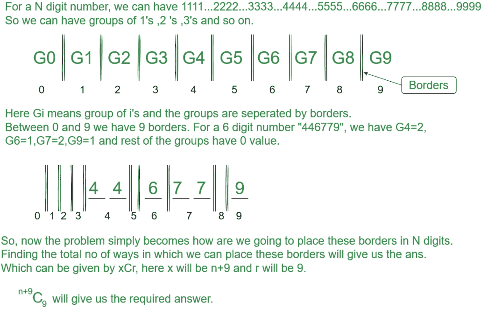

# n 位数非递减整数数量

> 原文:[https://www . geesforgeks . org/number-n-位数-非递减-整数/](https://www.geeksforgeeks.org/number-n-digits-non-decreasing-integers/)

给定一个表示位数的整数 n > 0，任务是找出本质上不递减的 n 位数正整数的总数。
非减整数是指从左到右的所有数字都为非减形式的整数。例如:1234，1135，..等等。
**注:**前导零也算在非减整数中，如 0000、0001、0023 等也是 4 位数的非减整数。
**例:**

```
Input : n = 1
Output : 10
Numbers are 0, 1, 2, ...9.

Input : n = 2
Output : 55

Input : n = 4
Output : 715
```

**天真方法:**我们生成所有可能的 n 位数字，然后针对每个数字检查它是否不递减。
时间复杂度:(n*10^n)，其中 10^n 用于生成所有可能的 n 位数字，n 用于检查特定数字是否不递减。
**动态编程:**
如果我们从左到右一个一个地填充数字，以下条件成立。

1.  如果当前的最后一位数字是 9，我们只能在剩余的地方填入 9。因此，如果当前的最后一位数字是 9，那么只有一种解决方案是可能的。
2.  如果当前最后一位数字小于 9，那么我们可以使用以下公式递归计算计数。

```
a[i][j] = a[i-1][j] + a[i][j + 1] 
         For every digit j smaller than 9.

We consider previous length count and count
to be increased by all greater digits.
```

我们建立一个矩阵 a[][]，其中 **a[i][j]** =以 j 或大于 j 为前导数字的所有有效 I 位非递减整数的计数。该解决方案基于以下观察。我们按列填充这个矩阵，首先计算一个[1][9]，然后用这个值计算一个[2][8]等等。
在任何时刻，如果我们希望计算一个 I[I][j]表示前导数字为 j 或大于 j 的 I 位数非递减整数的数量，我们应该将一个[i-1][j](从 j 或更大的数字开始的 i-1 位数整数的数量，因为在这种情况下，如果我们将 j 作为其最左边的数字，那么我们的数字将是 I 位数非递减数字)和一个[i][j+1](以数字开始的 I 位数整数的数量等于或大于 j+1)。所以，**a[I][j]= a[I-1][j]+a[I][j+1]**。



## C++

```
// C++ program for counting n digit numbers with
// non decreasing digits
#include <bits/stdc++.h>
using namespace std;

// Returns count of non- decreasing numbers with
// n digits.
int nonDecNums(int n)
{
    /* a[i][j] = count of all possible number
    with i digits having leading digit as j */
    int a[n + 1][10];

    // Initialization of all 0-digit number
    for (int i = 0; i <= 9; i++)
        a[0][i] = 1;

    /* Initialization of all i-digit
    non-decreasing number leading with 9*/
    for (int i = 1; i <= n; i++)
        a[i][9] = 1;

    /* for all digits we should calculate
    number of ways depending upon leading
    digits*/
    for (int i = 1; i <= n; i++)
        for (int j = 8; j >= 0; j--)
            a[i][j] = a[i - 1][j] + a[i][j + 1];

    return a[n][0];
}

// driver program
int main()
{
    int n = 2;
    cout << "Non-decreasing digits = "
        << nonDecNums(n) << endl;
    return 0;
}
```

## Java 语言(一种计算机语言，尤用于创建网站)

```
// Java program for counting n digit numbers with
// non decreasing digits
import java.io.*;

class GFG {

    // Function that returns count of non- decreasing numbers
    // with n digits
    static int nonDecNums(int n)
    {
        // a[i][j] = count of all possible number
        // with i digits having leading digit as j
        int[][] a = new int[n + 1][10];

        // Initialization of all 0-digit number
        for (int i = 0; i <= 9; i++)
            a[0][i] = 1;

        // Initialization of all i-digit
        // non-decreasing number leading with 9
        for (int i = 1; i <= n; i++)
            a[i][9] = 1;

        // for all digits we should calculate
        // number of ways depending upon leading
        // digits
        for (int i = 1; i <= n; i++)
            for (int j = 8; j >= 0; j--)
                a[i][j] = a[i - 1][j] + a[i][j + 1];

        return a[n][0];
    }

    // driver program
    public static void main(String[] args)
    {
        int n = 2;
        System.out.println("Non-decreasing digits = " + nonDecNums(n));
    }
}

// Contributed by Pramod Kumar
```

## 蟒蛇 3

```
# Python3 program for counting n digit
# numbers with non decreasing digits
import numpy as np

# Returns count of non- decreasing
# numbers with n digits.
def nonDecNums(n) :

    # a[i][j] = count of all possible number
    # with i digits having leading digit as j
    a = np.zeros((n + 1, 10))

    # Initialization of all 0-digit number
    for i in range(10) :
        a[0][i] = 1

    # Initialization of all i-digit
    # non-decreasing number leading with 9
    for i in range(1, n + 1) :
        a[i][9] = 1

    # for all digits we should calculate
    # number of ways depending upon
    # leading digits
    for i in range(1, n + 1) :
        for j in range(8, -1, -1) :
            a[i][j] = a[i - 1][j] + a[i][j + 1]

    return int(a[n][0])

# Driver Code
if __name__ == "__main__" :

    n = 2
    print("Non-decreasing digits = ",
                       nonDecNums(n))

# This code is contributed by Ryuga
```

## C#

```
// C# function to find number of diagonals
// in n sided convex polygon
using System;

class GFG {

    // Function that returns count of non-
    // decreasing numbers with n digits
    static int nonDecNums(int n)
    {
        // a[i][j] = count of all possible number
        // with i digits having leading digit as j
        int[, ] a = new int[n + 1, 10];

        // Initialization of all 0-digit number
        for (int i = 0; i <= 9; i++)
            a[0, i] = 1;

        // Initialization of all i-digit
        // non-decreasing number leading with 9
        for (int i = 1; i <= n; i++)
            a[i, 9] = 1;

        // for all digits we should calculate
        // number of ways depending upon leading
        // digits
        for (int i = 1; i <= n; i++)
            for (int j = 8; j >= 0; j--)
                a[i, j] = a[i - 1, j] + a[i, j + 1];

        return a[n, 0];
    }

    // driver program
    public static void Main()
    {
        int n = 2;
        Console.WriteLine("Non-decreasing digits = " +
                                       nonDecNums(n));
    }
}

// This code is contributed by Sam007
```

## 服务器端编程语言（Professional Hypertext Preprocessor 的缩写）

```
<?php
// PHP program for counting
// n digit numbers with
// non decreasing digits

// Returns count of non-
// decreasing numbers with
// n digits.

function nonDecNums($n)
{
    /* a[i][j] = count of
    all possible number
    with i digits having
    leading digit as j */

    // Initialization of
    // all 0-digit number
    for ($i = 0; $i <= 9; $i++)
        $a[0][$i] = 1;

    /* Initialization of all
    i-digit non-decreasing
    number leading with 9*/
    for ($i = 1; $i <= $n; $i++)
        $a[$i][9] = 1;

    /* for all digits we should
    calculate number of ways
    depending upon leading digits*/
    for ($i = 1; $i <= $n; $i++)
        for ($j = 8; $j >= 0; $j--)
            $a[$i][$j] = $a[$i - 1][$j] +
                         $a[$i][$j + 1];

    return $a[$n][0];
}

// Driver Code
$n = 2;
echo "Non-decreasing digits = ",
            nonDecNums($n),"\n";

// This code is contributed by m_kit
?>
```

## java 描述语言

```
<script>

    // Javascript program for counting n digit
    // numbers with non decreasing digits

    // Function that returns count
    // of non- decreasing numbers
    // with n digits
    function nonDecNums(n)
    {
        // a[i][j] = count of all possible number
        // with i digits having leading digit as j
        let a = new Array(n + 1)
        for (let i = 0; i < n + 1; i++)
        {
            a[i] = new Array(10);
        }

        // Initialization of all 0-digit number
        for (let i = 0; i <= 9; i++)
            a[0][i] = 1;

        // Initialization of all i-digit
        // non-decreasing number leading with 9
        for (let i = 1; i <= n; i++)
            a[i][9] = 1;

        // for all digits we should calculate
        // number of ways depending upon leading
        // digits
        for (let i = 1; i <= n; i++)
            for (let j = 8; j >= 0; j--)
                a[i][j] = a[i - 1][j] + a[i][j + 1];

        return a[n][0];
    }

    let n = 2;
      document.write(
    "Non-decreasing digits = " + nonDecNums(n)
    );

</script>
```

**Output**

```
Non-decreasing digits = 55
```

**输出:**

```
Non-decreasing digits = 55
```

**时间复杂度:** O(10*n)相当于 O(n)。

**另一种方法:**

如果我们观察，可以看到 0 必须放在 1-9 之前，1 必须放在 2-9 之前，以此类推。当我们被要求寻找非递减整数时，111223 是一个有效的非递减整数，这意味着相同的数字可以同时出现。



**<u>例 1</u>** <u>:</u> 当 N=2 时，我们有 11C9，等于 **55。**

**<u>例 2</u>**:N = 5 时，我们有 14C9，等于 **2002。**

## C++

```
// CPP program To calculate Number of n-digits non-decreasing integers
//Contributed by Parishrut Kushwaha//
#include <bits/stdc++.h>
using namespace std;

// Returns factorial of n
long long int fact(int n)
{
    long long int res = 1;
    for (int i = 2; i <= n; i++)
        res = res * i;
    return res;
}

// returns nCr
long long int nCr(int n, int r)
{
    return fact(n) / (fact(r) * fact(n - r));
}

// Driver code
int main()
{
    int n = 2;
    cout <<"Number of Non-Decreasing digits: "<< nCr(n+9,9);
    return 0;
}
```

## Java 语言(一种计算机语言，尤用于创建网站)

```
// Java program To calculate Number
// of n-digits non-decreasing integers
class GFG {

    // Returns factorial of n
    static long fact(int n)
    {
        long res = 1;
        for (int i = 2; i <= n; i++)
            res = res * i;
        return res;
    }

    // returns nCr
    static long nCr(int n, int r)
    {
        return fact(n) / (fact(r) * fact(n - r));
    }

    // Driver code
    public static void main(String[] args)
    {
        int n = 2;
        System.out.println(
            "Number of Non-Decreasing digits: "
            + nCr(n + 9, 9));
    }
}

// This code is contributed by rajsanghavi9.
```

## 蟒蛇 3

```
# Python program To calculate Number of n-digits non-decreasing integers
#Contributed by Parishrut Kushwaha#
# Returns factorial of n
def fact(n):

    res = 1
    for i in range (2,n+1):
        res = res * i
    return res

# returns nCr
def nCr(n, r):
    return fact(n) // ((fact(r) * fact(n - r)))

# Driver code
n = 2
print("Number of Non-Decreasing digits: " , nCr(n+9,9))

# This code is contributed by shivanisinghss2110   
```

## C#

```
// C# program To calculate Number
// of n-digits non-decreasing integers
using System;

class GFG {

    // Returns factorial of n
    static long fact(int n)
    {
        long res = 1;
        for (int i = 2; i <= n; i++)
            res = res * i;
        return res;
    }

    // returns nCr
    static long nCr(int n, int r)
    {
        return fact(n) / (fact(r) * fact(n - r));
    }

    // Driver code
    public static void Main(String[] args)
    {
        int n = 2;
        Console.Write("Number of Non-Decreasing digits: " + nCr(n + 9, 9));
    }
}

// This code is contributed by shivanisinghss2110
```

## java 描述语言

```
<script>
// JavaScript program To calculate Number
// of n-digits non-decreasing integers

    // Returns factorial of n
    function fact( n)
    {
        var res = 1;
        for (var i = 2; i <= n; i++)
            res = res * i;
        return res;
    }

    // returns nCr
    function nCr(n, r)
    {
        return fact(n) / (fact(r) * fact(n - r));
    }

    // Driver code
        var n = 2;
        document.write("Number of Non-Decreasing digits: " + nCr(n + 9, 9));

// This code is contributed by shivanisinghss2110.

</script>
```

**Output**

```
Number of Non-Decreasing digits: 55
```

**时间复杂度:** O(n)。

**空间复杂度:** O(n)。
本文由 [**希瓦姆·普拉丹(anuj_charm)**](https://www.facebook.com/anuj.charm) 供稿。如果你喜欢 GeeksforGeeks 并想投稿，你也可以使用[contribute.geeksforgeeks.org](http://www.contribute.geeksforgeeks.org)写一篇文章或者把你的文章邮寄到 review-team@geeksforgeeks.org。看到你的文章出现在极客博客主页上，帮助其他极客。
如果发现有不正确的地方，或者想分享更多关于上述话题的信息，请写评论。