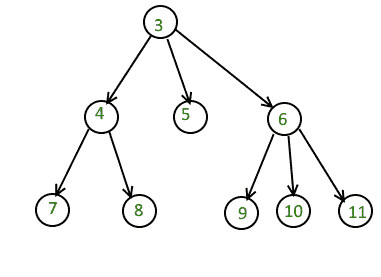

# n 元树中大于给定值的节点数

> 原文:[https://www . geesforgeks . org/number-nodes-greater-给定值-n-ary-tree/](https://www.geeksforgeeks.org/number-nodes-greater-given-value-n-ary-tree/)

给定一个 **n 元**树和一个数字 **x** ，找到并返回大于 x 的节点数。

**示例:**

```
In the given tree, x = 7
```



```
Number of nodes greater than x are 4.
```

**方法:**
想法是保持一个计数变量初始化为 0。遍历树并将根数据与 x 进行比较。如果根数据大于 x，递增计数变量并递归调用其所有子变量。

下面是 idea 的实现。

## C++

```
// C++ program to find number of nodes
// greater than x
#include <bits/stdc++.h>
using namespace std;

// Structure of a node of n-ary tree
struct Node {
    int key;
    vector<Node*> child;
};

// Utility function to create
// a new tree node
Node* newNode(int key)
{
    Node* temp = new Node;
    temp->key = key;
    return temp;
}

// Function to find number of nodes
// greater than x
int nodesGreaterThanX(Node* root, int x)
{
    if (root == NULL)
        return 0;

    int count = 0;

    // if current root is greater
    // than x increment count
    if (root->key > x)
        count++;

    // Number of children of root
    int numChildren = root->child.size();

    // recursively calling for every child
    for (int i = 0; i < numChildren; i++) {
        Node* child = root->child[i];
        count += nodesGreaterThanX(child, x);
    }

    // return the count
    return count;
}

// Driver program
int main()
{
    /* Let us create below tree
*         5
*         / | \
*     1 2 3
*     / / \ \
*     15 4 5 6
*/

    Node* root = newNode(5);
    (root->child).push_back(newNode(1));
    (root->child).push_back(newNode(2));
    (root->child).push_back(newNode(3));
    (root->child[0]->child).push_back(newNode(15));
    (root->child[1]->child).push_back(newNode(4));
    (root->child[1]->child).push_back(newNode(5));
    (root->child[2]->child).push_back(newNode(6));

    int x = 5;

    cout << "Number of nodes greater than "
        << x << " are ";
    cout << nodesGreaterThanX(root, x)
        << endl;

    return 0;
}
```

## Java 语言(一种计算机语言，尤用于创建网站)

```
// Java program to find number of nodes
// greater than x
import java.util.*;

// Class representing a Node of an N-ary tree
class Node{

    int key;
    ArrayList<Node> child;

    // Constructor to create a Node
    Node(int val)
    {
        key = val;
        child = new ArrayList<>();
    }
}

class GFG{

// Recursive function to find number
// of nodes greater than x
public static int nodesGreaterThanX(Node root, int x)
{
    if (root == null)
        return 0;

    int count = 0;

    // If current root is greater
    // than x increment count
    if (root.key > x)
        count++;

    // Recursively calling for every
    // child of current root
    for(Node child : root.child)
    {
        count += nodesGreaterThanX(child, x);
    }

    // Return the count
    return count;
}

// Driver code
public static void main(String[] args)
{

    /* Let us create below tree
            5
        / | \
        1 2 3
        / / \ \
    15 4 5 6
    */

    Node root = new Node(5);

    root.child.add(new Node(1));
    root.child.add(new Node(2));
    root.child.add(new Node(3));

    root.child.get(0).child.add(new Node(15));
    root.child.get(1).child.add(new Node(4));
    root.child.get(1).child.add(new Node(5));
    root.child.get(2).child.add(new Node(6));

    int x = 5;

    System.out.print("Number of nodes greater than " +
                    x + " are ");
    System.out.println(nodesGreaterThanX(root, x));
}
}

// This code is contributed by jrishabh99
```

## 蟒蛇 3

```
# Python3 program to find number of nodes
# greater than x

# Structure of a node of n-ary tree
class Node:
    def __init__(self, data):
        self.key = data
        self.child = []

# Function to find number of nodes
# greater than x
def nodesGreaterThanX(root: Node, x: int) -> int:
    if root is None:
        return 0

    count = 0

    # if current root is greater
    # than x increment count
    if root.key > x:
        count += 1

    # Number of children of root
    numChildren = len(root.child)

    # recursively calling for every child
    for i in range(numChildren):
        child = root.child[i]
        count += nodesGreaterThanX(child, x)

    # return the count
    return count

# Driver Code
if __name__ == "__main__":

    ans = 0
    k = 25

    # Let us create below tree
    # 5
    #         / | \
    # 1 2 3
    #     / / \ \
    # 15 4 5 6

    root = Node(5)
    (root.child).append(Node(1))
    (root.child).append(Node(2))
    (root.child).append(Node(3))
    (root.child[0].child).append(Node(15))
    (root.child[1].child).append(Node(4))
    (root.child[1].child).append(Node(5))
    (root.child[2].child).append(Node(6))

    x = 5

    print("Number of nodes greater than % d are % d" %
        (x, nodesGreaterThanX(root, x)))

# This code is contributed by
# sanjeev2552
```

## C#

```
// C# program to find number of nodes
// greater than x
using System;
using System.Collections.Generic;

// Class representing a Node of an N-ary tree
public class Node
{
    public int key;
    public List<Node> child;

    // Constructor to create a Node
    public Node(int val)
    {
        key = val;
        child = new List<Node>();
    }
}

class GFG{

// Recursive function to find number
// of nodes greater than x
public static int nodesGreaterThanX(Node root, int x)
{
    if (root == null)
        return 0;

    int count = 0;

    // If current root is greater
    // than x increment count
    if (root.key > x)
        count++;

    // Recursively calling for every
    // child of current root
    foreach(Node child in root.child)
    {
        count += nodesGreaterThanX(child, x);
    }

    // Return the count
    return count;
}

// Driver code
public static void Main(String[] args)
{

    /* Let us create below tree
          5
        / | \
       1  2  3
      /  / \  \
    15  4   5  6
    */
    Node root = new Node(5);

    root.child.Add(new Node(1));
    root.child.Add(new Node(2));
    root.child.Add(new Node(3));

    root.child[0].child.Add(new Node(15));
    root.child[1].child.Add(new Node(4));
    root.child[1].child.Add(new Node(5));
    root.child[2].child.Add(new Node(6));

    int x = 5;

    Console.Write("Number of nodes greater than " +
                  x + " are ");
    Console.WriteLine(nodesGreaterThanX(root, x));
}
}

// This code is contributed by Amit Katiyar
```

**输出:**

```
Number of nodes greater than 5 are 2
```

本文由 [**查哈维**](https://auth.geeksforgeeks.org/profile.php?user=chhavi saini 1&list=practice) 供稿。如果你喜欢 GeeksforGeeks 并想投稿，你也可以使用[write.geeksforgeeks.org](https://write.geeksforgeeks.org)写一篇文章或者把你的文章邮寄到 review-team@geeksforgeeks.org。看到你的文章出现在极客博客主页上，帮助其他极客。
如果发现有不正确的地方，或者想分享更多关于上述话题的信息，请写评论。