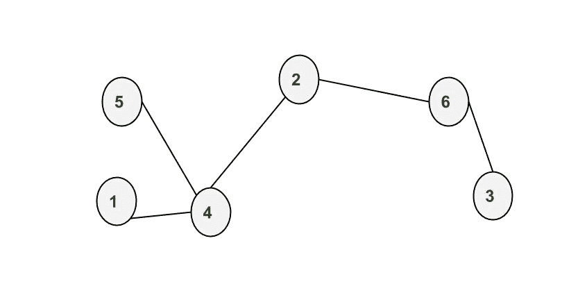

# 用不相交并方法计算非循环图中两个顶点之间的节点数

> 原文:[https://www . geesforgeks . org/number-nodes-two-顶点-无环-图-不相交-并集-method/](https://www.geeksforgeeks.org/number-nodes-two-vertices-acyclic-graph-disjoint-union-method/)

给定一个连通非循环图，一个源顶点和一个目的顶点，你的任务是通过**不相交并集方法计算给定源顶点和目的顶点之间的顶点数。**
**例:**

```
Input : 1 4
        4 5
        4 2
        2 6
        6 3
        1 3 
Output : 3
In the input 6 is the total number of vertices
labeled from 1 to 6 and the next 5 lines are the connection 
between vertices. Please see the figure for more
explanation. And in last line 1 is the source vertex
and 3 is the destination vertex. From the figure 
it is clear that there are 3 nodes(4, 2, 6) present
between 1 and 3\. 
```



为了使用不相交并方法，我们必须首先检查给定图的每个节点的父节点。我们可以使用 [BFS](https://www.geeksforgeeks.org/breadth-first-traversal-for-a-graph/) 遍历图，计算图中每个顶点的父顶点。例如，如果我们从顶点 1 开始遍历图(即我们的 BFS)，那么 1 是 4 的父项，那么 4 是 5 和 2 的父项，同样 2 是 6 的父项，6 是 3 的父项。
现在要计算源节点和目的节点之间的节点数，我们必须做一个循环，从目的节点的父节点开始，每次迭代后我们用当前节点的父节点更新这个节点，保持迭代次数的计数。当我们到达源顶点时，循环的执行将终止，计数变量给出源节点和目的节点连接路径中的节点数。
在上面的方法中，不相交的集合都是具有单个顶点的集合，我们使用了并集运算来合并两个集合，其中一个包含父节点，另一个包含子节点。
以下是上述方法的实现。

## C++

```
// C++ program to calculate number
// of nodes between two nodes
#include <bits/stdc++.h>
using namespace std;

// function to calculate no of nodes
// between two nodes
int totalNodes(vector<int> adjac[], int n,
                             int x, int y)
{
    // x is the source node and
    // y is destination node

    // visited array take account of
    // the nodes visited through the bfs
    bool visited[n+1] = {0};

    // parent array to store each nodes
    // parent value
    int p[n] ;

    queue<int> q;
    q.push(x);

    // take our first node(x) as first element
    // of queue and marked it as
    // visited through visited[] array
    visited[x] = true;

    int m;

    // normal bfs method starts
    while (!q.empty())
    {
        m = q.front() ;
        q.pop();
        for (int i=0; i<adjac[m].size(); ++i)
        {
            int h = adjac[m][i];
            if (!visited[h])
            {
                visited[h] = true;

                // when new node is encountered
                // we assign it's parent value
                // in parent array p
                p[h] = m ;
                q.push(h);
            }
        }
    }

    // count variable stores the result
    int count = 0;

    // loop start with parent of y
    // till we encountered x
    int i = p[y];
    while (i != x)
    {
        // count increases for counting
        // the nodes
        count++;

        i = p[i];
    }

    return count ;
}

// Driver program to test above function
int main()
{
    // adjacency list for graph
    vector < int > adjac[7];

    // creating graph, keeping length of
    // adjacency list as (1 + no of nodes)
    // as index ranges from (0 to n-1)
    adjac[1].push_back(4);
    adjac[4].push_back(1);
    adjac[5].push_back(4);
    adjac[4].push_back(5);
    adjac[4].push_back(2);
    adjac[2].push_back(4);
    adjac[2].push_back(6);
    adjac[6].push_back(2);
    adjac[6].push_back(3);
    adjac[3].push_back(6);

    cout << totalNodes(adjac, 7, 1, 3);

    return 0;
}
```

## Java 语言(一种计算机语言，尤用于创建网站)

```
// Java program to calculate number
// of nodes between two nodes
import java.util.Arrays;
import java.util.LinkedList;
import java.util.Queue;
import java.util.Vector;

public class GFG
{
    // function to calculate no of nodes
    // between two nodes
    static int totalNodes(Vector<Integer> adjac[],
                            int n, int x, int y)
    {
        // x is the source node and
        // y is destination node

        // visited array take account of
        // the nodes visited through the bfs
        Boolean visited[] = new Boolean[n + 1];

        //filling boolean value with false
        Arrays.fill(visited, false);

        // parent array to store each nodes
        // parent value
        int p[] = new int[n];

        Queue<Integer> q = new LinkedList<>();
        q.add(x);

        // take our first node(x) as first element
        // of queue and marked it as
        // visited through visited[] array
        visited[x] = true;

        int m;

        // normal bfs method starts
        while(!q.isEmpty())
        {
            m = q.peek();
            q.poll();
            for(int i=0; i < adjac[m].size() ; ++i)
            {

                int h = adjac[m].get(i);

                if(visited[h] != true )
                {
                    visited[h] = true;

                    // when new node is encountered
                    // we assign it's parent value
                    // in parent array p
                    p[h] = m;
                    q.add(h);
                }
            }
        }

        // count variable stores the result
        int count  = 0;

        // loop start with parent of y
        // till we encountered x
        int i = p[y];
        while(i != x)
        {
            // count increases for counting
            // the nodes
            count++;
            i = p[i];
        }
        return count;
    }

    // Driver program to test above function
    public static void main(String[] args)
    {
        // adjacency list for graph
        Vector<Integer> adjac[] = new Vector[7];

        //Initializing Vector for each nodes
        for (int i = 0; i < 7; i++)       
            adjac[i] = new Vector<>();       

        // creating graph, keeping length of
        // adjacency list as (1 + no of nodes)
        // as index ranges from (0 to n-1)
        adjac[1].add(4);
        adjac[4].add(1);
        adjac[5].add(4);
        adjac[4].add(5);
        adjac[4].add(2);
        adjac[2].add(4);
        adjac[2].add(6);
        adjac[6].add(2);
        adjac[6].add(3);
        adjac[3].add(6);

        System.out.println(totalNodes(adjac, 7, 1, 3));

    }
}
// This code is contributed by Sumit Ghosh
```

## 蟒蛇 3

```
# Python3 program to calculate number
# of nodes between two nodes
import queue

# function to calculate no of nodes
# between two nodes
def totalNodes(adjac, n, x, y):

    # x is the source node and
    # y is destination node

    # visited array take account of
    # the nodes visited through the bfs
    visited = [0] * (n + 1)

    # parent array to store each nodes
    # parent value
    p = [None] * n

    q = queue.Queue()
    q.put(x)

    # take our first node(x) as first
    # element of queue and marked it as
    # visited through visited[] array
    visited[x] = True

    m = None

    # normal bfs method starts
    while (not q.empty()):
        m = q.get()
        for i in range(len(adjac[m])):
            h = adjac[m][i]
            if (not visited[h]):
                visited[h] = True

                # when new node is encountered
                # we assign it's parent value
                # in parent array p
                p[h] = m
                q.put(h)

    # count variable stores the result
    count = 0

    # loop start with parent of y
    # till we encountered x
    i = p[y]
    while (i != x):

        # count increases for counting
        # the nodes
        count += 1

        i = p[i]

    return count

# Driver Code
if __name__ == '__main__':

    # adjacency list for graph
    adjac = [[] for i in range(7)]

    # creating graph, keeping length of
    # adjacency list as (1 + no of nodes)
    # as index ranges from (0 to n-1)
    adjac[1].append(4)
    adjac[4].append(1)
    adjac[5].append(4)
    adjac[4].append(5)
    adjac[4].append(2)
    adjac[2].append(4)
    adjac[2].append(6)
    adjac[6].append(2)
    adjac[6].append(3)
    adjac[3].append(6)

    print(totalNodes(adjac, 7, 1, 3))

# This code is contributed by PranchalK
```

## C#

```
// C# program to calculate number
// of nodes between two nodes
using System;
using System.Collections.Generic;

class GFG
{
    // function to calculate no of nodes
    // between two nodes
    static int totalNodes(List<int> []adjac,
                          int n, int x, int y)
    {
        // x is the source node and
        // y is destination node

        // visited array take account of
        // the nodes visited through the bfs
        Boolean []visited = new Boolean[n + 1];

        // parent array to store each nodes
        // parent value
        int []p = new int[n];

        Queue<int> q = new Queue<int>();
        q.Enqueue(x);

        // take our first node(x) as first element
        // of queue and marked it as
        // visited through visited[] array
        visited[x] = true;

        int m, i;

        // normal bfs method starts
        while(q.Count != 0)
        {
            m = q.Peek();
            q.Dequeue();
            for(i = 0; i < adjac[m].Count ; ++i)
            {
                int h = adjac[m][i];

                if(visited[h] != true )
                {
                    visited[h] = true;

                    // when new node is encountered
                    // we assign it's parent value
                    // in parent array p
                    p[h] = m;
                    q.Enqueue(h);
                }
            }
        }

        // count variable stores the result
        int count = 0;

        // loop start with parent of y
        // till we encountered x
        i = p[y];
        while(i != x)
        {
            // count increases for counting
            // the nodes
            count++;
            i = p[i];
        }
        return count;
    }

    // Driver Code
    public static void Main(String[] args)
    {
        // adjacency list for graph
        List<int> []adjac = new List<int>[7];

        //Initializing Vector for each nodes
        for (int i = 0; i < 7; i++)    
            adjac[i] = new List<int>();    

        // creating graph, keeping length of
        // adjacency list as (1 + no of nodes)
        // as index ranges from (0 to n-1)
        adjac[1].Add(4);
        adjac[4].Add(1);
        adjac[5].Add(4);
        adjac[4].Add(5);
        adjac[4].Add(2);
        adjac[2].Add(4);
        adjac[2].Add(6);
        adjac[6].Add(2);
        adjac[6].Add(3);
        adjac[3].Add(6);

        Console.WriteLine(totalNodes(adjac, 7, 1, 3));
    }
}

// This code is contributed by 29AjayKumar
```

## java 描述语言

```
<script>
// Javascript program to calculate number
// of nodes between two nodes

// function to calculate no of nodes
    // between two nodes
function totalNodes(adjac,n,x,y)
{
     // x is the source node and
        // y is destination node

        // visited array take account of
        // the nodes visited through the bfs
        let visited = new Array(n + 1);

        // filling boolean value with false
        for(let i=0;i<n+1;i++)
        {
            visited[i]=false;
        }

        // parent array to store each nodes
        // parent value
        let p = new Array(n);

        let q = [];
        q.push(x);

        // take our first node(x) as first element
        // of queue and marked it as
        // visited through visited[] array
        visited[x] = true;

        let m;

        // normal bfs method starts
        while(q.length!=0)
        {
            m = q[0];
            q.shift();
            for(let i=0; i < adjac[m].length ; ++i)
            {

                let h = adjac[m][i];

                if(visited[h] != true )
                {
                    visited[h] = true;

                    // when new node is encountered
                    // we assign it's parent value
                    // in parent array p
                    p[h] = m;
                    q.push(h);
                }
            }
        }

        // count variable stores the result
        let count  = 0;

        // loop start with parent of y
        // till we encountered x
        let i = p[y];
        while(i != x)
        {
            // count increases for counting
            // the nodes
            count++;
            i = p[i];
        }
        return count;
}

// Driver program to test above function
let adjac = new Array(7);

//Initializing Vector for each nodes
for (let i = 0; i < 7; i++)       
    adjac[i] = [];

// creating graph, keeping length of
// adjacency list as (1 + no of nodes)
// as index ranges from (0 to n-1)
adjac[1].push(4);
adjac[4].push(1);
adjac[5].push(4);
adjac[4].push(5);
adjac[4].push(2);
adjac[2].push(4);
adjac[2].push(6);
adjac[6].push(2);
adjac[6].push(3);
adjac[3].push(6);

document.write(totalNodes(adjac, 7, 1, 3));

// This code is contributed by rag2127
</script>
```

**输出:**

```
3
```

**时间复杂度** : O(n)，其中 n 为图中节点总数。
本文由 **Surya Priy** 供稿。如果你喜欢 GeeksforGeeks 并想投稿，你也可以使用[write.geeksforgeeks.org](https://write.geeksforgeeks.org)写一篇文章或者把你的文章邮寄到 review-team@geeksforgeeks.org。看到你的文章出现在极客博客主页上，帮助其他极客。
如果发现有不正确的地方，或者想分享更多关于上述话题的信息，请写评论。