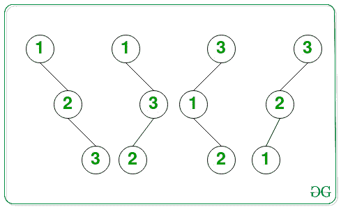

# 由 H+1 个节点组成的高度为 H 的二分搜索法树的数量

> 原文:[https://www . geeksforgeeks . org/number-of-binary-search-trees-of-high-h-composed-h1-nodes/](https://www.geeksforgeeks.org/number-of-binary-search-trees-of-height-h-consisting-of-h1-nodes/)

给定一个正整数 **H** ，任务是找到由第一个 **(H + 1)** [自然数](https://www.geeksforgeeks.org/natural-numbers/)组成的高度 **H** 的可能[二分搜索法树](https://www.geeksforgeeks.org/binary-search-tree-data-structure/)的数量作为节点值。由于计数可能很大，打印到 [**模 10 <sup>9</sup> + 7**](https://www.geeksforgeeks.org/modulo-1097-1000000007/) 。

**示例:**

> **输入:** H = 2
> **输出:** 4
> **解释:**由 3 个节点组成的高度 2 的所有可能的 BST 如下:
> 
> 
> 
> 因此，可能的 BST 总数是 4。
> 
> **输入:**H = 6
> T3】输出: 64

**方法:**给定的问题可以基于以下观察来解决:

*   只有 **(H + 1)** 节点是可以用来组成高度 **H** 的[二叉树](https://www.geeksforgeeks.org/binary-tree-data-structure/)。
*   除了根节点之外，每个节点都有两种可能，即要么是左子节点，要么是右子节点。
*   考虑 **T(H)** 为高度 **H** 的[T3BST](https://www.geeksforgeeks.org/binary-search-tree-set-1-search-and-insertion/)的数量，其中**T(0)= 1****T(H)= 2 * T(H–1)**。
*   求解上述[递推关系](https://www.geeksforgeeks.org/analysis-algorithm-set-4-master-method-solving-recurrences/)， **T(H)** 的值为 **2 <sup>H</sup>** 。

因此，从以上观察，打印 **2 <sup>H</sup>** 的值作为由第一个 **(H + 1)** [自然数](https://www.geeksforgeeks.org/natural-numbers/)组成的 **BST** s 高度 **H** 的总数。

下面是上述方法的实现:

## C++

```
// C++ program for the above approach

#include <bits/stdc++.h>
using namespace std;

const int mod = 1000000007;

// Function to calculate x^y
// modulo 1000000007 in O(log y)
int power(long long x, unsigned int y)
{
    // Stores the value of x^y
    int res = 1;

    // Update x if it exceeds mod
    x = x % mod;

    // If x is divisible by mod
    if (x == 0)
        return 0;

    while (y > 0) {

        // If y is odd, then
        // multiply x with result
        if (y & 1)
            res = (res * x) % mod;

        // Divide y by 2
        y = y >> 1;

        // Update the value of x
        x = (x * x) % mod;
    }

    // Return the value of x^y
    return res;
}

// Function to count the number of
// of BSTs of height H consisting
// of (H + 1) nodes
int CountBST(int H)
{

    return power(2, H);
}

// Driver Code
int main()
{
    int H = 2;
    cout << CountBST(H);

    return 0;
}
```

## Java 语言(一种计算机语言，尤用于创建网站)

```
// Java program for the above approach
class GFG{

static int mod = 1000000007;

// Function to calculate x^y
// modulo 1000000007 in O(log y)
static long power(long x, int y)
{

    // Stores the value of x^y
    long res = 1;

    // Update x if it exceeds mod
    x = x % mod;

    // If x is divisible by mod
    if (x == 0)
        return 0;

    while (y > 0)
    {

        // If y is odd, then
        // multiply x with result
        if ((y & 1) == 1)
            res = (res * x) % mod;

        // Divide y by 2
        y = y >> 1;

        // Update the value of x
        x = (x * x) % mod;
    }

    // Return the value of x^y
    return res;
}

// Function to count the number of
// of BSTs of height H consisting
// of (H + 1) nodes
static long CountBST(int H)
{
    return power(2, H);
}

// Driver code
public static void main(String[] args)
{
    int H = 2;

    System.out.print(CountBST(H));
}
}

// This code is contributed by abhinavjain194
```

## 蟒蛇 3

```
# Python3 program for the above approach

# Function to calculate x^y
# modulo 1000000007 in O(log y)
def power(x, y):

    mod = 1000000007

    # Stores the value of x^y
    res = 1

    # Update x if it exceeds mod
    x = x % mod

    # If x is divisible by mod
    if (x == 0):
        return 0

    while (y > 0):

        # If y is odd, then
        # multiply x with result
        if (y & 1):
            res = (res * x) % mod

        # Divide y by 2
        y = y >> 1

        # Update the value of x
        x = (x * x) % mod

    # Return the value of x^y
    return res

# Function to count the number of
# of BSTs of height H consisting
# of (H + 1) nodes
def CountBST(H):

    return power(2, H)

# Driver Code
H = 2

print(CountBST(H))

# This code is contributed by rohitsingh07052
```

## C#

```
// C# program for the above approach
using System;

class GFG{

static int mod = 1000000007;

// Function to calculate x^y
// modulo 1000000007 in O(log y)
static long power(long x, int y)
{

    // Stores the value of x^y
    long res = 1;

    // Update x if it exceeds mod
    x = x % mod;

    // If x is divisible by mod
    if (x == 0)
        return 0;

    while (y > 0)
    {

        // If y is odd, then
        // multiply x with result
        if ((y & 1) == 1)
            res = (res * x) % mod;

        // Divide y by 2
        y = y >> 1;

        // Update the value of x
        x = (x * x) % mod;
    }

    // Return the value of x^y
    return res;
}

// Function to count the number of
// of BSTs of height H consisting
// of (H + 1) nodes
static long CountBST(int H)
{

    return power(2, H);
}

// Driver code
static void Main()
{
    int H = 2;

    Console.Write(CountBST(H));
}
}

// This code is contributed by abhinavjain194
```

## java 描述语言

```
<script>
// Javascript program for the above approach

var mod = 1000000007;

// Function to calculate x^y
// modulo 1000000007 in O(log y)
function power(x, y)
{
    // Stores the value of x^y
    var res = 1;

    // Update x if it exceeds mod
    x = x % mod;

    // If x is divisible by mod
    if (x == 0)
        return 0;

    while (y > 0) {

        // If y is odd, then
        // multiply x with result
        if (y & 1)
            res = (res * x) % mod;

        // Divide y by 2
        y = y >> 1;

        // Update the value of x
        x = (x * x) % mod;
    }

    // Return the value of x^y
    return res;
}

// Function to count the number of
// of BSTs of height H consisting
// of (H + 1) nodes
function CountBST(H)
{

    return power(2, H);
}

// Driver Code
var H = 2;
document.write( CountBST(H));

</script>
```

**Output:** 

```
4
```

***时间复杂度:**O(log<sub>2</sub>H)*
***辅助空间:** O(1)*