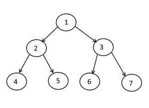
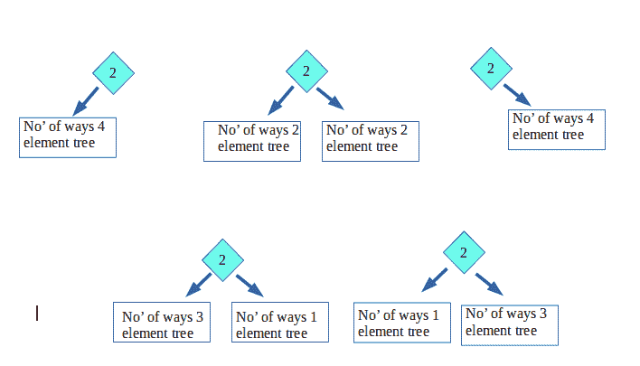

# 给定预序序列长度的二叉树数量

> 原文:[https://www . geesforgeks . org/给定预排序序列长度的二叉树数量/](https://www.geeksforgeeks.org/number-of-binary-trees-for-given-preorder-sequence-length/)

计算给定预排序序列长度 n 的二叉树的可能数量
**示例:**

```
Input : n = 1
Output : 1

Input : n = 2
Output : 2

Input : n = 3
Output : 5
```

**背景:**

在 [Preorder 遍历](https://www.geeksforgeeks.org/tree-traversals-inorder-preorder-and-postorder/)中，我们先处理根节点，然后遍历左子节点，再遍历右子节点。
例如，下树的前序遍历是 1 2 4 5 3 6 7



**寻找给定预序的树的数量:**

如果给定这样的遍历长度(假设 n)，二叉树的数目是可能的。
**我们举个例子**:给定预订单序列–>2 4 6 8 10(长度 5)。

*   假设只有一个节点(在这种情况下是 2 个)，那么只有一个二叉树是可能的
*   现在，假设有 2 个节点(即 2 和 4)，因此只有 2 棵二叉树是可能的:
*   现在，当有 3 个节点(即 2、4 和 6)时，那么可能的二叉树是 5
*   考虑 4 个节点(即 2、4、6 和 8)，因此可能的二叉树是 14。
    假设 BT(1)表示 1 个节点的二叉树数。(我们假设 BT(0)= 1)
    **BT(4)**= BT(0)* BT(3)+BT(1)* BT(2)+BT(2)* BT(1)+BT(3)* BT(0)
    T5】BT(4)= 1 * 5+1 * 2+2 * 1+5 * 1 = 14
*   同样，考虑所有 5 个节点(2、4、6、8 和 10)。二叉树的可能个数为:
    T1】BT(5)= BT(0)* BT(4)+BT(1)* BT(3)+BT(2)* BT(2)+BT(3)* BT(1)+BT(4)* BT(0)
    T4】BT(5)= 1 * 14+1 * 5+2 * 2+5 * 1+14 * 1 = 42



因此，长度为 5 的预排序序列的总二叉树为 42。
我们用[动态规划](https://www.geeksforgeeks.org/dynamic-programming/)来计算二叉树的可能个数。我们一次取一个节点，并使用之前计算的树来计算可能的树。

## C++

```
// C++ Program to count possible binary trees
// using dynamic programming
#include <bits/stdc++.h>
using namespace std;

int countTrees(int n)
{
    // Array to store number of Binary tree
    // for every count of nodes
    int BT[n + 1];
    memset(BT, 0, sizeof(BT));

    BT[0] = BT[1] = 1;

    // Start finding from 2 nodes, since
    // already know for 1 node.
    for (int i = 2; i <= n; ++i)
        for (int j = 0; j < i; j++)
            BT[i] += BT[j] * BT[i - j - 1];

    return BT[n];
}

// Driver code
int main()
{
    int n = 5;
    cout << "Total Possible Binary Trees are : "
        << countTrees(n) << endl;
    return 0;
}
```

## Java 语言(一种计算机语言，尤用于创建网站)

```
// Java Program to count
// possible binary trees
// using dynamic programming
import java.io.*;

class GFG
{
static int countTrees(int n)
{
    // Array to store number
    // of Binary tree for
    // every count of nodes
    int BT[] = new int[n + 1];
    for(int i = 0; i <= n; i++)
    BT[i] = 0;
    BT[0] = BT[1] = 1;

    // Start finding from 2
    // nodes, since already
    // know for 1 node.
    for (int i = 2; i <= n; ++i)
        for (int j = 0; j < i; j++)
            BT[i] += BT[j] *
                     BT[i - j - 1];

    return BT[n];
}

// Driver code
public static void main (String[] args)
{
int n = 5;
System.out.println("Total Possible " +
                "Binary Trees are : " +
                       countTrees(n));
}
}

// This code is contributed by anuj_67.
```

## 蟒蛇 3

```
# Python3 Program to count possible binary
# trees using dynamic programming

def countTrees(n) :

    # Array to store number of Binary
    # tree for every count of nodes
    BT = [0] * (n + 1)

    BT[0] = BT[1] = 1

    # Start finding from 2 nodes, since
    # already know for 1 node.
    for i in range(2, n + 1):
        for j in range(i):
            BT[i] += BT[j] * BT[i - j - 1]

    return BT[n]

# Driver Code
if __name__ == '__main__':

    n = 5
    print("Total Possible Binary Trees are : ",
                                 countTrees(n))

# This code is contributed by
# Shubham Singh(SHUBHAMSINGH10)
```

## C#

```
// C# Program to count
// possible binary trees
// using dynamic programming
using System;

class GFG
{
static int countTrees(int n)
{
    // Array to store number
    // of Binary tree for
    // every count of nodes
    int []BT = new int[n + 1];
    for(int i = 0; i <= n; i++)
        BT[i] = 0;
        BT[0] = BT[1] = 1;

    // Start finding from 2
    // nodes, since already
    // know for 1 node.
    for (int i = 2; i <= n; ++i)
        for (int j = 0; j < i; j++)
            BT[i] += BT[j] *
                     BT[i - j - 1];

    return BT[n];
}

// Driver code
static public void Main (String []args)
{
    int n = 5;
    Console.WriteLine("Total Possible " +
                      "Binary Trees are : " +
                             countTrees(n));
}
}

// This code is contributed
// by Arnab Kundu
```

## 服务器端编程语言（Professional Hypertext Preprocessor 的缩写）

```
<?php
// PHP Program to count possible binary
// trees using dynamic programming

function countTrees($n)
{
    // Array to store number of Binary
    // tree for every count of nodes
    $BT[$n + 1] = array();
    $BT = array_fill(0, $n + 1, NULL);
    $BT[0] = $BT[1] = 1;

    // Start finding from 2 nodes, since
    // already know for 1 node.
    for ($i = 2; $i <= $n; ++$i)
        for ($j = 0; $j < $i; $j++)
            $BT[$i] += $BT[$j] *
                       $BT[$i - $j - 1];

    return $BT[$n];
}

// Driver code
$n = 5;
echo "Total Possible Binary Trees are : ",
                    countTrees($n), "\n";

// This code is contributed by ajit.
?>
```

## java 描述语言

```
<script>
    // Javascript Program to count
    // possible binary trees
    // using dynamic programming

    function countTrees(n)
    {
        // Array to store number
        // of Binary tree for
        // every count of nodes
        let BT = new Array(n + 1);
        for(let i = 0; i <= n; i++)
            BT[i] = 0;
            BT[0] = BT[1] = 1;

        // Start finding from 2
        // nodes, since already
        // know for 1 node.
        for (let i = 2; i <= n; ++i)
            for (let j = 0; j < i; j++)
                BT[i] += BT[j] * BT[i - j - 1];

        return BT[n];
    }

    let n = 5;
    document.write("Total Possible " + "Binary Trees are : " + countTrees(n));

</script>
```

**输出:**

```
Total Possible Binary Trees are : 42
```

**替代:**
这个也可以用[加泰罗尼亚文号](https://www.geeksforgeeks.org/program-nth-catalan-number/) Cn = (2n)来完成！/(n+1)！*n！
对于 n = 0，1，2，3，…加泰罗尼亚数字的值为 1，1，2，5，14，42，132，429，1430，4862，…。二分搜索法树的数量也是如此。
本文由**舒巴姆拉纳**供稿。如果你喜欢 GeeksforGeeks 并想投稿，你也可以使用[write.geeksforgeeks.org](https://write.geeksforgeeks.org)写一篇文章或者把你的文章邮寄到 contribute@geeksforgeeks.org。看到你的文章出现在极客博客主页上，帮助其他极客。
如果发现有不正确的地方，或者想分享更多关于上述话题的信息，请写评论。