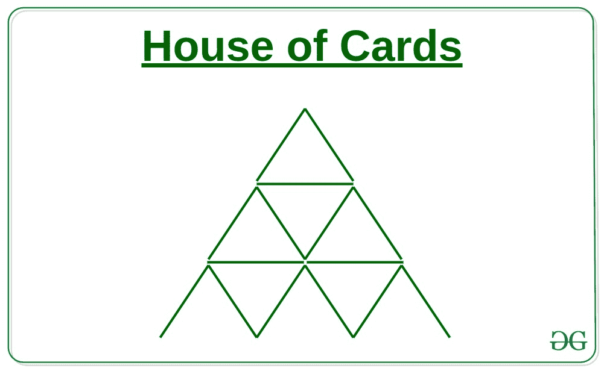

# 建造给定等级 N 的牌库所需的牌数

> 原文:[https://www . geeksforgeeks . org/所需卡数-建造特定级别的卡屋-n/](https://www.geeksforgeeks.org/number-of-cards-needed-build-a-house-of-cards-of-a-given-level-n/)

给定一个数字 **N** ，任务是找到制作 N 级卡牌屋所需的卡牌数量。



**例:**

> **输入:** N = 3
> **输出:** 15
> 从上图中可以明显看出，3 级的卡屋需要 15 张牌
> **输入:** N = 2
> **输出:** 7

**进场:**

1.  如果我们仔细观察，就会形成如下所示的系列，其中第 I 项表示制作 **i** 级金字塔所需的三角牌数量:

> 2、7、15、26、40、57、77、100、126、155……等等。

2.  上面的级数是差分级数的一种方法，其中差分在 AP 中表示为 5，8，11，14……。等等。

3.  因此，该系列的第 n 项将是:

```
nth term = 2 + {5 + 8 + 11 +14 +.....(n-1) terms}
         = 2 + (n-1)*(2*5+(n-1-1)*3)/2
         = 2 + (n-1)*(10+(n-2)*3)/2
         = 2 + (n-1)*(10+3n-6)/2
         = 2 + (n-1)*(3n+4)/2
         = n*(3*n+1)/2;
```

2.  因此建造一个 N 级卡牌屋所需的卡牌数量为:

以下是上述方法的实现:

## 卡片打印处理机（Card Print Processor 的缩写）

```
// C++ implementation of the above approach

#include <bits/stdc++.h>
using namespace std;

// Function to find number of cards needed
int noOfCards(int n)
{
    return n * (3 * n + 1) / 2;
}

// Driver Code
int main()
{
    int n = 3;
    cout << noOfCards(n) << ", ";
    return 0;
}
```

## Java 语言(一种计算机语言，尤用于创建网站)

```
// Java implementation of the above approach
import java.lang.*;

class GFG
{
    // Function to find number of cards needed
    public static int noOfCards(int n)
    {
        return n * (3 * n + 1) / 2;
    }

    // Driver Code
    public static void main(String args[])
    {
        int n = 3;
        System.out.print(noOfCards(n));
    }
}

// This code is contributed by shubhamsingh10
```

## 蟒蛇 3

```
# Python3 implementation of the above approach

# Function to find number of cards needed
def noOfCards(n):
    return n * (3 * n + 1) // 2

# Driver Code
n = 3
print(noOfCards(n))

# This code is contributed by mohit kumar 29
```

## C#

```
// C# implementation of the above approach
using System;

class GFG
{
    // Function to find number of cards needed
    public static int noOfCards(int n)
    {
        return n * (3 * n + 1) / 2;
    }

    // Driver Code
    public static void Main(String []args)
    {
        int n = 3;
        Console.Write(noOfCards(n));
    }
}

// This code is contributed by 29AjayKumar
```

## java 描述语言

```
<script>

// Javascript implementation of the above approach

// Function to find number of cards needed
function noOfCards(n)
{
    return parseInt(n * (3 * n + 1) / 2);
}

// Driver Code
var n = 3;
document.write(noOfCards(n));

</script>
```

**Output:** 

```
15
```

**时间复杂度:** O(1)

**辅助空间:** O(1)