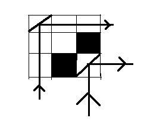

# 矩阵中满足给定条件的细胞数量

> 原文:[https://www . geeksforgeeks . org/矩阵中满足给定条件的单元数/](https://www.geeksforgeeks.org/number-of-cells-in-a-matrix-that-satisfy-the-given-condition/)

给定一个由空单元(用‘1’表示)和障碍物(用‘0’表示)组成的 **N * N** 网格，任务是找到可以放置镜子的空单元的数量，以便从南侧查看网格的东侧视图。
**例:**

> **输入:** mat[][] = {
> {1，1，1}，
> {1，1，0}，
> {1，0，1}}
> **输出:** 2
> 
> 
> 
> 在清楚地观察上面的图像时，可以看到镜子只能放置在单元(0，0)和单元(2，2)中。如果选择了任何其他细胞，那么光的路径就会被障碍物阻挡。
> **输入:** mat[][] = {
> {0，1，1}，
> {0，1，1}，
> {0，1，1}}
> **输出:** 6

**天真的做法:**提到镜像只有在它的右边和下面的单元格都是空的情况下，才能放在空单元格中。最简单的方法是单独检查每个单元格是否满足条件。这种方式需要 **O(n <sup>3</sup> )** 时间。
**高效方法:**创建两个布尔数组**行[][]** 和**列[][]** ，其中**行[i][j]** 将存储如果 **i <sup>第</sup>T18】行在 **j <sup>第</sup>** 列(包括它)之后的所有单元格都是 **1** 否则它将存储 false 和**列[i 现在，对于每个单元格**mat【I】【j】**如果**行【I】【j】**和**列【I】【j】**都为真，则当前单元格有效，否则无效。计算所有这样的有效单元格，并在最后打印计数。
以下是上述方法的实施:**** 

## C++

```
// C++ implementation of the approach
#include <bits/stdc++.h>
using namespace std;

const int N = 3;

// Function to return the number of cells
// in which mirror can be placed
int numberOfCells(int mat[][N])
{

    bool row[N][N] = { { false } };
    bool col[N][N] = { { false } };

    // Update the row array where row[i][j]
    // will store whether the current row i
    // contains all 1s in the columns
    // starting from j
    for (int i = 0; i < N; i++) {
        for (int j = N - 1; j >= 0; j--) {
            if (mat[i][j] == 1) {
                row[i][j] = (j + 1 < N)
                                ? row[i][j + 1]
                                : true;
            }
            else {
                row[i][j] = false;
            }
        }
    }

    // Update the column array where col[i][j]
    // will store whether the current column j
    // contains all 1s in the rows starting from i
    for (int j = 0; j < N; j++) {
        for (int i = N - 1; i >= 0; i--) {
            if (mat[i][j] == 1) {
                col[i][j] = (i + 1 < N)
                                ? col[i + 1][j]
                                : true;
            }
            else {
                col[i][j] = false;
            }
        }
    }

    // To store the required result
    int cnt = 0;

    // For every cell except the last
    // row and the last column
    for (int i = 0; i < N - 1; i++) {
        for (int j = 0; j < N - 1; j++) {

            // If the current cell is not blocked
            // and the light can travel from the
            // next row and the next column
            // then the current cell is valid
            if (row[i][j]
                && col[i][j]) {
                cnt++;
            }
        }
    }

    // For the last column
    for (int i = 0; i < N; i++) {
        if (col[i][N - 1])
            cnt++;
    }

    // For the last row, note that the last column
    // is not taken into consideration as the bottom
    // right element has already been considered
    // in the last column previously
    for (int j = 0; j < N - 1; j++) {
        if (row[N - 1][j])
            cnt++;
    }

    return cnt;
}

// Driver code
int main()
{
    int mat[][N] = { { 0, 1, 1 },
                     { 0, 1, 1 },
                     { 0, 1, 1 } };

    cout << numberOfCells(mat);

    return 0;
}
```

## Java 语言(一种计算机语言，尤用于创建网站)

```
// Java implementation of the approach
import java.util.*;

class GFG
{
static int N = 3;

// Function to return the number of cells
// in which mirror can be placed
static int numberOfCells(int mat[][])
{
    boolean [][]row = new boolean[N][N];
    boolean [][]col = new boolean[N][N];

    // Update the row array where row[i][j]
    // will store whether the current row i
    // contains all 1s in the columns
    // starting from j
    for (int i = 0; i < N; i++)
    {
        for (int j = N - 1; j >= 0; j--)
        {
            if (mat[i][j] == 1)
            {
                row[i][j] = (j + 1 < N) ? row[i][j + 1]
                                        : true;
            }
            else
            {
                row[i][j] = false;
            }
        }
    }

    // Update the column array where col[i][j]
    // will store whether the current column j
    // contains all 1s in the rows starting from i
    for (int j = 0; j < N; j++)
    {
        for (int i = N - 1; i >= 0; i--)
        {
            if (mat[i][j] == 1)
            {
                col[i][j] = (i + 1 < N) ? col[i + 1][j]
                                        : true;
            }
            else
            {
                col[i][j] = false;
            }
        }
    }

    // To store the required result
    int cnt = 0;

    // For every cell except the last
    // row and the last column
    for (int i = 0; i < N - 1; i++)
    {
        for (int j = 0; j < N - 1; j++)
        {

            // If the current cell is not blocked
            // and the light can travel from the
            // next row and the next column
            // then the current cell is valid
            if (row[i][j] && col[i][j])
            {
                cnt++;
            }
        }
    }

    // For the last column
    for (int i = 0; i < N; i++)
    {
        if (col[i][N - 1])
            cnt++;
    }

    // For the last row, note that the last column
    // is not taken into consideration as the bottom
    // right element has already been considered
    // in the last column previously
    for (int j = 0; j < N - 1; j++)
    {
        if (row[N - 1][j])
            cnt++;
    }
    return cnt;
}

// Driver code
public static void main(String[] args)
{
    int mat[][] = { { 0, 1, 1 },
                    { 0, 1, 1 },
                    { 0, 1, 1 } };

    System.out.print(numberOfCells(mat));
}
}

// This code is contributed by 29AjayKumar
```

## 蟒蛇 3

```
# Python3 implementation of the approach
N = 3

# Function to return the number of cells
# in which mirror can be placed
def numberOfCells(mat):

    row = [[ False for i in range(N)]
                   for i in range(N)]
    col = [[ False for i in range(N)]
                   for i in range(N)]

    # Update the row array where row[i][j]
    # will store whether the current row i
    # contains all 1s in the columns
    # starting from j
    for i in range(N):
        for j in range(N - 1, -1, -1):
            if (mat[i][j] == 1):
                if j + 1 < N:
                    row[i][j] = row[i][j + 1]
                else:
                    row[i][j] = True

            else :
                row[i][j] = False

    # Update the column array where col[i][j]
    # will store whether the current column j
    # contains all 1s in the rows starting from i
    for j in range(N):
        for i in range(N - 1, -1, -1):
            if (mat[i][j] == 1):
                if i + 1 < N:
                    col[i][j] = col[i + 1][j]
                else:
                    col[i][j] = True

            else:
                col[i][j] = False

    # To store the required result
    cnt = 0

    # For every cell except the last
    # row and the last column
    for i in range(N - 1):
        for j in range(N - 1):

            # If the current cell is not blocked
            # and the light can travel from the
            # next row and the next column
            # then the current cell is valid
            if (row[i][j] and col[i][j]):
                cnt += 1

    # For the last column
    for i in range(N):
        if (col[i][N - 1]):
            cnt += 1

    # For the last row, note that the last column
    # is not taken into consideration as the bottom
    # right element has already been considered
    # in the last column previously
    for j in range(N - 1):
        if (row[N - 1][j]):
            cnt += 1

    return cnt

# Driver code
mat = [[0, 1, 1],
       [0, 1, 1],
       [0, 1, 1]]

print(numberOfCells(mat))

# This code is contributed by Mohit Kumar
```

## C#

```
// C# implementation of the approach
using System;

class GFG
{
static int N = 3;

// Function to return the number of cells
// in which mirror can be placed
static int numberOfCells(int [,]mat)
{
    bool [,]row = new bool[N, N];
    bool [,]col = new bool[N, N];

    // Update the row array where row[i,j]
    // will store whether the current row i
    // contains all 1s in the columns
    // starting from j
    for (int i = 0; i < N; i++)
    {
        for (int j = N - 1; j >= 0; j--)
        {
            if (mat[i, j] == 1)
            {
                row[i, j] = (j + 1 < N) ? row[i, j + 1]
                                        : true;
            }
            else
            {
                row[i, j] = false;
            }
        }
    }

    // Update the column array where col[i,j]
    // will store whether the current column j
    // contains all 1s in the rows starting from i
    for (int j = 0; j < N; j++)
    {
        for (int i = N - 1; i >= 0; i--)
        {
            if (mat[i, j] == 1)
            {
                col[i, j] = (i + 1 < N) ? col[i + 1, j]
                                        : true;
            }
            else
            {
                col[i, j] = false;
            }
        }
    }

    // To store the required result
    int cnt = 0;

    // For every cell except the last
    // row and the last column
    for (int i = 0; i < N - 1; i++)
    {
        for (int j = 0; j < N - 1; j++)
        {

            // If the current cell is not blocked
            // and the light can travel from the
            // next row and the next column
            // then the current cell is valid
            if (row[i, j] && col[i, j])
            {
                cnt++;
            }
        }
    }

    // For the last column
    for (int i = 0; i < N; i++)
    {
        if (col[i, N - 1])
            cnt++;
    }

    // For the last row, note that the last column
    // is not taken into consideration as the bottom
    // right element has already been considered
    // in the last column previously
    for (int j = 0; j < N - 1; j++)
    {
        if (row[N - 1, j])
            cnt++;
    }
    return cnt;
}

// Driver code
public static void Main(String[] args)
{
    int [,]mat = {{ 0, 1, 1 },
                  { 0, 1, 1 },
                  { 0, 1, 1 }};

    Console.Write(numberOfCells(mat));
}
}

// This code is contributed by 29AjayKumar
```

## java 描述语言

```
<script>
// Javascript implementation of the approach

let N = 3;
// Function to return the number of cells
// in which mirror can be placed
function numberOfCells(mat)
{
    let row = new Array(N);
    let col = new Array(N);

    for(let i=0;i<N;i++)
    {
        row[i]=new Array(N);
        col[i]=new Array(N);
        for(let j=0;j<N;j++)
        {
            row[i][j]=0;
            col[i][j]=0;
        }
    }

    // Update the row array where row[i][j]
    // will store whether the current row i
    // contains all 1s in the columns
    // starting from j
    for (let i = 0; i < N; i++)
    {
        for (let j = N - 1; j >= 0; j--)
        {
            if (mat[i][j] == 1)
            {
                row[i][j] = (j + 1 < N) ? row[i][j + 1]
                                        : true;
            }
            else
            {
                row[i][j] = false;
            }
        }
    }

    // Update the column array where col[i][j]
    // will store whether the current column j
    // contains all 1s in the rows starting from i
    for (let j = 0; j < N; j++)
    {
        for (let i = N - 1; i >= 0; i--)
        {
            if (mat[i][j] == 1)
            {
                col[i][j] = (i + 1 < N) ? col[i + 1][j]
                                        : true;
            }
            else
            {
                col[i][j] = false;
            }
        }
    }

    // To store the required result
    let cnt = 0;

    // For every cell except the last
    // row and the last column
    for (let i = 0; i < N - 1; i++)
    {
        for (let j = 0; j < N - 1; j++)
        {

            // If the current cell is not blocked
            // and the light can travel from the
            // next row and the next column
            // then the current cell is valid
            if (row[i][j] && col[i][j])
            {
                cnt++;
            }
        }
    }

    // For the last column
    for (let i = 0; i < N; i++)
    {
        if (col[i][N - 1])
            cnt++;
    }

    // For the last row, note that the last column
    // is not taken into consideration as the bottom
    // right element has already been considered
    // in the last column previously
    for (let j = 0; j < N - 1; j++)
    {
        if (row[N - 1][j])
            cnt++;
    }
    return cnt;
}

// Driver code
let mat = [[0, 1, 1 ],
                    [ 0, 1, 1 ],
                    [ 0, 1, 1 ]];

document.write(numberOfCells(mat));

// This code is contributed by patel2127
</script>
```

**Output:** 

```
6
```

**时间复杂度:** O(n <sup>2</sup> )