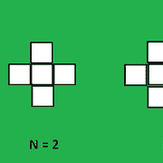

# 第 n 个顺序图中的单元数量

> 原文:[https://www . geesforgeks . org/第 n 阶细胞数-图/](https://www.geeksforgeeks.org/number-of-cells-in-the-nth-order-figure/)

给定一个整数 **N** ，任务是找到给定类型的 **N <sup>第</sup>T5】阶图中的单元格数:** 



**例:**

> **输入:** N = 2
> **输出:** 5
> **输入:** N = 3
> **输出:** 13

**方法:**可以观察到，对于 **N = 1、2、3、…** 的值，一个系列将形成为 **1、5、13、25、41、61、85、113、145、181、…** ，其 **N <sup>th</sup>** 项将为**N<sup>2</sup>+(N–1)<sup>2</sup>**
以下是上述方法的实施:

## C++

```
// C++ implementation of the approach
#include <bits/stdc++.h>
using namespace std;

// Function to return the number
// of cells in the nth order
// figure of the given type
int cntCells(int n)
{
    int cells = pow(n, 2) + pow(n - 1, 2);
    return cells;
}

// Driver code
int main()
{
    int n = 3;

    cout << cntCells(n);

    return 0;
}
```

## Java 语言(一种计算机语言，尤用于创建网站)

```
// Java implementation of the approach
class GFG
{

// Function to return the number
// of cells in the nth order
// figure of the given type
static int cntCells(int n)
{
    int cells = (int)Math.pow(n, 2) +
                (int)Math.pow(n - 1, 2);
    return cells;
}

// Driver code
public static void main(String[] args)
{
    int n = 3;

    System.out.println(cntCells(n));
}
}

// This code is contributed by Code_Mech
```

## 蟒蛇 3

```
# Python3 implementation of the approach

# Function to return the number
# of cells in the nth order
# figure of the given type
def cntCells(n) :

    cells = pow(n, 2) + pow(n - 1, 2);

    return cells;

# Driver code
if __name__ == "__main__" :

    n = 3;

    print(cntCells(n));

# This code is contributed by AnkitRai01
```

## C#

```
// C# implementation of the approach
using System;

class GFG
{

// Function to return the number
// of cells in the nth order
// figure of the given type
static int cntCells(int n)
{
    int cells = (int)Math.Pow(n, 2) +
                (int)Math.Pow(n - 1, 2);
    return cells;
}

// Driver code
public static void Main(String[] args)
{
    int n = 3;

    Console.WriteLine(cntCells(n));
}
}

// This code is contributed by 29AjayKumar
```

## java 描述语言

```
<script>

// Javascript implementation of the approach

// Function to return the number
// of cells in the nth order
// figure of the given type
function cntCells(n)
{
    var cells = Math.pow(n, 2) + Math.pow(n - 1, 2);
    return cells;
}

// Driver code
var n = 3;
document.write(cntCells(n));

</script>
```

**Output:** 

```
13
```