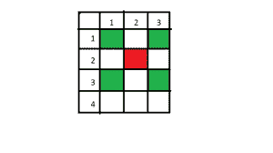

# 矩阵中通过(x，y)的左右对角线上的单元数

> 原文:[https://www . geeksforgeeks . org/左右对角线中的单元数-矩阵中通过-x-y/](https://www.geeksforgeeks.org/number-of-cells-in-the-right-and-left-diagonals-passing-through-x-y-in-a-matrix/)

给定四个整数 *row、col、x 和 y* ，其中 *row 和 col* 是二维矩阵的行数和列数， *x 和 y* 是同一矩阵中一个单元格的坐标，任务是找出与矩阵的单元格(x，y)相关联的左对角线和右对角线中的单元格数。
**举例:**

> **输入:**行= 4，列= 3，x = 2，y = 2
> T3】输出: 3 3
> 
> 
> 
> (2，2)的左对角线和右对角线上的单元格数分别为 3 和 3。
> **输入:**行= 4，列= 5，x = 2，y = 2
> **输出:** 4 3

**进场:**

*   分别计算单元格(x，y)左对角线左上角和右下角的单元格数。然后将它们相加，得到左对角线上的单元格数。
*   同样，分别计算单元格(x，y)右对角线的右上角和左下角的单元格数。

以下是上述方法的实现:

## C++

```
// C++ implementation of the approach
#include<bits/stdc++.h>
using namespace std;

    // Function to return the number of cells
    // in the left and the right diagonal of
    // the matrix for a cell (x, y)
    void count_left_right(int n, int m, int x, int y)
    {
        int left = 0, right = 0;

        // number of cells in the left diagonal
        int left_upper_part = min(x-1, y-1);
        int left_lower_part = min(n-x, m-y);
        left = left_upper_part + left_lower_part + 1;

        // number of cells in the right diagonal
        int right_upper_part = min(m-y, x-1);
        int right_lower_part = min(y-1, n-x);
        right = right_upper_part + right_lower_part + 1;

        cout<<(left)<<" "<<(right);
    }

    // Driver code
    int main()
    {
        int row = 4;
        int col = 3;
        int x = 2;
        int y = 2;

        count_left_right(row, col, x, y);
    }
// This code is contributed by
// Sanjit_Prasad
```

## Java 语言(一种计算机语言，尤用于创建网站)

```
// Java implementation of the approach

class GFG {

    // Function to return the number of cells
    // in the left and the right diagonal of
    // the matrix for a cell (x, y)
    static void count_left_right(int n, int m
                                    , int x, int y)
    {
        int left = 0, right = 0;

        // number of cells in the left diagonal
        int left_upper_part = Math.min(x - 1, y - 1);
        int left_lower_part = Math.min(n - x, m - y);
        left = left_upper_part + left_lower_part + 1;

        // number of cells in the right diagonal
        int right_upper_part = Math.min(m - y, x - 1);
        int right_lower_part = Math.min(y - 1, n - x);
        right = right_upper_part + right_lower_part + 1;

        System.out.println(left + " " + right);
    }

    // Driver code
    public static void main(String[] args)
    {
        int row = 4;
        int col = 3;
        int x = 2;
        int y = 2;

        count_left_right(row, col, x, y);
    }
}
```

## 蟒蛇 3

```
# Python 3 implementation of the approach

# Function to return the number of cells
# in the left and the right diagonal of
# the matrix for a cell (x, y)
def count_left_right(n, m, x, y):

    left = 0
    right = 0

    # number of cells in the left diagonal
    left_upper_part = min(x - 1, y - 1)
    left_lower_part = min(n - x, m - y)
    left = left_upper_part + left_lower_part + 1

    # number of cells in the right diagonal
    right_upper_part = min(m - y, x - 1)
    right_lower_part = min(y - 1, n - x)
    right = right_upper_part + right_lower_part + 1

    print(left, right)

# Driver code
if __name__ == "__main__":

    row = 4
    col = 3
    x = 2
    y = 2

    count_left_right(row, col, x, y)

# This code is contributed by ChitraNayal
```

## C#

```
// C# implementation of the above approach

using System;

class Program
{
    // Function to return the number of cells
    // in the left and the right diagonal of
    // the matrix for a cell (x, y)
    static void count_left_right(int n, int m
                            , int x, int y)
    {
        int left = 0, right = 0;

        // number of cells in the left diagonal
        int left_upper_part = Math.Min(x - 1, y - 1);
        int left_lower_part = Math.Min(n - x, m - y);
        left = left_upper_part + left_lower_part + 1;

        // number of cells in the right diagonal
        int right_upper_part = Math.Min(m - y, x - 1);
        int right_lower_part = Math.Min(y - 1, n - x);
        right = right_upper_part + right_lower_part + 1;
        Console.WriteLine(left + " " + right);
    }

    //Driver code
    static void Main()
    {
        int row = 4;
        int col = 3;
        int x = 2;
        int y = 2;
        count_left_right(row, col, x, y);

    }
// This code is contributed by ANKITRAI1
}
```

## 服务器端编程语言（Professional Hypertext Preprocessor 的缩写）

```
<?php
// PHP implementation of the approach

// Function to return the number of cells
// in the left and the right diagonal of
// the matrix for a cell (x, y)
function count_left_right($n, $m, $x, $y)
{
    $left = 0;
    $right = 0;

    // number of cells in the left diagonal
    $left_upper_part = min($x - 1, $y - 1);
    $left_lower_part = min($n - $x, $m - $y);
    $left = $left_upper_part +
            $left_lower_part + 1;

    // number of cells in the right diagonal
    $right_upper_part = min($m - $y, $x - 1);
    $right_lower_part = min($y - 1, $n - $x);
    $right = $right_upper_part +
             $right_lower_part + 1;

    echo $left, " " , $right;
}

// Driver code
$row = 4;
$col = 3;
$x = 2;
$y = 2;

count_left_right($row, $col, $x, $y);

// This code is contributed by jit_t
?>
```

## java 描述语言

```
<script>

// Javascript implementation of the approach

    // Function to return the number of cells
    // in the left and the right diagonal of
    // the matrix for a cell (x, y)
    function count_left_right(n, m, x, y)
    {
        let left = 0, right = 0;

        // number of cells in the left diagonal
        let left_upper_part = Math.min(x-1, y-1);
        let left_lower_part = Math.min(n-x, m-y);
        left = left_upper_part + left_lower_part + 1;

        // number of cells in the right diagonal
        let right_upper_part = Math.min(m-y, x-1);
        let right_lower_part = Math.min(y-1, n-x);
        right = right_upper_part + right_lower_part + 1;

        document.write((left) + " " + (right));
    }

    // Driver code
        let row = 4;
        let col = 3;
        let x = 2;
        let y = 2;

        count_left_right(row, col, x, y);

// This code is contributed by souravmahato348.
</script>
```

**Output:** 

```
3 3
```