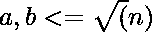
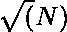

# 从 1 到 N 且乘积等于 N 的同素对的数量

> 原文:[https://www . geesforgeks . org/co-prime-pairs-number-from-1-n-with-product-equal-n/](https://www.geeksforgeeks.org/number-of-co-prime-pairs-from-1-to-n-with-product-equals-to-n/)

给定一个数 N .任务是找出从 1 到 N 的共素对(A，b)的个数，使它们的乘积(a*b)等于 N.
**注**:如果 [gcd(a，b)](https://www.geeksforgeeks.org/basic-and-extended-euclidean-algorithms/) = 1，则称一对(A，b)为共素。
**例:**

```
Input: N = 120
Output: No. of co-prime pairs = 3
(3, 40)
(5, 24)
(8, 15) 

Input: N= 250
Output: No. of co-prime pairs = 3
(2, 125) 
```

**方法:**给定对中的元素应该彼此同素。设一个同素对为 **(a，b)** ，
给定， **a * b = N** 。
因此，

所以思路是运行一个从 1 到的循环，检查 I 和(N/i)是否互质，i*(N/i) = N，如果是，那么统计这样的对。
以下是上述方法的实施:

## C++

```
// C++ program to count number of Co-prime pairs
// from 1 to N with product equals to N
#include <bits/stdc++.h>
using namespace std;

// Function to count number of Co-prime pairs
// from 1 to N with product equals to N
void countCoprimePairs(int n)
{
    int count = 0;

    cout << "The co- prime pairs are: " << endl;

    // find all the co- prime pairs
    // Traverse from 2 to sqrt(N) and check
    // if i, N/i are coprimes
    for (int i = 2; i <= sqrt(n); i++) {

        // check if N is divisible by i,
        // so that the other term in pair i.e. N/i
        // is integral
        if (n % i == 0) {

            // Check if i and N/i are coprime
            if (__gcd(i, (n / i)) == 1) {

                // Display the co- prime pairs
                cout << "(" << i << ", " << (n / i) << ")\n";
                count++;
            }
        }
    }

    cout << "\nNumber of coprime pairs : " << count;
}

// Driver code
int main()
{
    int N = 120;

    countCoprimePairs(N);

    return 0;
}
```

## Java 语言(一种计算机语言，尤用于创建网站)

```
// Java program to count number of Co-prime pairs
// from 1 to N with product equals to N
import java.io.*;

public class GFG {
  // Recursive function to return gcd of a and b
    static int __gcd(int a, int b)
    {
        // Everything divides 0 
        if (a == 0)
          return b;
        if (b == 0)
          return a;

        // base case
        if (a == b)
            return a;

        // a is greater
        if (a > b)
            return __gcd(a-b, b);
        return __gcd(a, b-a);
    }

// Function to count number of Co-prime pairs
// from 1 to N with product equals to N
static void countCoprimePairs(int n)
{
    int count = 0;

    System.out.println( "The co- prime pairs are: ");

    // find all the co- prime pairs
    // Traverse from 2 to sqrt(N) and check
    // if i, N/i are coprimes
    for (int i = 2; i <= Math.sqrt(n); i++) {

        // check if N is divisible by i,
        // so that the other term in pair i.e. N/i
        // is integral
        if (n % i == 0) {

            // Check if i and N/i are coprime
            if (__gcd(i, (n / i)) == 1) {

                // Display the co- prime pairs
                System.out.print( "(" +i + ", " + (n / i) + ")\n");
                count++;
            }
        }
    }

    System.out.println("\nNumber of coprime pairs : " + count);
}

// Driver code
    public static void main (String[] args) {
            int N = 120;

    countCoprimePairs(N);
    }
}

// This code is contributed by shs..
```

## 蟒蛇 3

```
# Python program to count number
# of Co-prime pairs from 1 to N
# with product equals to N

# import everything from math lib
from math import *

# Function to count number of
# Co-prime pairs from 1 to N
# with product equals to N
def countCoprimePairs(n) :

    count = 0

    print("The co-prime pairs are: ")

    # find all the co- prime pairs
    # Traverse from 2 to sqrt(N) and
    # check if i, N//i are coprimes
    for i in range(2, int(sqrt(n)) + 1) :

        # check if N is divisible by i,
        # so that the other term in pair
        # i.e. N/i is integral
        if n % i == 0 :

            # Check if i and N/i are coprime
            if gcd(i, n // i) == 1 :

                # Display the co- prime pairs
                print("(", i,",", (n // i),")")
                count += 1

    print("Number of coprime pairs : ", count)

# Driver code    
if __name__ == "__main__" :

    N = 120

    countCoprimePairs(N)

# This code is contributed by ANKITRAI1
```

## C#

```
// C# program to count number
// of Co-prime pairs from 1 to N
// with product equals to N
using System;

class GFG
{
// Recursive function to
// return gcd of a and b
static int __gcd(int a, int b)
{
    // Everything divides 0
    if (a == 0)
    return b;
    if (b == 0)
    return a;

    // base case
    if (a == b)
        return a;

    // a is greater
    if (a > b)
        return __gcd(a - b, b);
    return __gcd(a, b - a);
}

// Function to count number of
// Co-prime pairs from 1 to N
// with product equals to N
static void countCoprimePairs(int n)
{
int count = 0;

Console.WriteLine("The co- prime pairs are: ");

// find all the co- prime pairs
// Traverse from 2 to sqrt(N) and
// check if i, N/i are coprimes
for (int i = 2; i <= Math.Sqrt(n); i++)
{

    // check if N is divisible by i,
    // so that the other term in pair
    // i.e. N/i is integral
    if (n % i == 0)
    {

        // Check if i and N/i are coprime
        if (__gcd(i, (n / i)) == 1)
        {

            // Display the co- prime pairs
            Console.WriteLine( "(" + i + ", " +
                              (n / i) + ")\n");
            count++;
        }
    }
}

Console.WriteLine("\nNumber of coprime" +
                    " pairs : " + count);
}

// Driver code
public static void Main ()
{
    int N = 120;

    countCoprimePairs(N);
}
}

// This code is contributed by Shashank
```

## 服务器端编程语言（Professional Hypertext Preprocessor 的缩写）

```
<?php
// PHP program to count number of
// Co-prime pairs from 1 to N with
// product equals to N

// Function to count number of
// Co-prime pairs from 1 to N
// with product equals to N
function gcd($a,$b)
{
    return $b ? gcd($b, $a % $b) : $a;
}

function countCoprimePairs($n)
{
    $count = 0;

    echo "The co-prime pairs are: " ."\n";

    // find all the co- prime pairs
    // Traverse from 2 to sqrt(N) and
    // check if i, N/i are coprimes
    for ($i = 2; $i <= sqrt($n); $i++)
    {

        // check if N is divisible by i,
        // so that the other term in pair
        // i.e. N/i is integral
        if ($n % $i == 0)
        {

            // Check if i and N/i are coprime
            if (gcd($i, ($n / $i)) == 1)
            {

                // Display the co- prime pairs
                echo "(" .$i . ", " . ($n / $i) .")\n";
                $count++;
            }
        }
    }

    echo "\nNumber of coprime pairs : " . $count;
}

// Driver code
$N = 120;

countCoprimePairs($N);

// This code is contributed
// by ChitraNayal
?>
```

## java 描述语言

```
<script>

// Javascript program to count number of Co-prime pairs
// from 1 to N with product equals to N

// Recursive function to
// return gcd of a and b
function __gcd(a, b)
{
    // Everything divides 0
    if (a == 0)
    return b;
    if (b == 0)
    return a;

    // base case
    if (a == b)
        return a;

    // a is greater
    if (a > b)
        return __gcd(a - b, b);
    return __gcd(a, b - a);
}

// Function to count number of Co-prime pairs
// from 1 to N with product equals to N
function countCoprimePairs(n)
{
    var count = 0;

    document.write( "The co- prime pairs are: " + "<br>");

    // find all the co- prime pairs
    // Traverse from 2 to sqrt(N) and check
    // if i, N/i are coprimes
    for (var i = 2; i <= Math.sqrt(n); i++) {

        // check if N is divisible by i,
        // so that the other term in pair i.e. N/i
        // is integral
        if (n % i == 0) {

            // Check if i and N/i are coprime
            if (__gcd(i, parseInt(n / i)) == 1) {

                // Display the co- prime pairs
                document.write( "(" + i + ", " + parseInt(n / i) + ")<br>");
                count++;
            }
        }
    }

    document.write( "<br>Number of coprime pairs : " + count);
}

// Driver code
var N = 120;
countCoprimePairs(N);

</script>
```

**Output:** 

```
The co- prime pairs are: 
(3, 40)
(5, 24)
(8, 15)

Number of coprime pairs : 3
```