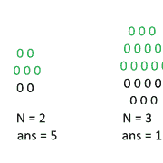

# N 级六边形中彩色 0 的数量

> 原文:[https://www . geesforgeks . org/number-of-color-0s-in-an-n-level-hexagon/](https://www.geeksforgeeks.org/number-of-coloured-0s-in-an-n-level-hexagon/)

给定一个整数 **N** ，当 **0s** 按照以下方式着色时，任务是在 **N 级**六边形中找到着色的 **0s** 的计数:



**例:**

> **输入:** N = 2
> **输出:** 5
> **输入:** N = 3
> **输出:** 12

**方法:**对于 **N = 1、2、3、…** 的值，可以观察到一系列将形成为 **1、5、12、22、35、…** 。这是一个差异系列，差异在 AP 中是 **4，7，10，13，…** 。
因此 **N <sup>第</sup>** 项将为 1 + {4 + 7 + 10 +13 +…..(n–1)条款}
= 1+(n–1)*(2 * 4+(n–1–1)* 3)/2
= 1+(n–1)*(8+(n–2)* 3)/2
= 1+(n–1)*(8+3n–6)/2
= 1+(n–1)*(3n+2)/2
**= n *(3 * n–1)/2**
如下

## C++

```
// C++ implementation of the approach
#include <bits/stdc++.h>
using namespace std;

// Function to return the count of
// coloured 0s in an n-level hexagon
int count(int n)
{
    return n * (3 * n - 1) / 2;
}

// Driver code
int main()
{
    int n = 3;

    cout << count(n);

    return 0;
}
```

## Java 语言(一种计算机语言，尤用于创建网站)

```
// Java implementation of the approach
class GFG
{

// Function to return the count of
// coloured 0s in an n-level hexagon
static int count(int n)
{
    return n * (3 * n - 1) / 2;
}

// Driver code
public static void main(String[] args)
{
    int n = 3;

    System.out.println(count(n));
}
}

// This code is contributed by Code_Mech
```

## 蟒蛇 3

```
# Python3 implementation of the approach

# Function to return the count of
# coloured 0s in an n-level hexagon
def count(n) :

    return n * (3 * n - 1) // 2;

# Driver code
if __name__ == "__main__" :

    n = 3;

    print(count(n));

# This code is contributed by AnkitRai01
```

## C#

```
// C# implementation of the approach
using System;

class GFG
{

// Function to return the count of
// coloured 0s in an n-level hexagon
static int count(int n)
{
    return n * (3 * n - 1) / 2;
}

// Driver code
public static void Main(String[] args)
{
    int n = 3;

    Console.WriteLine(count(n));
}
}

// This code is contributed by 29AjayKumar
```

## java 描述语言

```
<script>

// Javascript implementation of the approach

// Function to return the count of
// coloured 0s in an n-level hexagon
function count(n)
{
    return parseInt(n * (3 * n - 1) / 2);
}

// Driver code
var n = 3;
document.write(count(n));

</script>
```

**Output:** 

```
12
```