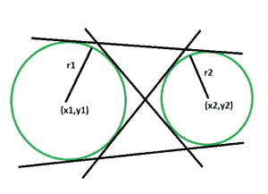
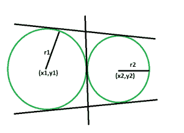
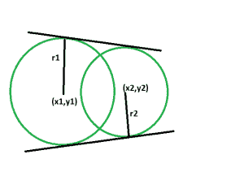
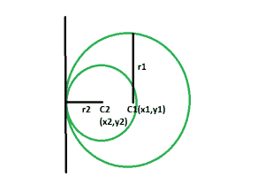

# 给定圆心和半径的两个圆之间的公共切线数

> 原文:[https://www . geesforgeks . org/两个圆之间的公共切线数-如果给定它们的中心和半径/](https://www.geeksforgeeks.org/number-of-common-tangents-between-two-circles-if-their-centers-and-radius-is-given/)

给定两个具有给定半径和中心的圆。任务是找到这些圆之间的公共切线的数量。
**例:**

```
Input: x1 = -10, y1 = 8, x2 = 14, y2 = -24, r1 = 30, r2 = 10
Output: 3

Input: x1 = 40, y1 = 8, x2 = 14, y2 = 54, r1 = 39, r2 = 51
Output: 2
```

**接近** :

*   首先我们会检查圆是否在外部相互接触，相互相交或者根本不接触。([请参考此处](https://www.geeksforgeeks.org/check-two-given-circles-touch-intersect/))



*   那么如果圆在外部没有相互接触，那么显然它们将有 4 条公共切线，两条直切线和两条横切线。



*   如果圆在外部相互接触，那么它们将有 3 条公共切线，两条直切线和一条横切线。
    中间的切线可以认为是重合在一起的横向切线。



*   如果圆彼此相交，那么它们将有 2 条公共切线，两者都是直的。



*   如果一个圆在另一个圆内，那么它们只有一个公共切线。

下面是上述方法的实现:

## C++

```
// C++ program to find
// the number of common tangents
// between the two circles

#include <bits/stdc++.h>
using namespace std;

int circle(int x1, int y1, int x2,
        int y2, int r1, int r2)
{

    int distSq = (x1 - x2) * (x1 - x2)
                + (y1 - y2) * (y1 - y2);

    int radSumSq = (r1 + r2) * (r1 + r2);

    if (distSq == radSumSq)
        return 1;
    else if (distSq > radSumSq)
        return -1;
    else
        return 0;
}

// Driver code
int main()
{
    int x1 = -10, y1 = 8;
    int x2 = 14, y2 = -24;
    int r1 = 30, r2 = 10;
    int t = circle(x1, y1, x2,
                y2, r1, r2);
    if (t == 1)
        cout << "There are 3 common tangents"
            << " between the circles.";
    else if (t < 0)
        cout << "There are 4 common tangents"
            << " between the circles.";
    else
        cout << "There are 2 common tangents"
            << " between the circles.";

    return 0;
}
```

## Java 语言(一种计算机语言，尤用于创建网站)

```
// Java program to find
// the number of common tangents
// between the two circles
import java.io.*;

class GFG
{

static int circle(int x1, int y1, int x2,
        int y2, int r1, int r2)
{

    int distSq = (x1 - x2) * (x1 - x2)
                + (y1 - y2) * (y1 - y2);

    int radSumSq = (r1 + r2) * (r1 + r2);

    if (distSq == radSumSq)
        return 1;
    else if (distSq > radSumSq)
        return -1;
    else
        return 0;
}

// Driver code
public static void main (String[] args)
{

    int x1 = -10, y1 = 8;
    int x2 = 14, y2 = -24;
    int r1 = 30, r2 = 10;
    int t = circle(x1, y1, x2,
                y2, r1, r2);
    if (t == 1)
        System.out.println ("There are 3 common tangents"+
                    " between the circles.");
    else if (t < 0)
        System.out.println ("There are 4 common tangents"+
            " between the circles.");
    else
        System.out.println ("There are 2 common tangents" +
                " between the circles.");

}
}

// This code is contributed by ajit.
```

## 蟒蛇 3

```
# Python3 program to find
# the number of common tangents
# between the two circles

def circle(x1, y1, x2,y2, r1, r2):

    distSq = (x1 - x2) * (x1 - x2)+ (y1 - y2) * (y1 - y2)

    radSumSq = (r1 + r2) * (r1 + r2)

    if (distSq == radSumSq):
        return 1
    elif (distSq > radSumSq):
        return -1
    else:
        return 0

# Driver code
x1,y1 = -10,8;
x2,y2 = 14,-24;
r1,r2 = 30,10;

t = circle(x1, y1, x2,y2, r1, r2);

if (t == 1):
    print("There are 3 common tangents between the circles.")
elif (t < 0):
    print("There are 4 common tangents between the circles.")
else:
    print("There are 2 common tangents between the circles.")

# This code is contributed by mohit kumar 29
```

## C#

```
// C# program to find
// the number of common tangents
// between the two circles
using System;

class GFG
{

static int circle(int x1, int y1, int x2,
        int y2, int r1, int r2)
{

    int distSq = (x1 - x2) * (x1 - x2)
                + (y1 - y2) * (y1 - y2);

    int radSumSq = (r1 + r2) * (r1 + r2);

    if (distSq == radSumSq)
        return 1;
    else if (distSq > radSumSq)
        return -1;
    else
        return 0;
}

// Driver code
public static void Main (String []args)
{

    int x1 = -10, y1 = 8;
    int x2 = 14, y2 = -24;
    int r1 = 30, r2 = 10;
    int t = circle(x1, y1, x2,
                y2, r1, r2);
    if (t == 1)
        Console.WriteLine ("There are 3 common tangents"+
                    " between the circles.");
    else if (t < 0)
        Console.WriteLine ("There are 4 common tangents"+
            " between the circles.");
    else
        Console.WriteLine ("There are 2 common tangents" +
                " between the circles.");

}
}

// This code is contributed by Arnab Kundu
```

## 服务器端编程语言（Professional Hypertext Preprocessor 的缩写）

```
<?php
// PHP program to find
// the number of common tangents
// between the two circles

function circle($x1, $y1, $x2,
        $y2, $r1, $r2)
{

    $distSq = ($x1 - $x2) * ($x1 - $x2)
                + ($y1 - $y2) * ($y1 - $y2);

    $radSumSq = ($r1 + $r2) * ($r1 + $r2);

    if ($distSq == $radSumSq)
        return 1;
    else if ($distSq > $radSumSq)
        return -1;
    else
        return 0;
}

    // Driver code
    $x1 = -10; $y1 = 8;
    $x2 = 14; $y2 = -24;
    $r1 = 30; $r2 = 10;
    $t = circle($x1, $y1, $x2,
                $y2, $r1, $r2);
    if ($t == 1)
        echo "There are 3 common tangents"
                ," between the circles.";
    else if ($t < 0)
        echo "There are 4 common tangents"
            , " between the circles.";
    else
        echo "There are 2 common tangents"
            , " between the circles.";

    // This code is contributed by AnkitRai01
?>
```

## java 描述语言

```
<script>

// Javascript program to find
// the number of common tangents
// between the two circles

function circle(x1, y1, x2,
        y2, r1, r2)
{

    var distSq = (x1 - x2) * (x1 - x2)
                + (y1 - y2) * (y1 - y2);

    var radSumSq = (r1 + r2) * (r1 + r2);

    if (distSq == radSumSq)
        return 1;
    else if (distSq > radSumSq)
        return -1;
    else
        return 0;
}

// Driver code
    var x1 = -10, y1 = 8;
    var x2 = 14, y2 = -24;
    var r1 = 30, r2 = 10;
    var t = circle(x1, y1, x2,
                y2, r1, r2);
    if (t == 1)
        document.write(
"There are 3 common tangents between the circles."
);
    else if (t < 0)
        document.write(
"There are 4 common tangents between the circles."
);
    else
        document.write(
"There are 2 common tangents between the circles."
);

</script>
```

**输出:**

```
There are 3 common tangents between the circles.
```