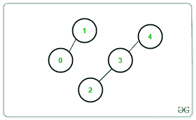
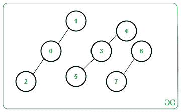

# 图的连通分量数(使用不相交集合并)

> 原文:[https://www . geeksforgeeks . org/图的连接组件数-使用不相交集-并集/](https://www.geeksforgeeks.org/number-of-connected-components-of-a-graph-using-disjoint-set-union/)

给定一个顶点编号在范围**【0，N】**内的[无向图](https://www.geeksforgeeks.org/graph-and-its-representations/) **G** 和一个由 **M** 条边组成的数组**条边【】【】**，任务是使用[不相交集并集算法](https://www.geeksforgeeks.org/union-find/)找到图中[个连通分量](https://www.geeksforgeeks.org/connected-components-in-an-undirected-graph/)的总数。

**示例:**

> **输入:** N = 4，边[][] = {{1，0}，{2，3}，{3，4}}
> **输出:** 2
> **说明:**只有 2 个连接的组件，如下图所示:
> 
> [](https://media.geeksforgeeks.org/wp-content/uploads/20201214122101/g.png)
> 
> **输入:** N = 4，边[][] = {{1，0}，{0，2}，{3，5}，{3，4}，{6，7}}
> 输出:3
> T6】说明:只有 3 个相连的组件，如下图所示:
> 
> [](https://media.geeksforgeeks.org/wp-content/uploads/20201214122119/g1.png)

**方法:**问题可以使用[不相交集并算法](https://www.geeksforgeeks.org/union-find/)来解决。按照以下步骤解决问题:

*   在 [DSU](https://www.geeksforgeeks.org/disjoint-set-union-trees-set-1/) 算法中，主要有两个功能，即 **connect()** 和 **root()** 功能。
*   **连接():**连接一条边。
*   **root():** 递归确定给定边的最顶层父元素。
*   对于每条边 **{a，b}，**检查 **a** 是否连接到 **b** 。如果发现为假，则通过附加它们的顶级父代来连接它们。
*   对每条边完成上述步骤后，打印每个顶点的不同最顶端父顶点的总数。

下面是上述方法的实现:

## C++

```
// C++ program for the above approach

#include <bits/stdc++.h>
using namespace std;

// Stores the parent of each vertex
int parent[1000000];

// Function to find the topmost
// parent of vertex a
int root(int a)
{
    // If current vertex is
    // the topmost vertex
    if (a == parent[a]) {
        return a;
    }

    // Otherwise, set topmost vertex of
    // its parent as its topmost vertex
    return parent[a] = root(parent[a]);
}

// Function to connect the component
// having vertex a with the component
// having vertex b
void connect(int a, int b)
{
    // Connect edges
    a = root(a);
    b = root(b);

    if (a != b) {
        parent[b] = a;
    }
}

// Function to find unique top most parents
void connectedComponents(int n)
{
    set<int> s;

    // Traverse all vertices
    for (int i = 0; i < n; i++) {

        // Insert all topmost
        // vertices obtained
        s.insert(root(parent[i]));
    }

    // Print count of connected components
    cout << s.size() << '\n';
}

// Function to print answer
void printAnswer(int N,
                 vector<vector<int> > edges)
{

    // Setting parent to itself
    for (int i = 0; i <= N; i++) {
        parent[i] = i;
    }

    // Traverse all edges
    for (int i = 0; i < edges.size(); i++) {
        connect(edges[i][0], edges[i][1]);
    }

    // Print answer
    connectedComponents(N);
}

// Driver Code
int main()
{
    // Given N
    int N = 8;

    // Given edges
    vector<vector<int> > edges = {
        { 1, 0 }, { 0, 2 }, { 5, 3 }, { 3, 4 }, { 6, 7 }
    };

    // Function call
    printAnswer(N, edges);

    return 0;
}
```

## Java 语言(一种计算机语言，尤用于创建网站)

```
// Java program for the above approach
import java.util.*;
class GFG{

// Stores the parent of each vertex
static int []parent = new int[1000000];

// Function to find the topmost
// parent of vertex a
static int root(int a)
{

    // If current vertex is
    // the topmost vertex
    if (a == parent[a])
    {
        return a;
    }

    // Otherwise, set topmost vertex of
    // its parent as its topmost vertex
    return parent[a] = root(parent[a]);
}

// Function to connect the component
// having vertex a with the component
// having vertex b
static void connect(int a, int b)
{

    // Connect edges
    a = root(a);
    b = root(b);

    if (a != b) {
        parent[b] = a;
    }
}

// Function to find unique top most parents
static void connectedComponents(int n)
{
    HashSet<Integer> s = new HashSet<Integer>();

    // Traverse all vertices
    for (int i = 0; i < n; i++)
    {

        // Insert all topmost
        // vertices obtained
        s.add(parent[i]);
    }

    // Print count of connected components
    System.out.println(s.size());
}

// Function to print answer
static void printAnswer(int N,int [][] edges)
{

    // Setting parent to itself
    for (int i = 0; i <= N; i++)
    {
        parent[i] = i;
    }

    // Traverse all edges
    for (int i = 0; i < edges.length; i++)
    {
        connect(edges[i][0], edges[i][1]);
    }

    // Print answer
    connectedComponents(N);
}

// Driver Code
public static void main(String[] args)
{

    // Given N
    int N = 8;

    // Given edges
   int [][]edges = {{ 1, 0 }, { 0, 2 },
                    { 5, 3 }, { 3, 4 },
                    { 6, 7 }};

    // Function call
    printAnswer(N, edges);
}
}

// This code is contributed by 29AjayKumar
```

## 蟒蛇 3

```
# Python3 program for the above approach

# Stores the parent of each vertex
parent = [0]*(1000000)

# Function to find the topmost
# parent of vertex a
def root(a) :

    # If current vertex is
    # the topmost vertex
    if (a == parent[a]) :       
        return a

    # Otherwise, set topmost vertex of
    # its parent as its topmost vertex
    parent[a] = root(parent[a])
    return parent[a]

# Function to connect the component
# having vertex a with the component
# having vertex b
def connect(a, b) :

    # Connect edges
    a = root(a)
    b = root(b)

    if (a != b) :
        parent[b] = a

# Function to find unique top most parents
def connectedComponents(n) :

    s = set()

    # Traverse all vertices
    for i in range(n) :

        # Insert all topmost
        # vertices obtained
        s.add(root(parent[i]))

    # Print count of connected components
    print(len(s))

# Function to print answer
def printAnswer(N, edges) :

    # Setting parent to itself
    for i in range(N + 1) :  
        parent[i] = i

    # Traverse all edges
    for i in range(len(edges)) :   
        connect(edges[i][0], edges[i][1])

    # Print answer
    connectedComponents(N)

# Given N
N = 6

# Given edges
edges = [[ 1, 0 ], [ 2, 3 ], [ 1, 2 ], [ 4, 5 ]]

# Function call
printAnswer(N, edges)

# This code is contributed by divyesh072019
```

## C#

```
// C# program for the above approach
using System;
using System.Collections.Generic;
class GFG {

    // Stores the parent of each vertex
    static int[] parent = new int[1000000];

    // Function to find the topmost
    // parent of vertex a
    static int root(int a)
    {
        // If current vertex is
        // the topmost vertex
        if (a == parent[a]) {
            return a;
        }

        // Otherwise, set topmost vertex of
        // its parent as its topmost vertex
        return parent[a] = root(parent[a]);
    }

    // Function to connect the component
    // having vertex a with the component
    // having vertex b
    static void connect(int a, int b)
    {
        // Connect edges
        a = root(a);
        b = root(b);

        if (a != b) {
            parent[b] = a;
        }
    }

    // Function to find unique top most parents
    static void connectedComponents(int n)
    {
        HashSet<int> s = new HashSet<int>();

        // Traverse all vertices
        for (int i = 0; i < n; i++) {

            // Insert all topmost
            // vertices obtained
            s.Add(parent[i]);
        }

        // Print count of connected components
        Console.WriteLine(s.Count);
    }

    // Function to print answer
    static void printAnswer(int N, List<List<int> > edges)
    {

        // Setting parent to itself
        for (int i = 0; i <= N; i++) {
            parent[i] = i;
        }

        // Traverse all edges
        for (int i = 0; i < edges.Count; i++) {
            connect(edges[i][0], edges[i][1]);
        }

        // Print answer
        connectedComponents(N);
    }  

  // Driver code
  static void Main() {

    // Given N
    int N = 8;

    // Given edges
    List<List<int>> edges = new List<List<int>>();
    edges.Add(new List<int> { 1, 0 });
    edges.Add(new List<int> { 0, 2 });
    edges.Add(new List<int> { 5, 3 });
    edges.Add(new List<int> { 3, 4 });
    edges.Add(new List<int> { 6, 7 });

    // Function call
    printAnswer(N, edges);
  }
}

// This code is contributed by divyeshrabadiya07
```

## java 描述语言

```
<script>

// Javascript program for the above approach

// Stores the parent of each vertex
var parent = Array(1000000);

// Function to find the topmost
// parent of vertex a
function root(a)
{
    // If current vertex is
    // the topmost vertex
    if (a == parent[a]) {
        return a;
    }

    // Otherwise, set topmost vertex of
    // its parent as its topmost vertex
    return parent[a] = root(parent[a]);
}

// Function to connect the component
// having vertex a with the component
// having vertex b
function connect( a, b)
{
    // Connect edges
    a = root(a);
    b = root(b);

    if (a != b) {
        parent[b] = a;
    }
}

// Function to find unique top most parents
function connectedComponents( n)
{
    var s = new Set();

    // Traverse all vertices
    for (var i = 0; i < n; i++) {

        // Insert all topmost
        // vertices obtained
        s.add(parent[i]);
    }

    // Print count of connected components
    document.write( s.size + "<br>");
}

// Function to print answer
function printAnswer( N, edges)
{

    // Setting parent to itself
    for (var i = 0; i <= N; i++) {
        parent[i] = i;
    }

    // Traverse all edges
    for (var i = 0; i < edges.length; i++) {
        connect(edges[i][0], edges[i][1]);
    }

    // Print answer
    connectedComponents(N);
}

// Driver Code
// Given N
var N = 8;
// Given edges
var edges = [
    [ 1, 0 ], [ 0, 2 ], [ 5, 3 ], [ 3, 4 ], [ 6, 7 ]
];

// Function call
printAnswer(N, edges);

</script>
```

**Output:** 

```
3
```

***时间复杂度:** O(N+M)*
***辅助空间:** O(N+M)*