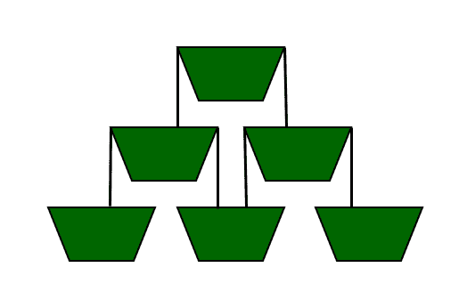

# 给定时间内可灌装的容器数量

> 原文:[https://www . geeksforgeeks . org/给定时间内可灌装的容器数量/](https://www.geeksforgeeks.org/number-of-containers-that-can-be-filled-in-the-given-time/)

给定一个数字 **N** 和一个时间 **X** 单位，任务是找到 X 单位内完全装满的容器数量，如果容器以金字塔方式排列，如下所示。

**注意:**下面的例子是 N = 3 的金字塔排列，其中 **N** 表示容器的金字塔形状排列中的层级数量，使得**层级 1 具有 1 个**容器，**层级 2 具有 2 个容器**并且直到**层级 N** 。液体总是被倾倒在第一层最上面的容器中。当一层的容器从两侧溢出时，下层的容器被填满。每秒钟倒入的液体量等于容器的体积。

[](https://media.geeksforgeeks.org/wp-content/uploads/20200617201457/wine-glass.png)

**示例:**

> **输入:** N = 3，X = 5
> **输出:**4
> 1 秒后，一级容器满。
> 2 秒后，2 级的 2 个容器半满。
> 3 秒钟后，2 级的 2 个容器完全装满。
> 4 秒后，在 3 层的 3 个容器中，末端的 2 个容器是四分之一填充的，中心的容器是半填充的。
> 5 秒后，在 3 层的 3 个容器中，末端的 2 个容器是半满的，中心的容器是满的。
> 
> **输入:** N = 4，X = 8
> T3】输出: 6

**进场:**这个问题用[贪婪进场](https://www.geeksforgeeks.org/greedy-algorithms/)解决。以下是步骤:

*   容器装满后，液体从容器的两侧均匀地溢出，并充满下面的容器。
*   把这个容器金字塔看作一个矩阵。所以，**cont【I】【j】**是 **i <sup>第</sup>** 排 **j <sup>第</sup>T5】容器中的液体。**
*   因此，当溢出发生时，液体流向 **cont[i+1][j]** 和 **cont[i+1][j+1]** 。
*   由于液体将被倾倒 **X** 秒，所以倾倒的液体总量为 **X** 单位。
*   所以能倒入容器的最大值可以是 **X** 单位，能倒入完全装满的最小值是 **1** 单位。

由于液体总是被倒入最上面的容器，让最上面的容器有一个最大值，即 X 个单位。
算法步骤如下:

1.  对于每一层的 **n** 集装箱，从 **1 到 N** 启动外环。在这个循环中，对每排的每个容器开始另一个循环 **1 至 i** 。还要声明一个计数器， **count = 0** ，用于计数正在被填充的容器。
2.  如果 **cont[i][j]** 的值大于或等于 **1** (表示已加满)，则计数增加 **1** ，然后在**cont[I+1][j]**&**g【I+1】【j+1】**中，液体被倒出，它们的值分别增加 **(g[i][j]-1)/2** 的值，因为液体被分成一半量
3.  以这种方式继续循环，并增加每个装满的容器的计数。当循环结束时，我们的计数将是所需的答案。

下面是上述方法的实现:

## C++

```
// C++ program for the above problem
#include <bits/stdc++.h>
using namespace std;

// matrix of containers
double cont[1000][1000];

// function to find the number
// of containers that will be
// filled in X seconds
void num_of_containers(int n,
                       double x)
{
    int count = 0;

    // container on top level
    cont[1][1] = x;
    for (int i = 1; i <= n; i++) {
        for (int j = 1; j <= i; j++) {

            // if container gets filled
            if (cont[i][j] >= (double)1) {
                count++;

                // dividing the liquid
                // equally in two halves
                cont[i + 1][j]
                    += (cont[i][j]
                        - (double)1)
                       / (double)2;

                cont[i + 1][j + 1]
                    += (cont[i][j]
                        - (double)1)
                       / (double)2;
            }
        }
    }
    cout << count;
}

// driver code
int main()
{
    int n = 3;
    double x = 5;
    num_of_containers(n, x);
    return 0;
}
```

## Java 语言(一种计算机语言，尤用于创建网站)

```
// Java program for the above problem
import java.util.*;

class GFG{

// Matrix of containers
static double cont[][] = new double[1000][1000];

// Function to find the number
// of containers that will be
// filled in X seconds
static void num_of_containers(int n, double x)
{
    int count = 0;

    // Container on top level
    cont[1][1] = x;
    for(int i = 1; i <= n; i++)
    {
        for(int j = 1; j <= i; j++)
        {

            // If container gets filled
            if (cont[i][j] >= (double)1)
            {
                count++;

                // Dividing the liquid
                // equally in two halves
                cont[i + 1][j] += (cont[i][j] -
                                   (double)1) /
                                   (double)2;

                cont[i + 1][j + 1] += (cont[i][j] -
                                       (double)1) /
                                       (double)2;
            }
        }
    }
    System.out.print(count);
}

// Driver code
public static void main(String[] args)
{
    int n = 3;
    double x = 5;

    num_of_containers(n, x);
}
}

// This code is contributed by jrishabh99
```

## 蟒蛇 3

```
# Python3 program for the above problem

# Matrix of containers
cont = [[ 0 for i in range(1000)]
            for j in range(1000)]

# Function to find the number          
# of containers that will be          
# filled in X seconds          
def num_of_containers(n, x):         

    count = 0    

    # Container on top level          
    cont[1][1] = x    

    for i in range(1, n + 1):
        for j in range(1, i + 1):

             # If container gets filled          
             if (cont[i][j] >= 1):         
                count += 1         

                # Dividing the liquid          
                # equally in two halves          
                cont[i + 1][j] += (cont[i][j] - 1) / 2         
                cont[i + 1][j + 1] += (cont[i][j] - 1) / 2

    print(count)

# Driver code          
n = 3         
x = 5   

num_of_containers(n, x)

# This code is contributed by yatinagg
```

## C#

```
// C# program for the above problem
using System;

class GFG{

// Matrix of containers
static double [,]cont = new double[1000, 1000];

// Function to find the number
// of containers that will be
// filled in X seconds
static void num_of_containers(int n, double x)
{
    int count = 0;

    // Container on top level
    cont[1, 1] = x;
    for(int i = 1; i <= n; i++)
    {
        for(int j = 1; j <= i; j++)
        {

            // If container gets filled
            if (cont[i, j] >= (double)1)
            {
                count++;

                // Dividing the liquid
                // equally in two halves
                cont[i + 1, j] += (cont[i, j] -
                                  (double)1) /
                                  (double)2;

                cont[i + 1, j + 1] += (cont[i, j] -
                                      (double)1) /
                                      (double)2;
            }
        }
    }
    Console.Write(count);
}

// Driver code
public static void Main(String[] args)
{
    int n = 3;
    double x = 5;

    num_of_containers(n, x);
}
}

// This code is contributed by Princi Singh
```

## java 描述语言

```
<script>

// Javascript program for the above problem

// function to find the number
// of containers that will be
// filled in X seconds
function num_of_containers(n, x)
{
    var cont = new Array(100);
    var i;
    var j;
    for (i=0;i<cont.length;i++)
        cont[i] = new Array(100);
    for(i=0;i<cont.length;i++){
        for (j=0;j<cont[i].length;j++)
          cont[i][j] = 0;
    }
    var count = 0;
    // container on top level
    cont[1][1] = x;
    for (i = 1; i <= n; i++) {
        for (j = 1; j <= i; j++) {

            // if container gets filled
            if (cont[i][j] >=  1) {
                count += 1;

                // dividing the liquid
                // equally in two halves
                cont[i + 1][j]
                    += (cont[i][j]
                        - 1)
                       / 2;

                cont[i + 1][j + 1]
                    += (cont[i][j]
                        - 1)
                       / 2;
            }
        }
    }
    document.write(count);
}

// driver code
    var n = 3;
    var x = 5;
    num_of_containers(n, x);

</script>
```

**Output**

```
4
```

***时间复杂度:**O(N<sup>2</sup>)*
***辅助空间复杂度:** O(N <sup>2</sup> )*