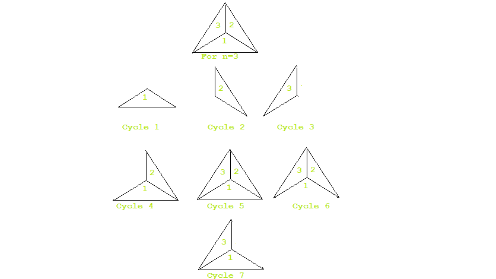

# 在中心连接 n 边多边形顶点形成的循环数

> 原文:[https://www . geeksforgeeks . org/中心 n 边多边形顶点连接形成的循环数/](https://www.geeksforgeeks.org/number-of-cycles-formed-by-joining-vertices-of-n-sided-polygon-at-the-center/)

给定一个 **N 边正多边形**，我们已经连接了多边形中心的所有顶点，从而将多边形分成 N 个相等的部分。我们的任务是计算多边形中的循环总数。
***注:**一个周期是在同一点上开始和结束的闭环。*
**示例:**

> **输入:** N = 3
> **输出:** 7
> **解释:**
> 
> 
> 
> 当一个 3 边多边形在中心被顶点连接时，我们可以得到 7 个循环，如图所示。
> **输入:** N = 5
> **输出:** 21
> **解释:**
> 
> 
> 
> 当一个 5 边的多边形在中心被顶点连接时，我们得到 21 个可能的循环，如图所示。

**方法:**对于上面提到的问题，我们应该计算分割后给定多边形中可能的闭环总数。该方法基于**数学模型**。由于多边形的划分，将会有已经创建的 **N 个循环**。 **N 块**中的一个将与其余**(N–1)**块形成一个循环。其余**(N–1)**块将与其他**(N–2)**块形成循环。所以我们的总循环数可以用下面给出的公式计算出来:

> 总周期= N+1 *(N–1)+(N–1)*(N–2)
> 总周期= 2 * N–1)+(N–1)*(N–2)

以下是上述方法的实现:

## C++

```
// C++ program for the above approach
#include<bits/stdc++.h>
using namespace std;

// Function to calculate number of cycles
int findCycles(int N)
{
    int res = 0;
    int finalResult = 0;
    int val = 2 * N - 1;

    // BigInteger is used here
    // if N=10^9 then multiply
    // will result into value
    // greater than 10^18
    int s = val;

    // BigInteger multiply function
    res = (N - 1) * (N - 2);
    finalResult = res + s;

    // Return the final result
    return finalResult;
}

// Driver code
int main()
{
    // Given N
    int N = 5;

    // Function Call
    cout << findCycles(N) << endl;   
    return 0;
}

// This code is contributed by divyeshrabadiya07
```

## Java 语言(一种计算机语言，尤用于创建网站)

```
// Java program for the above approach

import java.util.*;
import java.math.*;

class GFG {

    // Function to calculate number of cycles
    static BigInteger findCycles(int N)
    {
        BigInteger res, finalResult;
        long val = 2 * N - 1;

        String st = String.valueOf(val);

        // BigInteger is used here
        // if N=10^9 then multiply
        // will result into value
        // greater than 10^18

        BigInteger str = new BigInteger(st);
        String n1 = String.valueOf((N - 1));
        String n2 = String.valueOf((N - 2));

        BigInteger a = new BigInteger(n1);
        BigInteger b = new BigInteger(n2);

        // BigInteger multiply function
        res = a.multiply(b);

        finalResult = res.add(str);

        // Return the final result
        return finalResult;
    }

    // Driver Code
    public static void
    main(String args[]) throws Exception
    {
        // Given N
        int N = 5;

        // Function Call
        System.out.println(findCycles(N));
    }
}
```

## 蟒蛇 3

```
# Python3 program for the above approach

# Function to calculate number of cycles
def findCycles(N):
    res = 0
    finalResult = 0
    val = 2 * N - 1;

    # BigInteger is used here
    # if N=10^9 then multiply
    # will result into value
    # greater than 10^18
    s = val

    # BigInteger multiply function
    res = (N - 1) * (N - 2)
    finalResult = res + s;

    # Return the final result
    return finalResult;

# Driver Code
if __name__=='__main__':

    # Given N
    N = 5;

    # Function Call
    print(findCycles(N));

    # This code is contributed by pratham76
```

## C#

```
// C# program for the above approach
using System;
class GFG {

  // Function to calculate number of cycles
  static int findCycles(int N)
  {
    int res = 0;
    int finalResult = 0;
    int val = 2 * N - 1;

    // BigInteger is used here
    // if N=10^9 then multiply
    // will result into value
    // greater than 10^18
    int s = val;

    // BigInteger multiply function
    res = (N - 1) * (N - 2);
    finalResult = res + s;

    // Return the final result
    return finalResult;
  }

  // Driver code
  static void Main()
  {

    // Given N
    int N = 5;

    // Function Call
    Console.WriteLine(findCycles(N));
  }
}

// This code is contributed by divyesh072019
```

## java 描述语言

```
<script>

    // Javascript program for the above approach

    // Function to calculate number of cycles
    function findCycles(N)
    {
      let res = 0;
      let finalResult = 0;
      let val = 2 * N - 1;

      // BigInteger is used here
      // if N=10^9 then multiply
      // will result into value
      // greater than 10^18
      let s = val;

      // BigInteger multiply function
      res = (N - 1) * (N - 2);
      finalResult = res + s;

      // Return the final result
      return finalResult;
    }

    // Given N
    let N = 5;

    // Function Call
    document.write(findCycles(N));

</script>
```

**Output:** 

```
21
```