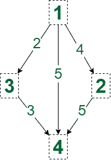

# 加权有向图中从节点 1 到 N 的不同最短路径数

> 原文:[https://www . geesforgeks . org/加权有向图中从节点 1 到 n 的不同最短路径数/](https://www.geeksforgeeks.org/number-of-distinct-shortest-paths-from-node-1-to-n-in-a-weighted-and-directed-graph/)

给定 **N** 节点和 **M** 边的有向加权[图](https://www.geeksforgeeks.org/graph-data-structure-and-algorithms/)，任务是计算节点 **1** 到**N**之间最短长度路径的数量

**示例:**

> **输入:** N = 4，M = 5，边= {{1，4，5}，{1，2，4}，{2，4，5}，{1，3，2}，{3，4，3 } }
> T3】输出:2
> T6】说明:从节点 1 到节点 4 的最短路径数为 2，代价为 5。
> 
> [](https://media.geeksforgeeks.org/wp-content/cdn-uploads/20210803164334/Number-of-distinct-Shortest-Paths-from-Node-1-to-N-in-a-Weighted-and-Directed-Graph.png)
> 
> **输入:** N = 3，M = 2，边= {{1，2，4}，{1，3，5 } }
> T3】输出: 1

**方法:**问题可以通过[迪克斯特拉算法](https://www.geeksforgeeks.org/dijkstras-shortest-path-algorithm-greedy-algo-7/)解决。使用两个数组，比如说 **dist[]** 来存储从源顶点到顶点的最短距离和**路径[]** 的大小 **N** ，来存储从源顶点到顶点的不同最短路径的数量 **N** 。按照以下步骤进行操作。

*   初始化一个[优先级队列](https://www.geeksforgeeks.org/priority-queue-set-1-introduction/)，比如 **pq，**来存储顶点数及其距离值。
*   [初始化一个零向量](https://www.geeksforgeeks.org/initialize-a-vector-in-cpp-different-ways/)，说出大小为 **N** 的**路径[]** ，使**路径【1】**等于 **1** 。
*   [初始化一个大数(1e9)的向量](https://www.geeksforgeeks.org/initialize-a-vector-in-cpp-different-ways/)，说出大小为 **N** 的 **dist[]** ，使 **dist[1]** 等于 **0** 。
*   当 **pq** 不为空时迭代。
    *   从 **pq** 弹出，将顶点值存储在变量中，比如 **u** ，距离值存储在变量 **d** 中。
    *   如果 **d** 大于 **u** ，则**继续**。
    *   对于每个顶点 **u 的每一个 **v** ，**如果**dist【v】>dist【u】+(u 和 v 的边缘成本)，**则**将**dist【v】减少到 dist【u】+(u 和 v 的边缘成本)，并将顶点 **u** 的路径数分配给顶点 **v** 的路径数。
    *   对于每个顶点 **u 的每一个 **v** ，**如果**dist[v]= dist[u]+(u 和 v 的边成本)**，那么将顶点 **u** 的路径数加到顶点 **v** 的路径数上。
*   最后打印**路径【N】。**

下面是上述方法的实现:

## C++

```
// C++ program for the above approach
#include <bits/stdc++.h>
using namespace std;

const int INF = 1e9;
const int MAXN = 1e5 + 1;
vector<vector<pair<int, int> > > g(MAXN);
vector<int> dist(MAXN);
vector<int> route(MAXN);

// Function to count number of shortest
// paths from node 1 to node N
void countDistinctShortestPaths(
    int n, int m, int edges[][3])
{
    // Storing the graph
    for (int i = 0; i < m; ++i) {
        int u = edges[i][0],
            v = edges[i][1],
            c = edges[i][2];
        g[u].push_back({ v, c });
    }

    // Initializing dis array to a
    // large value
    for (int i = 2; i <= n; ++i) {
        dist[i] = INF;
    }

    // Initialize a priority queue
    priority_queue<pair<int, int>,
                   vector<pair<int, int> >,
                   greater<pair<int, int> > >
        pq;
    pq.push({ 0, 1 });

    // Base Cases
    dist[1] = 0;
    route[1] = 1;

    // Loop while priority queue is
    // not empty
    while (!pq.empty()) {
        int d = pq.top().first;
        int u = pq.top().second;
        pq.pop();

        // if d is greater than distance
        // of the node
        if (d > dist[u])
            continue;

        // Traversing all its neighbours
        for (auto e : g[u]) {
            int v = e.first;
            int c = e.second;
            if (c + d > dist[v])
                continue;

            // Path found of same distance
            if (c + d == dist[v]) {
                route[v] += route[u];
            }

            // New path found for lesser
            // distance
            if (c + d < dist[v]) {
                dist[v] = c + d;
                route[v] = route[u];

                // Pushing in priority
                // queue
                pq.push({ dist[v], v });
            }
        }
    }
}

// Driver Code
int main()
{
    // Given Input
    int n = 4;
    int m = 5;
    int edges[m][3] = { { 1, 4, 5 },
                        { 1, 2, 4 },
                        { 2, 4, 5 },
                        { 1, 3, 2 },
                        { 3, 4, 3 } };

    // Function Call
    countDistinctShortestPaths(n, m, edges);
    cout << route[n] << endl;

    return 0;
}
```

**Output:**

```
2

```

***时间复杂度:** O(MLogN)*
***辅助空间:** O(N)*