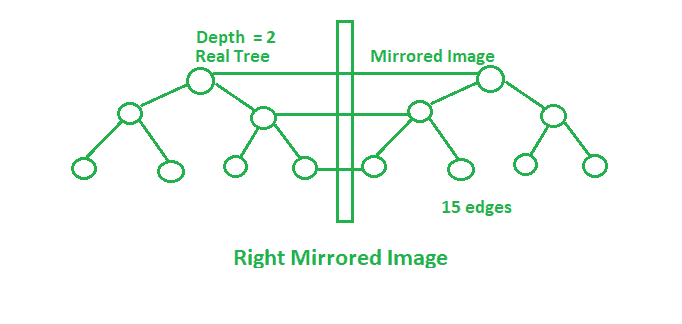

# 完全二叉树镜像中的边数

> 原文:[https://www . geesforgeks . org/完整二叉树镜像边数/](https://www.geeksforgeeks.org/number-of-edges-in-mirror-image-of-complete-binary-tree/)

给定深度为 **H** 的完整二叉树。如果从这棵树的左右两边拍摄镜像，那么:

> **右镜像:**每一级的最右边节点连接到镜像对应节点。
> **左侧镜像图像:**每一级的最左侧节点连接到镜像对应的节点。

任务是在最终的树中获取两个镜像后找到边的数量。



**例:**

> **输入:** H = 1
> **输出:** 10
> 原始树中的 2 条边将镜像到镜像中(左右)，即总共 6 条边。
> 以及连接镜像和原始树的边，如上图所示。
> **输入:** H = 2
> **输出:** 24
> (6 * 3) + 3 + 3 = 24

**方法:**保持每个镜像后最左边、最右边的节点。镜像的每次操作后，边数都会改变。最初，


**右镜像后:**


**左镜像后:**


**在完全修改的树中:**


以下是上述方法的实现:

## C++

```
// C++ implementation of the approach
#include <bits/stdc++.h>
using namespace std;

// Function to return the total number
// of edges in the modified tree
int countEdges(int H)
{

    int edges, right, left;
    edges = 2 * (pow(2, H) - 1);
    left = right = H + 1;

    // Total edges in the modified tree
    int cnt = (edges * 3) + left + right;
    return cnt;
}

// Driver code
int main()
{
    int H = 1;

    cout << countEdges(H);

    return 0;
}
```

## Java 语言(一种计算机语言，尤用于创建网站)

```
// Java implementation of the approach
import java.io.*;

class GFG {

    // Function to return the total number
    // of edges in the modified tree
    static int countEdges(int H)
    {

        int edges, right, left;
        edges = 2 * (int)(Math.pow(2, H) - 1);
        left = right = H + 1;

        // Total edges in the modified tree
        int cnt = (edges * 3) + left + right;
        return cnt;
    }

    // Driver code
    public static void main(String[] args)
    {
        int H = 1;
        System.out.println(countEdges(H));
    }
}

// This code has been contributed by anuj_67..
```

## 蟒蛇 3

```
# Python 3 implementation of the approach

# Function to return the total number
# of edges in the modified tree
def countEdges( H):

    edges = 2 * (pow(2, H) - 1)
    left = right = H + 1

    # Total edges in the modified tree
    cnt = (edges * 3) + left + right
    return cnt

# Driver code
if __name__ == "__main__":
    H = 1;

    print(countEdges(H))

# This code is contributed by ChitraNayal
```

## C#

```
// C# implementation of the approach
using System;

class GFG
{

    // Function to return the total number
    // of edges in the modified tree
    static int countEdges(int H)
    {

        int edges, right, left;

        edges = 2 * (int)(Math.Pow(2, H) - 1);
        left = right = H + 1;

        // Total edges in the modified tree
        int cnt = (edges * 3) + left + right;
        return cnt;
    }

    // Driver code
    public static void Main()
    {
        int H = 1;
        Console.WriteLine(countEdges(H));
    }

}

// This code is contributed by AnkitRai01
```

## java 描述语言

```
<script>
    // Javascript implementation of the approach

    // Function to return the total number
    // of edges in the modified tree
    function countEdges(H)
    {

        let edges, right, left;

        edges = 2 * (Math.pow(2, H) - 1);
        left = right = H + 1;

        // Total edges in the modified tree
        let cnt = (edges * 3) + left + right;
        return cnt;
    }

    let H = 1;
      document.write(countEdges(H));

</script>
```

**Output:** 

```
10
```