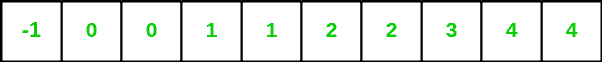
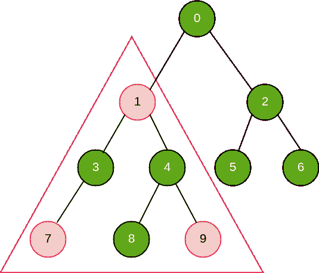
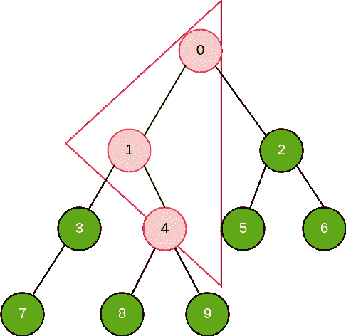

# 二叉树中等腰三角形的个数

> 原文:[https://www . geesforgeks . org/二叉树中等腰三角形的数量/](https://www.geeksforgeeks.org/number-of-isosceles-triangles-in-a-binary-tree/)

**先决条件:** [深度优先搜索](https://www.geeksforgeeks.org/depth-first-search-or-dfs-for-a-graph/) | [父数组表示法](https://www.geeksforgeeks.org/construct-a-binary-tree-from-parent-array-representation/)
给定二叉树的父数组表示法，我们需要找到二叉树中等腰三角形的个数。
考虑一个代表二叉树的父数组:
**父数组:**



下面给出了给定父数组的树形表示。
**二叉树:**


在二叉树中可以找到三种等腰三角形。这三种不同类型的等腰三角形可以作为三种不同的情况来处理。

**情况 1:** 顶点(顶点对共享等边的基)有两个后继(都是直接/间接的)。
本案可表述为:



在给定的树中，有 6 个等腰三角形，即: **(0、1、2)、(0、3、6)、(1、3、4)、(1、7、9)、(4、8、9)、(2、5、6)**

```
Pseudo Code: 
```

**情况 2:** Apex 有左后继者(直接/间接)，Apex 本身是其父代的右后继者(直接/间接)。
本案可表述为:


在给定的树中，有 2 个这样的等腰三角形，即； **(1，8，4)，(0，5，2)**

```
Pseudo Code: 
```

**情况 3:** Apex 有一个右后继者(直接/间接)，Apex 本身是其父代的左后继者(直接/间接)。
本案可表述为:



在给定的树中，有 1 个这样的等腰三角形，即； **(0，1，4)**

```
Pseudo Code: 
```

> **伪代码图例:**
> 左 _ 下[I]—>ith 节点与其最左侧后继节点的最大距离
> 右 _ 下[I]—>ith 节点与其最右侧后继节点的最大距离
> 左 _ 上[I]—>ith 节点与其最左侧前驱节点的最大距离
> 右 _ 上[I]—>ith 节点与其最右侧前驱节点的最大距离

下面是计算给定二叉树中存在的等腰三角形数量的实现:

## C++

```
/* C++ program for calculating number of
isosceles triangles present in a binary tree */
#include <bits/stdc++.h>
using namespace std;

#define MAX_SZ int(1e5)

/* Data Structure used to store
   Binary Tree in form of Graph */
vector<int>* graph;

// Data varirables
int right_down[MAX_SZ];
int left_down[MAX_SZ];
int right_up[MAX_SZ];
int left_up[MAX_SZ];

/* Utility function used to
   start a DFS traversal over a node */
void DFS(int u, int* parent)
{

    if (graph[u].size() != 0)
        sort(graph[u].begin(), graph[u].end());

    if (parent[u] != -1) {
        if (graph[parent[u]].size() > 1) {
            /* check if current node is
                                left child of its parent */
            if (u == graph[parent[u]][0]) {
                right_up[u] += right_up[parent[u]] + 1;
            }
            // current node is right child of its parent
            else {
                left_up[u] += left_up[parent[u]] + 1;
            }
        }
        /* check if current node is left and
                            only child of its parent */
        else {
            right_up[u] += right_up[parent[u]] + 1;
        }
    }
    for (int i = 0; i < graph[u].size(); ++i) {

        int v = graph[u][i];

        // iterating over subtree
        DFS(v, parent);

        // left child of current node
        if (i == 0) {
            left_down[u] += left_down[v] + 1;
        }
        // right child of current node
        else {
            right_down[u] += right_down[v] + 1;
        }
    }
}

/* utility function used to generate
                graph from parent array */
int generateGraph(int* parent, int n)
{

    int root;

    graph = new vector<int>[n];

    // Generating graph from parent array
    for (int i = 0; i < n; ++i) {

        // check for non-root node
        if (parent[i] != -1) {
            /* creating an edge from node with number
             parent[i] to node with number i */
            graph[parent[i]].push_back(i);
        }
        // initializing root
        else {
            root = i;
        }

        // Initializing necessary data variables
        left_up[i] = 0;
        right_up[i] = 0;
        left_down[i] = 0;
        right_down[i] = 0;
    }
    // root of the binary tree
    return root;
}

// Driver Function
int main()
{

    int n = 10;

    /* Parent array used for storing
       parent of each node */
    int parent[] = { -1, 0, 0, 1, 1, 2, 2, 3, 4, 4 };

    /* generateGraph() function generates a graph a
       returns root of the graph which can be used for
       starting DFS traversal */
    int root = generateGraph(parent, n);

    // triggering dfs for traversal over graph
    DFS(root, parent);

    int count = 0;

    // Calculation of number of isosceles triangles
    for (int i = 0; i < n; ++i) {
        count += min(right_down[i], right_up[i]);
        count += min(left_down[i], left_up[i]);
        count += min(left_down[i], right_down[i]);
    }

    cout << "Number of isosceles triangles "
         << "in the given binary tree are " << count;

    return 0;
}
```

## Java 语言(一种计算机语言，尤用于创建网站)

```
/* JAVA program for calculating number of
isosceles triangles present in a binary tree */

import java.io.*;
import java.util.*;

@SuppressWarnings("unchecked")
class Isosceles_triangles {

    static int MAX_SZ = (int)1e5;

    /* Data Structure used to store
       Binary Tree in form of Graph */
    static ArrayList<Integer>[] graph;

    // Data varirables
    static int[] right_down = new int[MAX_SZ];
    static int[] left_down = new int[MAX_SZ];
    static int[] right_up = new int[MAX_SZ];
    static int[] left_up = new int[MAX_SZ];

    /* Utility function used to
       start a DFS traversal over a node */
    public static void DFS(int u, int[] parent)
    {

        if (graph[u] != null)
            Collections.sort(graph[u]);

        if (parent[u] != -1) {
            if (graph[parent[u]].size() > 1) {
                /* check if current node is
                                left child of its parent */
                if (u == graph[parent[u]].get(0)) {
                    right_up[u] += right_up[parent[u]] + 1;
                }
                // current node is right child of its parent
                else {
                    left_up[u] += left_up[parent[u]] + 1;
                }
            }
            /* check if current node is left and
                                only child of its parent */
            else {
                right_up[u] += right_up[parent[u]] + 1;
            }
        }

        if (graph[u] == null)
            return;

        for (int i = 0; i < graph[u].size(); ++i) {

            int v = graph[u].get(i);

            // iterating over subtree
            DFS(v, parent);

            // left child of current node
            if (i == 0) {
                left_down[u] += left_down[v] + 1;
            }
            // right child of current node
            else {
                right_down[u] += right_down[v] + 1;
            }
        }
    }

    static int min(Integer a, Integer b)
    {
        return (a < b) ? a : b;
    }

    /* utility function used to generate
                    graph from parent array */
    public static int generateGraph(int[] parent, int n)
    {

        int root = -1;

        graph = (ArrayList<Integer>[]) new ArrayList[n];

        // Generating graph from parent array
        for (int i = 0; i < n; ++i) {

            // check for non-root node
            if (parent[i] != -1) {
                /* creating an edge from node with number
                 parent[i] to node with number i */
                if (graph[parent[i]] == null) {
                    graph[parent[i]] = new ArrayList<Integer>();
                }
                graph[parent[i]].add(i);
                // System.out.println(graph);
            }
            // initializing root
            else {
                root = i;
            }

            // Initializing necessary data variables
            left_up[i] = 0;
            right_up[i] = 0;
            left_down[i] = 0;
            right_down[i] = 0;
        }
        // root of the binary tree
        return root;
    }

    // Driver Function
    public static void main(String[] args)
    {

        int n = 10;

        /* Parent array used for storing
           parent of each node */
        int[] parent = new int[] { -1, 0, 0, 1, 1, 2, 2, 3, 4, 4 };

        /* generateGraph() function generates a graph a
           returns root of the graph which can be used for
           starting DFS traversal */
        int root = generateGraph(parent, n);

        // System.exit(0);

        // triggering dfs for traversal over graph
        DFS(root, parent);

        int count = 0;

        // Calculation of number of isosceles triangles
        for (int i = 0; i < n; ++i) {
            count += min(right_down[i], right_up[i]);
            count += min(left_down[i], left_up[i]);
            count += min(left_down[i], right_down[i]);
        }
        System.out.println("Number of isosceles triangles "
                           + "in the given binary tree are "
                           + Integer.toString(count));

        System.exit(0);
    }
}
```

## 蟒蛇 3

```
''' Python3 program for calculating number of
isosceles triangles present in a binary tree '''

MAX_SZ = int(1e5)

''' Data Structure used to store
  Binary Tree in form of Graph '''
graph = {}

# Data varirables
right_down = MAX_SZ*[0]
left_down = MAX_SZ*[0]
right_up = MAX_SZ*[0]
left_up = MAX_SZ*[0]

''' Utility function used to
    start a DFS traversal over a node '''
def DFS(u, parent):

    if u in graph:
        graph[u].sort()

    if parent[u] != -1:
        if u in graph and len(graph[parent[u]]) > 1:
            ''' check if current node is
                            left child of its parent '''
            if u == graph[parent[u]][0] :
                right_up[u] += right_up[parent[u]] + 1

            # current node is right child of its parent
            else:
                left_up[u] += left_up[parent[u]] + 1

        else :
            ''' check if current node is left and
                            only child of its parent '''
            right_up[u] += right_up[parent[u]] + 1

    if u in graph:
        for i in range(0, len(graph[u])):

            v = graph[u][i]

            # iterating over subtree
            DFS(v, parent)

            # left child of current node
            if i == 0:
                left_down[u] += left_down[v] + 1;

            # right child of current node
            else:
                right_down[u] += right_down[v] + 1;

''' utility function used to generate
                graph from parent array '''
def generateGraph(parent, n):

    root = -1

    # Generating graph from parent array
    for i in range(0, n):

        # check for non-root node
        if parent[i] != -1:
            ''' creating an edge from node with number
             parent[i] to node with number i '''
            if parent[i] not in graph:
                graph[parent[i]] = [i]
            else :
                graph[parent[i]].append(i)

        # initializing root
        else :
            root = i

    # root of the binary tree
    return root;

# Driver Function
if __name__ == '__main__':

    n = 10

    ''' Parent array used for storing
       parent of each node '''
    parent = [-1, 0, 0, 1, 1, 2, 2, 3, 4, 4]

    ''' generateGraph() function generates a graph a
    returns root of the graph which can be used for
     starting DFS traversal '''
    root = generateGraph(parent, n)

    # triggering dfs for traversal over graph
    DFS(root, parent)

    count = 0

    # Calculation of number of isosceles triangles
    for i in range(0, n):
        count += min(right_down[i], right_up[i])
        count += min(left_down[i], left_up[i])
        count += min(left_down[i], right_down[i])

    print("Number of isosceles triangles "
            + "in the given binary tree are "
            + str(count))
```

## C#

```
/* C# program for calculating number of
isosceles triangles present in a binary tree */
using System;
using System.Collections.Generic;
using System.Linq;

class Isosceles_triangles
{

    static int MAX_SZ = (int)1e5;

    /* Data Structure used to store
    Binary Tree in form of Graph */
    static List<int>[] graph;

    // Data varirables
    static int[] right_down = new int[MAX_SZ];
    static int[] left_down = new int[MAX_SZ];
    static int[] right_up = new int[MAX_SZ];
    static int[] left_up = new int[MAX_SZ];

    /* Utility function used to
    start a DFS traversal over a node */
    public static void DFS(int u, int[] parent)
    {

        if (graph[u] != null)
            graph[u].Sort();

        if (parent[u] != -1)
        {
            if (graph[parent[u]].Count > 1)
            {
                /* check if current node is
                                left child of its parent */
                if (u == graph[parent[u]][0])
                {
                    right_up[u] += right_up[parent[u]] + 1;
                }

                // current node is right child of its parent
                else
                {
                    left_up[u] += left_up[parent[u]] + 1;
                }
            }

            /* check if current node is left and
                                only child of its parent */
            else
            {
                right_up[u] += right_up[parent[u]] + 1;
            }
        }

        if (graph[u] == null)
            return;

        for (int i = 0; i < graph[u].Count; ++i)
        {

            int v = graph[u][i];

            // iterating over subtree
            DFS(v, parent);

            // left child of current node
            if (i == 0)
            {
                left_down[u] += left_down[v] + 1;
            }
            // right child of current node
            else
            {
                right_down[u] += right_down[v] + 1;
            }
        }
    }

    static int min(int a, int b)
    {
        return (a < b) ? a : b;
    }

    /* utility function used to generate
                    graph from parent array */
    public static int generateGraph(int[] parent, int n)
    {

        int root = -1;

        graph = new List<int>[n];

        // Generating graph from parent array
        for (int i = 0; i < n; ++i)
        {

            // check for non-root node
            if (parent[i] != -1)
            {
                /* creating an edge from node with number
                parent[i] to node with number i */
                if (graph[parent[i]] == null)
                {
                    graph[parent[i]] = new List<int>();
                }
                graph[parent[i]].Add(i);
                // Console.WriteLine(graph);
            }

            // initializing root
            else
            {
                root = i;
            }

            // Initializing necessary data variables
            left_up[i] = 0;
            right_up[i] = 0;
            left_down[i] = 0;
            right_down[i] = 0;
        }

        // root of the binary tree
        return root;
    }

    // Driver Function
    public static void Main(String[] args)
    {
        int n = 10;

        /* Parent array used for storing
        parent of each node */
        int[] parent = new int[] { -1, 0, 0, 1, 1, 2, 2, 3, 4, 4 };

        /* generateGraph() function generates a graph a
        returns root of the graph which can be used for
        starting DFS traversal */
        int root = generateGraph(parent, n);

        // System.exit(0);

        // triggering dfs for traversal over graph
        DFS(root, parent);

        int count = 0;

        // Calculation of number of isosceles triangles
        for (int i = 0; i < n; ++i)
        {
            count += min(right_down[i], right_up[i]);
            count += min(left_down[i], left_up[i]);
            count += min(left_down[i], right_down[i]);
        }
        Console.WriteLine("Number of isosceles triangles "
                        + "in the given binary tree are "
                        + count);
    }
}

// This code is contributed by Rajput-Ji
```

## java 描述语言

```
<script>

// Javascript program for calculating number of
// isosceles triangles present in a binary tree
let MAX_SZ = 1e5;

// Data Structure used to store
// Binary Tree in form of Graph
let graph;

// Data varirables
let right_down = new Array(MAX_SZ);
let left_down = new Array(MAX_SZ);
let right_up = new Array(MAX_SZ);
let left_up = new Array(MAX_SZ);

// Utility function used to start
// a DFS traversal over a node
function DFS(u, parent)
{
    if (graph[u] != null)
        graph[u].sort();

    if (parent[u] != -1)
    {
        if (graph[parent[u]].length > 1)
        {

            // Check if current node is
            // left child of its parent
            if (u == graph[parent[u]][0])
            {
                right_up[u] += right_up[parent[u]] + 1;
            }

            // Current node is right child of its parent
            else
            {
                left_up[u] += left_up[parent[u]] + 1;
            }
        }

        // Check if current node is left and
        // only child of its parent
        else
        {
            right_up[u] += right_up[parent[u]] + 1;
        }
    }

    if (graph[u] == null)
        return;

    for(let i = 0; i < graph[u].length; ++i)
    {
        let v = graph[u][i];

        // Iterating over subtree
        DFS(v, parent);

        // left child of current node
        if (i == 0)
        {
            left_down[u] += left_down[v] + 1;
        }

        // right child of current node
        else
        {
            right_down[u] += right_down[v] + 1;
        }
    }
}

function min(a, b)
{
    return (a < b) ? a : b;
}

// Utility function used to generate
// graph from parent array
function generateGraph(parent, n)
{
    let root = -1;

    graph = new Array(n);

    // Generating graph from parent array
    for(let i = 0; i < n; ++i)
    {

        // Check for non-root node
        if (parent[i] != -1)
        {

            // Creating an edge from node with number
            // parent[i] to node with number i
            if (graph[parent[i]] == null)
            {
                graph[parent[i]] = [];
            }
            graph[parent[i]].push(i);
            // System.out.println(graph);
        }

        // Initializing root
        else
        {
            root = i;
        }

        // Initializing necessary data variables
        left_up[i] = 0;
        right_up[i] = 0;
        left_down[i] = 0;
        right_down[i] = 0;
    }

    // Root of the binary tree
    return root;
}

// Driver code
let n = 10;

// Parent array used for storing
// parent of each node
let parent = [ -1, 0, 0, 1, 1, 2, 2, 3, 4, 4 ];

// generateGraph() function generates a graph a
// returns root of the graph which can be used for
// starting DFS traversal
let root = generateGraph(parent, n);

// System.exit(0);

// Triggering dfs for traversal over graph
DFS(root, parent);

let count = 0;

// Calculation of number of isosceles triangles
for(let i = 0; i < n; ++i)
{
    count += min(right_down[i], right_up[i]);
    count += min(left_down[i], left_up[i]);
    count += min(left_down[i], right_down[i]);
}
document.write("Number of isosceles triangles " +
               "in the given binary tree are " + count);

// This code is contributed by suresh07

</script>
```

**Output:** 

```
Number of isosceles triangles in the given binary tree are 9
```

**时间复杂度:**O(n)
T3】辅助空间: O(n)