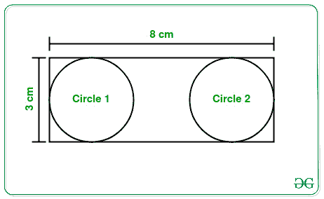

# 矩形内接的最大圆数

> 原文:[https://www . geeksforgeeks . org/矩形内接最大圈数/](https://www.geeksforgeeks.org/number-of-largest-circles-that-can-be-inscribed-in-a-rectangle/)

给定两个整数 **L** 和 **B** 代表一个[矩形](https://www.geeksforgeeks.org/largest-rectangle-under-histogram/)的长度和宽度，任务是找到在给定矩形中可以不重叠地内接的最大可能圆的最大数量[。](https://www.geeksforgeeks.org/the-biggest-possible-circle-that-can-be-inscribed-in-rectangle/)

**示例:**

> **输入:** L = 3，B = 8
> T3】输出:2
> T6】说明:
> 
> [](https://media.geeksforgeeks.org/wp-content/uploads/20210303153316/5589911.jpg)
> 
> 从上图可以清楚地看到，在给定的矩形内可以内切出直径为 3 厘米的最大圆。
> 因此，此类圆的计数为 2。
> 
> **输入:** L = 2，B = 9
> T3】输出: 4

**方法:**给定的问题可以基于以下观察来解决:

*   矩形内接的最大圆的直径等于矩形的小边。
*   因此，这种最大圆的最大可能数等于**(最大边长)/(最小边长)**。

因此，从以上观察，只需打印**(最大边长)/(最小边长)**的值作为所需结果即可。

下面是上述方法的实现:

## C++

```
// C++ program for the above approach

#include <bits/stdc++.h>
using namespace std;

// Function to count the number of
// largest circles in a rectangle
int totalCircles(int L, int B)
{
    // If length exceeds breadth
    if (L > B) {

        // Swap to reduce length
        // to smaller than breadth
        int temp = L;
        L = B;
        B = temp;
    }

    // Return total count
    // of circles inscribed
    return B / L;
}

// Driver Code
int main()
{
    int L = 3;
    int B = 8;
    cout << totalCircles(L, B);

    return 0;
}
```

## Java 语言(一种计算机语言，尤用于创建网站)

```
// Java program for the above approach
import java.io.*;
import java.util.*;
class GFG
{

  // Function to count the number of
  // largest circles in a rectangle
  static int totalCircles(int L, int B)
  {
    // If length exceeds breadth
    if (L > B) {

      // Swap to reduce length
      // to smaller than breadth
      int temp = L;
      L = B;
      B = temp;
    }

    // Return total count
    // of circles inscribed
    return B / L;
  }

  // Driver Code
  public static void main(String[] args)
  {
    int L = 3;
    int B = 8;
    System.out.print(totalCircles(L, B));
  }
}

// This code is contributed by susmitakundugoaldanga.
```

## 蟒蛇 3

```
# Python3 program for the above approach

# Function to count the number of
# largest circles in a rectangle
def totalCircles(L, B) :

    # If length exceeds breadth
    if (L > B) :

        # Swap to reduce length
        # to smaller than breadth
        temp = L
        L = B
        B = temp

    # Return total count
    # of circles inscribed
    return B // L

# Driver Code
L = 3
B = 8
print(totalCircles(L, B))

# This code is contributed by splevel62.
```

## C#

```
// C# program to implement
// the above approach
using System;
public class GFG
{

  // Function to count the number of
  // largest circles in a rectangle
  static int totalCircles(int L, int B)
  {
    // If length exceeds breadth
    if (L > B) {

      // Swap to reduce length
      // to smaller than breadth
      int temp = L;
      L = B;
      B = temp;
    }

    // Return total count
    // of circles inscribed
    return B / L;
  }

  // Driver Code
  public static void Main(String[] args)
  {
    int L = 3;
    int B = 8;
    Console.Write(totalCircles(L, B));
  }
}

// This code is contributed by souravghosh0416.
```

## java 描述语言

```
<script>

// javascript program to implement
// the above approach

  // Function to count the number of
  // largest circles in a rectangle

  function  totalCircles( L,  B)
  {
    // If length exceeds breadth
    if (L > B) {

      // Swap to reduce length
      // to smaller than breadth

      var temp = L;
      L = B;
      B = temp;
    }

    // Return total count
    // of circles inscribed
    return B / L;
  }

  // Driver Code

    var L = 3;
    var B = 8;
    document.write(totalCircles(L, B).toString().split('.')[0]);

</script>
```

**Output:** 

```
2
```

***时间复杂度:**O(1)*
T5**辅助空间:** O(1)