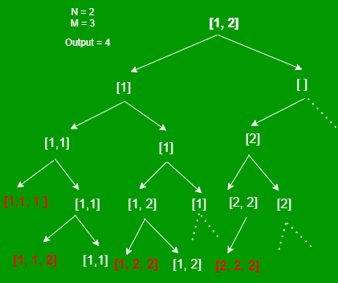
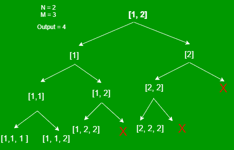

# 可以使用前 N 个自然数形成的 M 长度排序数组的数量

> 原文:[https://www . geeksforgeeks . org/number-of-m-length-sorted-arrays-可使用-first-n-natural-numbers 形成的数组/](https://www.geeksforgeeks.org/number-of-m-length-sorted-arrays-that-can-be-formed-using-first-n-natural-numbers/)

给定两个数字 **N** 和 **M** ，任务是使用第一个 **N** [自然数](https://www.geeksforgeeks.org/natural-numbers/)找到大小为 **M** 的排序后的[数组](https://www.geeksforgeeks.org/array-data-structure/)的数量，如果每个数字可以取任意次数的话。

**示例:**

> **输入:** N = 4，M = 2
> **输出:** 10
> **解释:**所有这样的可能数组都是{1，1}、{1，2}、{1，2}、{1，4}、{2，2}、{2，3}、{2，4}、{3，3}、{3，4}、{4，4}。
> 
> **输入:** N = 2，M = 4
> **输出:** 5
> **解释:**所有这样的可能数组都是{1，1，1，1，1}，{1，1，2}，{1，1，2，2}，{1，2，2，2，2}，{2，2，2，2，2}。

**天真法:**每个数字有两个选择，可以取，也可以留。此外，一个数字可以取多次。

*   多次取的元素在[阵](https://www.geeksforgeeks.org/array-data-structure/)的 [](https://www.geeksforgeeks.org/array-data-structure/) 中应该是连续的，就像[阵](https://www.geeksforgeeks.org/array-data-structure/)应该排序一样。
*   如果一个元素被留下，并且已经移动到另一个元素，那么该元素不能被再次获取。

[**递归**](https://www.geeksforgeeks.org/recursion/) **进场:**



左边的分支表示该元素被取用，右边的分支表示该元素在左边，指针移动到下一个元素。

下面是上述方法的实现:

## C++

```
// C++ program for the above approach
#include <bits/stdc++.h>
using namespace std;

// Function to find the number of
// M-length sorted arrays possible
// using numbers from the range [1, N]
int countSortedArrays(int start, int m,
                      int size, int n)
{
    // If size becomes equal to m,
    // that means an array is found
    if (size == m)
        return 1;

    if (start > n)
        return 0;

    int notTaken = 0, taken = 0;

    // Include current element, increase
    // size by 1 and remain on the same
    // element as it can be included again
    taken = countSortedArrays(start, m,
                              size + 1, n);

    // Exclude current element
    notTaken = countSortedArrays(start + 1,
                                 m, size, n);

    // Return the sum obtained
    // in both the cases
    return taken + notTaken;
}

// Driver Code
int main()
{
    // Given Input
    int n = 2, m = 3;

    // Function Call
    cout << countSortedArrays(1, m, 0, n);

    return 0;
}
```

## Java 语言(一种计算机语言，尤用于创建网站)

```
// Java program for the above approach
import java.util.*;
import java.lang.*;

class GFG{

// Function to find the number of
// M-length sorted arrays possible
// using numbers from the range [1, N]
static int countSortedArrays(int start, int m,
                             int size, int n)
{

    // If size becomes equal to m,
    // that means an array is found
    if (size == m)
        return 1;

    if (start > n)
        return 0;

    int notTaken = 0, taken = 0;

    // Include current element, increase
    // size by 1 and remain on the same
    // element as it can be included again
    taken = countSortedArrays(start, m,
                              size + 1, n);

    // Exclude current element
    notTaken = countSortedArrays(start + 1,
                                 m, size, n);

    // Return the sum obtained
    // in both the cases
    return taken + notTaken;
}

// Driver Code
public static void main(String[] args)
{

    // Given Input
    int n = 2, m = 3;

    // Function Call
    System.out.println(countSortedArrays(1, m, 0, n));
}
}

// This code is contributed by sanjoy_62
```

## 蟒蛇 3

```
# Python3 program for the above approach

# Function to find the number of
# M-length sorted arrays possible
# using numbers from the range [1, N]
def countSortedArrays(start, m, size, n):

    # If size becomes equal to m,
    # that means an array is found
    if (size == m):
        return 1

    if (start > n):
        return 0

    notTaken, taken = 0, 0

    # Include current element, increase
    # size by 1 and remain on the same
    # element as it can be included again
    taken = countSortedArrays(start, m,
                              size + 1, n)

    # Exclude current element
    notTaken = countSortedArrays(start + 1,
                                 m, size, n)

    # Return the sum obtained
    # in both the cases
    return taken + notTaken

# Driver Code
if __name__ == '__main__':

    # Given Input
    n, m = 2, 3

    # Function Call
    print (countSortedArrays(1, m, 0, n))

# This code is contributed by mohit kumar 29
```

## C#

```
// C# program for the above approach
using System;

class GFG{

// Function to find the number of
// M-length sorted arrays possible
// using numbers from the range [1, N]
static int countSortedArrays(int start, int m,
                             int size, int n)
{

    // If size becomes equal to m,
    // that means an array is found
    if (size == m)
        return 1;

    if (start > n)
        return 0;

    int notTaken = 0, taken = 0;

    // Include current element, increase
    // size by 1 and remain on the same
    // element as it can be included again
    taken = countSortedArrays(start, m,
                              size + 1, n);

    // Exclude current element
    notTaken = countSortedArrays(start + 1,
                                 m, size, n);

    // Return the sum obtained
    // in both the cases
    return taken + notTaken;
}

// Driver Code
public static void Main()
{

    // Given Input
    int n = 2, m = 3;

    // Function Call
    Console.WriteLine(countSortedArrays(1, m, 0, n));
}
}

// This code is contributed by susmitakundugoaldanga
```

## java 描述语言

```
<script>

// JavaScript program for the above approach

// Function to find the number of
// M-length sorted arrays possible
// using numbers from the range [1, N]
function countSortedArrays(start, m, size, n)
{

    // If size becomes equal to m,
    // that means an array is found
    if (size === m)
        return 1;

    if (start > n)
        return 0;

    var notTaken = 0,
    taken = 0;

    // Include current element, increase
    // size by 1 and remain on the same
    // element as it can be included again
    taken = countSortedArrays(start, m, size + 1, n);

    // Exclude current element
    notTaken = countSortedArrays(start + 1, m,
                                 size, n);

    // Return the sum obtained
    // in both the cases
    return taken + notTaken;
}

// Driver Code

// Given Input
var n = 2,
m = 3;

// Function Call
document.write(countSortedArrays(1, m, 0, n));

// This code is contributed by rdtank

</script>
```

**Output:** 

```
4
```

***时间复杂度:**O(2<sup>N</sup>)*
***辅助空间:** O(1)*

[**递归**](https://www.geeksforgeeks.org/recursion/) **优化进场:**

*   [遍历每个元素](https://www.geeksforgeeks.org/c-program-to-traverse-an-array/)并尝试从该元素开始寻找所有可能的[数组](https://www.geeksforgeeks.org/introduction-to-arrays/)。
*   在前面的右分支方法中，元素首先被留在左边，在下一步中，被转移到下一个元素。
*   在这种方法中，不是先离开元素，然后移动到下一个元素，而是直接转到下一个元素，因此函数调用会更少。



下面是上述方法的实现:

## C++

```
// C++ program for the above approach
#include <bits/stdc++.h>
using namespace std;

// Function to find the number of
// M-length sorted arrays possible
// using numbers from the range [1, N]
void countSortedArrays(int st, int n,
                       int m, int& ans, int size)
{
    // If size becomes equal to m
    // one sorted array is found
    if (size == m) {
        ans += 1;
        return;
    }

    // Traverse over the range [st, N]
    for (int i = st; i <= n; i++) {

        // Find all sorted arrays
        // starting from i
        countSortedArrays(i, n, m,
                          ans, size + 1);
    }
}

// Driver Code
int main()
{
    // Given Input
    int n = 2, m = 3;

    // Store the required result
    int ans = 0;

    // Function Call
    countSortedArrays(1, n, m, ans, 0);

    // Print the result
    cout << ans;

    return 0;
}
```

## Java 语言(一种计算机语言，尤用于创建网站)

```
// Java program for the above approach
import java.io.*;

class GFG{

// Function to find the number of
// M-length sorted arrays possible
// using numbers from the range [1, N]
static int countSortedArrays(int st, int n,
                             int m, int ans,
                             int size)
{

    // If size becomes equal to m
    // one sorted array is found
    if (size == m)
    {
        ans += 1;
      System.out.println(ans);
      return ans;

    }

    // Traverse over the range [st, N]
    for(int i = st; i <= n; i++)
    {

        // Find all sorted arrays
        // starting from i
        ans = countSortedArrays(i, n, m,
                                ans, size + 1);
    }
      return ans;
}

// Driver Code
public static void main(String[] args)
{

    // Given Input
    int n = 2, m = 3;

    // Store the required result
    int ans = 0;

    // Function Call
    ans = countSortedArrays(1, n, m, ans, 0);

    // Print the result
    System.out.println(ans);
}
}

// This code is contributed by Dharanendra L V.
```

## 蟒蛇 3

```
# Python program for the above approach

# Function to find the number of
# M-length sorted arrays possible
# using numbers from the range [1, N]

def countSortedArrays( st, n, m, ans, size):

    # If size becomes equal to m
    # one sorted array is found
    if (size == m):
        ans += 1
        return ans

    # Traverse over the range [st, N]
    for i in range(st,n+1):

        # Find all sorted arrays
        # starting from i
        ans = countSortedArrays(i, n, m, ans, size + 1)
    return ans

# Given Input
n = 2
m = 3

# Store the required result
ans = 0

# Function Call
ans = countSortedArrays(1, n, m, ans, 0)

# Print the result
print(ans)

# This code is contributed by unknown2108.
```

## C#

```
// C# program for the above approach
using System;

class GFG{

// Function to find the number of
// M-length sorted arrays possible
// using numbers from the range [1, N]
static int countSortedArrays(int st, int n,
                             int m, int ans,
                             int size)
{

    // If size becomes equal to m
    // one sorted array is found
    if (size == m)
    {
        ans += 1;
        return ans;
    }

    // Traverse over the range [st, N]
    for(int i = st; i <= n; i++)
    {

        // Find all sorted arrays
        // starting from i
        ans = countSortedArrays(i, n, m,
                                ans, size + 1);
    }
    return ans;
}

// Driver Code
public static void Main(String[] args)
{

    // Given Input
    int n = 2, m = 3;

    // Store the required result
    int ans = 0;

    // Function Call
    ans = countSortedArrays(1, n, m, ans, 0);

    // Print the result
    Console.Write(ans);
}
}

// This code is contributed by shivanisinghss2110
```

## java 描述语言

```
<script>

// JavaScript program for the above approach

// Function to find the number of
// M-length sorted arrays possible
// using numbers from the range [1, N]
function countSortedArrays( st, n, m, ans, size)
{

    // If size becomes equal to m
    // one sorted array is found
    if (size == m)
    {
        ans += 1;

      return ans;

    }

    // Traverse over the range [st, N]
    for(var i = st; i <= n; i++)
    {

        // Find all sorted arrays
        // starting from i
        ans = countSortedArrays(i, n, m, ans, size + 1);
    }
      return ans;
}

// Given Input
    var n = 2, m = 3;

    // Store the required result
    var ans = 0;

    // Function Call
    ans = countSortedArrays(1, n, m, ans, 0);

    // Print the result
   document.write(ans);

// This code is contributed by SoumikMondal

</script>
```

**Output:** 

```
4
```

***时间复杂度:**O(2<sup>N</sup>)*
***辅助空间:** O(1)*

[**【动态规划】**](https://www.geeksforgeeks.org/dynamic-programming/) **逼近:**可以观察到，该问题存在[重叠子问题](https://www.geeksforgeeks.org/overlapping-subproblems-property-in-dynamic-programming-dp-1/)和[最优子结构性质](https://www.geeksforgeeks.org/optimal-substructure-property-in-dynamic-programming-dp-2/)，即满足动态规划的两个性质。因此，我们的想法是在函数调用过程中使用 2D 表来记住结果。

下面是上述方法的实现:

## C++

```
// C++ program for the above approach
#include <bits/stdc++.h>
using namespace std;

// Function to find the number of
// M-length sorted arrays possible
// using numbers from the range [1, N]
int countSortedArrays(vector<vector<int> >& dp,
                      int m, int n)
{
    // Base cases
    if (m == 0) {
        return 1;
    }
    if (n <= 0)
        return 0;

    // If the result is already computed,
    // return the result of the state
    if (dp[m][n] != -1)
        return dp[m][n];

    int taken = 0, notTaken = 0;

    // Include current element, decrease
    // required size by 1 and remain on the
    // same element, as it can be taken again
    taken = countSortedArrays(dp, m - 1, n);

    // If element is not included
    notTaken = countSortedArrays(dp, m, n - 1);

    // Store the result and return it
    return dp[m][n] = taken + notTaken;
}

// Driver Code
int main()
{

    // Given Input
    int n = 2, m = 3;

    // Create an 2D array for memoization
    vector<vector<int> > dp(m + 1,
                            vector<int>(n + 1, -1));

    // Function Call
    cout << countSortedArrays(dp, m, n);

    return 0;
}
```

**Output:** 

```
4
```

***时间复杂度:** O(N*M)*
***辅助空间:** O(N*M)*

**空间优化迭代** [**动态规划**](https://www.geeksforgeeks.org/dynamic-programming/) **方法:**

*   由于所有元素都可以根据需要多次使用，因此无需保存前几行的值，可以使用同一行的值。
*   所以一维数组可以用来保存之前的结果。
*   创建一个大小为 **M** 的[数组](https://www.geeksforgeeks.org/array-data-structure/)、 **dp** ，其中**DP【I】**存储最大数量的大小为 **i** 的排序数组，这些数组可以由范围为**【1，N】**的数字组成。

下面是上述方法的实现:

## C++

```
// C++ program for the above approach
#include <bits/stdc++.h>
using namespace std;

// Function to find the number of
// M-length sorted arrays possible
// using numbers from the range [1, N]
int countSortedArrays(int n, int m)
{
    // Create an array of size M+1
    vector<int> dp(m + 1, 0);

    // Base cases
    dp[0] = 1;

    // Fill the dp table
    for (int i = 1; i <= n; i++) {
        for (int j = 1; j <= m; j++) {

            // dp[j] will be equal to maximum
            // number of sorted array of size j
            // when elements are taken from 1 to i
            dp[j] = dp[j - 1] + dp[j];
        }

        // Here dp[m] will be equal to the
        // maximum number of sorted arrays when
        // element are taken from 1 to i
    }

    // Return the result
    return dp[m];
}

// Driver Code
int main()
{
    // Given Input
    int n = 2, m = 3;

    // Function Call
    cout << countSortedArrays(n, m);

    return 0;
}
```

## Java 语言(一种计算机语言，尤用于创建网站)

```
// Java program for the above approach
public class Main
{
    // Function to find the number of
    // M-length sorted arrays possible
    // using numbers from the range [1, N]
    static int countSortedArrays(int n, int m)
    {
        // Create an array of size M+1
        int[] dp = new int[(m + 1)];

        // Base cases
        dp[0] = 1;

        // Fill the dp table
        for (int i = 1; i <= n; i++) {
            for (int j = 1; j <= m; j++) {

                // dp[j] will be equal to maximum
                // number of sorted array of size j
                // when elements are taken from 1 to i
                dp[j] = dp[j - 1] + dp[j];
            }

            // Here dp[m] will be equal to the
            // maximum number of sorted arrays when
            // element are taken from 1 to i
        }

        // Return the result
        return dp[m];
    }

  // Driver code
    public static void main(String[] args)
    {

        // Given Input
        int n = 2, m = 3;

        // Function Call
        System.out.print(countSortedArrays(n, m));
    }
}

// This code is contributed by suresh07.
```

## 蟒蛇 3

```
# Python program for the above approach
# Function to find the number of
# M-length sorted arrays possible
# using numbers from the range [1, N]
def countSortedArrays(n, m):

    # Create an array of size M+1
    dp = [0 for _ in range(m + 1)]

    # Base cases
    dp[0] = 1

    # Fill the dp table
    for i in range(1, n + 1):
        for j in range(1, m + 1):

            # dp[j] will be equal to maximum
            # number of sorted array of size j
            # when elements are taken from 1 to i
            dp[j] = dp[j - 1] + dp[j]

        # Here dp[m] will be equal to the
        # maximum number of sorted arrays when
        # element are taken from 1 to i

    # Return the result
    return dp[m]

# Driver code
# Given Input
n = 2
m = 3

# Function Call
print (countSortedArrays(n, m))

# This code is contributed by rdtank.
```

## C#

```
// C# program for the above approach
using System;
class GFG {
    // Function to find the number of
    // M-length sorted arrays possible
    // using numbers from the range [1, N]
    static int countSortedArrays(int n, int m)
    {
        // Create an array of size M+1
        int[] dp = new int[(m + 1)];

        // Base cases
        dp[0] = 1;

        // Fill the dp table
        for (int i = 1; i <= n; i++) {
            for (int j = 1; j <= m; j++) {

                // dp[j] will be equal to maximum
                // number of sorted array of size j
                // when elements are taken from 1 to i
                dp[j] = dp[j - 1] + dp[j];
            }

            // Here dp[m] will be equal to the
            // maximum number of sorted arrays when
            // element are taken from 1 to i
        }

        // Return the result
        return dp[m];
    }

    // Driver Code
    public static void Main()
    {

        // Given Input
        int n = 2, m = 3;

        // Function Call
        Console.WriteLine(countSortedArrays(n, m));
    }
}

// This code is contributed by ukasp.
```

## java 描述语言

```
<script>

    // JavaScript program for the above approach

    // Function to find the number of
    // M-length sorted arrays possible
    // using numbers from the range [1, N]
    function countSortedArrays(n, m)
    {
        // Create an array of size M+1
        let dp = new Array(m + 1);
        dp.fill(0);

        // Base cases
        dp[0] = 1;

        // Fill the dp table
        for (let i = 1; i <= n; i++) {
            for (let j = 1; j <= m; j++) {

                // dp[j] will be equal to maximum
                // number of sorted array of size j
                // when elements are taken from 1 to i
                dp[j] = dp[j - 1] + dp[j];
            }

            // Here dp[m] will be equal to the
            // maximum number of sorted arrays when
            // element are taken from 1 to i
        }

        // Return the result
        return dp[m];
    }

    // Given Input
    let n = 2, m = 3;

    // Function Call
    document.write(countSortedArrays(n, m));

</script>
```

**Output:** 

```
4
```

***时间复杂度:** O(N*M)*
***辅助空间:** O(M)*