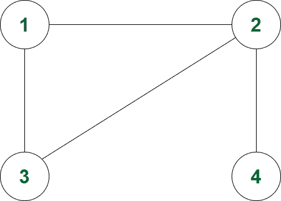

# 包括每个节点在内的 1 到 N 之间的最小长度路径数

> 原文:[https://www . geesforgeks . org/最小长度路径数-1 到-n-包括每个节点/](https://www.geeksforgeeks.org/number-of-minimum-length-paths-between-1-to-n-including-each-node/)

给定 **N** 节点和 **M** 边的无向和未加权[图](https://www.geeksforgeeks.org/graph-data-structure-and-algorithms/)，任务是计算节点 **1** 到 **N** 之间通过每个节点的**最小**长度路径。如果不存在这样的路径，则打印**-1”**。

**注意:**路径可以任意多次通过一个节点。

**示例:**

> **输入:** N = 4，M= 4，边= {{1，2}，{2，3}，{1，3}，{2，4}}
> **输出:**1 1 1 1 1
> **解释:**
> 
> 
> 
> 最小长度从 1 到 4 的总路径，从 1 通过是 1。
> 最小长度从 1 到 4 的总路径，从 2 通过的是 1。
> 最小长度从 1 到 4 的总路径，从 3 通过是 1。
> 最小长度从 1 到 4 的总路径，从 4 经过是 1。
> 
> **输入:** N = 5，M = 5，边= {{1，2}，{1，4}，{1 3}，{2，5}，{2，4}}
> **输出:** 1 1 0 1 1

**方法:**给定的问题可以通过执行两个 [BFS](https://www.geeksforgeeks.org/breadth-first-traversal-for-a-graph/) 来解决，一个从排除节点 **N** 的节点 **1** 开始，另一个从排除节点 **N** 的节点 **1** 开始，找到所有节点到 **1** 和 **N** 的最小距离，两个最小距离的乘积将是从 **1** 到的最小长度路径的总数按照以下步骤解决问题:

*   初始化一个[队列](https://www.geeksforgeeks.org/queue-data-structure/)，比如说**队列 1** 从节点 **1** 执行 **BFS** ，以及一个队列**队列 2** 从节点 **N** 执行 BFS。
*   初始化[数组](https://www.geeksforgeeks.org/arrays-in-java/)，说**dist【】**存储最短距离，**way【】**统计到达该节点的路数。
*   执行两次 BFS，并在每种情况下执行以下步骤:
    *   [从队列](https://www.geeksforgeeks.org/queuepush-and-queuepop-in-cpp-stl/)弹出，将节点存储在 **x** 中，其距离存储在 **dis** 中。
    *   如果**距离【x】**小于**距离**，则[继续](https://www.geeksforgeeks.org/continue-statement-cpp/)。
    *   遍历 **x** 的邻接表，对于每个孩子 **y** ，如果**dist【y】**大于 **dis + 1** ，则更新**dist【y】**等于**dis+1****路【y】**等于**路【x】**。否则，如果**距离【y】**等于**距离+1** ，则在**路径【y】**上增加**路径【x】**。
*   最后，迭代范围 **N** ，对于每个节点，将**最小**长度路径的计数打印为**路径 1[I]*路径 2[i]** 。

下面是上述方法的实现:

## C++

```
// C++ program for the above approach

#include <bits/stdc++.h>
using namespace std;
#define ll long long int

// Function to calculate the distances
// from node 1 to N
void countMinDistance(int n, int m,
                      int edges[][2])
{

    // Stores the number of edges
    vector<ll> g[10005];

    // Storing the edges in vector
    for (int i = 0; i < m; i++) {
        int a = edges[i][0] - 1;
        int b = edges[i][1] - 1;
        g[a].push_back(b);
        g[b].push_back(a);
    }

    // Initialize queue
    queue<pair<ll, ll> > queue1;
    queue1.push({ 0, 0 });
    vector<int> dist(n, 1e9);
    vector<int> ways1(n, 0);
    dist[0] = 0;
    ways1[0] = 1;

    // BFS from 1st node using queue
    while (!queue1.empty()) {
        auto up = queue1.front();

        // Pop from queue
        queue1.pop();
        int x = up.first;
        int dis = up.second;
        if (dis > dist[x])
            continue;
        if (x == n - 1)
            continue;

        // Traversing the adjacency list
        for (ll y : g[x]) {
            if (dist[y] > dis + 1) {
                dist[y] = dis + 1;
                ways1[y] = ways1[x];
                queue1.push({ y, dis + 1 });
            }
            else if (dist[y] == dis + 1) {
                ways1[y] += ways1[x];
            }
        }
    }

    // Initialize queue
    queue<pair<ll, ll> > queue2;
    queue2.push({ n - 1, 0 });
    vector<int> dist1(n, 1e9);
    vector<int> ways2(n, 0);
    dist1[n - 1] = 0;
    ways2[n - 1] = 1;

    // BFS from last node
    while (!queue2.empty()) {
        auto up = queue2.front();

        // Pop from queue
        queue2.pop();
        int x = up.first;
        int dis = up.second;
        if (dis > dist1[x])
            continue;
        if (x == 0)
            continue;

        // Traverse the adjacency list
        for (ll y : g[x]) {
            if (dist1[y] > dis + 1) {
                dist1[y] = dis + 1;
                ways2[y] = ways2[x];
                queue2.push({ y, dis + 1 });
            }
            else if (dist1[y] == 1 + dis) {
                ways2[y] += ways2[x];
            }
        }
    }

    // Print the count of minimum
    // distance
    for (int i = 0; i < n; i++) {
        cout << ways1[i] * ways2[i] << " ";
    }
}

// Driver Code
int main()
{
    int N = 5, M = 5;
    int edges[M][2] = {
        { 1, 2 }, { 1, 4 }, { 1, 3 },
        { 2, 5 }, { 2, 4 }
    };
    countMinDistance(N, M, edges);

    return 0;
}
```

## 蟒蛇 3

```
# Python 3 program for the above approach

# Function to calculate the distances
# from node 1 to N
def countMinDistance(n, m, edges):
    # Stores the number of edges
    g = [[] for i in range(10005)]

    # Storing the edges in vector
    for i in range(m):
        a = edges[i][0] - 1
        b = edges[i][1] - 1
        g[a].append(b)
        g[b].append(a)

    # Initialize queue
    queue1 = []
    queue1.append([0, 0])
    dist = [1e9 for i in range(n)]
    ways1 = [0 for i in range(n)]
    dist[0] = 0
    ways1[0] = 1

    # BFS from 1st node using queue
    while (len(queue1)>0):
        up = queue1[0]

        # Pop from queue
        queue1 = queue1[:-1]
        x = up[0]
        dis = up[1]
        if (dis > dist[x]):
            continue
        if (x == n - 1):
            continue

        # Traversing the adjacency list
        for y in g[x]:
            if (dist[y] > dis + 1):
                dist[y] = dis + 1
                ways1[y] = ways1[x]
                queue1.append([y, dis + 1])

            elif(dist[y] == dis + 1):
                ways1[y] += ways1[x]

    # Initialize queue
    queue2 = []
    queue2.append([n - 1, 0])
    dist1 = [1e9 for i in range(n)]
    ways2 = [0 for i in range(n)]
    dist1[n - 1] = 0
    ways2[n - 1] = 1

    # BFS from last node
    while(len(queue2)>0):
        up = queue2[0]

        # Pop from queue
        queue2 = queue2[:-1]
        x = up[0]
        dis = up[1]
        if (dis > dist1[x]):
            continue
        if (x == 0):
            continue

        # Traverse the adjacency list
        for y in g[x]:
            if (dist1[y] > dis + 1):
                dist1[y] = dis + 1
                ways2[y] = ways2[x]
                queue2.append([y, dis + 1])

            elif(dist1[y] == 1 + dis):
                ways2[y] += ways2[x]

    # Print the count of minimum
    # distance
    ways1[n-1] = 1
    ways2[n-1] = 1
    for i in range(n):
        print(ways1[i] * ways2[i],end = " ")

# Driver Code
if __name__ == '__main__':
    N = 5
    M = 5
    edges = [[1, 2],[1, 4],[1, 3],[2, 5],[2, 4]]
    countMinDistance(N, M, edges)

    # This code is contributed by SURENDRA_GANGWAR.
```

## java 描述语言

```
<script>
// Javascript program for the above approach

// Function to calculate the distances
// from node 1 to N
function countMinDistance(n, m, edges) {
  // Stores the number of edges
  let g = new Array(10005).fill(0).map(() => []);

  // Storing the edges in vector
  for (let i = 0; i < m; i++) {
    let a = edges[i][0] - 1;
    let b = edges[i][1] - 1;
    g[a].push(b);
    g[b].push(a);
  }

  // Initialize queue
  let queue1 = [];
  queue1.push([0, 0]);
  let dist = new Array(n).fill(1e9);
  let ways1 = new Array(n).fill(0);
  dist[0] = 0;
  ways1[0] = 1;

  // BFS from 1st node using queue
  while (queue1.length > 0) {
    let up = queue1[0];

    // Pop from queue
    queue1.pop();
    let x = up[0];
    let dis = up[1];
    if (dis > dist[x]) continue;
    if (x == n - 1) continue;

    // Traversing the adjacency list
    for (let y of g[x]) {
      if (dist[y] > dis + 1) {
        dist[y] = dis + 1;
        ways1[y] = ways1[x];
        queue1.push([y, dis + 1]);
      } else if (dist[y] == dis + 1) ways1[y] += ways1[x];
    }
  }
  // Initialize queue
  let queue2 = [];
  queue2.push([n - 1, 0]);
  let dist1 = new Array(n).fill(1e9);
  let ways2 = new Array(n).fill(0);
  dist1[n - 1] = 0;
  ways2[n - 1] = 1;

  // BFS from last node
  while (queue2.length > 0) {
    let up = queue2[0];

    // Pop from queue
    queue2.pop();
    let x = up[0];
    let dis = up[1];
    if (dis > dist1[x]) continue;
    if (x == 0) continue;

    // Traverse the adjacency list
    for (let y of g[x]) {
      if (dist1[y] > dis + 1) {
        dist1[y] = dis + 1;
        ways2[y] = ways2[x];
        queue2.push([y, dis + 1]);
      } else if (dist1[y] == 1 + dis) ways2[y] += ways2[x];
    }
  }
  // Print the count of minimum
  // distance
  ways1[n - 1] = 1;
  ways2[n - 1] = 1;
  for (let i = 0; i < n; i++) document.write(ways1[i] * ways2[i] + " ");
}

// Driver Code

let N = 5;
let M = 5;
let edges = [
  [1, 2],
  [1, 4],
  [1, 3],
  [2, 5],
  [2, 4],
];
countMinDistance(N, M, edges);

// This code is contributed by gfgking

</script>
```

**Output:** 

```
1 1 0 1 1
```

***时间复杂度:** O(N + M)*
***辅助空间:** O(N)*