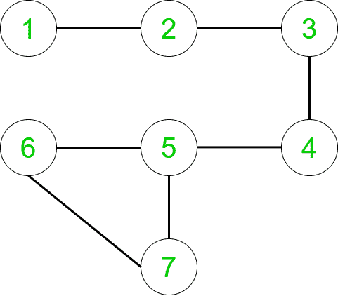
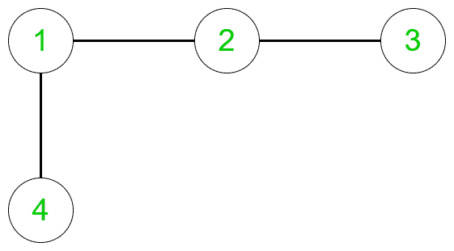
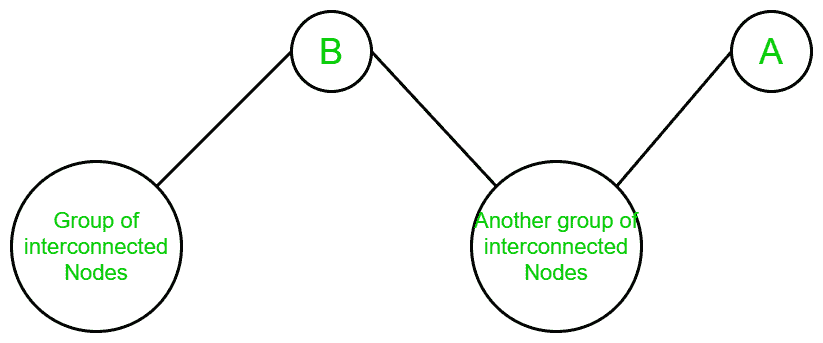
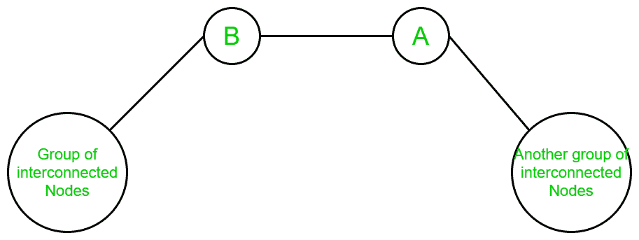

# 成对数，使得成对之间的路径具有两个顶点 A 和 B

> 原文:[https://www . geeksforgeeks . org/成对数-成对之间的路径有两个顶点-a 和-b/](https://www.geeksforgeeks.org/number-of-pairs-such-that-path-between-pairs-has-the-two-vertices-a-and-b/)

给定一个无向连通图和两个顶点 **A** 和 **B** ，任务是找到顶点对 **{X，Y}** 的数量，使得从 **X** 到 **Y** 的任何路径都包含两个顶点 **A** 和 **B** 。
**注:**

*   { X，Y }被视为等同于{ Y，X }。
*   x！= A，X！= B，Y！= A 和 Y！= B。

**例:**

> [](https://media.geeksforgeeks.org/wp-content/uploads/20200319113941/Graph19.png)
> 
> 对于上图:
> **输入:** A = 3，B = 5
> **输出:** 4
> **解释:**
> 有四对{ X，Y }，这样从源 X 到目的地 Y 的所有路径都包含顶点 A，B，它们是:
> {1，6}，{1，7}，{2，6}和{2，7}。
> 
> 
> 
> 对于上图:
> **输入:** A = 2，B = 1
> **输出:** 1
> **解释:**
> 只有一对{ X，Y }，使得从源 X 到目的地 Y 的所有路径都包含顶点 A，B，即:
> {4，3}。

**进场:**

*   对于给定的图，如果对于任何一对 **{X，Y}** ，除了给定的顶点 **A** 和 **B** 之外，它们之间还存在其他路径，那么这两个顶点不包含在最终答案中。这是因为我们需要对的计数，使得来自那些对的任何路径由顶点 **A** 和 **B** 组成。
*   因此，我们对成对的顶点 **{ X，Y }** 感兴趣，这样删除顶点 **A** (从 **B** 出发)会断开 X 到 Y 的连接，删除顶点 **B** (从 **A** 出发)会断开 X 到 Y 的连接
*   换句话说，当移除 **A** 和移除 **B** 时，如果 X 和 Y 属于图的不同组成部分，则这对 **{X，Y}** 会引起我们的兴趣。

因此，为了找到上述配对，遵循以下步骤:

*   考虑一个随机有向连通图，其中某一组互连的节点连接到 **A** ，某一组互连的节点连接到 **B** 。 **A** 和 **B** 之间可以有也可以没有节点。
*   如果我们把 **A** 和 **B** 都去掉呢？那么该图要么断开连接，要么保持连接。
*   如果图保持连接，则不存在顶点对，因为图中所有对 **{X，Y}** 都有其他路径，其中没有顶点 **A** 和 **B** 。
*   如果图变得不连续，那么会出现两种情况:
    1.  在移除顶点 A 和 B 时，该图被转换为两个断开的组件。
    2.  在移除顶点 A 和 B 时，图形被转换为三个断开的组件。

如果在移除顶点 **A** 和 **B** 时，图形被转换为两个断开的组件，那么出现三种情况:

1.  当有一组互连节点连接到顶点 A 时，一些独立节点连接到 A 和 B，顶点 B 是图的叶节点:


1.  很明显，在上图中，当顶点 **A** 和顶点 **B** 从图中移除时，图被转换成**两个不同的分量**。并且，任何组件都可以被丢弃，因为一个组件的顶点可以到达任何其他组件的顶点，而无需遍历顶点 **B** 。所以没有配对存在。
2.  当有一组互连节点连接到顶点 B 时，一些独立节点连接到 A 和 B，顶点 A 是图的叶节点:



1.  很明显，在上图中，当顶点 **A** 和顶点 **B** 从图中移除时，图被转换成**两个不同的分量**。并且，任何组件都可以被丢弃，因为一个组件的顶点可以到达任何其他组件的顶点，而无需穿过顶点 **A** 。所以没有配对存在。
2.  当顶点 **A** 和顶点 **B** 之间没有节点，并且两个顶点 **A** 和 **B** 都不是图的叶节点时:



1.  很明显，在上图中，当顶点 **A** 和顶点 **B** 从图中移除时，图被转换成**两个不同的分量**。这里，一个组件的任意一个顶点可以与另一个组件的任意一个顶点配对。因此，该图中的对数成为组件 1 和组件 2 中互连节点数的**乘积**。

如果在移除顶点 A 和 B 时，图形被转换为三个断开的组件，那么只有一种情况出现:

1.  当有一组相互连接的节点连接到顶点 A、顶点 B，并且在顶点 A 和顶点 B 之间有另一组节点，并且顶点 A 和 B 都不是叶节点时:


1.  在这种情况下，由于上述原因，顶点 A 和 B 之间的分量可以被丢弃。并且，一旦它被丢弃，它就直接是双组分图中的情况 3。同样的概念被应用于寻找顶点的数量。

因此，上述思想通过以下步骤实现:

1.  使用矢量 STL 将图形存储为[邻接表](https://www.geeksforgeeks.org/graph-and-its-representations/)。
2.  运行 [DFS](http://www.geeksforgeeks.org/depth-first-traversal-for-a-graph/) ，这样我们就像移除了顶点 **B** 一样固定了它。这可以使用 DFS 函数的基本条件来完成，即调用在到达顶点 **B** 时返回。
3.  在移除 **B** 后，计算 **A** 无法到达的顶点。
4.  重复以上两个步骤，固定顶点 A，去除顶点 **A** 后，统计 **B** 无法到达的顶点数。
5.  将两个计数存储在两个不同的变量中。这表示首先移除 **B** 然后移除 **A** 时设置的顶点数。
6.  将两个计数相乘是必需的答案。

以下是上述方法的实现:

## C++

```
// C++ program to find the number
// of pairs such that the path between
// every pair contains two given vertices

#include <bits/stdc++.h>
using namespace std;

int cnt, num_vertices, num_edges, a, b;

// Function to perform DFS on the given graph
// by fixing the a vertex
void dfs(int a, int b, vector<int> v[], int vis[])
{
    // To mark a particular vertex as visited
    vis[a] = 1;

    // Variable to store the count of the
    // vertices which can be reached from a
    cnt++;

    // Performing the DFS by iterating over
    // the visited array
    for (auto i : v[a]) {

        // If the vertex is not visited
        // and removing the vertex b
        if (!vis[i] && i != b)
            dfs(i, b, v, vis);
    }
}

// Function to return the number of pairs
// such that path between any two pairs
// consists the given two vertices A and B
void Calculate(vector<int> v[])
{

    // Initializing the visited array
    // and assigning it with 0's
    int vis[num_vertices + 1];
    memset(vis, 0, sizeof(vis));

    // Initially, the count of vertices is 0
    cnt = 0;

    // Performing DFS by removing the vertex B
    dfs(a, b, v, vis);

    // Count the vertices which cannot be
    // reached after removing the vertex B
    int ans1 = num_vertices - cnt - 1;

    // Again reinitializing the visited array
    memset(vis, 0, sizeof(vis));

    // Setting the count of vertices to 0 to
    // perform the DFS again
    cnt = 0;

    // Performing the DFS by removing the vertex A
    dfs(b, a, v, vis);

    // Count the vertices which cannot be
    // reached after removing the vertex A
    int ans2 = num_vertices - cnt - 1;

    // Multiplying both the vertices set
    cout << ans1 * ans2 << "\n";
}

// Driver code
int main()
{
    num_vertices = 7, num_edges = 7, a = 3, b = 5;

    int edges[][2] = { { 1, 2 },
                       { 2, 3 },
                       { 3, 4 },
                       { 4, 5 },
                       { 5, 6 },
                       { 6, 7 },
                       { 7, 5 } };
    vector<int> v[num_vertices + 1];

    // Loop to store the graph
    for (int i = 0; i < num_edges; i++) {
        v[edges[i][0]].push_back(edges[i][1]);
        v[edges[i][1]].push_back(edges[i][0]);
    }

    Calculate(v);
    return 0;
}
```

## Java 语言(一种计算机语言，尤用于创建网站)

```
// Java program to find the number
// of pairs such that the path between
// every pair contains two given vertices
import java.util.*;

class GFG{
static int N = 1000001;
static int c, n, m, a, b;

// Function to perform DFS on the given graph
// by fixing the a vertex
static void dfs(int a, int b, Vector<Integer> v[], int vis[])
{
    // To mark a particular vertex as visited
    vis[a] = 1;

    // Variable to store the count of the
    // vertices which can be reached from a
    c++;

    // Performing the DFS by iterating over
    // the visited array
    for (int i : v[a]) {

        // If the vertex is not visited
        // and removing the vertex b
        if (vis[i] == 0 && i != b)
            dfs(i, b, v, vis);
    }
}

// Function to return the number of pairs
// such that path between any two pairs
// consists of the given two vertices A and B
static void Calculate(Vector<Integer> v[])
{

    // Initializing the visited array
    // and assigning it with 0's
    int []vis = new int[n + 1];
    Arrays.fill(vis, 0);

    // Initially, the count of vertices is 0
    c = 0;

    // Performing DFS by removing the vertex B
    dfs(a, b, v, vis);

    // Count the vertices which cannot be
    // reached after removing the vertex B
    int ans1 = n - c - 1;

    // Again reinitializing the visited array
    Arrays.fill(vis, 0);

    // Setting the count of vertices to 0 to
    // perform the DFS again
    c = 0;

    // Performing the DFS by removing the vertex A
    dfs(b, a, v, vis);

    // Count the vertices which cannot be
    // reached after removing the vertex A
    int ans2 = n - c - 1;

    // Multiplying both the vertices set
    System.out.print(ans1 * ans2+ "\n");
}

// Driver code
public static void main(String[] args)
{
    n = 7;
    m = 7;
    a = 3;
    b = 5;

    int edges[][] = { { 1, 2 },
                       { 2, 3 },
                       { 3, 4 },
                       { 4, 5 },
                       { 5, 6 },
                       { 6, 7 },
                       { 7, 5 } };
    Vector<Integer> []v = new Vector[n + 1];
    for(int i= 0; i <= n; i++) {
        v[i] = new Vector<Integer>();
    }
    // Loop to store the graph
    for (int i = 0; i < m; i++) {
        v[edges[i][0]].add(edges[i][1]);
        v[edges[i][1]].add(edges[i][0]);
    }

    Calculate(v);
}
}

// This code is contributed by Rajput-Ji
```

## 蟒蛇 3

```
# Python 3 program to find the number
# of pairs such that the path between
# every pair contains two given vertices

N = 1000001
c = 0
n = 0
m = 0
a = 0
b = 0

# Function to perform DFS on the given graph
# by fixing the a vertex
def dfs(a,b,v,vis):
    global c
    # To mark a particular vertex as visited
    vis[a] = 1
    # Variable to store the count of the
    # vertices which can be reached from a
    c += 1

    # Performing the DFS by iterating over
    # the visited array
    for i in v[a]:
        # If the vertex is not visited
        # and removing the vertex b
        if (vis[i]==0 and i != b):
            dfs(i, b, v, vis)

# Function to return the number of pairs
# such that path between any two pairs
# consists of the given two vertices A and B
def Calculate(v):
    global c

    # Initializing the visited array
    # and assigning it with 0's
    vis = [0 for i in range(n + 1)]

    # Initially, the count of vertices is 0
    c = 0

    # Performing DFS by removing the vertex B
    dfs(a, b, v, vis)

    # Count the vertices which cannot be
    # reached after removing the vertex B
    ans1 = n - c - 1

    # Again reinitializing the visited array
    vis = [0 for i in range(len(vis))]

    # Setting the count of vertices to 0 to
    # perform the DFS again
    c = 0

    # Performing the DFS by removing the vertex A
    dfs(b, a, v, vis)

    # Count the vertices which cannot be
    # reached after removing the vertex A
    ans2 = n - c - 1

    # Multiplying both the vertices set
    print(ans1 * ans2)

# Driver code
if __name__ == '__main__':
    n = 7
    m = 7
    a = 3
    b = 5

    edges = [[1, 2], [2, 3], [3, 4], [4, 5], [5, 6], [6, 7], [7, 5]]
    v = [[] for i in range(n + 1)]

    # Loop to store the graph
    for i in range(m):
        v[edges[i][0]].append(edges[i][1])
        v[edges[i][1]].append(edges[i][0])

    Calculate(v)

# This code is contributed by Surendra_Gangwar
```

## C#

```
// C# program to find the number
// of pairs such that the path between
// every pair contains two given vertices
using System;
using System.Collections.Generic;

class GFG{
static int N = 1000001;
static int c, n, m, a, b;

// Function to perform DFS on the given graph
// by fixing the a vertex
static void dfs(int a, int b, List<int> []v, int []vis)
{
    // To mark a particular vertex as visited
    vis[a] = 1;

    // Variable to store the count of the
    // vertices which can be reached from a
    c++;

    // Performing the DFS by iterating over
    // the visited array
    foreach (int i in v[a]) {

        // If the vertex is not visited
        // and removing the vertex b
        if (vis[i] == 0 && i != b)
            dfs(i, b, v, vis);
    }
}

// Function to return the number of pairs
// such that path between any two pairs
// consists of the given two vertices A and B
static void Calculate(List<int> []v)
{

    // Initializing the visited array
    // and assigning it with 0's
    int []vis = new int[n + 1];
    for(int i = 0; i < n + 1; i++)
        vis[i] = 0;

    // Initially, the count of vertices is 0
    c = 0;

    // Performing DFS by removing the vertex B
    dfs(a, b, v, vis);

    // Count the vertices which cannot be
    // reached after removing the vertex B
    int ans1 = n - c - 1;

    // Again reinitializing the visited array
    for(int i = 0; i < n + 1; i++)
        vis[i] = 0;

    // Setting the count of vertices to 0 to
    // perform the DFS again
    c = 0;

    // Performing the DFS by removing the vertex A
    dfs(b, a, v, vis);

    // Count the vertices which cannot be
    // reached after removing the vertex A
    int ans2 = n - c - 1;

    // Multiplying both the vertices set
    Console.Write(ans1 * ans2+ "\n");
}

// Driver code
public static void Main(String[] args)
{
    n = 7;
    m = 7;
    a = 3;
    b = 5;

    int [,]edges = { { 1, 2 },
                    { 2, 3 },
                    { 3, 4 },
                    { 4, 5 },
                    { 5, 6 },
                    { 6, 7 },
                    { 7, 5 } };
    List<int> []v = new List<int>[n + 1];
    for(int i= 0; i <= n; i++) {
        v[i] = new List<int>();
    }
    // Loop to store the graph
    for (int i = 0; i < m; i++) {
        v[edges[i,0]].Add(edges[i,1]);
        v[edges[i,1]].Add(edges[i,0]);
    }

    Calculate(v);
}
}

// This code is contributed by Princi Singh
```

## java 描述语言

```
<script>
    // Javascript program to find the number
    // of pairs such that the path between
    // every pair contains two given vertices

    let N = 1000001;
    let c, n, m, a, b;

    // Function to perform DFS on the given graph
    // by fixing the a vertex
    function dfs(a, b, v, vis)
    {
        // To mark a particular vertex as visited
        vis[a] = 1;

        // Variable to store the count of the
        // vertices which can be reached from a
        c++;

        // Performing the DFS by iterating over
        // the visited array
        for(let i of v[a]) {

            // If the vertex is not visited
            // and removing the vertex b
            if (vis[i] == 0 && i != b)
                dfs(i, b, v, vis);
        }
    }

    // Function to return the number of pairs
    // such that path between any two pairs
    // consists of the given two vertices A and B
    function Calculate(v)
    {

        // Initializing the visited array
        // and assigning it with 0's
        let vis = new Array(n + 1);
        for(let i = 0; i < n + 1; i++)
            vis[i] = 0;

        // Initially, the count of vertices is 0
        c = 0;

        // Performing DFS by removing the vertex B
        dfs(a, b, v, vis);

        // Count the vertices which cannot be
        // reached after removing the vertex B
        let ans1 = n - c - 1;

        // Again reinitializing the visited array
        for(let i = 0; i < n + 1; i++)
            vis[i] = 0;

        // Setting the count of vertices to 0 to
        // perform the DFS again
        c = 0;

        // Performing the DFS by removing the vertex A
        dfs(b, a, v, vis);

        // Count the vertices which cannot be
        // reached after removing the vertex A
        let ans2 = n - c - 1;

        // Multiplying both the vertices set
        document.write((ans1 * ans2)+ "</br>");
    }

    n = 7;
    m = 7;
    a = 3;
    b = 5;

    let edges = [ [ 1, 2 ],
                    [ 2, 3 ],
                    [ 3, 4 ],
                    [ 4, 5 ],
                    [ 5, 6 ],
                    [ 6, 7 ],
                    [ 7, 5 ] ];
    let v = new Array(n + 1);
    for(let i= 0; i <= n; i++) {
        v[i] = [];
    }
    // Loop to store the graph
    for (let i = 0; i < m; i++) {
        v[edges[i][0]].push(edges[i][1]);
        v[edges[i][1]].push(edges[i][0]);
    }

    Calculate(v);

// This code is contributed by divyeshrabadiya07.
</script>
```

**Output:** 

```
4
```

**时间复杂度分析:**

*   这里 [DFS](http://www.geeksforgeeks.org/depth-first-traversal-for-a-graph/) 执行两次。因此，整体时间复杂度为 **O(V + E)** 。

**辅助空间:O(V + E)**