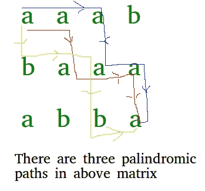

# 矩阵中回文路径的数量

> 原文:[https://www . geesforgeks . org/矩阵中回文路径数/](https://www.geeksforgeeks.org/number-of-palindromic-paths-in-a-matrix/)

给定一个只包含较低字母字符的矩阵，我们需要计算给定矩阵中回文路径的数量。路径被定义为从**左上角单元格**开始到**右下角**单元格结束的一系列单元格。我们只能从当前单元格向右下方移动到**。**

****示例:****

```
Input : mat[][] = {"aaab”, 
                   "baaa”
                   “abba”}
Output : 3

Number of palindromic paths are 3 from top-left to 
bottom-right.
aaaaaa (0, 0) -> (0, 1) -> (1, 1) -> (1, 2) -> 
                                (1, 3) -> (2, 3)    
aaaaaa (0, 0) -> (0, 1) -> (0, 2) -> (1, 2) -> 
                                (1, 3) -> (2, 3)    
abaaba (0, 0) -> (1, 0) -> (1, 1) -> (1, 2) -> 
                                 (2, 2) -> (2, 3) 
```

****

**我们可以递归地解决这个问题，我们从回文路径的两个角开始(左上角和右下角)。在每次递归调用中，我们保持一个状态，该状态将由两个单元组成，一个从开始，一个从结束，这对于回文属性应该是相等的。如果在一个状态下，两个单元格字符相等，那么我们递归调用，所有可能的移动都在两个方向上。
由于这可能导致多次求解同一个子问题，我们在下面的代码中取了一个[映射](https://www.geeksforgeeks.org/map-associative-containers-the-c-standard-template-library-stl/) memo，它将带有关键字的计算结果存储为起始和结束单元格的索引，因此如果再次调用具有相同起始和结束单元格的子问题，结果将由 memo 直接返回，而不是再次重新计算。
为了更好的理解，请看下面的代码，**

## **卡片打印处理机（Card Print Processor 的缩写）**

```
// C++ program to get number of palindrome
// paths in matrix
#include <bits/stdc++.h>

using namespace std;

#define R 3
#define C 4

// struct to represent state of recursion
// and key of map
struct cells
{
    //  indices of front cell
    int rs, cs;

    //  indices of end cell
    int re, ce;
    cells(int rs, int cs, int re, int ce)
        : rs(rs)
        , cs(cs)
        , re(re)
        , ce(ce)
    {
    }

    // operator overloading to compare two
    // cells which rs needed for map
    bool operator<(const cells& other) const
    {
        return ((rs != other.rs) || (cs != other.cs)
                || (re != other.re) || (ce != other.ce));
    }
};

// recursive method to return number
//  of palindromic paths in matrix
// (rs, cs) ==> Indices of current cell
//              from a starting point (First Row)
// (re, ce) ==> Indices of current cell
//              from a ending point (Last Row)
// memo     ==> To store results of
//              already computed problems
int getPalindromicPathsRecur(char mat[R][C],
                             int rs, int cs,
                             int re, int ce,
                             map<cells, int>& memo)
{
    // Base Case 1 : if any index rs out of boundary,
    // return 0
    if (rs < 0 || rs >= R || cs < 0 || cs >= C)
        return 0;
    if (re < 0 || re < rs || ce < 0 || ce < cs)
        return 0;

    // Base case 2 : if values are not equal
    // then palindrome property rs not satisfied,
    // so return 0
    if (mat[rs][cs] != mat[re][ce])
        return 0;

    // If we reach here, then matrix cells are same.

    // Base Case 3 : if indices are adjacent then
    // return 1
    if (abs((rs - re) + (cs - ce)) <= 1)
        return 1;

    //  if result rs precalculated, return from map
    if (memo.find(cells(rs, cs, re, ce))
        != memo.end())
        return memo[cells(rs, cs, re, ce)];

    int ret = 0; // Initialize result

    // calling recursively for all possible movements
    ret += getPalindromicPathsRecur(mat, rs + 1,
                                    cs, re - 1,
                                    ce, memo);
    ret += getPalindromicPathsRecur(mat, rs + 1,
                                    cs, re,
                                    ce - 1, memo);
    ret += getPalindromicPathsRecur(mat, rs,
                                    cs + 1, re - 1,
                                    ce, memo);
    ret += getPalindromicPathsRecur(mat, rs,
                                    cs + 1, re,
                                    ce - 1, memo);

    // storing the calculated result in map
    memo[cells(rs, cs, re, ce)] = ret;

    return ret;
}

//  method returns number of palindromic paths in matrix
int getPalindromicPaths(char mat[R][C])
{
    map<cells, int> memo;
    return getPalindromicPathsRecur(mat, 0, 0, R - 1, C - 1,
                                    memo);
}

//  Driver code
int main()
{
    char mat[R][C] = { 'a', 'a', 'a',
                      'b', 'b', 'a',
                       'a', 'a', 'a',
                      'b', 'b', 'a' };
    printf("%d", getPalindromicPaths(mat));

    return 0;
}
```

****Output**

```
3
```** 

****时间复杂度:** O((R x C) <sup>2</sup>**

**本文由 [**乌卡什·特里维迪**](https://in.linkedin.com/in/utkarsh-trivedi-253069a7) 供稿。如果你喜欢 GeeksforGeeks 并想投稿，你也可以使用[write.geeksforgeeks.org](https://write.geeksforgeeks.org)写一篇文章或者把你的文章邮寄到 review-team@geeksforgeeks.org。看到你的文章出现在极客博客主页上，帮助其他极客。
如果发现有不正确的地方，或者想分享更多关于上述话题的信息，请写评论。**