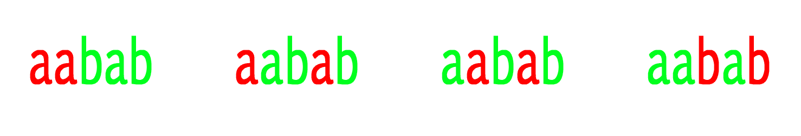

# 长度为 k 的回文子序列数，其中 k < = 3

> 原文:[https://www . geeksforgeeks . org/回文数-长度子序列-k-where-k/](https://www.geeksforgeeks.org/number-of-palindromic-subsequences-of-length-k-where-k/)

给定长度为 n 和正整数 k 的字符串 **S** ，任务是找出长度为 k 的回文子序列的数目，其中 k < = 3。

**示例:**

```
Input : s = "aabab", k = 2
Output : 4
```



```
Input : s = "aaa", k = 3
Output : 1
```

对于 **k = 1** ，我们很容易说字符串中的字符数将是答案。
对于 **k = 2** ，我们可以很容易地对相同的字符进行配对，因此我们必须保持字符串中每个字符的计数，然后进行计算

```
sum = 0
for character 'a' to 'z'
  cnt = count(character)
  sum = sum + cnt*(cnt-1)/2
sum is the answer.
```

现在随着 k 的增加，变得很难找到。如何找到 **k = 3** 的答案？所以我们的想法是看到长度为 3 的回文将是 TZT 的格式，所以我们必须维护两个矩阵，一个计算每个字符的前缀和，一个计算字符串中每个字符的后缀和。
在索引 **i** 处字符 **T** 的前缀和为**L【T】【I】**，即 **T** 在范围【0，I】(索引)内出现的次数。
索引 **i** 处字符 **T** 的后缀和为**R【T】【I】**出现在范围【I，n–1】(索引)内。
这两个矩阵都是 26*n，并且可以用复杂度 O(26*n)预计算这两个矩阵，其中 n 是字符串的长度。
现在如何计算子序列？仔细想想:对于一个索引，我假设一个字符 X 在[0，I–1]范围内出现 n1 次，在[i + 1，n–1]范围内出现 n2 次，那么这个字符的答案将是 n1 * n2，即 L[X][i-1]* R[X][I+1]，这将给出 X-s[i]-X 格式的子序列的计数，其中 s[i]是第 I 个索引处的字符。所以对于每一个指数，你必须计算

```
L[X][i-1] * R[X][i+1], 
where i is the range [1, n-2]  and 
      X will be from 'a' to 'z'
```

下面是该方法的实现:

## C++

```
// CPP program to count number of subsequences of
// given length.
#include <bits/stdc++.h>
#define MAX 100
#define MAX_CHAR 26
using namespace std;

// Precompute the prefix and suffix array.
void precompute(string s, int n, int l[][MAX],
                                 int r[][MAX])
{
    l[s[0] - 'a'][0] = 1;

    // Precompute the prefix 2D array
    for (int i = 1; i < n; i++) {
        for (int j = 0; j < MAX_CHAR; j++)
            l[j][i] += l[j][i - 1];       

        l[s[i] - 'a'][i]++;
    }

    r[s[n - 1] - 'a'][n - 1] = 1;

    // Precompute the Suffix 2D array.
    for (int i = n - 2; i >= 0; i--) {
        for (int j = 0; j < MAX_CHAR; j++)
            r[j][i] += r[j][i + 1];      

        r[s[i] - 'a'][i]++;
    }
}

// Find the number of palindromic subsequence of
// length k
int countPalindromes(int k, int n, int l[][MAX],
                                   int r[][MAX])
{
    int ans = 0;

    // If k is 1.
    if (k == 1) {
        for (int i = 0; i < MAX_CHAR; i++)
            ans += l[i][n - 1]; 
        return ans;
    }

    // If k is 2
    if (k == 2) {

        // Adding all the products of prefix array
        for (int i = 0; i < MAX_CHAR; i++)            
            ans += ((l[i][n - 1] * (l[i][n - 1] - 1)) / 2);
        return ans;
    }

    // For k greater than 2\. Adding all the products
    // of value of prefix and suffix array.
    for (int i = 1; i < n - 1; i++)
        for (int j = 0; j < MAX_CHAR; j++)            
            ans += l[j][i - 1] * r[j][i + 1]; 

    return ans;
}

// Driven Program
int main()
{
    string s = "aabab";
    int k = 2;
    int n = s.length();
    int l[MAX_CHAR][MAX] = { 0 }, r[MAX_CHAR][MAX] = { 0 };
    precompute(s, n, l, r);
    cout << countPalindromes(k, n, l, r) << endl;
    return 0;
}
```

## Java 语言(一种计算机语言，尤用于创建网站)

```
// Java program to count number of subsequences of
// given length.
class GFG
{

static final int MAX=100;
static final int MAX_CHAR=26;

// Precompute the prefix and suffix array.
static void precompute(String s, int n, int l[][],
                                int r[][])
{
    l[s.charAt(0) - 'a'][0] = 1;

    // Precompute the prefix 2D array
    for (int i = 1; i < n; i++) {
        for (int j = 0; j < MAX_CHAR; j++)
            l[j][i] += l[j][i - 1];    

        l[s.charAt(i) - 'a'][i]++;
    }

    r[s.charAt(n - 1) - 'a'][n - 1] = 1;

    // Precompute the Suffix 2D array.
    for (int i = n - 2; i >= 0; i--) {
        for (int j = 0; j < MAX_CHAR; j++)
            r[j][i] += r[j][i + 1];    

        r[s.charAt(i) - 'a'][i]++;
    }
}

// Find the number of palindromic subsequence of
// length k
static int countPalindromes(int k, int n, int l[][],
                                            int r[][])
{
    int ans = 0;

    // If k is 1.
    if (k == 1) {
        for (int i = 0; i < MAX_CHAR; i++)
            ans += l[i][n - 1];

        return ans;
    }

    // If k is 2
    if (k == 2) {

        // Adding all the products of prefix array
        for (int i = 0; i < MAX_CHAR; i++)            
            ans += ((l[i][n - 1] * (l[i][n - 1] - 1)) / 2);

        return ans;
    }

    // For k greater than 2\. Adding all the products
    // of value of prefix and suffix array.
    for (int i = 1; i < n - 1; i++)
        for (int j = 0; j < MAX_CHAR; j++)            
            ans += l[j][i - 1] * r[j][i + 1];

    return ans;
}

// Driver code
public static void main (String[] args)
{
    String s = "aabab";
    int k = 2;
    int n = s.length();
    int l[][]=new int[MAX_CHAR][MAX];
    int r[][]=new int[MAX_CHAR][MAX];

    precompute(s, n, l, r);

    System.out.println(countPalindromes(k, n, l, r));
}
}

// This code is contributed by Anant Agarwal.
```

## 蟒蛇 3

```
# Python3 program to count number of
# subsequences of given length.

MAX = 100
MAX_CHAR = 26

# Precompute the prefix and suffix array.
def precompute(s, n, l, r):
    l[ord(s[0]) - ord('a')][0] = 1

    # Precompute the prefix 2D array
    for i in range(1, n):
        for j in range(MAX_CHAR):
            l[j][i] += l[j][i - 1]

        l[ord(s[i]) - ord('a')][i] += 1

    r[ord(s[n - 1]) - ord('a')][n - 1] = 1

    # Precompute the Suffix 2D array.
    k = n - 2
    while(k >= 0):
        for j in range(MAX_CHAR):
            r[j][k] += r[j][k + 1]
        r[ord(s[k]) - ord('a')][k] += 1
        k -= 1

# Find the number of palindromic
# subsequence of length k
def countPalindromes(k, n, l, r):
    ans = 0

    # If k is 1.
    if (k == 1):
        for i in range(MAX_CHAR):
            ans += l[i][n - 1]
        return ans

    # If k is 2
    if (k == 2):

        # Adding all the products of
        # prefix array
        for i in range(MAX_CHAR):
            ans += ((l[i][n - 1] * (l[i][n - 1] - 1)) / 2)
        return ans

    # For k greater than 2\. Adding all
    # the products of value of prefix
    # and suffix array.
    for i in range(1, n - 1):
        for j in range(MAX_CHAR):
            ans += l[j][i - 1] * r[j][i + 1]
    return ans

# Driven Program
s = "aabab"
k = 2
n = len(s)

l = [[0 for x in range(MAX)] for y in range(MAX_CHAR)]
r = [[0 for x in range(MAX)] for y in range(MAX_CHAR)]

precompute(s, n, l, r)
print (countPalindromes(k, n, l, r))

# This code is written by Sachin Bisht
```

## C#

```
// C# program to count number of
// subsequences of given length.
using System;
class GFG {

static int MAX=100;
static int MAX_CHAR=26;

// Precompute the prefix
// and suffix array.
static void precompute(string s, int n,
                    int [,]l, int [,]r)
{
    l[s[0] - 'a',0] = 1;

    // Precompute the
    // prefix 2D array
    for (int i = 1; i < n; i++)
    {
        for (int j = 0; j < MAX_CHAR; j++)
            l[j, i] += l[j,i - 1];    

        l[s[i] - 'a',i]++;
    }

    r[s[n - 1] - 'a',n - 1] = 1;

    // Precompute the Suffix 2D array.
    for (int i = n - 2; i >= 0; i--)
    {
        for (int j = 0; j < MAX_CHAR; j++)
            r[j, i] += r[j,i + 1];    

        r[s[i] - 'a',i]++;
    }
}

// Find the number of palindromic
// subsequence of length k
static int countPalindromes(int k, int n,
                      int [,]l, int [,]r)
{
    int ans = 0;

    // If k is 1.
    if (k == 1)
    {
        for (int i = 0; i < MAX_CHAR; i++)
            ans += l[i,n - 1];

        return ans;
    }

    // If k is 2
    if (k == 2) {

        // Adding all the products
        // of prefix array
        for (int i = 0; i < MAX_CHAR; i++)            
            ans += ((l[i,n - 1] *
                    (l[i,n - 1] - 1)) / 2);

        return ans;
    }

    // For k greater than 2.
    // Adding all the products
    // of value of prefix and
    // suffix array.
    for (int i = 1; i < n - 1; i++)
        for (int j = 0; j < MAX_CHAR; j++)            
            ans += l[j,i - 1] * r[j, i + 1];

    return ans;
}

// Driver code
public static void Main ()
{
    string s = "aabab";
    int k = 2;
    int n = s.Length;
    int [,]l=new int[MAX_CHAR,MAX];
    int [,]r=new int[MAX_CHAR,MAX];

    precompute(s, n, l, r);

    Console.Write(countPalindromes(k, n, l, r));
}
}

// This code is contributed by Nitin Mittal.
```

## 服务器端编程语言（Professional Hypertext Preprocessor 的缩写）

```
<?php
// PHP program to count number of
// subsequences of given length.
$MAX = 100;
$MAX_CHAR = 26;

// Precompute the prefix and suffix array.
function precompute($s, $n, &$l, &$r)
{
    global $MAX, $MAX_CHAR;
    $l[ord($s[0]) - ord('a')][0] = 1;

    // Precompute the prefix 2D array
    for ($i = 1; $i < $n; $i++)
    {
        for ($j = 0; $j < $MAX_CHAR; $j++)
            $l[$j][$i] += $l[$j][$i - 1];    

        $l[ord($s[$i]) - ord('a')][$i]++;
    }

    $r[ord($s[$n - 1]) - ord('a')][$n - 1] = 1;

    // Precompute the Suffix 2D array.
    for ($i = $n - 2; $i >= 0; $i--)
    {
        for ($j = 0; $j < $MAX_CHAR; $j++)
            $r[$j][$i] += $r[$j][$i + 1];    

        $r[ord($s[$i]) - ord('a')][$i]++;
    }
}

// Find the number of palindromic
// subsequence of length k
function countPalindromes($k, $n, &$l, &$r)
{
    global $MAX, $MAX_CHAR;
    $ans = 0;

    // If k is 1.
    if ($k == 1)
    {
        for ($i = 0; $i < $MAX_CHAR; $i++)
            $ans += $l[$i][$n - 1];
        return $ans;
    }

    // If k is 2
    if ($k == 2)
    {

        // Adding all the products of
        // prefix array
        for ($i = 0; $i < $MAX_CHAR; $i++)            
            $ans += (($l[$i][$n - 1] *
                     ($l[$i][$n - 1] - 1)) / 2);
        return $ans;
    }

    // For k greater than 2\. Adding all
    // the products of value of prefix
    // and suffix array.
    for ($i = 1; $i < $n - 1; $i++)
        for ($j = 0; $j < $MAX_CHAR; $j++)            
            $ans += $l[$j][$i - 1] *
                    $r[$j][$i + 1];

    return $ans;
}

// Driver Code
$s = "aabab";
$k = 2;
$n = strlen($s);
$l = array_fill(0, $MAX_CHAR,
     array_fill(0, $MAX, NULL));
$r = array_fill(0, $MAX_CHAR,
     array_fill(0, $MAX, NULL));
precompute($s, $n, $l, $r);
echo countPalindromes($k, $n, $l, $r) . "\n";

// This code is contributed by ita_c
?>
```

## java 描述语言

```
<script>
// Javascript program to count number of subsequences of
// given length.

let MAX=100;
let MAX_CHAR=26;

// Precompute the prefix and suffix array.
function precompute(s,n,l,r)
{
        l[s[0].charCodeAt(0) - 'a'.charCodeAt(0)][0] = 1;

    // Precompute the prefix 2D array
    for (let i = 1; i < n; i++) {
        for (let j = 0; j < MAX_CHAR; j++)
            l[j][i] += l[j][i - 1];    

        l[s[i].charCodeAt(0) - 'a'.charCodeAt(0)][i]++;
    }

    r[s[n-1].charCodeAt(0) - 'a'.charCodeAt(0)][n - 1] = 1;

    // Precompute the Suffix 2D array.
    for (let i = n - 2; i >= 0; i--) {
        for (let j = 0; j < MAX_CHAR; j++)
            r[j][i] += r[j][i + 1];    

        r[s[i].charCodeAt(0) - 'a'.charCodeAt(0)][i]++;
    }
}

// Find the number of palindromic subsequence of
// length k
function countPalindromes(k,n,l,r)
{
    let ans = 0;

    // If k is 1.
    if (k == 1) {
        for (let i = 0; i < MAX_CHAR; i++)
            ans += l[i][n - 1];

        return ans;
    }

    // If k is 2
    if (k == 2) {

        // Adding all the products of prefix array
        for (let i = 0; i < MAX_CHAR; i++)            
            ans += ((l[i][n - 1] * (l[i][n - 1] - 1)) / 2);

        return ans;
    }

    // For k greater than 2\. Adding all the products
    // of value of prefix and suffix array.
    for (let i = 1; i < n - 1; i++)
        for (let j = 0; j < MAX_CHAR; j++)            
            ans += l[j][i - 1] * r[j][i + 1];

    return ans;
}

// Driver code
let s = "aabab";
let k = 2;
let n = s.length;
let l=new Array(MAX_CHAR);
let r= new Array(MAX_CHAR);
for(let i=0;i<MAX_CHAR;i++)
{
    l[i]=new Array(MAX);
    r[i]=new Array(MAX);
    for(let j=0;j<MAX;j++)
    {
        l[i][j]=0;
        r[i][j]=0;
    }
}
precompute(s, n, l, r);
document.write(countPalindromes(k, n, l, r));

    // This code is contributed by avanitrachhadiya2155
</script>
```

**输出:**

```
4
```