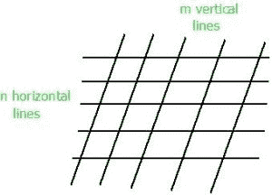

# n 条水平平行线与 m 条垂直平行线相交时的平行四边形数量

> 原文:[https://www . geesforgeks . org/平行四边形数量-当-n-水平-平行-直线-相交-m-垂直-平行/](https://www.geeksforgeeks.org/number-of-parallelograms-when-n-horizontal-parallel-lines-intersect-m-vertical-parallellines/)

给定两个正整数 **n** 和 **m** 。任务是计算当 n 条水平平行线与 m 条垂直平行线相交时，可以形成任意大小的平行四边形的数量。



示例:

```
Input : n = 3, m = 2
Output : 3
2 parallelograms of size 1x1 and 1 parallelogram 
of size 2x1.

Input : n = 5, m = 5
Output : 100
```

想法是使用 [**组合**](https://en.wikipedia.org/wiki/Combination) ，其中状态，从给定的 n 个项目中选择 k 个项目的方式数由 <sup>n</sup> C <sub>r</sub> 给出。
要形成平行四边形，我们需要两条水平平行线和两条垂直平行线。所以，选择两条水平平行线的方式数为 <sup>n</sup> C <sub>2</sub> ，选择两条垂直平行线的方式数为 <sup>m</sup> C <sub>2</sub> 。因此，可能平行四边形的总数将是<sup>n</sup>C<sub>2</sub>x<sup>m</sup>C<sub>2</sub>。
下面是这种方法的 C++实现:

## C++

```
// CPP Program to find number of parallelogram when
// n horizontal parallel lines intersect m vertical
// parallel lines.
#include<bits/stdc++.h>
#define MAX 10
using namespace std;

// Find value of Binomial Coefficient
int binomialCoeff(int C[][MAX], int n, int k)
{
    // Calculate value of Binomial Coefficient
    // in bottom up manner
    for (int i = 0; i <= n; i++)
    {
        for (int j = 0; j <= min(i, k); j++)
        {
            // Base Cases
            if (j == 0 || j == i)
                C[i][j] = 1;

            // Calculate value using previously
            // stored values
            else
                C[i][j] = C[i-1][j-1] + C[i-1][j];
        }
    }
}

// Return number of parallelogram when n horizontal
// parallel lines intersect m vertical parallel lines.
int countParallelogram(int n, int m)
{
    int  C[MAX][MAX] = { 0 };   
    binomialCoeff(C, max(n, m), 2);   
    return C[n][2] * C[m][2];
}

// Driver Program
int main()
{
    int n = 5, m = 5;   
    cout << countParallelogram(n, m) << endl;
    return 0;
}
```

## Java 语言(一种计算机语言，尤用于创建网站)

```
// Java Program to find number of parallelogram when
// n horizontal parallel lines intersect m vertical
// parallel lines.
class GFG
{
    static final int MAX = 10;

    // Find value of Binomial Coefficient
    static void binomialCoeff(int C[][], int n, int k)
    {
        // Calculate value of Binomial Coefficient
        // in bottom up manner
        for (int i = 0; i <= n; i++)
        {
            for (int j = 0; j <= Math.min(i, k); j++)
            {
                // Base Cases
                if (j == 0 || j == i)
                    C[i][j] = 1;

                // Calculate value using previously
                // stored values
                else
                    C[i][j] = C[i - 1][j - 1] + C[i - 1][j];
            }
        }
    }

    // Return number of parallelogram when n horizontal
    // parallel lines intersect m vertical parallel lines.
    static int countParallelogram(int n, int m)
    {
        int C[][]=new int[MAX][MAX];

        binomialCoeff(C, Math.max(n, m), 2);

        return C[n][2] * C[m][2];
    }

    // Driver code
    public static void main(String arg[])
    {
        int n = 5, m = 5;
        System.out.println(countParallelogram(n, m));
    }
}

// This code is contributed By Anant Agarwal.
```

## 蟒蛇 3

```
# Python Program to find number of parallelogram when
# n horizontal parallel lines intersect m vertical
# parallel lines.
MAX = 10;

# Find value of Binomial Coefficient
def binomialCoeff(C, n, k):

    # Calculate value of Binomial Coefficient
    # in bottom up manner
    for i in range(n + 1):
        for j in range(0, min(i, k) + 1):

            # Base Cases
            if (j == 0 or j == i):
                C[i][j] = 1;

            # Calculate value using previously
            # stored values
            else:
                C[i][j] = C[i - 1][j - 1] + C[i - 1][j];

# Return number of parallelogram when n horizontal
# parallel lines intersect m vertical parallel lines.
def countParallelogram(n, m):
    C = [[0 for i in range(MAX)] for j in range(MAX)]

    binomialCoeff(C, max(n, m), 2);

    return C[n][2] * C[m][2];

# Driver code
if __name__ == '__main__':
    n = 5;
    m = 5;
    print(countParallelogram(n, m));

# This code is contributed by 29AjayKumar
```

## C#

```
// C# Program to find number of parallelogram when
// n horizontal parallel lines intersect m vertical
// parallel lines.
using System;

class GFG
{
    static int MAX = 10;

    // Find value of Binomial Coefficient
    static void binomialCoeff(int [,]C, int n, int k)
    {
        // Calculate value of Binomial Coefficient
        // in bottom up manner
        for (int i = 0; i <= n; i++)
        {
            for (int j = 0; j <= Math.Min(i, k); j++)
            {
                // Base Cases
                if (j == 0 || j == i)
                    C[i, j] = 1;

                // Calculate value using previously
                // stored values
                else
                    C[i, j] = C[i - 1, j - 1] + C[i - 1, j];
            }
        }
    }

    // Return number of parallelogram when n horizontal
    // parallel lines intersect m vertical parallel lines.
    static int countParallelogram(int n, int m)
    {
        int [,]C = new int[MAX, MAX];

        binomialCoeff(C, Math.Max(n, m), 2);

        return C[n, 2] * C[m, 2];
    }

    // Driver code
    public static void Main()
    {
        int n = 5, m = 5;
        Console.WriteLine(countParallelogram(n, m));
    }
}

// This code is contributed By vt_m.
```

## java 描述语言

```
<script>

// Javascript Program to find number of parallelogram when
// n horizontal parallel lines intersect m vertical
// parallel lines.
var MAX = 10;

// Find value of Binomial Coefficient
function binomialCoeff(C, n, k)
{
    // Calculate value of Binomial Coefficient
    // in bottom up manner
    for (var i = 0; i <= n; i++)
    {
        for (var j = 0; j <= Math.min(i, k); j++)
        {
            // Base Cases
            if (j == 0 || j == i)
                C[i][j] = 1;

            // Calculate value using previously
            // stored values
            else
                C[i][j] = C[i-1][j-1] + C[i-1][j];
        }
    }
}

// Return number of parallelogram when n horizontal
// parallel lines intersect m vertical parallel lines.
function countParallelogram(n, m)
{
    var C = Array.from(Array(MAX), () => Array(MAX).fill(0));
    binomialCoeff(C, Math.max(n, m), 2);   
    return C[n][2] * C[m][2];
}

// Driver Program
var n = 5, m = 5;   
document.write( countParallelogram(n, m));

// This code is contributed by rdtank.
</script>
```

**输出:**

```
100
```