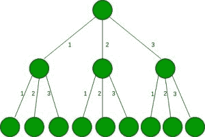

# K 元树中权重 W 的路径数

> 原文:[https://www . geeksforgeeks . org/权重路径数-w-in-a-k-ary-tree/](https://www.geeksforgeeks.org/number-of-paths-of-weight-w-in-a-k-ary-tree/)

给定一棵 K 元树，其中每个节点都有 K 个子节点，每个边都有一些权重。从一个特定节点到其所有子节点的所有边(即 K)的权重按 1，2，3，…，K 的升序排列。找出总权重为 W(路径中所有边权重之和)的路径数，从根开始，包含至少一条权重至少为 m 的边。
**示例:**

```
Input : W = 3, K = 3, M = 2
Output : 3
Explanation : One path can be (1 + 2), second can be (2 + 1) and third is 3.
```



```
Input : W = 4, K = 3, M = 2
Output : 6
```

**方法:**这个问题可以用动态规划的方法来解决。其思想是保持两种状态，一种是需要的当前权重，另一种是布尔变量，表示当前路径包含至少为 M 的权重边缘。迭代所有可能的边权重，即 K，并递归求解权重**W–I 为 1 ≤ i ≤ K** 。如果当前边权重大于或等于 M，则为下一次调用将布尔变量设置为 1。
以下是上述办法的实施情况。

## C++

```
// C++ program to count the number of
// paths with weight W in a K-ary tree
#include <bits/stdc++.h>
using namespace std;

// Function to return the number of ways
// having weight as wt in K-ary tree
int solve(int dp[][2], int wt, int K, int M,
          int used)
{
    // Return 0 if weight becomes less
    // than zero
    if (wt < 0)
        return 0;

    if (wt == 0) {

        // Return one only if the
        // current path has included
        // edge weight of atleast M
        if (used)
            return 1;
        return 0;
    }

    if (dp[wt][used] != -1)
        return dp[wt][used];

    int ans = 0;
    for (int i = 1; i <= K; i++) {

        // If the current edge weight
        // is greater than or equal to
        // M, set used as true
        if (i >= M)
            ans += solve(dp, wt - i,
                         K, M, used | 1);
        else
            ans += solve(dp, wt - i,
                         K, M, used);
    }
    return dp[wt][used] = ans;
}

// Driver Code to test above function
int main()
{
    int W = 3, K = 3, M = 2;
    int dp[W + 1][2];
    memset(dp, -1, sizeof(dp));
    cout << solve(dp, W, K, M, 0) << endl;
    return 0;
}
```

## Java 语言(一种计算机语言，尤用于创建网站)

```
// Java program to count the number of
// paths with weight W in a K-ary tree

class GFG
{
    // Function to return the number of ways
    // having weight as wt in K-ary tree

    public static int solve(int[][] dp, int wt,
                            int K, int M, int used)
    {
        // Return 0 if weight becomes less
        // than zero
        if (wt < 0)
        {
            return 0;
        }

        if (wt == 0)
        {

            // Return one only if the
            // current path has included
            // edge weight of atleast M
            if (used == 1)
            {
                return 1;
            }
            return 0;
        }

        if (dp[wt][used] != -1)
        {
            return dp[wt][used];
        }

        int ans = 0;
        for (int i = 1; i <= K; i++)
        {

            // If the current edge weight
            // is greater than or equal to
            // M, set used as true
            if (i >= M)
            {
                ans += solve(dp, wt - i,
                        K, M, used | 1);
            }
            else
            {
                ans += solve(dp, wt - i,
                        K, M, used);
            }
        }
        return dp[wt][used] = ans;
    }

    // Driver Code
    public static void main(String[] args)
    {

        int W = 3, K = 3, M = 2;
        int[][] dp = new int[W + 1][2];
        for (int i = 0; i < W + 1; i++)
        {
            for (int j = 0; j < 2; j++)
            {
                dp[i][j] = -1;
            }
        }
        System.out.print(solve(dp, W, K, M, 0) + "\n");
    }
}

// This code has been contributed by 29AjayKumar
```

## 蟒蛇 3

```
# Python 3 program to count the number of
# paths with weight W in a K-ary tree
import numpy as np

# Function to return the number of ways
# having weight as wt in K-ary tree
def solve(dp, wt, K, M, used) :

    # Return 0 if weight becomes less
    # than zero
    if (wt < 0) :
        return 0

    if (wt == 0) :

        # Return one only if the
        # current path has included
        # edge weight of atleast M
        if (used) :
            return 1
        return 0

    if (dp[wt][used] != -1) :
        return dp[wt][used]

    ans = 0
    for i in range(1, K + 1) :

        # If the current edge weight
        # is greater than or equal to
        # M, set used as true
        if (i >= M) :
            ans += solve(dp, wt - i,
                         K, M, used | 1)
        else :
            ans += solve(dp, wt - i,
                         K, M, used)

    dp[wt][used] = ans

    return ans

# Driver Code
if __name__ == "__main__" :

    W = 3
    K = 3
    M = 2
    dp = np.ones((W + 1, 2));
    dp = -1 * dp
    print(solve(dp, W, K, M, 0))

# This code is contributed by Ryuga
```

## C#

```
// C# program to count the number of
// paths with weight W in a K-ary tree
using System;

class GFG
{
    // Function to return the number of ways
    // having weight as wt in K-ary tree
    public static int solve(int[,] dp, int wt, int K, int M, int used)
    {
        // Return 0 if weight becomes less
        // than zero
        if (wt < 0)
            return 0;

        if (wt == 0) {

            // Return one only if the
            // current path has included
            // edge weight of atleast M
            if (used == 1)
                return 1;
            return 0;
        }

        if (dp[wt,used] != -1)
            return dp[wt,used];

        int ans = 0;
        for (int i = 1; i <= K; i++) {

            // If the current edge weight
            // is greater than or equal to
            // M, set used as true
            if (i >= M)
                ans += solve(dp, wt - i,
                             K, M, used | 1);
            else
                ans += solve(dp, wt - i,
                             K, M, used);
        }
        return dp[wt,used] = ans;
    }

    // Driver Code to test above function
    static void Main()
    {
        int W = 3, K = 3, M = 2;
        int[,] dp = new int[W + 1,2];
        for(int i = 0;i < W + 1; i++)
            for(int j = 0; j < 2; j++)
                dp[i,j] = -1;
        Console.Write(solve(dp, W, K, M, 0) + "\n");
    }
    //This code is contributed by DrRoot_
}
```

## java 描述语言

```
<script>
    // Javascript program to count the number of
    // paths with weight W in a K-ary tree

    // Function to return the number of ways
    // having weight as wt in K-ary tree

    function solve(dp, wt, K, M, used)
    {
        // Return 0 if weight becomes less
        // than zero
        if (wt < 0)
        {
            return 0;
        }

        if (wt == 0)
        {

            // Return one only if the
            // current path has included
            // edge weight of atleast M
            if (used == 1)
            {
                return 1;
            }
            return 0;
        }

        if (dp[wt][used] != -1)
        {
            return dp[wt][used];
        }

        let ans = 0;
        for (let i = 1; i <= K; i++)
        {

            // If the current edge weight
            // is greater than or equal to
            // M, set used as true
            if (i >= M)
            {
                ans += solve(dp, wt - i,
                        K, M, used | 1);
            }
            else
            {
                ans += solve(dp, wt - i,
                        K, M, used);
            }
        }
        return dp[wt][used] = ans;
    }

    let W = 3, K = 3, M = 2;
    let dp = new Array(W + 1);
    for (let i = 0; i < W + 1; i++)
    {
        dp[i] = new Array(2);
      for (let j = 0; j < 2; j++)
      {
        dp[i][j] = -1;
      }
    }
    document.write(solve(dp, W, K, M, 0) + "</br>");

   // This code is contributed by suresh07.
</script>
```

**Output:** 

```
3
```

**时间复杂度:** O(W * K)