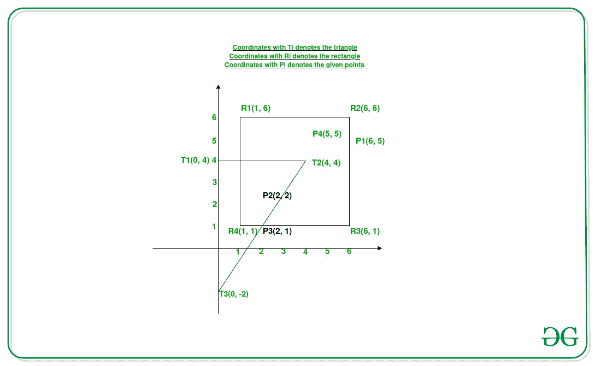

# 矩形和三角形内的点数

> 原文:[https://www . geeksforgeeks . org/矩形和三角形内的点数/](https://www.geeksforgeeks.org/number-of-points-lying-inside-a-rectangle-as-well-as-a-triangle/)

给定两个 [2D 数组](https://www.geeksforgeeks.org/multidimensional-arrays-in-java/) **矩形[][]** 和**三角形[][]** ，分别表示一个矩形和一个三角形的顶点坐标，以及另一个由 **N** 坐标组成的数组**点[][]** ，任务是计算矩形和三角形内的点数。

**示例:**

> **输入:**矩形[][] = {{1，1}、{6，1}、{6，6}、{1，6}}、三角形[][] = {{4，4}、{0，4}、{0，-2}}、点[][] = {{6，5}、{2，2}、{2，1}、{5，5}}
> **输出:** 2
> **解释:**
> 
> 
> 
> 从上面的图像中，很明显坐标(2，1)和(2，2)位于给定的矩形和三角形内。
> 因此，计数为 2。
> 
> **输入:**矩形[][]= {-2，-2}、{2，-2}、{2，2}、{-2，2}}、三角形[][] = {{0，0}、{1，1}、{-1，-1}}、点[][] = {{0，2}、{-2，-2}、{2，-2}}
> 输出: 2

**方法:**给定的问题可以基于以下观察来解决:

> 一个矩形的任何三个顶点都可以连接成一个三角形。
> 因此，给定矩形可能的三角形数量是 4。

因此，要解决这个问题，思路是检查给定点是否位于给定三角形和从矩形获得的四个三角形中的任何一个三角形内。f >按照以下步骤解决问题:

*   初始化四个列表，比如**三角形 1、三角形 2、三角形 3** 和**三角形 4** ，以存储一个矩形中可能的四个三角形的顶点坐标。
*   一次考虑矩形的三个顶点，填充上面初始化的列表。
*   初始化一个变量，比如说**和**为 **0** ，以存储三角形和矩形内的点数。
*   [遍历数组](https://www.geeksforgeeks.org/c-program-to-traverse-an-array/) **点【】【】**并检查是否存在位于任何一个**获得的四个**三角形以及给定三角形内的[点。如果发现为真，则以 **1** 递增**和**。](https://www.geeksforgeeks.org/check-whether-a-given-point-lies-inside-a-triangle-or-not/)
*   完成上述步骤后，打印**和**的值作为结果计数。

下面是上述方法的实现:

## C++

```
// C++ program for the above approach
#include <bits/stdc++.h>
using namespace std;

// Function to calculate area of a triangle
int getArea(int x1,int y1,int x2,int y2,int x3,int y3)
{

    // Return the resultant area
    return abs((x1 * (y2 - y3) +
                x2 * (y3 - y1) +
                x3 * (y1 - y2)) / 2);
}

// Function to check if a point
// lies inside a triangle or not
int isInside(vector<vector<int>> triangle, vector<int> point)
{

    vector<int> A = triangle[0];
    vector<int> B = triangle[1];
    vector<int> C = triangle[2];
    int x = point[0];
    int y = point[1];

    // Calculate area of triangle ABC
    int ABC = getArea(A[0], A[1],
                B[0], B[1],
                C[0], C[1]);

    // Calculate area of triangle
    // formed by connecting B, C, point
    int BPC = getArea(x, y, B[0],
                B[1], C[0],
                C[1]);

    // Calculate area of triangle
    // formed by connecting A, C, point
    int APC = getArea(A[0], A[1], x,
                y, C[0], C[1]);

    // Calculate area of triangle
    // formed by connecting A, B, point
    int APB = getArea(A[0], A[1], B[0],
               B[1], x, y);

    // Check if the sum of the areas of
    // above three triangles the same as ABC
    return ABC == (APC + APB + BPC);
}

// Function to count the number of points
// lying inside a triangle & rectangle
void countPoints(vector<vector<int>> rectangle,vector<vector<int>> triangle,vector<vector<int>> points){

    // Stores the coordinates of the
    // vertices of the triangles
    int n = rectangle.size();
    vector<vector<int>> triangle1;
    for(int i = 1; i < n; i++) triangle1.push_back(rectangle[i]);
    vector<vector<int>> triangle2;

    for(int i = 0; i < 3; i++) triangle2.push_back(rectangle[i]);
    vector<vector<int>> triangle3;

    for(int i = 0; i < 2; i++) triangle3.push_back(rectangle[i]);
    triangle3.push_back(rectangle[3]);
    vector<vector<int>> triangle4;

    for(int i = n - 2; i < n; i++) triangle4.push_back(rectangle[i]);

    triangle4.push_back(rectangle[0]);

    // Stores the number of points lying
    // inside the triangle and rectangle
    int ans = 0;

    // Traverse the array of points
    for(auto point:points)
    {

        // Stores whether the current point
        // lies inside triangle1 or not
        int condOne = isInside(triangle1, point);

        // Stores whether the current point
        // lies inside triangle2 or not
        int condTwo = isInside(triangle2, point);

        // Stores whether the current point
        // lies inside triangle3 or not
        int condThree = isInside(triangle3, point);

        // Stores whether the current point
        // lies inside triangle4 or not
        int condFour = isInside(triangle4, point);

        // Stores whether the current point
        // lies inside given triangle or not
        int condFive = isInside(triangle, point);

        // If current point lies inside
        // given triangle as well as inside
        // any of the four obtained triangles
        if ((condOne || condTwo || condThree || condFour) && condFive)
            ans += 1;
        }

    // Print the count of points
    cout << ans;
}

// Driver Code
int main()
{
  vector<vector<int>> rectangle = {{6, 5}, {2, 2}, {2, 1}, {5, 5}};
  vector<vector<int>> points = {{1, 1}, {6, 1}, {6, 6}, {1, 6}};
  vector<vector<int>> triangle = {{4, 4}, {0, 4}, {0, -2}};
  countPoints(points, triangle, rectangle);
  return 0;
}

// This code is contributed by mohit kumar 29.
```

## Java 语言(一种计算机语言，尤用于创建网站)

```
// Java program for the above approach
import java.io.*;
import java.util.*;

class GFG{

// Function to calculate area of a triangle
static int getArea(int x1, int y1, int x2,
                   int y2, int x3, int y3)
{

    // Return the resultant area
    return Math.abs((x1 * (y2 - y3) +
                     x2 * (y3 - y1) +
                     x3 * (y1 - y2)) / 2);
}

// Function to check if a point
// lies inside a triangle or not
static int isInside(ArrayList<ArrayList<Integer>> triangle,
                    ArrayList<Integer> point)
{
    ArrayList<Integer> A = triangle.get(0);
    ArrayList<Integer> B = triangle.get(1);
    ArrayList<Integer> C = triangle.get(2);
    int x = point.get(0);
    int y = point.get(1);

    // Calculate area of triangle ABC
    int ABC = getArea(A.get(0), A.get(1),
                      B.get(0), B.get(1),
                      C.get(0), C.get(1));

    // Calculate area of triangle
    // formed by connecting B, C, point
    int BPC = getArea(x, y, B.get(0),
                  B.get(1), C.get(0),
                            C.get(1));

    // Calculate area of triangle
    // formed by connecting A, C, point
    int APC = getArea(A.get(0), A.get(1), x,
                   y, C.get(0), C.get(1));

    // Calculate area of triangle
    // formed by connecting A, B, point
    int APB = getArea(A.get(0), A.get(1), B.get(0),
                      B.get(1), x, y);

    // Check if the sum of the areas of
    // above three triangles the same as ABC
    return ABC == (APC + APB + BPC) ? 1 :0;
}

// Function to count the number of points
// lying inside a triangle & rectangle
static void countPoints(ArrayList<ArrayList<Integer>> rectangle,
                        ArrayList<ArrayList<Integer>> triangle,
                        ArrayList<ArrayList<Integer>> points)
{

    // Stores the coordinates of the
    // vertices of the triangles
    int n = rectangle.size();
    ArrayList<ArrayList<Integer>> triangle1 = new ArrayList<ArrayList<Integer>>();

    for(int i = 1; i < n; i++)
        triangle1.add(rectangle.get(i));

    ArrayList<ArrayList<Integer>> triangle2 = new ArrayList<ArrayList<Integer>>();

    for(int i = 0; i < 3; i++)
    {
        triangle2.add(rectangle.get(i));
    }
    ArrayList<ArrayList<Integer>> triangle3 = new ArrayList<ArrayList<Integer>>();

    for(int i = 0; i < 2; i++)
    {
        triangle3.add(rectangle.get(i));
    }
    triangle3.add(rectangle.get(3));
    ArrayList<ArrayList<Integer>> triangle4 = new ArrayList<ArrayList<Integer>>();

    for(int i = n - 2; i < n; i++)
    {
        triangle4.add(rectangle.get(i));
    }

    triangle4.add(rectangle.get(0));

    // Stores the number of points lying
    // inside the triangle and rectangle
    int ans = 0;

    // Traverse the array of points
    for(ArrayList<Integer> point:points)
    {

        // Stores whether the current point
        // lies inside triangle1 or not
        int condOne = isInside(triangle1, point);

        // Stores whether the current point
        // lies inside triangle2 or not
        int condTwo = isInside(triangle2, point);

        // Stores whether the current point
        // lies inside triangle3 or not
        int condThree = isInside(triangle3, point);

        // Stores whether the current point
        // lies inside triangle4 or not
        int condFour = isInside(triangle4, point);

        // Stores whether the current point
        // lies inside given triangle or not
        int condFive = isInside(triangle, point);

        // If current point lies inside
        // given triangle as well as inside
        // any of the four obtained triangles
        if ((condOne != 0 || condTwo != 0 ||
           condThree != 0 || condFour != 0) &&
            condFive != 0)
                ans += 1;
        }

    // Print the count of points
    System.out.println(ans);
}

// Driver Code

public static void main (String[] args)
{
    ArrayList<ArrayList<Integer>> rectangle = new ArrayList<ArrayList<Integer>>();
    ArrayList<ArrayList<Integer>> points = new ArrayList<ArrayList<Integer>>();
    ArrayList<ArrayList<Integer>> triangle = new ArrayList<ArrayList<Integer>>();

    rectangle.add(new ArrayList<Integer>(Arrays.asList(6, 5)));
    rectangle.add(new ArrayList<Integer>(Arrays.asList(2, 2)));
    rectangle.add(new ArrayList<Integer>(Arrays.asList(2, 1)));
    rectangle.add(new ArrayList<Integer>(Arrays.asList(5, 5)));

    points.add(new ArrayList<Integer>(Arrays.asList(1, 1)));
    points.add(new ArrayList<Integer>(Arrays.asList(6, 1)));
    points.add(new ArrayList<Integer>(Arrays.asList(6, 6)));
    points.add(new ArrayList<Integer>(Arrays.asList(1, 6)));

    triangle.add(new ArrayList<Integer>(Arrays.asList(4, 4)));
    triangle.add(new ArrayList<Integer>(Arrays.asList(0, 4)));
    triangle.add(new ArrayList<Integer>(Arrays.asList(0, -2)));

    countPoints(points, triangle, rectangle);
}
}

// This code is contributed by avanitrachhadiya2155
```

## 蟒蛇 3

```
# Python3 program for the above approach

# Function to calculate area of a triangle
def getArea(x1, y1, x2, y2, x3, y3):

    # Return the resultant area
    return abs((x1 * (y2 - y3) +
                x2 * (y3 - y1) +
                x3 * (y1 - y2)) / 2)

# Function to check if a point
# lies inside a triangle or not
def isInside(triangle, point):

    A, B, C = triangle
    x, y = point

    # Calculate area of triangle ABC
    ABC = getArea(A[0], A[1],
                B[0], B[1],
                C[0], C[1])

    # Calculate area of triangle
    # formed by connecting B, C, point
    BPC = getArea(x, y, B[0],
                B[1], C[0],
                C[1])

    # Calculate area of triangle
    # formed by connecting A, C, point
    APC = getArea(A[0], A[1], x,
                y, C[0], C[1])

    # Calculate area of triangle
    # formed by connecting A, B, point
    APB = getArea(A[0], A[1], B[0],
                B[1], x, y)

    # Check if the sum of the areas of
    # above three triangles the same as ABC
    return ABC == (APC + APB + BPC)

# Function to count the number of points
# lying inside a triangle & rectangle
def countPoints(rectangle, triangle, points):

    # Stores the coordinates of the
    # vertices of the triangles
    triangle1 = rectangle[1:]

    triangle2 = rectangle[:3]

    triangle3 = rectangle[:2]
    triangle3.append(rectangle[3])

    triangle4 = rectangle[-2:]
    triangle4.append(rectangle[0])

    # Stores the number of points lying
    # inside the triangle and rectangle
    ans = 0

    # Traverse the array of points
    for point in points:

        # Stores whether the current point
        # lies inside triangle1 or not
        condOne = isInside(triangle1, point)

        # Stores whether the current point
        # lies inside triangle2 or not
        condTwo = isInside(triangle2, point)

        # Stores whether the current point
        # lies inside triangle3 or not
        condThree = isInside(triangle3, point)

        # Stores whether the current point
        # lies inside triangle4 or not
        condFour = isInside(triangle4, point)

        # Stores whether the current point
        # lies inside given triangle or not
        condFive = isInside(triangle, point)

        # If current point lies inside
        # given triangle as well as inside
        # any of the four obtained triangles
        if (condOne or condTwo or condThree \
            or condFour) and condFive:
            ans += 1

    # Print the count of points
    print(ans)

# Driver Code

rectangle = [[6, 5], [2, 2], [2, 1], [5, 5]]
points = [[1, 1], [6, 1], [6, 6], [1, 6]]
triangle = [[4, 4], [0, 4], [0, -2]]

countPoints(points, triangle, rectangle)
```

## C#

```
// C# program for the above approach
using System;
using System.Collections.Generic;

public class GFG
{

  // Function to calculate area of a triangle
  static int getArea(int x1, int y1, int x2,
                     int y2, int x3, int y3)
  {

    // Return the resultant area
    return Math.Abs((x1 * (y2 - y3) +
                     x2 * (y3 - y1) +
                     x3 * (y1 - y2)) / 2);
  }

  // Function to check if a point
  // lies inside a triangle or not
  static int isInside(List<List<int>> triangle,
                      List<int> point)
  {
    List<int> A = triangle[0];
    List<int> B = triangle[1];
    List<int> C = triangle[2];
    int x = point[0];
    int y = point[1];

    // Calculate area of triangle ABC
    int ABC = getArea(A[0], A[1],
                      B[0], B[1],
                      C[0], C[1]);

    // Calculate area of triangle
    // formed by connecting B, C, point
    int BPC = getArea(x, y, B[0],
                      B[1], C[0],
                      C[1]);

    // Calculate area of triangle
    // formed by connecting A, C, point
    int APC = getArea(A[0], A[1], x,
                      y, C[0], C[1]);

    // Calculate area of triangle
    // formed by connecting A, B, point
    int APB = getArea(A[0], A[1], B[0],
                      B[1], x, y);

    // Check if the sum of the areas of
    // above three triangles the same as ABC
    return ABC == (APC + APB + BPC) ? 1 :0;
  }

  // Function to count the number of points
  // lying inside a triangle & rectangle
  static void countPoints(List<List<int>> rectangle,
                          List<List<int>> triangle,
                          List<List<int>> points)
  {

    // Stores the coordinates of the
    // vertices of the triangles
    int n = rectangle.Count;
    List<List<int>> triangle1 = new List<List<int>>();
    for(int i = 1; i < n; i++)
      triangle1.Add(rectangle[i]);
    List<List<int>> triangle2 = new List<List<int>>();
    for(int i = 0; i < 3; i++)
    {
      triangle2.Add(rectangle[i]);
    }
    List<List<int>> triangle3 = new List<List<int>>();

    for(int i = 0; i < 2; i++)
    {
      triangle3.Add(rectangle[i]);
    }
    triangle3.Add(rectangle[3]);
    List<List<int>> triangle4 = new List<List<int>>();

    for(int i = n - 2; i < n; i++)
    {
      triangle4.Add(rectangle[i]);
    }

    triangle4.Add(rectangle[0]);

    // Stores the number of points lying
    // inside the triangle and rectangle
    int ans = 0;

    // Traverse the array of points
    foreach(List<int> point in points)
    {

      // Stores whether the current point
      // lies inside triangle1 or not
      int condOne = isInside(triangle1, point);

      // Stores whether the current point
      // lies inside triangle2 or not
      int condTwo = isInside(triangle2, point);

      // Stores whether the current point
      // lies inside triangle3 or not
      int condThree = isInside(triangle3, point);

      // Stores whether the current point
      // lies inside triangle4 or not
      int condFour = isInside(triangle4, point);

      // Stores whether the current point
      // lies inside given triangle or not
      int condFive = isInside(triangle, point);

      // If current point lies inside
      // given triangle as well as inside
      // any of the four obtained triangles
      if ((condOne != 0 || condTwo != 0 ||
           condThree != 0 || condFour != 0) &&
          condFive != 0)
        ans += 1;
    }

    // Print the count of points
    Console.WriteLine(ans);
  }

  // Driver Code
  static public void Main ()
  {
    List<List<int>> rectangle = new List<List<int>>();
    List<List<int>> points = new List<List<int>>();
    List<List<int>> triangle = new List<List<int>>();

    rectangle.Add(new List<int>(){6, 5});
    rectangle.Add(new List<int>(){2, 2});
    rectangle.Add(new List<int>(){2, 1});
    rectangle.Add(new List<int>(){5, 5});

    points.Add(new List<int>(){1, 1});
    points.Add(new List<int>(){6, 1});
    points.Add(new List<int>(){6, 6});
    points.Add(new List<int>(){1, 6});

    triangle.Add(new List<int>(){4, 4});
    triangle.Add(new List<int>(){0, 4});
    triangle.Add(new List<int>(){0, -2});

    countPoints(points, triangle, rectangle);
  }
}

// This code is contributed by rag2127
```

## java 描述语言

```
<script>
// Javascript program for the above approach

// Function to calculate area of a triangle
function getArea(x1,y1,x2,y2,x3,y3)
{
    // Return the resultant area
    return Math.abs((x1 * (y2 - y3) +
                     x2 * (y3 - y1) +
                     x3 * (y1 - y2)) / 2);
}

// Function to check if a point
// lies inside a triangle or not
function isInside(triangle,point)
{
    let A = triangle[0];
    let B = triangle[1];
    let C = triangle[2];
    let x = point[0];
    let y = point[1];

    // Calculate area of triangle ABC
    let ABC = getArea(A[0], A[1],
                      B[0], B[1],
                      C[0], C[1]);

    // Calculate area of triangle
    // formed by connecting B, C, point
    let BPC = getArea(x, y, B[0],
                  B[1], C[0],
                            C[1]);

    // Calculate area of triangle
    // formed by connecting A, C, point
    let APC = getArea(A[0], A[1], x,
                   y, C[0], C[1]);

    // Calculate area of triangle
    // formed by connecting A, B, point
    let APB = getArea(A[0], A[1], B[0],
                      B[1], x, y);

    // Check if the sum of the areas of
    // above three triangles the same as ABC
    return ABC == (APC + APB + BPC) ? 1 :0;
}

// Function to count the number of points
// lying inside a triangle & rectangle
function countPoints(rectangle,triangle,points)
{
    // Stores the coordinates of the
    // vertices of the triangles
    let n = rectangle.length;
    let triangle1 = [];

    for(let i = 1; i < n; i++)
        triangle1.push(rectangle[i]);

    let triangle2 = [];

    for(let i = 0; i < 3; i++)
    {
        triangle2.push(rectangle[i]);
    }
    let triangle3 = [];

    for(let i = 0; i < 2; i++)
    {
        triangle3.push(rectangle[i]);
    }
    triangle3.push(rectangle[3]);
    let triangle4 = [];

    for(let i = n - 2; i < n; i++)
    {
        triangle4.push(rectangle[i]);
    }

    triangle4.push(rectangle[0]);

    // Stores the number of points lying
    // inside the triangle and rectangle
    let ans = 0;

    // Traverse the array of points
    for(let point=0;point<points.length;point++)
    {

        // Stores whether the current point
        // lies inside triangle1 or not
        let condOne = isInside(triangle1, points[point]);

        // Stores whether the current point
        // lies inside triangle2 or not
        let condTwo = isInside(triangle2, points[point]);

        // Stores whether the current point
        // lies inside triangle3 or not
        let condThree = isInside(triangle3, points[point]);

        // Stores whether the current point
        // lies inside triangle4 or not
        let condFour = isInside(triangle4, points[point]);

        // Stores whether the current point
        // lies inside given triangle or not
        let condFive = isInside(triangle, points[point]);

        // If current point lies inside
        // given triangle as well as inside
        // any of the four obtained triangles
        if ((condOne != 0 || condTwo != 0 ||
           condThree != 0 || condFour != 0) &&
            condFive != 0)
                ans += 1;
        }

    // Print the count of points
    document.write(ans+"<br>");
}

// Driver Code
let rectangle =[];
let points = [];
let triangle = [];

rectangle.push([6, 5]);
rectangle.push([2, 2]);
rectangle.push([2, 1]);
rectangle.push([5, 5]);

points.push([1, 1]);
points.push([6, 1]);
points.push([6, 6]);
points.push([1, 6]);

triangle.push([4, 4]);
triangle.push([0, 4]);
triangle.push([0, -2]);

countPoints(points, triangle, rectangle);

// This code is contributed by patel2127
</script>
```

**Output:** 

```
2
```

***时间复杂度:**O(N)*
T5**辅助空间:** O(1)