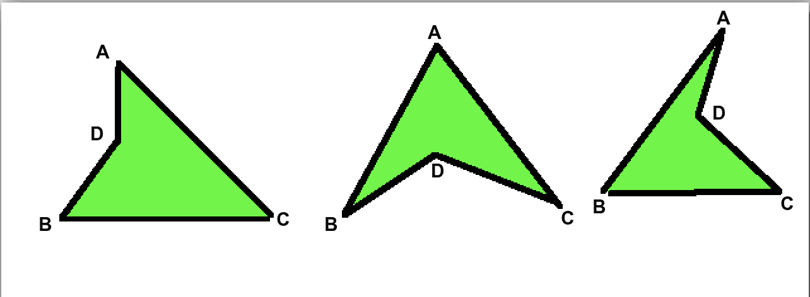
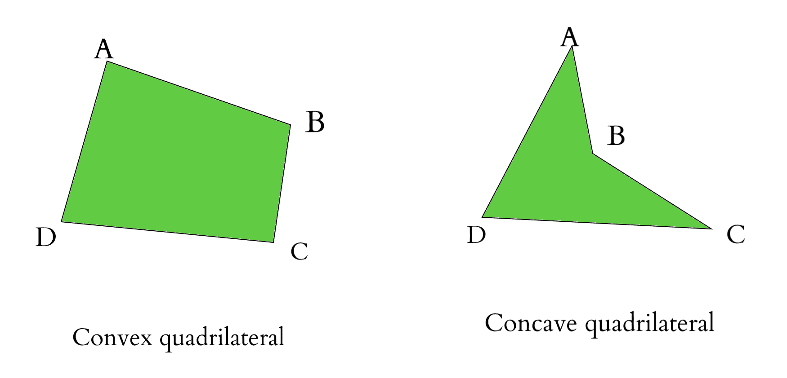

# 给定点可能出现的四边形数量

> 原文:[https://www . geeksforgeeks . org/四边形数量-给定点的可能数量/](https://www.geeksforgeeks.org/number-of-quadrilaterals-possible-from-the-given-points/)

给定笛卡尔坐标中的四个点(x，y)。找出四个点连接起来可能形成的四边形的数目。
**例:**

```
Input: A=(0, 9), B=(-1, 0), C=(5, -1), D=(5, 9)
Output: Only one quadrilateral is possible (ABCD) in any orientation 

Input: A=(0, 9), B=(-1, 0), C=(5, -1), D=(0, 3)
Output: 3 quadrilaterals are possible (ABCD), (ADBC), (ABDC)
```

第二个例子的图:



**进场:**

1.  我们需要检查给定的点是否相同。**如果是，四边形的数量= 0**
2.  然后我们需要检查给定的 4 个点中的 3 个点是否共线。**如果是，四边形的数量=0** 。检查[程序检查三点是否共线](https://www.geeksforgeeks.org/program-check-three-points-collinear/)链接检查三点是否共线。

这可以通过[确定如何检查给定的两条线段是否相交？对角线的](https://www.geeksforgeeks.org/check-if-two-given-line-segments-intersect/)。
在**凸四边形**的情况下，对角线会相交，而在凹四边形的情况下，对角线不会相交。
由于我们不知道点的方位，所以无法具体确定对角线，所以将四边形的所有截然不同的线段(两条线段中没有公共点)并确定它们是否相交。
参考图了解如何确定四边形的类型:



**凸四边形:**

> AB 线和 DC 线不相交
> 线 AD 和 BC 线不相交
> 线 AC 和 BD 线相交
> 所以相交总数= 1

**凹四边形**

> AB 线和 DC 线不相交
> 线 AD 和 BC 线不相交
> 线 AC 和 BD 线不相交
> 所以相交总数= 0

**如果相交数= 1，它是一个凸四边形所以可能性数= 1**
**如果相交数= 0，它是一个凹四边形所以可能性数= 3**

## C++

```
// C++ implementation of above approach
#include <iostream>
using namespace std;

struct Point // points
{
    int x;
    int y;
};

// determines the orientation of points
int orientation(Point p, Point q, Point r)
{
    int val = (q.y - p.y) * (r.x - q.x) - (q.x - p.x) * (r.y - q.y);

    if (val == 0)
        return 0;
    return (val > 0) ? 1 : 2;
}

// check whether the distinct line segments intersect
bool doIntersect(Point p1, Point q1, Point p2, Point q2)
{
    int o1 = orientation(p1, q1, p2);
    int o2 = orientation(p1, q1, q2);
    int o3 = orientation(p2, q2, p1);
    int o4 = orientation(p2, q2, q1);

    if (o1 != o2 && o3 != o4)
        return true;

    return false;
}

// check if points overlap(similar)
bool similar(Point p1, Point p2)
{

    // it is same, we are returning false because
    // quadrilateral is not possible in this case
    if (p1.x == p2.x && p1.y == p2.y)
        return false;

    // it is not same, So there is a
    // possibility of a quadrilateral
    return true;
}

// check for collinearity
bool collinear(Point p1, Point p2, Point p3)
{
    int x1 = p1.x, y1 = p1.y;
    int x2 = p2.x, y2 = p2.y;
    int x3 = p3.x, y3 = p3.y;

    // it is collinear, we are returning false
    // because quadrilateral is not possible in this case
    if ((y3 - y2) * (x2 - x1) == (y2 - y1) * (x3 - x2))
        return false;

    // it is not collinear, So there
    // is a possibility of a quadrilateral
    else
        return true;
}

int no_of_quads(Point p1, Point p2, Point p3, Point p4)
{
    // ** Checking for cases where no quadrilateral = 0 **

    // check if any of the points are same
    bool same = true;
    same = same & similar(p1, p2);
    same = same & similar(p1, p3);
    same = same & similar(p1, p4);
    same = same & similar(p2, p3);
    same = same & similar(p2, p4);
    same = same & similar(p3, p4);

    // similar points exist
    if (same == false)
        return 0;

    // check for collinearity
    bool coll = true;
    coll = coll & collinear(p1, p2, p3);
    coll = coll & collinear(p1, p2, p4);
    coll = coll & collinear(p1, p3, p4);
    coll = coll & collinear(p2, p3, p4);

    // points are collinear
    if (coll == false)
        return 0;

    //** Checking for cases where no of quadrilaterals= 1 or 3 **

    int check = 0;

    if (doIntersect(p1, p2, p3, p4))
        check = 1;
    if (doIntersect(p1, p3, p2, p4))
        check = 1;
    if (doIntersect(p1, p2, p4, p3))
        check = 1;

    if (check == 0)
        return 3;
    return 1;
}

// Driver code
int main()
{
    struct Point p1, p2, p3, p4;
    // A =(0, 9), B = (-1, 0), C = (5, -1), D=(5, 9)
    p1.x = 0, p1.y = 9;
    p2.x = -1, p2.y = 0;
    p3.x = 5, p3.y = -1;
    p4.x = 5, p4.y = 9;
    cout << no_of_quads(p1, p2, p3, p4) << endl;

    // A=(0, 9), B=(-1, 0), C=(5, -1), D=(0, 3)
    p1.x = 0, p1.y = 9;
    p2.x = -1, p2.y = 0;
    p3.x = 5, p3.y = -1;
    p4.x = 0, p4.y = 3;
    cout << no_of_quads(p1, p2, p3, p4) << endl;

    // A=(0, 9), B=(0, 10), C=(0, 11), D=(0, 12)
    p1.x = 0, p1.y = 9;
    p2.x = 0, p2.y = 10;
    p3.x = 0, p3.y = 11;
    p4.x = 0, p4.y = 12;
    cout << no_of_quads(p1, p2, p3, p4) << endl;

    // A=(0, 9), B=(0, 9), C=(5, -1), D=(0, 3)
    p1.x = 0, p1.y = 9;
    p2.x = 0, p2.y = 9;
    p3.x = 5, p3.y = -1;
    p4.x = 0, p4.y = 3;
    cout << no_of_quads(p1, p2, p3, p4) << endl;

    return 0;
}
```

## Java 语言(一种计算机语言，尤用于创建网站)

```
// Java implementation of above approach
class GFG
{
static class Point // points
{
    int x;
    int y;
}

// determines the orientation of points
static int orientation(Point p, Point q,
                                Point r)
{
    int val = (q.y - p.y) * (r.x - q.x) -
              (q.x - p.x) * (r.y - q.y);

    if (val == 0)
        return 0;
    return (val > 0) ? 1 : 2;
}

// check whether the distinct
// line segments intersect
static boolean doIntersect(Point p1, Point q1,
                           Point p2, Point q2)
{
    int o1 = orientation(p1, q1, p2);
    int o2 = orientation(p1, q1, q2);
    int o3 = orientation(p2, q2, p1);
    int o4 = orientation(p2, q2, q1);

    if (o1 != o2 && o3 != o4)
        return true;

    return false;
}

// check if points overlap(similar)
static boolean similar(Point p1, Point p2)
{

    // it is same, we are returning
    // false because quadrilateral is
    // not possible in this case
    if (p1.x == p2.x && p1.y == p2.y)
        return false;

    // it is not same, So there is a
    // possibility of a quadrilateral
    return true;
}

// check for collinearity
static boolean collinear(Point p1, Point p2,
                         Point p3)
{
    int x1 = p1.x, y1 = p1.y;
    int x2 = p2.x, y2 = p2.y;
    int x3 = p3.x, y3 = p3.y;

    // it is collinear, we are returning
    // false because quadrilateral is not
    // possible in this case
    if ((y3 - y2) *
        (x2 - x1) == (y2 - y1) *
                     (x3 - x2))
        return false;

    // it is not collinear, So there
    // is a possibility of a quadrilateral
    else
        return true;
}

static int no_of_quads(Point p1, Point p2,
                       Point p3, Point p4)
{
    // Checking for cases where
    // no quadrilateral = 0

    // check if any of the
    // points are same
    boolean same = true;
    same = same & similar(p1, p2);
    same = same & similar(p1, p3);
    same = same & similar(p1, p4);
    same = same & similar(p2, p3);
    same = same & similar(p2, p4);
    same = same & similar(p3, p4);

    // similar points exist
    if (same == false)
        return 0;

    // check for collinearity
    boolean coll = true;
    coll = coll & collinear(p1, p2, p3);
    coll = coll & collinear(p1, p2, p4);
    coll = coll & collinear(p1, p3, p4);
    coll = coll & collinear(p2, p3, p4);

    // points are collinear
    if (coll == false)
        return 0;

    // Checking for cases where
    // no of quadrilaterals= 1 or 3

    int check = 0;

    if (doIntersect(p1, p2, p3, p4))
        check = 1;
    if (doIntersect(p1, p3, p2, p4))
        check = 1;
    if (doIntersect(p1, p2, p4, p3))
        check = 1;

    if (check == 0)
        return 3;
    return 1;
}

// Driver code
public static void main(String args[])
{
    Point p1, p2, p3, p4;
    p1 = new Point();
    p2 = new Point();
    p3 = new Point();
    p4 = new Point();

    // A =(0, 9), B = (-1, 0),
    // C = (5, -1), D=(5, 9)
    p1.x = 0; p1.y = 9;
    p2.x = -1; p2.y = 0;
    p3.x = 5; p3.y = -1;
    p4.x = 5; p4.y = 9;
    System.out.println(no_of_quads(p1, p2, p3, p4));

    // A=(0, 9), B=(-1, 0),
    // C=(5, -1), D=(0, 3)
    p1.x = 0; p1.y = 9;
    p2.x = -1; p2.y = 0;
    p3.x = 5; p3.y = -1;
    p4.x = 0; p4.y = 3;
    System.out.println(no_of_quads(p1, p2, p3, p4));

    // A=(0, 9), B=(0, 10),
    // C=(0, 11), D=(0, 12)
    p1.x = 0; p1.y = 9;
    p2.x = 0; p2.y = 10;
    p3.x = 0; p3.y = 11;
    p4.x = 0; p4.y = 12;
    System.out.println(no_of_quads(p1, p2, p3, p4));

    // A=(0, 9), B=(0, 9),
    // C=(5, -1), D=(0, 3)
    p1.x = 0; p1.y = 9;
    p2.x = 0; p2.y = 9;
    p3.x = 5; p3.y = -1;
    p4.x = 0; p4.y = 3;
    System.out.println(no_of_quads(p1, p2, p3, p4));
}
}

// This code is contributed
// by Arnab Kundu
```

## C#

```
// C# implementation of above approach
using System;
class GFG
{
public class Point // points
{
    public int x;
    public int y;
}

// determines the orientation of points
static int orientation(Point p, Point q,
                                Point r)
{
    int val = (q.y - p.y) * (r.x - q.x) -
            (q.x - p.x) * (r.y - q.y);

    if (val == 0)
        return 0;
    return (val > 0) ? 1 : 2;
}

// check whether the distinct
// line segments intersect
static bool doIntersect(Point p1, Point q1,
                        Point p2, Point q2)
{
    int o1 = orientation(p1, q1, p2);
    int o2 = orientation(p1, q1, q2);
    int o3 = orientation(p2, q2, p1);
    int o4 = orientation(p2, q2, q1);

    if (o1 != o2 && o3 != o4)
        return true;

    return false;
}

// check if points overlap(similar)
static bool similar(Point p1, Point p2)
{

    // it is same, we are returning
    // false because quadrilateral is
    // not possible in this case
    if (p1.x == p2.x && p1.y == p2.y)
        return false;

    // it is not same, So there is a
    // possibility of a quadrilateral
    return true;
}

// check for collinearity
static bool collinear(Point p1, Point p2,
                        Point p3)
{
    int x1 = p1.x, y1 = p1.y;
    int x2 = p2.x, y2 = p2.y;
    int x3 = p3.x, y3 = p3.y;

    // it is collinear, we are returning
    // false because quadrilateral is not
    // possible in this case
    if ((y3 - y2) *
        (x2 - x1) == (y2 - y1) *
                    (x3 - x2))
        return false;

    // it is not collinear, So there
    // is a possibility of a quadrilateral
    else
        return true;
}

static int no_of_quads(Point p1, Point p2,
                    Point p3, Point p4)
{
    // Checking for cases where
    // no quadrilateral = 0

    // check if any of the
    // points are same
    bool same = true;
    same = same & similar(p1, p2);
    same = same & similar(p1, p3);
    same = same & similar(p1, p4);
    same = same & similar(p2, p3);
    same = same & similar(p2, p4);
    same = same & similar(p3, p4);

    // similar points exist
    if (same == false)
        return 0;

    // check for collinearity
    bool coll = true;
    coll = coll & collinear(p1, p2, p3);
    coll = coll & collinear(p1, p2, p4);
    coll = coll & collinear(p1, p3, p4);
    coll = coll & collinear(p2, p3, p4);

    // points are collinear
    if (coll == false)
        return 0;

    // Checking for cases where
    // no of quadrilaterals= 1 or 3

    int check = 0;

    if (doIntersect(p1, p2, p3, p4))
        check = 1;
    if (doIntersect(p1, p3, p2, p4))
        check = 1;
    if (doIntersect(p1, p2, p4, p3))
        check = 1;

    if (check == 0)
        return 3;
    return 1;
}

// Driver code
static void Main()
{
    Point p1, p2, p3, p4;
    p1 = new Point();
    p2 = new Point();
    p3 = new Point();
    p4 = new Point();

    // A =(0, 9), B = (-1, 0),
    // C = (5, -1), D=(5, 9)
    p1.x = 0; p1.y = 9;
    p2.x = -1; p2.y = 0;
    p3.x = 5; p3.y = -1;
    p4.x = 5; p4.y = 9;
    Console.WriteLine(no_of_quads(p1, p2, p3, p4));

    // A=(0, 9), B=(-1, 0),
    // C=(5, -1), D=(0, 3)
    p1.x = 0; p1.y = 9;
    p2.x = -1; p2.y = 0;
    p3.x = 5; p3.y = -1;
    p4.x = 0; p4.y = 3;
    Console.WriteLine(no_of_quads(p1, p2, p3, p4));

    // A=(0, 9), B=(0, 10),
    // C=(0, 11), D=(0, 12)
    p1.x = 0; p1.y = 9;
    p2.x = 0; p2.y = 10;
    p3.x = 0; p3.y = 11;
    p4.x = 0; p4.y = 12;
    Console.WriteLine(no_of_quads(p1, p2, p3, p4));

    // A=(0, 9), B=(0, 9),
    // C=(5, -1), D=(0, 3)
    p1.x = 0; p1.y = 9;
    p2.x = 0; p2.y = 9;
    p3.x = 5; p3.y = -1;
    p4.x = 0; p4.y = 3;
    Console.WriteLine(no_of_quads(p1, p2, p3, p4));
}
}

// This code is contributed by mits
```

## java 描述语言

```
<script>

// JavaScript implementation of above approach

class Point // points
{
    constructor()
    {
        this.x=0;
        this.y=0;
    }
}

// determines the orientation of points
function orientation(p,q,r)
{
    let val = (q.y - p.y) * (r.x - q.x) -
              (q.x - p.x) * (r.y - q.y);

    if (val == 0)
        return 0;
    return (val > 0) ? 1 : 2;
}

// check whether the distinct
// line segments intersect
function doIntersect(p1,q1,p2,q2)
{
    let o1 = orientation(p1, q1, p2);
    let o2 = orientation(p1, q1, q2);
    let o3 = orientation(p2, q2, p1);
    let o4 = orientation(p2, q2, q1);

    if (o1 != o2 && o3 != o4)
        return true;

    return false;
}

// check if points overlap(similar)
function similar(p1,p2)
{
    // it is same, we are returning
    // false because quadrilateral is
    // not possible in this case
    if (p1.x == p2.x && p1.y == p2.y)
        return false;

    // it is not same, So there is a
    // possibility of a quadrilateral
    return true;
}

// check for collinearity
function collinear(p1,p2,p3)
{
    let x1 = p1.x, y1 = p1.y;
    let x2 = p2.x, y2 = p2.y;
    let x3 = p3.x, y3 = p3.y;

    // it is collinear, we are returning
    // false because quadrilateral is not
    // possible in this case
    if ((y3 - y2) *
        (x2 - x1) == (y2 - y1) *
                     (x3 - x2))
        return false;

    // it is not collinear, So there
    // is a possibility of a quadrilateral
    else
        return true;
}

function no_of_quads(p1,p2,p3,p4)
{
    // Checking for cases where
    // no quadrilateral = 0

    // check if any of the
    // points are same
    let same = true;
    same = same & similar(p1, p2);
    same = same & similar(p1, p3);
    same = same & similar(p1, p4);
    same = same & similar(p2, p3);
    same = same & similar(p2, p4);
    same = same & similar(p3, p4);

    // similar points exist
    if (same == false)
        return 0;

    // check for collinearity
    let coll = true;
    coll = coll & collinear(p1, p2, p3);
    coll = coll & collinear(p1, p2, p4);
    coll = coll & collinear(p1, p3, p4);
    coll = coll & collinear(p2, p3, p4);

    // points are collinear
    if (coll == false)
        return 0;

    // Checking for cases where
    // no of quadrilaterals= 1 or 3

    let check = 0;

    if (doIntersect(p1, p2, p3, p4))
        check = 1;
    if (doIntersect(p1, p3, p2, p4))
        check = 1;
    if (doIntersect(p1, p2, p4, p3))
        check = 1;

    if (check == 0)
        return 3;
    return 1;
}

// Driver code
let p1, p2, p3, p4;
p1 = new Point();
p2 = new Point();
p3 = new Point();
p4 = new Point();

// A =(0, 9), B = (-1, 0),
// C = (5, -1), D=(5, 9)
p1.x = 0; p1.y = 9;
p2.x = -1; p2.y = 0;
p3.x = 5; p3.y = -1;
p4.x = 5; p4.y = 9;
document.write(no_of_quads(p1, p2, p3, p4)+"<br>");

// A=(0, 9), B=(-1, 0),
// C=(5, -1), D=(0, 3)
p1.x = 0; p1.y = 9;
p2.x = -1; p2.y = 0;
p3.x = 5; p3.y = -1;
p4.x = 0; p4.y = 3;
document.write(no_of_quads(p1, p2, p3, p4)+"<br>");

// A=(0, 9), B=(0, 10),
// C=(0, 11), D=(0, 12)
p1.x = 0; p1.y = 9;
p2.x = 0; p2.y = 10;
p3.x = 0; p3.y = 11;
p4.x = 0; p4.y = 12;
document.write(no_of_quads(p1, p2, p3, p4)+"<br>");

// A=(0, 9), B=(0, 9),
// C=(5, -1), D=(0, 3)
p1.x = 0; p1.y = 9;
p2.x = 0; p2.y = 9;
p3.x = 5; p3.y = -1;
p4.x = 0; p4.y = 3;
document.write(no_of_quads(p1, p2, p3, p4)+"<br>");

// This code is contributed by avanitrachhadiya2155

</script>
```

**Output:** 

```
1
3
0
0
```